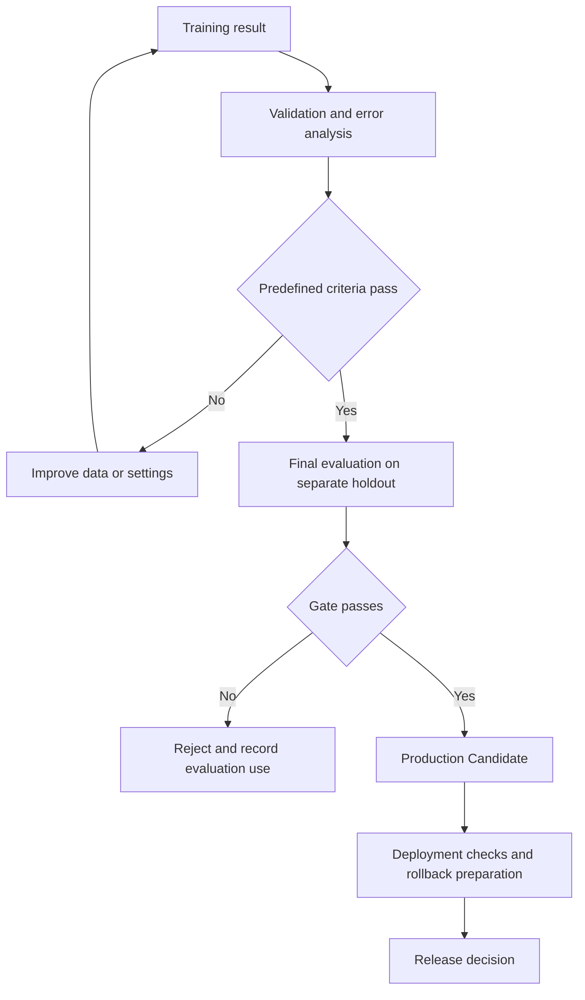

# Chapter 5. Evaluation and Model Promotion

**Reading guide:** Source headings, numbers, tables, examples, and text diagrams are preserved in translation. Read **Supplements and Conditions by Source Section** after the source for conditions that affect real use. Values and settings are study examples. Training, deployment, and performance tests were not run for this page.

<!-- SOURCE CORE START -->

## 5.1 Training Complete Does Not Mean Production Ready

Do not deploy to Production just because Fine-Tuning is complete.

```text
Training Complete
≠
Production Ready
```

Validate the training result with a Golden Dataset.

---

## 5.2 Compare the Base Model and Fine-Tuned Model

Compare them on the same Golden Dataset.

```text
Golden Dataset
      │
      ├─ Base Model
      │
      ├─ Fine-Tuned Model A
      │
      └─ Fine-Tuned Model B
```

Example:

| Metric | Base | Fine-Tuned |
|---|---:|---:|
| Task Accuracy | 76% | 89% |
| Format Pass | 81% | 97% |
| Hallucination | 9% | 4% |
| Latency | 120ms | 135ms |

Important:

> Low Training Loss alone does not mean a model is good.

Evaluate with Metrics required for the actual task.

---

## 5.3 Evaluation Metric

Depending on the task, you can use Metrics such as these.

```text
Accuracy
Task Success Rate
Format Pass Rate
Hallucination Rate
Safety
Human Preference
Latency
Token Usage
Cost
```

This covers Serving concerns as well as Model Quality.

---

## 5.4 Quality Gate

A model can become a Production Candidate only when Evaluation results meet the criteria.

```text
Fine-Tuned Model
↓
Golden Evaluation
↓
Quality Gate
├─ PASS → Promote
└─ FAIL → Reject / Retrain
```

Example:

```text
Accuracy >= 90%
Format Pass >= 98%
Hallucination <= 3%
Latency <= Target
```

These are examples of criteria you can set.

---

## 5.5 Error Analysis

It is important to analyze Samples that failed Evaluation.

Example:

```text
SAP questions
→ Performs well

Basic Kafka questions
→ Performs well

Complex incident analysis
→ Performs poorly
```

Then analyze the cause.

```text
Too few Samples for complex incident analysis
↓
Add relevant Training Data
↓
Create Dataset v4
↓
Retrain
↓
Re-evaluate
```

Fine-Tuning is an iterative improvement Loop, not a one-time task.

---

## 5.6 Model Improvement Loop

The full Loop:

```text
Define the problem
↓
Collect / Clean Data
↓
Create the Training Dataset
↓
Fine-Tuning
↓
Evaluation
↓
Error Analysis
↓
Improve the Dataset
↓
Retraining
```

This is why Datasets and Evaluation matter in model development.

---

<!-- SOURCE CORE END -->

## Supplements and Conditions by Source Section

The official evaluation sources below were checked on 2026-10-05. These notes interpret source examples and recommend evaluation design. They are not measured results.

### 5.2–5.4: Example Values and Passing Criteria

The changes in 5.2—76%→89%, 81%→97%, 9%→4%, and 120ms→135ms—are hypothetical. If the 5.4 criteria apply to this candidate, accuracy of 89% is below 90%, format pass of 97% is below 98%, and hallucination of 4% exceeds 3%. All three fail. The latency target is missing, so its result is unknown. Improvement over the base and passing an absolute gate are separate questions.

Design recommendation: fix the evaluation dataset, rubric, prompt, and generation settings. Record the correct chat template for each model. Measure latency under the same hardware, load, and input/output lengths, and name the percentile. Keep sample counts and failure distributions by category. See [AI Evaluation](../data-platform/ai-evaluation.md) for operational evaluation design.

### 5.5–5.6: Development Evaluation and a Final Holdout

If golden-set failures repeatedly guide datasets and settings, that score has influenced model selection. Do not call it an unused final test. Improve with validation and use a separate holdout for final checks. Manage duplicate and similar samples across training and evaluation. This applies general leakage prevention to this improvement loop. [scikit-learn evaluation splits](https://scikit-learn.org/stable/modules/cross_validation.html), [Data leakage](https://scikit-learn.org/stable/common_pitfalls.html)

“Too few complex incident samples” is one possible cause. Check label errors, templates, truncation, and base-model capability before adding data. Do not copy failed test questions into training and report gains on those same questions as generalization.

## Supplemental Diagram: Evaluation and Deployment Checks

This design example adds a final holdout and deployment checks to the source text flow. Being a promotion candidate does not mean deployment is complete.



## Related Pages

[QLoRA training](qlora-training.md) · [Model replacement and retraining](model-retraining.md) · [AI Evaluation](../data-platform/ai-evaluation.md) · [Data Quality](../data-platform/data-quality.md)
