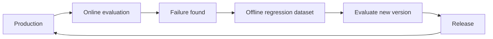
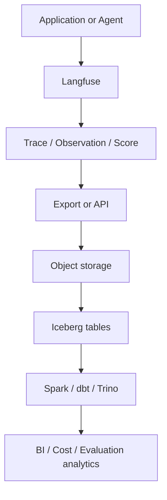

# AI evaluation data platform

This page records conceptual study of sections 16.2–16.12. All data, scores, costs, versions, and gates below are hypothetical teaching examples, not production measurements or implemented results. [Online evaluation](online-evaluation.md) observes real executions. Offline evaluation compares changes with fixed cases. Turning failures into regression cases and linking executions to version bundles connects the two flows.

## 16.2 Offline evaluation datasets

Run the same dataset against different prompt, model, or agent versions. This reduces input differences compared with separate production traffic windows. For example, compare `Dataset v5 → Agent v10 / Agent v11 → Scores`.

| Dataset v5 case | Scope |
|---|---|
| Case 1 | Normal request |
| Case 2 | Tool usage request |
| Case 3 | Permission violation attempt |
| Case 4 | Difficult RAG request |
| Case 5 | Known production regression |

Items may contain `input`, `expected_output`, `expected_behavior`, `expected_tool`, `rubric`, `category`, `difficulty`, and `metadata`. An agent may need behavior checks beyond one exact answer. For “Show last week's AI cost by team,” expected behavior means calling an analytics tool, using an authorized dataset, grouping by team, and keeping user-level PII out of the result.

Useful categories are General, Tool Usage, RAG, Security, Complex Reasoning, Edge Cases, and Regression. An overall score of `88%` can hide a weak category.

| Category | Example result |
|---|---|
| General | 95% |
| Tool Usage | 91% |
| RAG | 84% |
| Security | 100% |
| Regression | 70% |



The core pattern is **production failure → offline regression case**. Fixed inputs help fair comparison. They do not automatically fix the evaluator, data permissions, or retrieval state. This is an added design caution for reproducibility.

## 16.3 Human feedback

A person directly evaluates a response and produces quality data. Thumbs up/down helps find poor traces, build failure datasets, and prioritize human review. Example ratings are accuracy `4/5`, helpfulness `5/5`, and relevance `3/5`.

Experts can review technical correctness, tool selection, policy compliance, citation quality, and domain accuracy. Specialized or high-stakes work needs reviewers with relevant knowledge. An explicit rubric helps reviewers use shared criteria instead of asking only “Is this good?”

| Rubric dimension | Example scale |
|---|---|
| Accuracy | 0–2 |
| Relevance | 0–2 |
| Groundedness | 0–2 |
| Tool Selection | 0–2 |
| Format | 0–2 |

Humans are not perfect ground truth. Reviewer A may give the same response `5`, while B gives it `3`. **Inter-rater agreement** describes agreement between reviewers. Manage human labels as noisy data too.

The production flow is `Production Trace → Thumbs Down → Human Review → Failure Label → Regression Dataset`. Example labels are `wrong_tool_selection`, `hallucination`, `retrieval_failure`, `permission_violation`, and `bad_format`.

## 16.4 Model-as-Judge

Use another LLM to evaluate a response. Record `Input + Response + Optional Context → Judge LLM → Score + Reason`. Dimensions can include Accuracy, Relevance, Helpfulness, Groundedness, Tool Usage, Format Compliance, and Safety. For RAG, supply `Question + Retrieved Context + Response` to check whether the response is grounded in those documents.

Do not keep only a score such as `0.72`. Store `judge_model`, `judge_model_version`, `judge_prompt_version`, `score`, `reason`, and `timestamp`. The same agent may get `0.85` from judge v1 and `0.72` from judge v2. A lower score alone does not prove an agent regression.

Calibrate with human and judge scores on a sample. Persistent disagreement is a reason to review the judge model or prompt. An example scale is `100,000 traces → Model-as-Judge` and `important 1,000 traces → Human Review`. The judge provides scale. Human review helps make calibration more reliable. Humans can still make mistakes.

## 16.5 Prompt versions

Treat prompts as versioned assets and link them to traces and evaluation.

| Example version | Instruction | Example score |
|---|---|---|
| v1 | Answer the user. | 0.78 |
| v2 | Answer the user. Do not guess when evidence is missing. Use tools when required. | 0.89 |

Useful fields are `prompt_id`, `prompt_version`, `prompt_text`, `created_at`, `created_by`, and `change_description`. For example, record `prompt_id=agent_system_prompt`, `prompt_version=12`, and change “Clarified tool usage rules.” Manage real author data under internal access and privacy rules. Do not put it in public examples.

A link such as `Trace → Agent v5 / Model A / Prompt v12 / Score 0.91` supports comparing v11 and v12 by quality, tool success, cost, and latency. A hypothetical A/B split sends `50% → Prompt v10` and `50% → Prompt v11`.

| Prompt | Success rate | Cost |
|---|---|---|
| v10 | 87% | $0.12 |
| v11 | 91% | $0.17 |

The highest-quality prompt is not always the best operational choice. Version `system_prompt`, `tool_instruction`, `retrieval_prompt`, `judge_prompt`, and `summarization_prompt` separately when needed.

## 16.6 Model versions

Record the exact model version that produced a result. `model=model-X` may not be enough. The same model name in June and September may refer to different serving snapshots after a provider update. Record `provider`, `model_name`, `model_version`, `deployment_id`, and `endpoint`. Keep internal endpoints and credentials out of public documentation.

This example holds `Dataset v5`, `Prompt v12`, and `Agent v7` fixed.

| Model | Quality | Latency | Cost |
|---|---|---|---|
| A | 0.88 | 1.2s | $0.04 |
| B | 0.91 | 2.0s | $0.02 |

Self-hosting with vLLM or other servers still needs `checkpoint`, `quantization`, `tokenizer_version`, and `serving_config`. For fine-tuned models, link `base_model`, `training_dataset_version`, `training_config`, and `checkpoint_version`. An example is `Base Model M1 → Training Set train_v4 → Fine-tune ft_v7`.

## 16.7 Agent versions

An agent includes the system prompt, model, tool set, tool routing logic, retrieval, memory, and workflow. Prompt text can stay unchanged while v10's tools A and B become v11's tools A, B, and C with a new routing rule. Behavior can change.

Useful fields are `agent_version`, `prompt_version`, `model_version`, `tool_set_version`, `workflow_version`, `retrieval_config_version`, and `memory_config_version`. Think of the agent version as a **bundle version**.

```text
agent_version = v12
prompt        = v8
model         = model-A-v3
toolset       = v4
workflow      = v6
retrieval     = v2
```

An example with Dataset v7 fixed:

| Agent | Quality | Cost | Latency |
|---|---|---|---|
| v10 | 0.84 | $0.08 | 4.2s |
| v11 | 0.91 | $0.11 | 5.0s |

Evaluate tool success rate, tool error rate, and retrieval quality alongside quality, cost, and latency.

## 16.8 Experiment tracking

Record experiment configuration and results together. Example Experiment A uses Dataset `eval_v5`, Prompt `prompt_v12`, Model `model_A`, and Agent `agent_v7`. Its quality is `0.88`, latency is `3.2s`, and cost is `$0.05`.

Experiment fields include `experiment_id`, `dataset_version`, `prompt_version`, `model_version`, `agent_version`, `evaluator_version`, and `runtime_config`. Results may include accuracy, groundedness, tool_success_rate, latency, and cost.

Change one variable when possible. Keep the dataset, model, and agent logic fixed when comparing Prompt v10 and v11. Changing the prompt, model, agent, and dataset together makes differences hard to explain. Offline experiments compare Agent A and B with fixed evaluation data to reduce pre-release risk. Online experiments split live traffic to gather evidence from real conditions. Also inspect traffic mix and experiment conditions when interpreting online results.

## 16.9 Regression datasets

Previously failed cases should keep working in later releases. After fixing a wrong-tool failure for “Show last week's AI cost by team,” turn its trace into a regression case. Run Agent v10, v11, and v12 against the regression dataset.

Categories include `tool_selection_regression`, `rag_regression`, `security_regression`, and `format_regression`. Example release gates require `100%` for Critical Security Regression and `>=98%` for General Regression. These are not universal safety thresholds. Choose gates for the actual risks and requirements. Version the dataset as `regression_v1 → v2 → v3` too.

The recurring pattern is **Production Failure → Regression Case → Release Test**. Define the pass-rate denominator and distinguish failed from unscored cases.

## 16.10 Cost / Quality / Latency

Inspect all three dimensions together. Model A may have quality `92`, latency `5s`, and cost `$0.10`. Model B may have quality `90`, latency `1.5s`, and cost `$0.02`. Product requirements determine the choice.

| Dimension | Example metrics |
|---|---|
| Quality | accuracy, groundedness, success_rate, tool_success_rate, user_satisfaction, judge_score, regression_pass_rate |
| Cost | input_tokens, output_tokens, model_cost, tool_cost, total_cost, cost_per_execution, cost_per_success, cost_per_team |
| Latency | TTFT, LLM latency, tool latency, retrieval latency, total latency; p50, p95, p99 |

`cost_per_success` may be more useful than raw request cost. A sequential execution of `LLM 2s + Tool 5s + LLM 2s = Total 9s` shows the tool's large contribution. Use percentiles as well as averages.

A larger model may increase quality, cost, and latency. More tool calls may improve quality but also increase cost and latency. A smaller context may reduce cost and latency while lowering quality. These are tendencies and hypotheses, not guaranteed laws. Aim to maintain or improve quality while reducing cost and latency where possible.

## 16.11 Langfuse + Iceberg

This role split is a proposed architecture, not a deployed system or a promise of automatic integration. Use Langfuse for traces, LLM and tool calls, prompts and responses, scores, feedback, experiments, and evaluation datasets. Iceberg is the table layer for long-term history, large-scale analysis, cross-domain joins, governance, BI, and historical version analysis.



Export files in object storage do not automatically become Iceberg tables. An ingestion, transformation, and commit path is required. Langfuse offers blob storage export and a public API. Check supported formats, fields, versions, and hosting options before adoption. [Export documentation](https://langfuse.com/docs/api-and-data-platform/features/export-to-blob-storage), [Public API](https://langfuse.com/docs/api-and-data-platform/features/public-api).

Example facts are `fact_agent_execution`, `fact_llm_call`, `fact_tool_call`, and `fact_evaluation`. Dimensions are `dim_agent`, `dim_model`, `dim_prompt`, and `dim_team`.

| Layer | Data and transformations |
|---|---|
| Bronze | Raw traces / observations / scores |
| Silver | Normalize calls, link versions, normalize cost, categorize errors |
| Gold | Team AI cost, agent success rate, prompt quality, model p95 latency, cost per successful execution |

Keeping everything only in Langfuse may be insufficient when traces must join HR organization data, finance cost, product usage, and business KPIs. The data platform handles this broader analysis. Limit sensitive joins to the intended purpose and access scope.

An example source-of-truth split assigns agent code, workflow, and config to Git; AI trace, prompt, and evaluation operations to Langfuse; and long-term analytical history to Iceberg. See [Iceberg](lakehouse-iceberg.md), [analytical modeling](analytical-modeling.md), and [AI-ready data](ai-ready-data.md).

## 16.12 Where are all these versions managed?

Manage versions by asset type and connect them with experiment or release IDs. One system does not need to own every asset. These are common options, not guarantees of identical version semantics or features across products.

| Asset | Management options |
|---|---|
| Prompt version | Langfuse / MLflow / Git |
| Model version | MLflow Model Registry / provider model snapshot |
| Agent version | Git release / application release |
| Tool / workflow version | Git / config registry |
| Evaluation dataset version | Langfuse / MLflow / lakehouse |
| Judge version | Langfuse / MLflow + Git |
| Embedding model | Model registry / config |
| Retrieval config | Git / config registry |
| Full experiment | Langfuse / MLflow |

An example structure:

```text
Git
  Agent code / Tool logic / Workflow / Retrieval config / Deployment config
Langfuse or MLflow
  Prompt versions / Traces / Scores / Feedback / Evaluation datasets / Experiments
Model registry
  Self-hosted models / Fine-tuned models
Iceberg
  Long-term telemetry history / Evaluation history / Enterprise analytics
```

The commit and model names in this unified record are fictional teaching values.

```text
experiment_id       = EXP-1042
agent_release       = 1.7.3
git_commit          = abc123
prompt_version      = 12
model_version       = model-A-2026-09
dataset_version     = eval-v8
evaluator_version   = judge-v4
retrieval_version   = v3
toolset_version     = v5
quality_score       = 0.92
latency_p95         = 3.4s
cost_per_execution  = $0.08
```

These links provide evidence for reproduction and explanation. IDs alone do not guarantee identical execution. Preserve the actual artifacts, inputs, runtime, and relevant external state too.

### Product-specific version cautions

Official documentation was checked on 2026-09-26. No installation or runtime test was performed. Langfuse dataset item changes create timestamp-based versions. Dataset schema changes are not part of that versioning. Record the item version and schema definition separately. [Langfuse datasets](https://langfuse.com/docs/evaluation/experiments/datasets).

MLflow prompt versions are immutable, while aliases can move to another version. Model Registry aliases can also refer to model versions. Record the version actually used, not just a moving alias. [Prompt Registry](https://mlflow.org/docs/latest/genai/prompt-registry/), [Model Registry workflow](https://mlflow.org/docs/latest/ml/model-registry/workflow/).

## LLM in Practice: review a release evaluation design

- **Situation:** Review claims that a new agent release improves quality, cost, and latency before deployment.
- **Context to give:** Sanitized experiment records, fixed dataset versions, version bundles, evaluator changes, category results, regression gates, and missing or failed evaluation counts.
- **Example prompt:**

=== "English"

    ```text {.prompt}
    [Context]
    Before/after experiments and category results: [sanitized material]
    Dataset, prompt, model, agent, and evaluator versions: [records]
    Regression gates, cost, p95 latency, and unscored counts: [criteria and observations]
    [Task]
    Separate fixed and changed conditions and assess comparability.
    Review security, tool, and RAG regressions separately from the overall average.
    [Output]
    Make a table of observations, assumptions, missing evidence, and next checks.
    List further comparisons needed for a release decision and conditional conclusions.
    [Checks]
    Do not confuse judge changes with agent changes.
    Do not count unscored cases as passes or invent safety thresholds.
    Draft a review without running tools or deploying; link evidence for human review.
    ```

=== "한국어"

    ```text {.prompt}
    [맥락]
    릴리스 전후 실험과 범주별 결과: [비식별 자료]
    데이터셋·prompt·model·agent·evaluator 버전: [기록]
    회귀 게이트·비용·p95 latency·미평가 수: [기준과 관측]
    [요청]
    고정된 조건과 바뀐 조건을 나누고 비교 가능성을 검토하세요.
    전체 평균과 별도로 보안·tool·RAG 회귀를 살펴보세요.
    [출력]
    관측·가정·누락 근거·다음 검증을 표로 작성하세요.
    배포 판단에 필요한 추가 비교와 조건부 결론을 적으세요.
    [검증]
    judge 변경과 agent 변경을 혼동하지 마세요.
    미평가를 성공으로 세거나 임의의 안전 기준을 만들지 마세요.
    도구 실행·배포 없이 검토안만 작성하고 사람이 확인할 근거를 연결하세요.
    ```

- **Expected output:** A comparability table, missing evidence, category regression risks, and a conditional release review.
- **What can go wrong:** The LLM may treat a judge change as an agent improvement, hide a security failure behind an average, or apply example gates as universal thresholds.
- **How to validate:** A person compares the original experiments, traces, version artifacts, and denominators. Run needed comparisons in an approved isolated evaluation environment, then review the results. No execution was performed for this page.

[Online evaluation](online-evaluation.md) · [AI-ready data](ai-ready-data.md) · [Study scope](curriculum.md)
