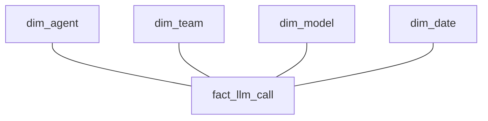

# Analytical data modeling

This page records study of grain, facts, dimensions, and metrics. The AI platform schema is a hypothetical design. It contains no real user or company data and does not claim implementation experience.

## Start with grain

Grain defines what one row means.

| Table | Meaning of one row |
| --- | --- |
| `fact_order` | One order |
| `fact_order_item` | One order item |
| `fact_llm_call` | One LLM call |

A wrong understanding of grain can cause double counting after a join. For example, joining an order to several items repeats the order amount. Summing it again can overcount. A useful study sequence is `Grain → Fact → Dimension → Metric`. Agree on the business meaning of a row before choosing physical columns. [Kimball: Grain](https://www.kimballgroup.com/data-warehouse-business-intelligence-resources/kimball-techniques/dimensional-modeling-techniques/grain/)

## Facts and dimensions

A fact table stores events or measurements.

| Fact type | Example |
| --- | --- |
| Event fact | Click or API call |
| Transaction fact | Order or payment |
| Periodic snapshot fact | State at regular intervals, such as daily inventory or balance |
| Accumulating snapshot fact | Progress of one process through several steps |

An order's accumulating snapshot can include `order_created_at`, `paid_at`, `shipped_at`, and `delivered_at`. One row holds the milestones of the order process. The event/transaction distinction here helps explain business events. It is not a claim that every modeling method treats them as separate, exclusive fact types.

A dimension describes a fact. Examples are `dim_customer`, `dim_product`, `dim_model`, and `dim_team`. A natural key comes from the source system. A surrogate key is created in the analytical system. It helps identify different SCD Type 2 versions.

## Star schemas and history

A star schema has a central fact and surrounding dimensions. This structure is easy to explain and gives BI queries clear roles.



SCD means Slowly Changing Dimension. Type 1 overwrites an attribute when only its current value matters. Type 2 keeps old rows and adds a new version.

```text
customer_sk | customer_id | region | valid_from | valid_to
```

This structure supports analysis using a past region. Join to the version valid at the analysis time. Overlapping validity periods for the same natural key can multiply rows. Define validity periods and the meaning of their end boundaries.

## How much to denormalize

OLTP often uses normalization to manage consistent changes. OLAP may allow some duplication to simplify queries and reduce joins. Putting everything in one table also creates problems. Mixed grains and update schedules can cause repeated values and wrong totals. Compare convenience with history and maintenance costs.

## AI platform example

An agent execution, an LLM call, and a user event have different grains. One agent execution may include several LLM calls. Do not treat them as the same row unit.

| Table | Grain | Example fields |
| --- | --- | --- |
| `fact_agent_execution` | One agent execution | `execution_id`, `agent_id`, `user_id`, `team_id`, `started_at`, `completed_at`, `status`, `total_latency`, `total_cost` |
| `fact_llm_call` | One LLM call | `llm_call_id`, `execution_id`, `model_id`, `input_tokens`, `output_tokens`, `latency`, `cost` |
| `fact_user_event` | One user event | Defined separately by the business event schema |
| `dim_agent` | Agent description | Agent attributes |
| `dim_model` | Model description | Model attributes |
| `dim_team` | Organization description | Team attributes |

Dimensions can be conformed when several facts share the same meaning and key rules. If you join executions to LLM calls and sum execution costs, check whether each execution repeats once per call. Field names such as `user_id` are schema examples. They contain no actual personal identifiers.

## Metrics and the semantic layer

Metric modeling keeps KPI definitions consistent. This example uses execution grain:

```text
agent_execution_error_rate
= failed execution count / total execution count
```

Base metrics include `execution_count`, `token_count`, and `cost`. Derived metrics include `error_rate` and `cost_per_execution`. Use the same period, filters, and population for the numerator and denominator. Define the result when the denominator is zero.

A semantic layer centrally defines the meaning and calculation of business metrics such as DAU, Total Cost, Error Rate, and Average Latency. It helps dashboards, analysts, and AI agents use the same definitions. Matching names do not make metrics equivalent when their grain or exclusions differ.

## LLM in Practice: review duplicated costs

Situation: execution cost grows with the number of calls. Give the LLM each table's grain, keys, relationship cardinality, join SQL, a small synthetic sample, and metric definitions.

```text
Review this cost query using the stated grain of each table.
Show row counts and duplicated measures after each join.
Separate observed facts from hypotheses and missing information.
Propose a minimal correction and a small example that checks the total.
```

Expected output identifies where a join repeats measures and provides a validation example. The LLM may hide symptoms with `DISTINCT` or combine costs at different grains. Compare totals at the original grain with totals after joins. Include multiple calls, zero calls, and SCD version boundaries. This page does not record an actual query run.

[dbt](dbt.md) · [Trino](trino.md) · [Handbook home](../index.md)
