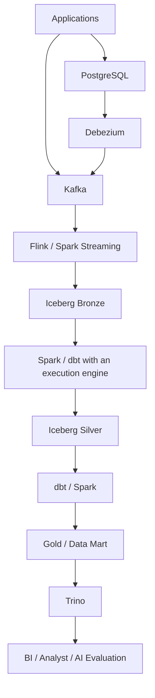

# Data platform architecture and roles

This page merges the source's supplementary explanations and final mental model. The architecture explains relationships. It is not a completed system or a required design for every organization. Linked topic pages provide evidence and qualifications for product behavior.

## Data paths

In this example, application events go to Kafka. PostgreSQL changes reach Kafka through Debezium. Flink or Spark Streaming writes Bronze data. Spark and dbt transformations build Silver and Gold, which Trino queries. dbt SQL runs on a connected execution engine.

The source's simpler diagram emphasizes Spark from Bronze to Silver and dbt from Silver to Gold/Data Mart. This diagram shows tool combinations within the same learning architecture. Connections require compatible connectors, catalogs, and execution engines. No end-to-end integration was tested for this material.

## Component boundaries

| Component | Main role | Details |
|---|---|---|
| Kafka | Event transport / durable log | [Kafka](event-architecture.md) |
| S3 | Object storage | [S3](foundations.md) |
| Parquet | Columnar analytical file format | [Parquet](foundations.md) |
| Iceberg | Table format, metadata, snapshots | [Iceberg](lakehouse-iceberg.md) |
| Spark | Large-scale compute and batch processing | [Spark](spark.md) |
| Flink | Stateful real-time processing | [Flink](flink.md) |
| Debezium | Capture database changes | [Debezium](cdc-debezium.md) |
| dbt | SQL transformation management | [dbt](dbt.md) |
| Trino | Distributed, interactive SQL queries | [Trino](trino.md) |
| Airflow | Workflow orchestration | [Airflow](orchestration.md) |
| OpenLineage | A standard for lineage events | [OpenLineage](lineage-metadata.md) |
| Catalog | Metadata search and discovery | [Catalog](lineage-metadata.md) |
| Governance | Policy, access, and audit | [Governance](governance.md) |
| Langfuse | AI telemetry, observability, and evaluation | [Langfuse](ai-ready-data.md) |

Storage, file format, table format, compute, query, transformation management, and orchestration have different roles. S3 holds objects; Parquet describes files; Iceberg manages table state; Spark/Flink process data; Trino runs SQL queries; dbt manages SQL models; Airflow manages task dependencies and execution order.

## Cross-cutting capabilities

| Capability | Question |
|---|---|
| Airflow | In what order and with which dependencies should tasks run? |
| Data quality | Does data satisfy the rules, and can we trust it? |
| Data observability | Are freshness, volume, distribution, or correctness abnormal now? |
| Metadata / catalog | What data exists, and what does it mean? |
| Lineage / OpenLineage | Where did it come from, and where does it go? |
| Governance | Who may use it, and under which policy? |
| Langfuse | What happened inside AI execution, and how good was it? |
| AI-ready data | Can AI reuse data under controlled conditions and restore experiment conditions? |

## Quality and observability

[Data quality](data-quality.md) checks rules such as not null, unique, accepted values, and accuracy. [Data observability](data-observability.md) studies changes and anomalies through freshness, volume, schema, distribution, anomaly detection, and alerts. Observability can monitor quality rules continuously. A successful pipeline does not prove correct data.

## Metadata, catalogs, and semantic layers

Metadata describes data. A catalog makes metadata searchable. Business metadata explains business meaning. A semantic layer defines reusable metric and dimension meanings and calculations for queries. Lineage describes creation and transformation relationships. Governance covers use policies and their enforcement. See [lineage and metadata](lineage-metadata.md), [analytical modeling](analytical-modeling.md), and [governance](governance.md).

## AI observability and the general data platform

Tools such as Langfuse handle traces, LLM/tool calls, prompts/responses, tokens/cost/latency, scores, datasets, and experiments. Do not assume they replace enterprise analytics, lakehouse storage, cross-domain joins, governance, long-term history, or a unified catalog. In this learning design, Langfuse handles execution-level telemetry and evaluation; the data platform holds durable analytical assets. This is not a final product adoption decision.

[AI-ready data](ai-ready-data.md) · [Online evaluation](online-evaluation.md) · [Study scope and next steps](curriculum.md)
