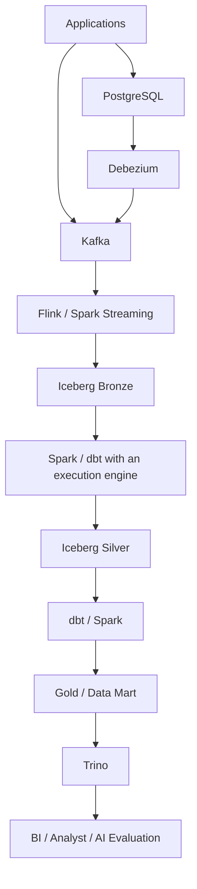
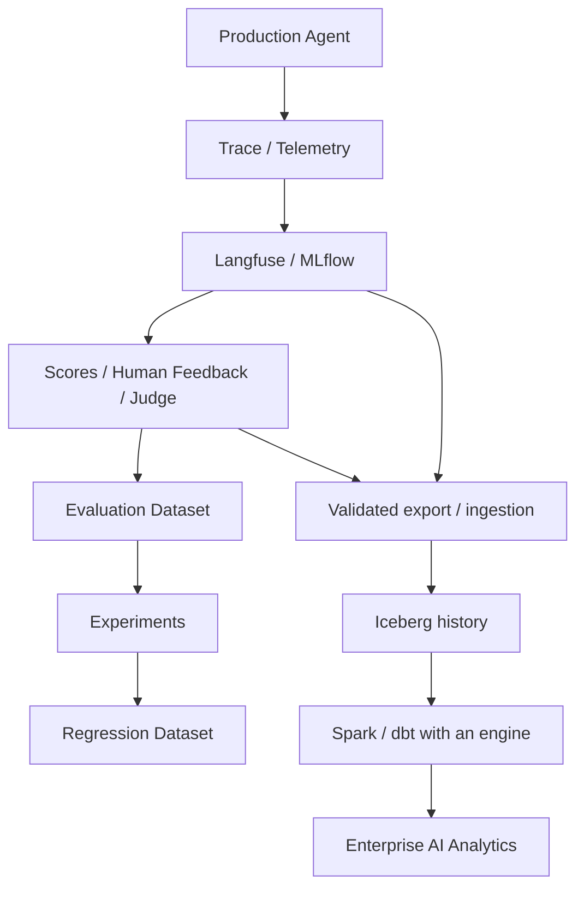

# Data platform architecture and roles

This page merges the source's supplementary explanations and final mental model. The architecture explains relationships. It is not a completed system or a required design for every organization. Linked topic pages provide evidence and qualifications for product behavior.

## Data paths

In this example, application events go to Kafka. PostgreSQL changes reach Kafka through Debezium. Flink or Spark Streaming writes Bronze data. Spark and dbt transformations build Silver and Gold, which Trino queries. dbt SQL runs on a connected execution engine.



The source's simpler diagram emphasizes Spark from Bronze to Silver and dbt from Silver to Gold/Data Mart. This diagram shows tool combinations within the same learning architecture. Connections require compatible connectors, catalogs, and execution engines. No end-to-end integration was tested for this material.

## Component boundaries

| Component | Main role | Details |
|---|---|---|
| Kafka | Event transport / durable log | [Kafka](event-architecture.md) |
| S3 | Object storage | [S3](foundations.md) |
| Parquet | Columnar analytical file format | [Parquet](foundations.md) |
| Iceberg | Table format, metadata, snapshots | [Iceberg](lakehouse-iceberg.md) |
| Spark | Large-scale compute and batch processing | [Spark](spark.md) |
| Flink | Stateful real-time processing | [Flink](flink.md) |
| Debezium | Capture database changes | [Debezium](cdc-debezium.md) |
| dbt | SQL transformation management | [dbt](dbt.md) |
| Trino | Distributed, interactive SQL queries | [Trino](trino.md) |
| Airflow | Workflow orchestration | [Airflow](orchestration.md) |
| OpenLineage | A standard for lineage events | [OpenLineage](lineage-metadata.md) |
| Catalog | Metadata search and discovery | [Catalog](lineage-metadata.md) |
| Governance | Policy, access, and audit | [Governance](governance.md) |
| Langfuse | AI telemetry, observability, and evaluation | [Langfuse](ai-ready-data.md) |


Storage, file format, table format, compute, query, transformation management, and orchestration have different roles. S3 holds objects; Parquet describes files; Iceberg manages table state; Spark/Flink process data; Trino runs SQL queries; dbt manages SQL models; Airflow manages task dependencies and execution order.

## Cross-cutting capabilities

| Capability | Question |
|---|---|
| Airflow | In what order and with which dependencies should tasks run? |
| Data quality | Does data satisfy the rules, and can we trust it? |
| Data observability | Are freshness, volume, distribution, or correctness abnormal now? |
| Metadata / catalog | What data exists, and what does it mean? |
| Lineage / OpenLineage | Where did it come from, and where does it go? |
| Governance | Who may use it, and under which policy? |
| Langfuse | What happened inside AI execution, and how good was it? |
| AI-ready data | Can AI reuse data under controlled conditions and restore experiment conditions? |

## Quality and observability

[Data quality](data-quality.md) checks rules such as not null, unique, accepted values, and accuracy. [Data observability](data-observability.md) studies changes and anomalies through freshness, volume, schema, distribution, anomaly detection, and alerts. Observability can monitor quality rules continuously. A successful pipeline does not prove correct data.

## Metadata, catalogs, and semantic layers

Metadata describes data. A catalog makes metadata searchable. Business metadata explains business meaning. A semantic layer defines reusable metric and dimension meanings and calculations for queries. Lineage describes creation and transformation relationships. Governance covers use policies and their enforcement. See [lineage and metadata](lineage-metadata.md), [analytical modeling](analytical-modeling.md), and [governance](governance.md).

## AI observability and the general data platform

Tools such as Langfuse handle traces, LLM/tool calls, prompts/responses, tokens/cost/latency, scores, datasets, and experiments. Do not assume they replace enterprise analytics, lakehouse storage, cross-domain joins, governance, long-term history, or a unified catalog. In this learning design, Langfuse handles execution-level telemetry and evaluation; the data platform holds durable analytical assets. This is not a final product adoption decision.

[AI-ready data](ai-ready-data.md) · [Online evaluation](online-evaluation.md) · [Study scope and next steps](curriculum.md)

## Why each component exists

Chapter 21 adds role and selection criteria to the existing architecture. These are design review examples, not an adoption ADR or a running system.

| Component | Problem and role | Omission or alternative |
|---|---|---|
| Kafka | Durable event transport, replay within retention, and producer/consumer separation. Useful when several consumers independently read events and process them asynchronously. It is not the analytical database. | A small system may only need application → database or direct batch export. |
| Flink | Low latency, event time, watermarks, large state, and complex windows or sessions in stateful streams. | With relaxed latency needs, Kafka → Spark Structured Streaming → Iceberg may be a simpler candidate. |
| Bronze | Keeps history close to source form for replay, audit, debugging, reprocessing, new transformations, and historical source access. | Define retention, access, and deletion rules together. Without raw history, transformation errors can be harder to recover from. |
| Iceberg | Adds schema, snapshots, metadata, partition evolution, atomic commits, time travel, and support for updates/deletes/merges above object-storage files. | Check engine, catalog, and format-version compatibility for multi-engine reads, writes, and row changes. |
| Spark | Large ETL, joins, aggregation, backfills, compaction, ML datasets, and Silver/Gold transformations. | It is compute, not storage. A smaller SQL runtime may be enough for small workloads. |
| dbt | Manages staging, intermediate models, marts, tests, documentation, lineage, and metric-oriented SQL models. | Complements Spark's heavy processing. A connected engine executes the SQL. |
| Gold / marts | Makes business data usable without exposing raw event internals. | Examples: `fact_agent_execution`, `fact_llm_call`, `dim_model`, `dim_team`, `mart_daily_ai_usage`. Define grain and business meaning first. |
| Trino / SQL warehouse | Interactive SQL, such as Iceberg Gold → Trino → dashboard/analyst. | Databricks SQL Warehouse or Snowflake Virtual Warehouse can fill this role in a managed platform. |
| Airflow / Lakeflow Jobs | Connects schedules, dependencies, retries, backfills, failure handling, parameters, and alerts. | Consider Airflow for cross-platform work and Lakeflow Jobs for Databricks-centered work. |

## Questions about quality, context, and policy

Quality checks completeness, uniqueness, validity, consistency, freshness, accuracy, and volume. Quarantine invalid data with reasons and a reprocessing path instead of silently dropping it. Observability covers freshness, volume, schema, distribution, pipeline health, and data health. **Healthy execution and correct data are different.**

A catalog helps answer which tables exist, what columns mean, who owns them, and whether they are fresh and trustworthy. Lineage explains origins, destinations, and change impact. It supports root-cause analysis, debugging, governance, and sensitive-data tracking.

Governance covers ownership, access, sensitivity, masking, retention and deletion, and access history. Its controls include ownership, classification, retention, deletion, masking, row/column access, audit, and data contracts. AI-ready data combines trust, freshness, versioning, discovery, governance, and provenance. It does not mean giving AI uncontrolled access to enterprise data.

## AI evaluation and long-term analytics



The new source branches from Gold/marts to Trino, BI, and AI evaluation. The existing diagram routes consumers through Trino as one example; not every consumer must use Trino.

Arrows represent logical data movement. They do not promise automatic integration or equal product capabilities. See the [AI evaluation platform](ai-evaluation.md) for trace/evaluation IDs, normalization, versions, and Langfuse export/API paths. Separate long-term analytics from execution-level observability.

A result should link through `experiment_id` or `trace_id` to these versions:

```text
Agent version → Prompt version → Model version → Tool version
Retrieval config → Embedding version → Dataset version
Evaluator version → Git commit
```

The arrows show the order of a dependency list, not a required linear execution chain. Preserve the combination of data, prompt, model, agent, tools, retrieval, evaluator, and code. These links support reconstruction of conditions. They do not guarantee identical output when external data changes or models are nondeterministic.

## Failure behavior and consistency boundaries

| Failure | Recovery decision and boundary |
|---|---|
| Kafka | Check replication, acknowledgements, retention, and available replicas. Consumers can resume or replay retained logs. Do not assume lossless recovery from every failure. |
| Flink | Check the availability and consistency of checkpoints/savepoints and source offsets before restoring state. |
| Spark | Retry failed tasks/jobs. Check job and output idempotency and writes that already succeeded. |
| Iceberg write | An atomic metadata commit protects consistent table state. Uncommitted files may be orphaned. Do not remove them without checking active writers and retention. |
| Airflow | Verify successful upstream output remains valid, then resume failed tasks. Do not default to rebuilding everything. |
| CDC | Resume from retained offset/log state; consider snapshots or re-bootstrap when required. |
| Data quality | Contain the problem and quarantine data before downstream publication; check cause, impact, and reprocessing. |

| Boundary | Guarantee and checks |
|---|---|
| Kafka | Ordering within a partition. Delivery semantics such as at-least-once and transaction features depend on producer and consumer use. |
| Flink | Checkpointed state. End-to-end exactly-once depends on source + state + sink conditions. |
| Iceberg | Snapshot-based consistent table reads and atomic commits. This does not automatically provide a business transaction across independent tables. |
| dbt / batch | Correctness depends strongly on bounded input and idempotent transformation/write rules. |

Define input, state, output, side effects, and failure boundaries before saying the whole platform is exactly-once. Use [operations and recovery](production-operations.md) and official engine documentation to check recovery positions and duplicate handling.

## Backfill and recovery design

An example priority is **rebuild the affected partition/range → use Bronze history → replay Kafka within retention → re-extract the source if needed**. This is not a mandatory command sequence. Choose according to available source data and the failure type.

Parameterize time ranges and design idempotency, resource limits, quality checks, and lineage impact analysis together. Expect retries, replay, backfills, and rollbacks. Keep justified raw history, transformation versions, and a defined source of truth. Actual procedures also need an owner, SLO, data contract, recovery input, and publication criteria.

## Scaling units and cost

| Component | Scaling units | Main costs |
|---|---|---|
| Kafka | Partitions, brokers, consumer parallelism | Brokers, storage, network |
| Flink | Operator parallelism, TaskManagers, state backend/resources | Always-on stream compute and state |
| Spark | Executors, tasks, partitions, cluster/serverless compute | Batch compute |
| Iceberg | Object storage, metadata, file layout, partitioning, compaction | Object storage and maintenance |
| Trino / SQL | Workers/warehouse size, concurrency, query optimization | Query compute |
| BI / AI | Concurrent users/workloads, inference and search paths | BI concurrency; AI tokens, inference, search |

Scaling one component does not remove another component's bottleneck. Before reducing unnecessary raw retention, check replay, audit, and retention requirements. Compare reduced scans, better file layout, incremental transforms, fewer duplicate materializations, and right-sized compute across the architecture. The total cost in [platform comparison](platform-comparison.md) also includes integration, upgrades, and on-call work.

## What to remove at smaller scale

| Example scale and need | Possible architecture | Omission candidates |
|---|---|---|
| Very small system | Application → PostgreSQL → dbt/SQL → BI | Kafka, Flink, Iceberg, Trino, separate metadata platform |
| Small analytics platform | PostgreSQL/files → object storage → Spark or managed SQL → warehouse/lakehouse → BI | Kafka and Flink may still be unnecessary |
| Medium event-driven platform | Application → Kafka → Spark Structured Streaming → Iceberg → Spark/dbt → Trino | Flink if stateful low-latency processing is not required |
| Large real-time platform | Kafka → Flink → Iceberg → Spark → Trino | Add catalog, observability, quality, and governance tools as organizational and data complexity justify them |

Removing a separate tool does not remove necessary quality, access-policy, or recovery responsibilities. Start with a real problem, not the presence of a component in a reference architecture.

## Open Lakehouse and managed options

An open-oriented example is **Applications → Kafka → Flink → Iceberg on S3 → Spark → dbt → Trino → BI**. The dbt step executes SQL through a compatible engine.

| Supporting role | Example tools |
|---|---|
| Orchestration | Airflow |
| Lineage event standard | OpenLineage |
| Catalog | DataHub / OpenMetadata |
| Quality | Soda / Great Expectations |
| System observability | Prometheus / Grafana |
| Data observability | A freshness, volume, and drift layer |
| AI lifecycle | MLflow / Langfuse |

Strengths are flexibility, portability, and control. Costs include integration, operations, upgrades, security integration, and on-call complexity. An open format does not by itself make SQL, catalogs, IAM, and operations portable.

A Databricks-centered candidate is:

```text
Sources → Kafka / Lakeflow Connect
→ Lakeflow Pipelines / Spark Streaming
→ Delta / Iceberg
→ Databricks Runtime / dbt → Gold
→ SQL Warehouse → BI

Unity Catalog: governance / lineage
Lakeflow Jobs: orchestration
MLflow: ML / AI lifecycle
AI Search: retrieval
Model Serving: inference
```

Some self-managed Spark, Trino, Airflow, catalog, lineage, MLflow, and vector-store responsibilities may combine into Runtime, SQL Warehouse, Lakeflow, Unity Catalog, MLflow, and AI Search. Kafka, Flink, external dbt, cross-platform Airflow, and special-purpose stores may remain. A matching feature name does not prove full replacement. Compare less platform engineering and faster integration with vendor dependency and platform cost.

A Snowflake-centered candidate is:

```text
Sources → Snowpipe / Streaming / external ingestion
→ Snowflake / Iceberg
→ Dynamic Tables / SQL transformation → Data marts
→ Virtual Warehouses → BI

Horizon: governance
Cortex / Search / Agents: AI
```

This can combine warehouse, SQL compute, transformation, Dynamic Tables, governance, Iceberg access, and AI services. Kafka, Flink, external Spark, Airflow, and special-purpose operational systems may remain. Treat its fit for SQL/analytics-centered organizations as a learning heuristic, not proof that it always performs better or costs less.

Check cloud, region, edition, runtime, table mode, and connector conditions. [Databricks](databricks.md) and [Snowflake](snowflake.md) document capabilities, limits, and official sources. Managed diagrams also describe untested integration candidates.

## Adoption questions and engineering principles

| Candidate | Question to answer |
|---|---|
| Kafka | Do we need replayable event transport? Do several consumers independently read the same event? |
| Flink | Do we actually need stateful low-latency streaming? |
| Iceberg | Do we need open analytical tables on object storage, snapshots, multiple engines, and large history? |
| Spark | Do we have large transformation or backfill workloads? |
| dbt | Do we need reusable SQL models and transformation management? |
| Trino | Do we need interactive SQL over an open lakehouse? |
| Airflow | Do workflows span systems that require orchestration? |
| Catalog / lineage | Is it difficult to find data, understand it, or assess change impact? |
| Quality / observability | Would incorrect or stale data cause real business harm? |
| Managed platform | Is reduced integration and operations work worth the vendor cost and dependency? |

Seven principles guide the choice:

1. Start with the problem. “Five systems need independent consumption of replayable events” is a reason; “modern platforms use Kafka” is not.
2. Separate storage, file format, table format, compute, transformation, query, orchestration, and catalog roles.
3. Design raw history, idempotency, time ranges, transformation versions, and source data for retries, replay, backfills, and rollback.
4. Observe job success and data correctness separately.
5. Version AI data, prompts, models, agents, tools, retrieval, evaluators, and code as one system.
6. Compare open control, portability, and platform work with managed integration, faster delivery, and vendor dependency. Neither is always correct.
7. Consider removing components whose complexity is not justified by actual requirements. Tool count does not measure maturity.

Read the final path as **operational DB → CDC / events → Kafka → streaming → raw/Bronze → lakehouse table → batch → Silver → modeling/dbt → Gold/marts → SQL serving → BI/analytics/AI**. Overlay orchestration order, quality and trust, current data health, metadata discovery, lineage origins and impact, governance policies, AI output quality, versioned execution conditions, resource costs, and recovery of correct state.

## LLM in Practice

**Situation:** Adapt a reference architecture to the needs of a small team.

**Context to give the LLM:** Sanitized workloads, latency and recovery targets, consumer count, current components, staffing, retention, and access constraints.

**Example prompt**

=== "English"

    ```text {.prompt}
    [Context]
    Current architecture, workload, and consumers: [sanitized description]
    Latency, recovery, retention, access, and staffing constraints: [requirements]

    [Task]
    First compare current component roles with actual requirements.
    List candidates to retain, remove, or combine in a managed platform, with reasons.
    Separate observations, assumptions, and missing evidence; do not assume end-to-end guarantees.

    [Output]
    Return requirements, options, failure impact, and trade-offs for each component.
    State who still owns source data, reprocessing, quality, and access policies.

    [Checks]
    List checks against actual version support and settings.
    Propose a bounded comparison of results, latency, and recovery on the same input.
    ```

=== "한국어"

    ```text {.prompt}
    [맥락]
    현재 구조·workload·consumer: [비식별 설명]
    지연·복구·보존·권한·운영 인력 조건: [요구]

    [요청]
    먼저 현재 구조의 역할과 실제 요구를 대조해 주세요.
    유지·생략·managed 통합 후보를 근거와 함께 나눠 주세요.
    관찰·가정·누락 근거를 구분하고 end-to-end 보장을 단정하지 마세요.

    [출력]
    구성 요소별 요구·대안·실패 영향·trade-off 표를 주세요.
    원본·재처리·품질·접근 정책의 책임이 남는지 명시해 주세요.

    [검증]
    실제 버전의 지원 범위와 설정을 대조할 항목을 주세요.
    같은 입력의 결과·지연·복구를 비교하는 제한된 검증 계획을 주세요.
    ```

**Expected output:** A component decision table and validation plan that expose unowned responsibilities.

**What the LLM can get wrong:** It may treat managed feature names as full replacement, automatic access-policy propagation, or consistency guarantees. It may remove necessary controls at small scale.

**How to validate:** An owner compares workloads, support documentation, settings, and result, latency, and recovery evidence on the same input. This example does not authorize actual changes.

## Evidence and verification scope

[Databricks data engineering](https://docs.databricks.com/aws/en/data-engineering) and [Snowflake architecture](https://docs.snowflake.com/en/user-guide/intro-key-concepts) were checked on 2026-09-26. Linked canonical topics contain detailed product evidence. This page combines source architecture concepts and principles; connector integration, SQL, failure recovery, and performance were not executed.
