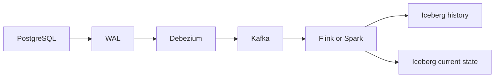

# CDC and Debezium

This page records conceptual study. The flows and recovery steps are examples, not records of production work or incident recovery. Product behavior was checked against official documentation on 2026-09-24. Check connector and database versions and settings in the actual environment.

## Why capture changes?

CDC means Change Data Capture. It sends database INSERT, UPDATE, and DELETE changes to other systems. Log-based CDC reads the transaction log. PostgreSQL uses WAL (Write-Ahead Log) and logical decoding.

This simple polling example uses `last_time` as a stored processing time. It is pseudo-SQL.

```sql
SELECT *
FROM orders
WHERE updated_at > last_time
```

Polling adds repeated query load. It makes deletes and change ordering hard to track. Its interval also adds delay. A deleted row cannot appear in this query. Log-based CDC uses change records, but it needs log retention and a stored read position.



## Connectors, offsets, and initial snapshots

A Debezium connector reads changes for a database such as PostgreSQL, MySQL, or SQL Server. Kafka Connect runs and manages connectors. An offset records the database log position already read. An initial snapshot copies data that existed before CDC started.

The goal is to connect `existing data + changes during the snapshot + later changes`. The snapshot is tied to a log position so the connector can continue reading changes. With a completed initial snapshot and a valid offset, a restart can usually resume streaming. A restart does not always skip the snapshot. A failure during a snapshot or a different snapshot mode can cause another snapshot. [Debezium PostgreSQL connector](https://debezium.io/documentation/reference/stable/connectors/postgresql.html)

## Reading events

| Change | before | after | op |
| --- | --- | --- | --- |
| INSERT | null | New row | `c` |
| UPDATE | Available previous values | New row | `u` |
| DELETE | Available previous values | null | `d` |
| Snapshot read | Check the event format | Read row | `r` |

Typical fields include `before`, `after`, operation type, source metadata, and transaction metadata. Source metadata can include database, schema, table, WAL position, and timestamp. Transaction metadata can provide a transaction ID and ordering information. Check its support and configuration.

The source's `before = old row` is a conceptual example. For PostgreSQL UPDATE and DELETE, available previous values depend on `REPLICA IDENTITY` and decoding conditions. Do not assume that every event contains a complete old row. [Replica identity](https://debezium.io/documentation/reference/stable/connectors/postgresql.html#postgresql-replica-identity)

## Key ordering and deletes

Changes for the same entity or key need the correct order. Order 100 should move through `CREATED → PAID → SHIPPED`. Kafka preserves order within a partition, not a global order across partitions. Sending the same primary key to the same partition helps. One database transaction can change several tables. Downstream, it can become several events in different partitions.

A DELETE event describes a database delete. A tombstone is a `key + null value` record for Kafka log compaction. They serve different purposes. Also separate downstream policies:

- Physical delete removes the downstream row.
- Logical delete keeps a state such as `deleted = true`.
- Bronze history stores all changes, including delete events.
- Silver current state keeps rows that currently exist. A logical-delete model also needs a rule for filtering deleted rows.

## Schema changes and Iceberg

Adding, removing, or renaming columns, changing types, and changing nullability can affect `Source → Kafka → Flink/Spark → Iceberg → dbt → BI`. Adding a nullable column is often easier to support, but consumers may still reject it. Type changes, removals, and renames need special care. Detect the change, check compatibility, and update downstream systems.

PostgreSQL logical decoding does not directly emit DDL change events. Do not assume that CDC reports every DDL operation. Include schema comparison and deployment controls. [PostgreSQL connector limits](https://debezium.io/documentation/reference/stable/connectors/postgresql.html)

A history table keeps CREATED, PAID, and SHIPPED events for order 100. A current-state table keeps its latest SHIPPED state. MERGE or upsert inserts new keys and updates existing keys. Deletes need a separate rule. Compare source sequences or positions so a late old change cannot overwrite a newer state. Define the scope of that comparison. Positions from different sources are not one global order. Processing an event again during replay must leave the same result.

## Failure recovery and checks

The normal recovery model is `Connector failure → restart → stored offset → WAL replay`. Replay can create duplicates, so downstream writes must be idempotent. An offset is a processing position. Replay means processing again. Idempotency makes repeated processing safe.

A lost offset or missing WAL may require a new snapshot. A snapshot can restore current state, but it cannot recover every intermediate change from a lost log. Before recovery, check the offset, replication slot, required WAL, and snapshot mode. Then check event order, duplicates, deletes, and source/current-state agreement for sample keys. [Failure behavior](https://debezium.io/documentation/reference/stable/connectors/postgresql.html#postgresql-when-things-go-wrong)

## LLM in Practice: a state moves backward after replay

Situation: an order moved from SHIPPED back to PAID after replay. Give the LLM anonymized events for the same key, source positions, offsets, write SQL, and connector settings.

=== "English"

    ```text {.prompt}
    [Context]
    Anonymized events and source positions for one key: [sample]
    Offsets, write SQL, and connector settings: [context]

    [Task]
    Review this CDC replay example. Separate observations from hypotheses.
    Check event order, source positions, duplicate handling, and delete handling.
    List missing evidence and the smallest tests before proposing a fix.
    Do not assume all before fields are complete or all positions are globally ordered.

    [Output]
    Return possible causes and checks for each one.

    [Checks]
    Validate hypotheses with synthetic duplicate, reversed, and delete events and actual settings.
    ```

=== "한국어"

    ```text {.prompt}
    [맥락]
    같은 key의 익명화한 event·source position: [샘플]
    Offset·적용 SQL·connector 설정: [맥락]

    [요청]
    이 CDC replay 예시를 검토하고 관찰과 가설을 구분해 주세요.
    Event 순서·source position·중복 처리·삭제 처리를 확인해 주세요.
    수정안을 제안하기 전에 부족한 근거와 가장 작은 테스트를 나열해 주세요.
    모든 before 필드가 완전하거나 모든 position이 전역 순서를 갖는다고 가정하지 말아 주세요.

    [출력]
    원인 후보와 각 후보의 확인 순서를 주세요.

    [검증]
    가상 중복·역순·삭제 event와 실제 설정으로 가설을 검증해 주세요.
    ```

Expected output is a set of possible causes and checks. The LLM may order events only by timestamp or assume MERGE alone guarantees idempotency. Check actual events and settings. Validate with a small test containing duplicate, reversed, and delete events. That test has not been run here.

[Orchestration](orchestration.md) · [dbt](dbt.md) · [Handbook home](../index.md)

[Six related practical prompts](../prompts/cdc-debezium.md)
