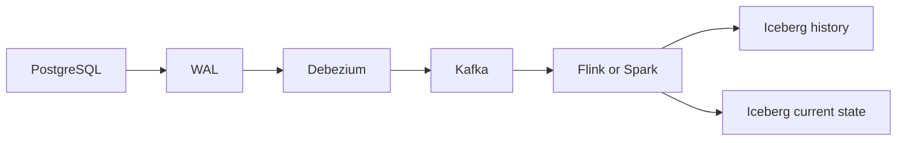

# Chapter 6 — CDC / Debezium

This page records conceptual study. The flows and recovery steps are examples, not records of production work or incident recovery. Product behavior was checked against official documentation on 2026-09-24. Check connector and database versions and settings in the actual environment.

The numbered body follows the supplied source’s headings, paragraphs, lists, examples, and order. Conditions on its simplified explanations and previously added guidance appear under **Additional checks before applying these ideas**.

**Reading note:** The source core below keeps the original order and form. Read the section-specific corrections, conditions, and additions in the supplement after the source material; some original statements are simplified.

<!-- SOURCE CORE START -->

## 6.1 CDC Fundamentals

CDC = Change Data Capture.

Purpose:

> **Continuously send database INSERT / UPDATE / DELETE changes to other systems.**

Polling approach:

```sql
SELECT *
FROM orders
WHERE updated_at > last_time
```

Problems:

- Database query load
- Difficulty detecting DELETE operations
- Difficulty managing change order
- Limited real-time delivery

CDC reads the database transaction log.

PostgreSQL:

```text
WAL
Write-Ahead Log
```

Structure:

```text
PostgreSQL
 ↓
WAL
 ↓
Debezium
 ↓
Kafka
```

---

## 6.2 Debezium Architecture

### Debezium Connector

A CDC reader for each database type.

Example:
- PostgreSQL
- MySQL
- SQL Server

### Kafka Connect

A platform for running and managing connectors.

### Offset

Records how far the database log has been read.

### Snapshot

Initially copies data that existed before CDC started.

---

## 6.3 Initial Snapshot

Data already exists when CDC starts for the first time.

```text
Existing Table
 ↓
Initial Snapshot
 ↓
WAL Streaming CDC
```

Changes can happen during a snapshot. Manage the WAL position to continue reading changes after the snapshot.

Goal:

```text
Existing data
+
Changes during the snapshot
+
Later changes
```

Avoid missing any of these.

A full snapshot is not repeated on every connector restart.

If an offset exists, reading resumes from it.

---

## 6.4 CDC Event Structure

Typical information:

- before
- after
- operation type
- source metadata
- transaction metadata

### INSERT

```text
before = null
after = new row
```

### UPDATE

```text
before = old row
after  = new row
```

### DELETE

```text
before = old row
after = null
```

Operation examples:

- c: create
- u: update
- d: delete
- r: snapshot read

Source Metadata:

- database
- schema
- table
- WAL position
- timestamp

Transaction Metadata:

- transaction id
- order information

---

## 6.5 Ordering

Key point:

> **In CDC, the change order for the same entity/key matters more than global ordering.**

Kafka preserves order within a partition but does not guarantee global order across partitions.

Sending the same primary key to the same partition helps preserve order for that entity.

```text
order 100:
CREATED
→ PAID
→ SHIPPED
```

Changes to several tables in one database transaction can become separate Kafka events in different partitions.

---

## 6.6 Deletes

### DELETE Event

Represents an actual database deletion.

### Tombstone

A `key + null value` record that represents a deleted key for Kafka log compaction.

A DELETE event and a tombstone serve different purposes.

### Physical Delete

Physically delete the row downstream too.

### Logical Delete

```text
deleted = true
```

Keep a state like this.

### History vs Current State

```text
Bronze History
→ Preserve all changes, including delete events

Silver Current State
→ Keep only rows that currently exist
```

---

## 6.7 Schema Changes

The source database schema can change.

Example:

- Adding a column
- Removing a column
- Rename
- Changing a type
- Changing nullability

A relatively safer change:

```text
Add a nullable column
```

Riskier changes:

```text
Change a type
Remove a column
rename
```

In CDC, a schema change can affect:

```text
Source
→ Kafka
→ Flink/Spark
→ Iceberg
→ dbt
→ BI
```

the whole path shown above.

Therefore:

```text
Detect
→ Check compatibility
→ Update downstream systems
```

these steps matter.

---

## 6.8 CDC → Iceberg

Representative structure:

```text
PostgreSQL
 ↓
Debezium
 ↓
Kafka
 ↓
Flink / Spark
 ↓
Iceberg
```

### History Table

Store every change event.

```text
order 100 CREATED
order 100 PAID
order 100 SHIPPED
```

### Current-State Table

Keep only the latest state.

```text
order 100 SHIPPED
```

### MERGE / Upsert

```text
new row
→ INSERT

existing row
→ UPDATE
```

### Late Change

Consider sequences or source positions to prevent an old change from overwriting a newer state.

### Idempotency

The result must remain correct if replay sends the same CDC event again.

---

## 6.9 CDC Failure Recovery

Normal recovery:

```text
Connector Failure
 ↓
Restart
 ↓
Stored Offset
 ↓
WAL Replay
```

Replay can create duplicates.

Downstream processing must therefore be idempotent.

A new snapshot may be needed if the offset is lost or the required WAL has already been deleted.

Key point:

```text
Offset
→ Processing position

Replay
→ Process again

Idempotency
→ Safety when processing duplicates

Snapshot Recovery
→ Reinitialize when recovery is unavailable
```

---

<!-- SOURCE CORE END -->

## Additional checks before applying these ideas

### Existing flow diagram


```mermaid
flowchart LR
  P[PostgreSQL] --> W[WAL]
  W --> D[Debezium]
  D --> K[Kafka]
  K --> C[Flink or Spark]
  C --> H[Iceberg history]
  C --> S[Iceberg current state]
```

### Scope of sections 6.1–6.4

CDC has several approaches. The source’s transaction-log explanation describes log-based CDC. PostgreSQL uses WAL and logical decoding. Log retention and a stored read position are required.

In the polling SQL, `last_time` is a pseudo-variable for the stored processing time. A deleted row cannot appear in this query. The polling interval also adds delay.

A snapshot read (`r`) carries the row read. Check the actual event format for fields such as `before`.

### Snapshot and previous-row conditions

With a completed initial snapshot and a valid offset, a restart can usually resume streaming. A failure during a snapshot or a different snapshot mode can cause another snapshot. [Debezium PostgreSQL connector](https://debezium.io/documentation/reference/stable/connectors/postgresql.html)

The event label `before = old row` is a conceptual example. For PostgreSQL UPDATE and DELETE, available previous values depend on `REPLICA IDENTITY` and decoding conditions. Do not assume every event contains a complete old row. Check support and configuration for transaction metadata too. [Replica identity](https://debezium.io/documentation/reference/stable/connectors/postgresql.html#postgresql-replica-identity)

### Schema and current-state writes

Consumers may reject even a new nullable column. PostgreSQL logical decoding does not directly emit DDL change events. Include schema comparison and deployment controls. [PostgreSQL connector limits](https://debezium.io/documentation/reference/stable/connectors/postgresql.html)

Separate delete handling from the INSERT and UPDATE behavior of MERGE/upsert. A logical-delete model also needs a rule for filtering deleted rows. Define the scope of source sequence/position comparisons used for late changes. Positions from different sources are not one global order.

### Checks before and after recovery

A snapshot can restore current state, but it cannot recover every intermediate change from a lost log.

- Before recovery: check the offset, replication slot, required WAL, and snapshot mode.
- After recovery: check event order, duplicates, deletes, and source/current-state agreement for sample keys.

[Failure behavior](https://debezium.io/documentation/reference/stable/connectors/postgresql.html#postgresql-when-things-go-wrong)

## LLM in Practice: a state moves backward after replay

Situation: an order moved from SHIPPED back to PAID after replay. Give the LLM anonymized events for the same key, source positions, offsets, write SQL, and connector settings.

=== "English"

    ```text {.prompt}
    [Context]
    Anonymized events and source positions for one key: [sample]
    Offsets, write SQL, and connector settings: [context]

    [Task]
    Review this CDC replay example. Separate observations from hypotheses.
    Check event order, source positions, duplicate handling, and delete handling.
    List missing evidence and the smallest tests before proposing a fix.
    Do not assume all before fields are complete or all positions are globally ordered.

    [Output]
    Return possible causes and checks for each one.

    [Checks]
    Validate hypotheses with synthetic duplicate, reversed, and delete events and actual settings.
    ```

=== "한국어"

    ```text {.prompt}
    [맥락]
    같은 key의 익명화한 event·source position: [샘플]
    Offset·적용 SQL·connector 설정: [맥락]

    [요청]
    이 CDC replay 예시를 검토하고 관찰과 가설을 구분해 주세요.
    Event 순서·source position·중복 처리·삭제 처리를 확인해 주세요.
    수정안을 제안하기 전에 부족한 근거와 가장 작은 테스트를 나열해 주세요.
    모든 before 필드가 완전하거나 모든 position이 전역 순서를 갖는다고 가정하지 말아 주세요.

    [출력]
    원인 후보와 각 후보의 확인 순서를 주세요.

    [검증]
    가상 중복·역순·삭제 event와 실제 설정으로 가설을 검증해 주세요.
    ```

Expected output is a set of possible causes and checks. The LLM may order events only by timestamp or assume MERGE alone guarantees idempotency. Check actual events and settings. Validate with a small test containing duplicate, reversed, and delete events. That test has not been run here.

[Orchestration](orchestration.md) · [dbt](dbt.md) · [Handbook home](../index.md)

[Six related practical prompts](../prompts/cdc-debezium.md)
