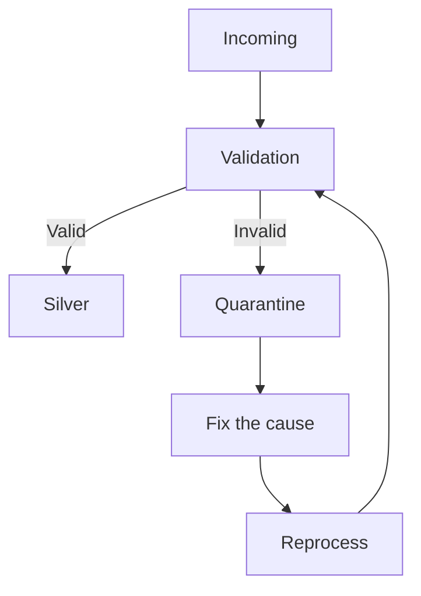

# Data quality engineering

This Learn page covers studied concepts and hypothetical operations. It does not claim hands-on implementation or incident response. Data quality asks, “Can we trust and use this data?” A service can respond while its data is wrong. That is still a data incident.

## Seven quality dimensions

One healthy metric does not prove that every dimension is healthy. These questions use a hypothetical `fact_llm_call` table.

| Dimension | Question | AI call example |
| --- | --- | --- |
| Completeness | Are required values present? | Is `model_id` NULL? |
| Uniqueness | Are values that must be unique free of duplicates? | Is `llm_call_id` duplicated? |
| Validity | Do values follow the format and allowed range? | Is latency negative? |
| Consistency | Do related data agree? | Does `model_id` exist in `dim_model`? |
| Freshness | Did data arrive within the required time? | Is the latest event within five minutes? |
| Accuracy | Do values match the real world? | Does recorded cost agree with billing? |
| Volume | Is the row count within the expected range? | Did call volume rise or fall sharply? |

Five minutes is a learning example, not a default target for every dataset. A valid format does not prove that a billed amount is correct.

## Validation layers

| Layer | Main checks | Purpose |
| --- | --- | --- |
| Ingestion | Schema, format, required fields, parsing | Can we read the input, and does it follow the expected shape? |
| Silver | Deduplication, relationships, business rules, valid values | Is the cleaned data logically sound? |
| Gold | KPIs, freshness, aggregate consistency, expected volume | Can we trust the final business result? |

Early checks focus on format. Middle checks focus on data logic. Final checks focus on business results. Passing an earlier layer does not remove the need for later checks.

## Quarantine invalid records

Quarantine stores invalid data on a separate path so that teams can diagnose and reprocess it. It avoids silently dropping records.



A quarantine record can hold the raw payload, error type, error message, and received time. After fixing the cause, send it through validation again. Monitor quarantine volume and trends by error reason. A queue that only grows is not a recovery process.

In an operational design, classify raw payloads and error messages as data that may contain sensitive information. Define storage scope and access with the [governance policy](governance.md). This page contains no real payloads.

## dbt checks and quality tools

`not_null`, `unique`, `relationships`, and `accepted_values` check declared conditions on model and table values. The source calls this “static validation.” Here that means fixed rules. A dbt data test runs SQL against actual data; it is not just static code analysis. Custom SQL tests can express business rules. [dbt data tests](https://docs.getdbt.com/docs/build/data-tests)

The four built-in checks alone do not cover every volume anomaly, distribution drift, or freshness anomaly. This does not mean dbt cannot check freshness. Source freshness is a separate feature. Statistical anomaly detection also needs historical measurements and a baseline. [dbt source freshness](https://docs.getdbt.com/docs/deploy/source-freshness)

| Tool | Studied role | Boundary to check |
| --- | --- | --- |
| Soda | Automated checks based on rules | Rule and data-source support |
| Great Expectations | Expectations that describe and validate conditions | Execution environment and data connections |
| Deequ | Large-scale data quality checks built on Spark | Compatibility with the Spark and library versions |

These tools overlap. This page explains their category. It does not claim to have tested their implementations or ranked them. Product descriptions were checked against official docs on 2026-09-24. [SodaCL v3](https://docs.soda.io/soda-documentation/soda-v3/sodacl-reference/metrics-and-checks), [GX Core](https://docs.greatexpectations.io/docs/core/define_expectations/), [Deequ](https://github.com/awslabs/deequ)

## Quality SLIs and SLOs

An SLI is a measurement. An SLO is its target. These are hypothetical targets:

```text
Freshness < 5 min
Completeness > 99.9%
Duplicate Rate < 0.01%
```

Requirements vary by dataset. A live dashboard and a monthly report need different freshness targets. For operational use, define the clock, measurement window, denominator, and dataset scope. These numbers are not measured results or approved production targets.

## Handle a data incident

1. **Detect:** Find an SLO violation.
2. **Contain:** Stop incorrect data from spreading downstream.
3. **Fix:** Correct the root cause.
4. **Reprocess:** Backfill or replay the affected scope.
5. **Verify:** Run quality checks again before resuming use.

An available service can still serve incorrect data. Do not close recovery just because a job succeeded. Check the reprocessing scope, duplicate risk, and downstream results. [Data observability](data-observability.md) helps measure ongoing health. [Lineage](lineage-metadata.md) helps find affected paths.

## LLM in Practice: review quality incident checks

**Situation:** A job succeeded, but duplicates increased in a hypothetical call table.

**Context to Give the LLM:** Provide a sanitized schema, event key, batch window, retry and replay history, duplicate rate, relevant SLOs, and downstream datasets.

**Example Prompt:**

```text
Review this data incident before proposing a redesign.
The job succeeded, but duplicate llm_call_id values increased.
Inputs: sanitized schema, batch window, retry and replay history,
duplicate-rate measurements, SLOs, and downstream datasets.
Separate observations, assumptions, hypotheses, and missing evidence.
Give containment options, next checks, a safe reprocessing scope,
and quality checks required before we resume downstream use.
```

**Expected Output:** A review that separates cause hypotheses, evidence to check, containment options, reprocessing scope, and resume criteria.

**What the LLM Can Get Wrong:** It may treat correlation between retries and duplicates as proof. It may assume the wrong deduplication key or grain.

**How to Validate:** Check real key definitions, logs, reprocessing windows, before-and-after quality measurements, and downstream aggregates. LLM output is a hypothesis. It does not replace operational approval.

[Handbook home](../index.md)
