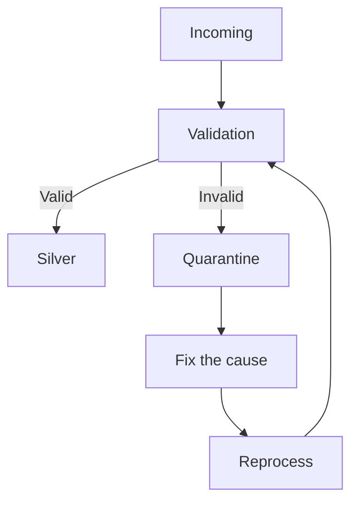

# Chapter 11 — Data Quality Engineering

This Learn page covers studied concepts and hypothetical operations. It does not claim hands-on implementation or incident response. Data quality asks, “Can we trust and use this data?” A service can respond while its data is wrong. That is still a data incident.

**Reading note:** The source core below keeps the original order and form. Read the section-specific corrections, conditions, and additions in the supplement after the source material; some original statements are simplified.

<!-- SOURCE CORE START -->

## 11.1 Quality Dimensions

### Completeness

Are required values present?

### Uniqueness

Are values that must be unique free of duplicates?

### Validity

Do values follow the allowed format and range?

### Consistency

Do related data agree?

### Freshness

Did data arrive on time?

### Accuracy

Do values match the real world?

### Volume

Is the amount of data within the expected range?

AI example:

```text
fact_llm_call

Completeness
→ model_id NULL?

Uniqueness
→ Duplicate llm_call_id?

Validity
→ Negative latency?

Consistency
→ model_id exists in dim_model?

Freshness
→ Latest event within 5 minutes?

Accuracy
→ Cost agrees with billing?

Volume
→ Sharp rise or fall in call volume?
```

---

## 11.2 Validation Layers

### Ingestion Validation

- Schema
- Format
- Required fields
- Parsing

### Silver Validation

- Deduplication
- Relationships
- Business rules
- Valid values

### Gold Validation

- KPIs
- Freshness
- Aggregate consistency
- Expected volume

Focus by layer:

```text
Early
→ Format

Middle
→ Data logic

Final
→ Business results
```

---

## 11.3 Quarantine Patterns

Keep invalid data separately instead of dropping it.

```text
Incoming
 ↓
Validation
 ↙      ↘
Valid   Invalid
 ↓        ↓
Silver   Quarantine
```

In quarantine:

- Raw payload
- Error type
- Error message
- Received time

Store these details, among others.

Reprocess the data after fixing the cause.

Do not let quarantine only grow. Monitor its volume and error reasons.

---

## 11.4 dbt Tests

Basic dbt tests for data quality:

- not_null
- unique
- relationships
- accepted_values

Strength:
- Static validation at the model/table level.

Areas that may need more checks:
- Volume anomalies
- Distribution drift
- Freshness anomalies

---

## 11.5 Soda / Great Expectations / Deequ

Common role:

> **Tools that check data quality rules automatically.**

### Soda

Rule- and check-based validation.

### Great Expectations

Validation based on expectations.

### Deequ

Large-scale data quality checks suited to Spark environments.

These tools overlap. The study goal was to understand the category, not implement each tool.

---

## 11.6 Data Quality SLOs

SLI:

> An actual measurement.

SLO:

> A target level.

Examples:

```text
Freshness < 5 min
Completeness > 99.9%
Duplicate Rate < 0.01%
```

SLOs should differ by dataset.

A live dashboard and a monthly report need different freshness targets.

---

## 11.7 Incident Handling

Flow:

```text
Detect
 ↓
Contain
 ↓
Fix
 ↓
Reprocess
 ↓
Verify
```

### Detect

Find an SLO violation.

### Contain

Stop incorrect data from spreading downstream.

### Fix

Correct the root cause.

### Reprocess

Backfill or replay the affected data.

### Verify

Run quality checks before resuming use.

Remember:

> **Incorrect data is a data incident even when the service is available.**

---

<!-- SOURCE CORE END -->

## Appendix: existing application notes

The main text follows the supplied chapter’s headings, examples, and order. These existing explanations and caveats are separate from the source text.

### Quality dimensions and validation layers

One healthy metric does not prove that every dimension is healthy. A valid format does not prove that a billed amount is accurate. Five-minute freshness is an example, not a default target for every dataset.

Passing an earlier validation layer does not remove the need for later checks.

### Quarantine storage and access

Raw payloads and error messages may contain sensitive information. Define storage scope and access with the [governance policy](governance.md). This page contains no real payloads.

### Scope of dbt and quality tools

The source’s “static validation” means fixed rules. A dbt data test runs SQL against actual data; it is not just static code analysis. Custom SQL tests can express business rules. [dbt data tests](https://docs.getdbt.com/docs/build/data-tests)

The limits of the four basic tests do not mean dbt cannot check freshness. Source freshness is a separate feature. Statistical anomaly detection also needs historical measurements and a baseline. [dbt source freshness](https://docs.getdbt.com/docs/deploy/source-freshness)

Check these boundaries when applying each tool:

- Soda: support for the rule and connected data source.
- Great Expectations: execution environment and data connections.
- Deequ: compatibility with Spark and library versions.

Product descriptions retain the scope checked against official documentation on 2026-09-24. This edit did not recheck them, test implementations, or rank the tools. [SodaCL v3](https://docs.soda.io/soda-documentation/soda-v3/sodacl-reference/metrics-and-checks), [GX Core](https://docs.greatexpectations.io/docs/core/define_expectations/), [Deequ](https://github.com/awslabs/deequ)

### SLOs and recovery checks

The SLO values in the main text are learning examples, not measured results or approved production targets.

For operational SLOs, define the clock, measurement window, denominator, and dataset scope.

Do not close recovery just because a job succeeded. Check the reprocessing scope, duplicate risk, and downstream results. [Data observability](data-observability.md) helps measure ongoing health. [Lineage](lineage-metadata.md) helps find affected paths.

### Existing conceptual diagram

This preserves the existing Mermaid diagram separately from the source’s text diagram.


```mermaid
flowchart TD
    Incoming --> Validation
    Validation -->|Valid| Silver
    Validation -->|Invalid| Quarantine
    Quarantine --> Repair[Fix the cause]
    Repair --> Reprocess
    Reprocess --> Validation
```

## LLM in Practice: review quality incident checks

**Situation:** A job succeeded, but duplicates increased in a hypothetical call table.

**Context to Give the LLM:** Provide a sanitized schema, event key, batch window, retry and replay history, duplicate rate, relevant SLOs, and downstream datasets.

**Example Prompt:**

=== "English"

    ```text {.prompt}
    [Context]
    The job succeeded, but duplicate llm_call_id values increased.
    Schema, event key, and batch window: [sanitized definitions]
    Retry and replay history and duplicate rate: [measurements and logs]
    SLOs and downstream datasets: [list]
    [Task]
    Review this data incident before proposing a redesign.
    Separate observations, assumptions, hypotheses, and missing evidence.
    [Output]
    Give containment options and the next checks.
    Give a safe reprocessing scope and quality checks before downstream use resumes.
    [Checks]
    Check key definitions, logs, replay windows, quality changes, and downstream totals.
    Do not treat hypotheses as approval or execute operational actions.
    ```

=== "한국어"

    ```text {.prompt}
    [맥락]
    작업은 성공했지만 llm_call_id 중복이 늘었습니다.
    스키마·이벤트 키·배치 구간: [비식별 정의]
    retry·replay 이력과 중복률: [측정과 로그]
    SLO와 downstream 데이터셋: [목록]
    [요청]
    재설계를 제안하기 전에 이 데이터 장애를 검토하세요.
    관찰·가정·가설·누락 근거를 구분하세요.
    [출력]
    전파 차단 선택지와 다음 확인 순서를 주세요.
    안전한 재처리 범위와 downstream 재개 전 품질 검사를 주세요.
    [검증]
    키 정의·로그·재처리 구간·전후 품질·downstream 집계로 확인하세요.
    가설을 운영 승인으로 취급하거나 실제 조치를 실행하지 마세요.
    ```

**Expected Output:** A review that separates cause hypotheses, evidence to check, containment options, reprocessing scope, and resume criteria.

**What the LLM Can Get Wrong:** It may treat correlation between retries and duplicates as proof. It may assume the wrong deduplication key or grain.

**How to Validate:** Check real key definitions, logs, reprocessing windows, before-and-after quality measurements, and downstream aggregates. LLM output is a hypothesis. It does not replace operational approval.

[Handbook home](../index.md)

[More practical prompts](../prompts/data-quality.md)
