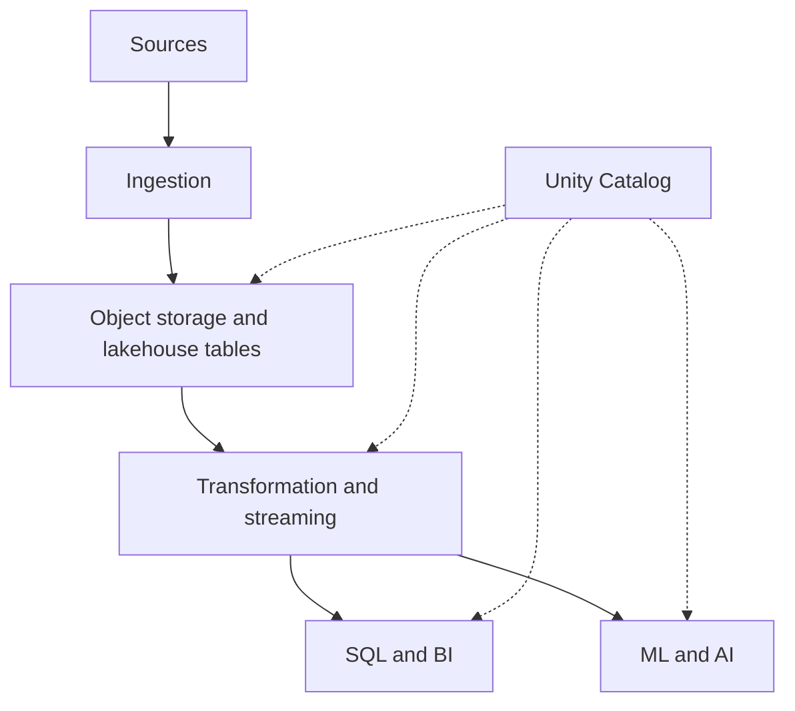

# Databricks: an integrated Lakehouse and its boundaries

Page type: Learn. This page records concept study from Chapter 17. `studied` does not mean hands-on implementation or production experience. Examples are hypothetical and were not run. Product scope was checked against official documentation on 2026-09-26. Availability depends on cloud, region, Runtime, access mode, and table features.

## 17.1 Lakehouse Architecture

Databricks combines data engineering, SQL, governance, ML, and AI on a shared data foundation. A self-managed stack might use `Kafka → Flink → Iceberg → Spark → dbt → Trino → BI`, with Airflow, Catalog, Lineage, Governance, and MLflow around it. Databricks combines several of these responsibilities. It does not remove every role.



Storage uses cloud object storage such as S3. Databricks supplies compute. The platform grew around Delta and also supports Iceberg. Runtime is Spark-based and can use Photon. Medallion layers separate **Bronze raw data → Silver cleaned, validated, joined data → Gold business facts, dimensions, and marts**. Turning on a tool does not guarantee layer quality. See [Lakehouse and Iceberg](lakehouse-iceberg.md).

## 17.2 Databricks Runtime and Photon

Runtime bundles Spark with an execution environment, optimizations, libraries, connectors, and platform integration. It takes over some work needed to manage JVM/Python, libraries, connectors, cluster settings, and tuning in a self-managed Spark system. Runtime versions include Spark, JDK, libraries, and behavior changes. Plan production upgrades and test compatibility.

A useful model is `SQL/DataFrame → Catalyst planning → Photon for supported operations`. Photon is a native vectorized execution layer for supported scans, filters, joins, aggregations, shuffles, and Parquet operations. It does not replace Spark's APIs, planning, and distributed framework. Inspect execution plans to see which operations use it. [Photon scope](https://docs.databricks.com/aws/en/compute/photon).

## 17.3 SQL Warehouses

A SQL Warehouse supplies compute for ad-hoc SQL, BI, dashboards, reporting, analyst exploration, and SQL transformations. It is not table storage. The flow is `Delta/Iceberg tables → SQL Warehouse → analyst/BI`. Compare its role with [Trino](trino.md) in an open stack.

Serverless SQL reduces cluster operations and adjusts compute to load. Measure concurrency and queue time when choosing capacity and settings. Queries connect to Unity Catalog governance. Metric Views cover central metric definitions, dimensions, and shared business semantics. Check feature requirements in [Databricks SQL](https://docs.databricks.com/aws/en/sql/) and [Metric Views](https://docs.databricks.com/aws/en/metric-views/).

## 17.4 Unity Catalog

Unity Catalog is a governance layer for data and AI assets. Its hierarchy is `Metastore → Catalog → Schema → Object`. Table names use `catalog.schema.table`. The hypothetical name `production.ai.fact_llm_call` does not identify a real organization.

| Object or type | Responsibility and example |
|---|---|
| Tables, Views, Functions, Models | Tabular data, query definitions, functions, and models |
| Volumes | Files such as PDFs, images, JSON, documents, and artifacts |
| RAG layout example | Source PDFs in a Volume; chunks and embeddings in a Table |
| Managed Table | UC manages metadata, storage location, lifecycle, and supported optimizations |
| External Table | Data uses a user-managed object path; UC manages registered metadata and access |

Catalogs, schemas, tables, views, volumes, and models are securable objects. Some privileges are inherited through the hierarchy. Do not assume every privilege or policy has the same inheritance rules. **UC policies alone do not govern direct external reads and writes to object paths.** Check cloud IAM and external engine access too. [Unity Catalog](https://docs.databricks.com/aws/en/data-governance/unity-catalog/), [external access boundaries](https://docs.databricks.com/aws/en/external-access).

## 17.5 Lakeflow Jobs

A Lakeflow Job defines tasks, dependencies, and schedules or triggers, much like an Airflow DAG. Tasks can include notebooks, SQL, dbt, pipelines, Python/Spark, and ML work. Time schedules, file arrival, table updates, and continuous execution have task-specific requirements. [Lakeflow Jobs](https://docs.databricks.com/aws/en/jobs/).

A separate Airflow system may add less value when most work runs inside Databricks. A [general orchestrator](orchestration.md) may still help coordinate Databricks, AWS Lambda, Kubernetes, Snowflake, SaaS APIs, and internal systems. Similar names do not imply identical DAG, retry, or backfill behavior.

## 17.6 Lakeflow Pipelines

Separate **Connect for ingestion / Pipelines for transformation / Jobs for execution order**. The source's Lakeflow Pipelines and older Delta Live Tables (DLT) names connect to the current Spark Declarative Pipelines documentation. Some documentation and environments also use Lakeflow Spark Declarative Pipelines. [Current Pipelines documentation](https://docs.databricks.com/aws/en/ldp/), [Lakeflow Connect](https://docs.databricks.com/aws/en/ingestion/lakeflow-connect).

An imperative workflow says “run the Bronze notebook, run the Silver notebook, then run Gold SQL.” A declarative pipeline defines `bronze_events → silver_events → gold_metrics`. The engine manages more dependency, incremental update, execution order, parallelization, and monitoring work. Key objects are Pipeline, Flow, Streaming Table, and Materialized View. Pipelines handle batch and streaming and connect to Spark Structured Streaming. A declarative query is not automatically incremental in every case. It also needs suitable settings to meet freshness goals.

## 17.7 Delta / Iceberg interoperability

Delta and Iceberg add table metadata to object storage and Parquet. Both address transactions, snapshots, schema evolution, time travel, and table management. **Delta and Iceberg are different formats.** Delta can be a natural choice for Databricks-centered work. Iceberg can suit multiple engines. Test the actual reader and writer combination.

| Approach | Meaning | Boundary to check |
|---|---|---|
| UC managed Iceberg | UC manages Iceberg tables and Parquet | Features, table version, external writers |
| Delta UniForm / Iceberg reads | One set of Parquet files with Delta and compatible Iceberg metadata | Delta remains the source format; read compatibility does not allow arbitrary Iceberg writes |
| Iceberg REST Catalog | Catalog interface for engines such as Spark, Flink, and Trino | Client, authentication, privileges, reads/writes, and table features |

UniForm generates Iceberg metadata asynchronously. Do not assume a Delta commit is immediately visible as the same Iceberg version. Check metadata generation status and external read freshness. Table format, storage, catalog, and governance integration are separate dimensions. [Iceberg reads](https://docs.databricks.com/aws/en/delta/iceberg-reads), [external system access](https://docs.databricks.com/aws/en/external-access), [Iceberg REST specification](https://iceberg.apache.org/rest-catalog-spec/).

## 17.8 Lineage and Governance

An example lineage is `bronze.llm_calls → Spark → silver.llm_calls → SQL/dbt → gold.ai_usage → Dashboard`. Column lineage helps assess change impact. Example classifications are `email → PII` and `employee_id → Sensitive Internal`. No real values are collected or published here.

UC connects lineage, classification, access control, masking, row filters, and audit. RBAC connects roles to privileges. ABAC connects attributes or tags to policies. For example, a policy can mask PII-tagged data for general analysts and allow clear text only for a separately approved security role. **Adding a tag alone does not create masking.** Configure policies and test both allowed and denied access for each role.

Governance can extend to external lineage, models, model services, agents, and AI services. Check the collection and enforcement boundary of each integration. [UC governance scope](https://docs.databricks.com/aws/en/data-governance/unity-catalog/). See [Governance](governance.md) and [Lineage and Metadata](lineage-metadata.md).

## 17.9 MLflow

MLflow covers traditional ML and GenAI/agents. An experiment Run links parameters, metrics, code versions, and artifacts. Model Registry tracks model names, versions, aliases, tags, and lineage. It integrates with UC on Databricks.

A `User → Agent → Retriever → LLM → Tool → Response` trace can link inputs, outputs, latency, tokens, cost, tool calls, and retrieval. Evaluation datasets, scorers, LLM judges, custom rules, Prompt Registry versions, and human feedback or review can support evaluation. Verify captured fields, cost availability, and sensitive-data handling in the actual instrumentation. [MLflow on Databricks](https://docs.databricks.com/aws/en/mlflow/).

The source compares MLflow 3 and Langfuse because their **capability areas overlap** in tracing, tool/retrieval tracking, prompt management, evaluation, judges, human feedback, and experiments. This does not promise equal behavior, UI, retention, or operations. MLflow has a strong traditional ML and Model Registry focus and native Databricks UC integration. Langfuse focuses on LLM work; a traditional ML registry is not its main purpose. The source describes its UC connection as an external integration. A Databricks-centered team can consider reducing duplicate systems after checking required features.

## 17.10 AI / Vector capabilities

The integrated flow is `Lakehouse → AI Search → Model/Agent → Serving → Application`. A RAG flow is `documents → chunking → embeddings → AI Search → retriever → LLM`. AI Search is the current name for Vector Search. Distinguish indexes that sync supported source tables from indexes updated directly. Not every index updates automatically. Supported sync indexes can apply source changes incrementally, but some endpoint types need partial index rebuilds. [AI Search](https://docs.databricks.com/aws/en/ai-search/ai-search).

Model Serving can expose custom models, foundation models, and external providers through managed endpoints. Agents can combine an LLM, AI Search, SQL tools, MCP, and external APIs. UC covers governance, MLflow covers traces and evaluation, Lakehouse holds data, AI Search retrieves it, and Serving runs inference.

**Retrieving unauthorized documents and hiding them later is unsafe.** Restrict access before retrieval. The checked AI Search documentation says row and column permissions are unsupported and application ACLs can use the filter API. Do not assume UC integration automatically carries source row policies to an index. Build filters from trusted server-side user and permission data. Test bypass attempts, unauthorized documents, and permission changes. [AI Search limitations](https://docs.databricks.com/aws/en/ai-search/ai-search#limitations).

## 17.11 Databricks cost model

A DBU is a normalized compute/service billing unit, not a fixed CPU count. Classic compute is conceptually **DBU + cloud VM + storage/network**. Serverless moves infrastructure operations to the vendor but can leave external storage/network charges. Include Spark Jobs, SQL Warehouses, Pipelines, Serverless, Model Serving, AI Search, storage, network, and background optimization.

Pruning can reduce scans. Compaction can improve reads. Incremental processing can avoid full recomputation. Check billing units, always-on resources, and maintenance cost before equating shorter runtime with lower bills. Allocate costs by `team / project / environment / job / workspace`. Serverless can improve operations, startup, scaling, and idle use without always being cheaper. Use real workloads and current [cost management documentation](https://docs.databricks.com/aws/en/admin/account-settings/usage), not a fixed assumed price.

## 17.12 Which self-managed components can it replace?

| Existing responsibility | Integration candidate | Decision boundary |
|---|---|---|
| Spark cluster | Runtime / Serverless | High consolidation potential |
| Trino-like BI serving | SQL Warehouse | Check SQL, concurrency, and connector needs |
| Custom Spark pipeline framework | Pipelines | Check transformations and recovery |
| Catalog / Governance | Unity Catalog | Check external policy boundaries |
| OpenLineage / Marquez-like internal lineage | UC Lineage | Review external lineage separately |
| Self-hosted MLflow | Managed MLflow | Compare storage, auth, and features |
| Vector DB for Databricks-centered RAG | AI Search | Check quality, permissions, and sync |
| Airflow | Partial replacement by Jobs | Cross-platform orchestration may remain |
| Langfuse | MLflow feature overlap | Compare required trace/evaluation features |
| dbt | Some overlap with SQL / Pipelines | dbt remains a valid choice |
| Kafka | Usually remains separate | Durable event log / event bus |
| Flink | Keep when needed | Low-latency complex stateful streaming |

The value is less installation, upgrade, integration, security, and monitoring work across S3, tables, engines, orchestration, catalogs, lineage, MLflow, search, and AI observability. Balance simpler operations and faster integration against platform dependency, lock-in, and possible higher cost. See [Platform comparison](platform-comparison.md).

## LLM in Practice

### Review the scope of a managed migration

**Situation:** Assess whether to consolidate a hypothetical Spark, Trino, Airflow, and RAG search stack on Databricks.

**Context to Give the LLM:** Provide sanitized workloads, latency/freshness SLOs, external DAG dependencies, table formats and reader/writer versions, per-user retrieval permissions, costs, and operating hours.

**Example Prompt:**

=== "English"

    ```text {.prompt}
    [Context]
    Stack: [workloads and external dependencies]
    Constraints: [SLOs, reader/writer versions, retrieval permissions, costs and operating hours]
    [Task]
    Assess current responsibilities and observed problems first.
    Compare which responsibilities to keep or move to Databricks with evidence.
    Review remaining Kafka/Flink needs, external catalog access, and pre-retrieval ACLs separately.
    [Output]
    Separate observations, assumptions, and unknown support requirements.
    Give a responsibility table, phased experiments, failure criteria, and a rollback plan.
    [Checks]
    Do not promise product equivalence or cost savings.
    Link claims to official docs, real settings, denied-access tests, and metrics to measure.
    ```

=== "한국어"

    ```text {.prompt}
    [맥락]
    구성: [workload 목록과 외부 의존성]
    제약: [SLO, reader/writer 버전, 검색 권한, 비용과 운영시간]
    [요청]
    먼저 현 구조의 책임과 실제 문제를 평가하라.
    Databricks로 유지 또는 이관할 범위를 근거와 함께 비교하라.
    Kafka/Flink 잔존, 외부 catalog 접근, 검색 전 ACL을 별도로 검토하라.
    [출력]
    관찰 사실, 가정, 미확인 지원 조건을 분리하라.
    책임별 후보표와 단계적 실험, 실패 기준, rollback 계획을 작성하라.
    [검증]
    제품 동등성이나 비용 절감을 단정하지 말라.
    공식 문서, 실제 설정, 권한 거부 테스트, 측정해야 할 지표를 연결하라.
    ```

**Expected Output:** A keep/migrate table by responsibility, unknown requirements, phased experiments, access tests, and a rollback plan.

**What the LLM Can Get Wrong:** It may assume UC protects every external access and retrieval row, or that Kafka and Flink always disappear.

**How to Validate:** Compare current official support tables with real settings. Test external reads/writes, denied retrieval, retries, and recovery in isolation. Measure actual bills and operating hours. Have a person approve the decision.
