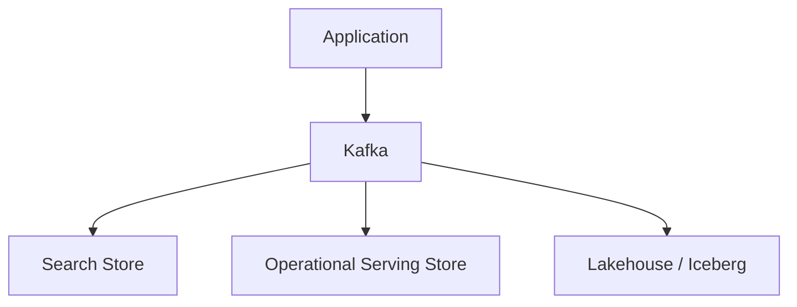

# Event data architecture

Page type: Learn. This page records concepts and design examples from the supplied study material. `studied` means conceptual study, not hands-on implementation or production validation. Examples were not run. Kafka broker, ISR, and replica operations are outside this page. The focus is event meaning for data engineering.

## 2.1 Event modeling

An event records a fact that happened: a user clicked a button, an order was created, an agent ran, an LLM was called, or a tool failed. Prefer immutable events when practical. Add a new event to express a new fact instead of changing the historical event.

| Field | Purpose |
| --- | --- |
| `event_id` | Unique identity for deduplication and tracing |
| Event time | When the real action happened |
| Ingestion time | When the data platform received it |
| Producer timestamp | When the producer recorded creation |
| `trace_id`, `session_id`, `execution_id` | Connect events across a trace, session, or execution |

Event time and ingestion time differ. An event may happen at `10:00:01` and arrive at `10:00:05`.

## 2.2 Event contracts

An event contract agrees on meaning between producer and consumer. It can include required or optional fields, data type, unit, semantic definition, owner, version, and compatibility rules.

```text
field: latency_ms
type: integer
unit: millisecond
required: true
owner: AI Platform Team (illustrative)
```

The same schema does not guarantee the same meaning. `latency = 5` could mean five milliseconds or five seconds. The contract must remove that ambiguity.

## 2.3 Schema evolution

Schemas change over time. Version 1 might contain `event_id`, `user_id`, and `event_time`. Version 2 adds `device_type`.

| Format | Main trade-off |
| --- | --- |
| JSON | Easy to read and flexible; validation may be weak without an explicit schema, and payloads may be larger |
| Avro | Schema-based serialization, often used with Kafka and a schema registry |
| Protobuf | Explicit schema and compact binary representation |

A schema registry stores versions and checks configured compatibility rules. It helps catch breaking structural changes before registration.

**Backward compatibility** asks whether a new consumer can read old data. **Forward compatibility** asks whether an old consumer can read new data. A breaking change can include a required-field removal, an incompatible type change, or a semantic change. The actual result depends on the format, reader and writer schemas, and compatibility mode. A unit change can break meaning even if schema validation passes.

## 2.4 Delivery semantics

| Semantics | Meaning | Main concern |
| --- | --- | --- |
| At-most-once | Zero or one delivery | Data may be lost |
| At-least-once | One or more deliveries within the supported recovery assumptions | Duplicate processing may occur |
| Exactly-once | One committed effect within a defined boundary | The boundary and participating systems matter |

Always ask: exactly once from where to where? Kafka transactions, stream-processor state, and an external sink have different boundaries.

At-least-once delivery plus idempotency and deduplication can make a final result reflect one effect. **Idempotency** means processing event A again does not change the final result further. **Deduplication** identifies repeated events, often by `event_id`, and keeps one logical event. These mechanisms need a defined identity and retention policy.

## 2.5 Replay

An event log such as Kafka lets a consumer reread retained events. Offset replay may start at offset 100 and read 101, 102, and later records. This can rebuild a search index, create a new lakehouse table, fill a missing range, or apply new logic to old events.

```text
Kafka → replay → New Search Index
Kafka → replay → New Lakehouse Table
```

Replay can repeat effects. Use idempotency, deduplication, and deterministic processing where required. Check that the necessary log history still exists and that the new reader can handle historical schemas.

## 2.6 Serving and lakehouse paths

One logical event can be materialized for several uses:



A user click can support a live dashboard, search or recommendations, long-term analytics, and AI evaluation. The stream is the delivery path. Each destination stores a representation suited to its purpose. Independent paths need their own lag, recovery, and consistency checks.

## Qualifications for real use

The owner in the example is fictional. Distinguish plain JSON from validation through JSON Schema. A registry cannot catch every semantic change, such as a unit change. Allowed changes depend on the format, field defaults, and compatibility mode. For full historical replay, check whether compatibility covers only the previous schema or all prior schemas through a transitive mode. [Confluent schema compatibility](https://docs.confluent.io/platform/current/schema-registry/fundamentals/schema-evolution.html)

At-least-once guarantees rely on the system's retention and recovery assumptions. Deduplication needs an identity rule and a state-retention period. A longer replay needs separate verification. Kafka replay is limited to retained history. Check historical schema support and each serving or lakehouse path's lag, recovery, and result consistency.

## Related reading

[Data foundations](foundations.md), [Flink](flink.md), [Iceberg](lakehouse-iceberg.md).

## LLM in practice: Replay safety review

- Situation: Rebuild a hypothetical search index from historical events.
- Context to give the LLM: Give schema versions, offset range, retention, event-ID rules, sink write behavior, and current consumer state.
- Expected output: Expect duplicate and loss risks, compatibility checks, and testable results.
- What the LLM can get wrong: The LLM may extend Kafka guarantees to an external sink without evidence.
- How to validate: Replay a small range twice and compare final results by event ID and missing-event counts.

Example prompt:

=== "English"

    ```text {.prompt}
    [Context]
    Schemas and scope: [schema versions, offset range, retention]
    Processing contract: [event-ID rules, sink writes, current consumer state]

    [Task]
    Assess the current replay design before redesigning it.
    State the delivery guarantee boundary.
    Separate facts, assumptions, duplicate risks, and missing evidence.

    [Output]
    List duplicate and loss risks, compatibility checks, and expected sink results.

    [Checks]
    Propose a bounded replay test and expected results by event ID.
    ```

=== "한국어"

    ```text {.prompt}
    [맥락]
    Schema와 범위: [schema 버전·offset 범위·보존 기간]
    처리 계약: [event ID 규칙·sink write·현재 consumer 상태]

    [요청]
    재설계 전에 현재 replay 설계를 검토해 줘.
    전달 보장 경계를 명시하고 사실·가정·중복 위험·누락 근거를 나눠 줘.

    [출력]
    중복·유실 위험과 호환성 점검, 예상 sink 결과를 작성해 줘.

    [검증]
    제한된 범위의 replay 테스트와 event ID별 기대 결과를 제안해 줘.
    ```

[See six more practical prompts for this topic](../prompts/event-architecture.md)

LLM output is a working hypothesis. Check it against official docs and actual configuration, logs, and measurements. External documents reviewed: 2026-09-24. This does not mean an implementation version was tested.
