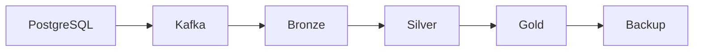

# Data governance

This Learn page covers studied concepts of ownership, policy, access, and audit. Durations and datasets are hypothetical. It does not claim that security policies were deployed or legal duties were verified. Governance asks, “Who may use this data, and under which conditions?”

## Dataset ownership and classification

| Responsibility | Scope |
| --- | --- |
| Technical owner | Pipeline, schema, quality, SLO |
| Business owner | Business meaning, KPIs, business definitions |

Without an owner, responsibility for incidents and changes is unclear. Name both responsibilities for each dataset.

Classification groups data by importance and sensitivity. Public, Internal, Confidential, PII, and Sensitive are possible labels. They are not a single strict order or a universal scheme. PII describes the kind of data and can be used alongside an importance level.

```text
email → PII
team_id → Internal
```

Column-level classification matters too. Connect classification to access, masking, and retention policies. These field names are examples; they contain no real organizational identifiers.

## Retention and deletion scope

Retention defines how long to keep data. Consider cost, legal or regulatory requirements, sensitivity, and analytical value. These durations are learning examples, not legal rules or recommended defaults.

| Example data | Hypothetical retention |
| --- | --- |
| Debug log | 14 days |
| User event | 1 year |
| Aggregated metrics | Long-term storage |

Storage can use Hot, Cold, and Archive tiers. Iceberg snapshot expiration is related to retention, but distinguish snapshot retention from source-data retention requirements.

Deletion defines when, where, and how data is removed. Deleting the source does not remove every copy.



This is an example of copies and derived data to trace. Real backups can exist at several stages. Inspect all copies and derived data. A logical delete marks a record as deleted. A physical delete removes it.

In Iceberg, data absent from the current snapshot may still be referenced by older snapshots. Snapshot expiration relates to cleanup of files no longer needed by retained snapshots. Orphan cleanup handles files that metadata does not reference. Choose a retention interval that avoids mistaking files from active writes for orphans. Current query results alone do not prove physical deletion. [Iceberg maintenance](https://iceberg.apache.org/docs/latest/maintenance/)

## Masking and access control

| Method | Meaning |
| --- | --- |
| Static masking | Store a separate copy with masked values |
| Dynamic masking | Change visible values based on the querying user or role |
| Row-level access | Limit which rows a user or team can see |
| Column-level access | Restrict access to a sensitive column itself |
| RBAC | Manage permissions by role |

Column access controls whether a column can be read. Masking hides its real values even when the column is visible. Masking and encryption are different controls. PII classification can lead to a masking policy. AI prompts and responses can also fall under that policy.

Check enforcement on the actual access path. For example, Databricks row filters and column masks have runtime, compute, and API limits. Its documented limits include unsupported path-based and certain REST API access to tables with these policies. A policy shown in a catalog does not prove protection across every external engine and storage path. [Databricks filters and masks](https://docs.databricks.com/aws/en/data-governance/unity-catalog/filters-and-masks)

## Auditability

Auditability records who accessed or changed which data and when. Conceptual access-audit fields include:

```text
user
dataset
time
action
query
```

Change audits record changes to schemas, policies, owners, and retention. Observability asks, “Are the system and data healthy?” Audit asks, “Who did what?” Real users and queries in audit logs can also be sensitive. Do not copy them directly into public learning material.

## Data contracts

A data contract is an agreement between a producer and a consumer. It is broader than a schema contract. It can cover schema, semantics, quality, SLOs, ownership, and version.

```text
event_id → required + unique
latency_ms → integer, millisecond, >= 0
Freshness → < 5 min
Owner → AI Platform Team
```

An integer type alone does not define a unit. The contract also states milliseconds and the non-negative rule. The owner is a hypothetical team, and five minutes is not an approved operational SLO.

## Governance platforms and their boundaries

This is a category-level comparison checked against official docs on 2026-09-24. No platform was deployed, and not every feature was tested.

| Platform | Main role studied in the source | Feature categories and boundaries to check |
| --- | --- | --- |
| Databricks Unity Catalog | Central data and AI governance for the Databricks lakehouse | Catalog/discovery, access control, row/column control, masking, classification, lineage, audit. Check runtime and access-path support |
| AWS Lake Formation | Governance centered on AWS S3 data lakes | Glue Data Catalog integration, table/column/row permissions, and AWS analytics integrations. Check data-filter support by service |
| Snowflake Horizon Catalog | Governance and catalog centered on Snowflake | Catalog, classification, tags, masking, row access, access history, lineage, data quality, AI governance. Check edition and feature requirements |

This table does not mean each product enforces every policy in the same way or scope. Separate broad Unity Catalog capabilities from detailed limits, Lake Formation engine support, and individual Horizon requirements. For example, Snowflake Access History requires Enterprise Edition or higher. [Unity Catalog](https://docs.databricks.com/aws/en/data-governance/unity-catalog/), [Lake Formation data filtering](https://docs.aws.amazon.com/lake-formation/latest/dg/data-filtering.html), [Horizon Catalog](https://docs.snowflake.com/en/user-guide/snowflake-horizon), [Snowflake Access History](https://docs.snowflake.com/en/user-guide/access-history)

Keep these questions when reviewing a platform:

- What is the data, and who owns it?
- Who may see it, and is it sensitive?
- Where did it come from, and where is it used?
- Who accessed it, and is the data healthy?

## LLM in Practice: review copies covered by deletion

**Situation:** Review a deletion policy for a hypothetical dataset to avoid missing source and derived copies.

**Context to Give the LLM:** Provide sanitized lineage, retention rules, snapshot and backup structure, consumers, current access policies, and unknown copies. Do not include real personal data.

**Example Prompt:**

```text
Review this deletion policy; do not execute deletion.
Inputs: sanitized lineage, retention rules, snapshot and backup
structure, consumers, access policies, and unknown copy locations.
Separate logical deletion, physical cleanup, and unverified scope.
List copies and derived data to inspect from PostgreSQL through
Kafka, Bronze, Silver, Gold, and backups.
Separate facts, assumptions, risks, and missing evidence.
Give verification criteria and questions for the policy owners.
Do not invent legal requirements or claim deletion is complete.
```

**Expected Output:** A list of copies to trace, questions for owners, a distinction between logical deletion and physical cleanup, and scope without completion evidence.

**What the LLM Can Get Wrong:** It may assume that data is deleted because current queries cannot see it. It may mistake hypothetical retention periods for legal rules.

**How to Validate:** Check actual storage, snapshot references, backup policies, consumer state, and approved retention and deletion policies. The responsible owners verify legal requirements. The LLM helps review; it does not replace policy approval or evidence of deletion.

[Lineage and metadata](lineage-metadata.md) · [Data quality](data-quality.md) · [Data observability](data-observability.md) · [Handbook home](../index.md)
