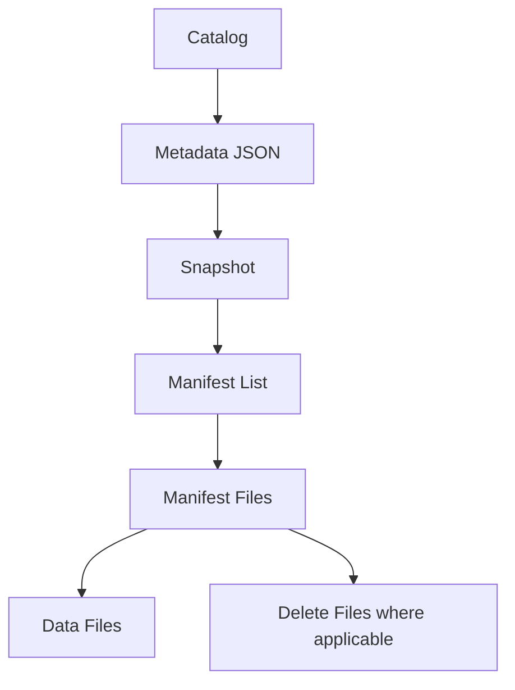

# Lakehouse and Apache Iceberg

Page type: Learn. This page records concepts and design examples from the supplied study material. `studied` means conceptual study, not hands-on implementation or production validation. Examples were not run.

## 3.1 Lakehouse architecture

A lakehouse combines open lake storage with table-management features associated with a warehouse. Keep these responsibilities separate:

| Layer | Role |
| --- | --- |
| Object storage | Holds persistent objects |
| File format, such as Parquet | Encodes the data within files |
| Table format, such as Iceberg | Describes a consistent table across files |
| Compute, such as Spark, Trino, or Flink | Reads, transforms, and writes data |
| Catalog | Finds tables and their metadata |
| Governance | Manages policies and accountability |

The **data plane** includes actual data files and query, read, and write work. The **control plane** includes metadata, catalogs, access policies, governance, and table definitions. This is a conceptual separation, not a claim that every product has the same deployment layout.

## 3.2 Iceberg metadata internals

Iceberg manages table metadata, not just a directory of Parquet files. A simplified lookup is:



Metadata JSON can contain the current snapshot reference, schema, partition specs, sort orders, and snapshot history. The current snapshot identifies the current table state. The snapshot log tracks changes to snapshot state over time.

Can a table have several metadata files? Yes. Table changes create metadata versions. The catalog or metadata pointer identifies the current version. An older file does not automatically describe the current table.

A snapshot refers through a manifest list to manifests. Manifests describe data or delete files and their metadata. This hierarchy makes file inventory and statistics manageable at scale. Data files may use Parquet, ORC, or Avro. Delete files can represent removals for merge-on-read processing.

## 3.3 Snapshot semantics

A snapshot describes a table at a point in time. It does not copy every data file:

```text
Snapshot 1 → A, B, C
Snapshot 2 → A, B, C, D
```

The snapshots share A, B, and C. The second adds D.

**Time travel** queries an older snapshot. **Rollback** changes the table back to a prior snapshot state. **Consistent reads** use one snapshot rather than a partially committed mix. The useful snapshot-isolation intuition is that concurrent writes do not expose half-finished changes to a reader already using a snapshot.

## 3.4 Atomic commits

Iceberg uses optimistic concurrency. Suppose writers A and B both start from metadata M1. Each prepares a change. If A commits first, the current metadata changes. B must check whether its work can still commit and may retry or fail on a conflict.

The compare-and-swap mental model is: is the table version I based this update on still current? The actual atomic operation depends on the catalog. A retry is not a promise that every conflicting update will succeed.

A writer can produce files and then fail before committing them. Files that no table metadata references may become **orphan files**. They require careful later cleanup.

## 3.5 Iceberg partitioning

**Hidden partitioning** lets a query filter a logical column such as `event_time`. Iceberg uses the partition transform to derive applicable partition filters. Users do not always need to name a separate stored partition column.

Common conceptual transforms include day, hour, bucket, and truncate:

```text
day(event_time)
bucket(32, user_id)
```

Exact SQL spelling depends on the engine. **Partition evolution** can change a spec, for example from day to hour, without rewriting all historical files. Old and new files can retain different specs and remain readable through metadata. The change does not retroactively repartition old data.

For high-cardinality keys such as `user_id`, consider bounded buckets instead of one partition per user.

## 3.6 Query pruning

The central performance question is how much data a query can avoid reading. Useful layers include:

```text
Partition filters → Manifest pruning → Data-file pruning
→ Parquet row-group pruning → Column pruning
```

This is a mental model of cooperating optimizations, not a mandatory physical execution order. **Scan amplification** means reading far more data than the query actually needs. Good layout reduces it.

## 3.7 Sort order and clustering

File min/max statistics help most when values have useful locality. Randomly spreading all user IDs across all files can leave broad overlapping ranges. Sorting by `user_id` can narrow those ranges and help queries for one user or a user range. Design sort order and clustering for real query patterns.

## 3.8 UPDATE, DELETE, and MERGE

A Parquet object is not normally edited like one row in an OLTP database. Iceberg describes row changes at the table level.

| Strategy | Method | Trade-off |
| --- | --- | --- |
| Copy-on-write | Rewrite data files containing changed rows | Simpler reads, potentially more writing |
| Merge-on-read | Keep data files and record removals separately; combine them on read | Potentially cheaper writes, more read work and delete maintenance |

A **position delete** identifies a row position in a particular file. An **equality delete** identifies rows by key or value fields. An update can be understood as removing the old row and adding a new row. Replacement values still need to be stored as data.

MERGE can apply CDC upserts to a current-state table. On large tables it may scan, shuffle, and rewrite significant data. Supported operations and physical delete representations depend on the table format version and engine.

## 3.9 Maintenance

| Maintenance task | Purpose |
| --- | --- |
| Data-file compaction | Combine small files into useful sizes |
| Delete-file rewrite | Reduce accumulated delete-file overhead |
| Manifest rewrite | Reorganize metadata for more efficient planning |
| Snapshot expiration | Retire old snapshots under a retention policy |
| Orphan cleanup | Remove files that are no longer referenced |

Iceberg does not remove the need for maintenance. These tasks have different purposes. Do not treat a file absent from the current snapshot as automatically orphaned: a retained older snapshot may still use it.

## 3.10 Catalogs

A catalog registers table names, manages namespaces, and helps find current table metadata. Examples in the study include Hive Metastore, AWS Glue, REST catalogs, JDBC catalogs, and Nessie. Unity Catalog is also relevant, but has a broader governance role. Check the actual integration and version before choosing a catalog.

## 3.11 Catalog vs governance

The narrow catalog mental model is `table name → current metadata`. Governance also includes access policy, ownership, classification, audit, lineage, and masking.

Is Unity Catalog just an Iceberg catalog with extra fields? That is too narrow. An Iceberg catalog handles Iceberg table discovery and metadata coordination. Unity Catalog combines catalog services with access control, lineage, governance, and management of several data and AI asset types. Product integration does not make the two concepts identical.

## Qualifications for real use

The layer model describes responsibilities, not a sequence where the catalog runs after compute. The catalog helps locate metadata; engines use it to read files. The pruning list also describes cooperating layers, not one required execution order.

The catalog supplies the atomic commit operation. Not every conflict can be retried successfully. Updates must store new values in data files. Position and equality deletes mainly describe the v2 model. Newer format versions include other representations, such as deletion vectors. Check engine and format support. A partition-spec change does not rearrange old files. [Iceberg specification](https://iceberg.apache.org/spec/)

A retained old snapshot can still reference a file absent from the current snapshot. Orphan cleanup needs a retention margin longer than in-flight writes and correct path matching. Early cleanup can damage data. Snapshot expiration also limits time travel and rollback. [Iceberg maintenance](https://iceberg.apache.org/docs/latest/maintenance/)

Unity Catalog governs data and AI assets, including access, lineage, and audit. Check the actual Iceberg integration in the target environment. [Databricks Unity Catalog](https://docs.databricks.com/aws/en/data-governance/unity-catalog/)

## Related reading

[File and partition foundations](foundations.md), [Spark](spark.md), [Flink](flink.md).

## LLM in practice: Commit failure analysis

- Situation: A hypothetical concurrent-write workload shows commit conflicts and apparently unreferenced files.
- Context to give the LLM: Give catalog, engine and format versions, snapshot history, writer logs, in-flight jobs, and retention policy.
- Expected output: Expect conflict hypotheses, reference checks, and an ordered investigation.
- What the LLM can get wrong: The LLM may call every file absent from the current snapshot an orphan.
- How to validate: Check all retained snapshots and in-flight writes, then compare catalog behavior with official docs and logs.

Example prompt:

=== "English"

    ```text {.prompt}
    [Context]
    Environment: [catalog, engine, format versions, snapshot history]
    Work state: [writer logs, in-flight writes, retention policy]

    [Task]
    Assess the commit failures.
    Separate observations, conflict hypotheses, and missing evidence.
    Identify files that may still be referenced.

    [Output]
    Return conflict candidates and an ordered file-reference investigation.

    [Checks]
    Propose read-only checks before retry or cleanup; do not produce deletion commands.
    ```

=== "한국어"

    ```text {.prompt}
    [맥락]
    환경: [catalog·engine·format 버전·snapshot 이력]
    작업 상태: [writer 로그·진행 중 write·retention 정책]

    [요청]
    Commit 실패를 분석하고 관찰·충돌 가설·누락 근거를 나눠 줘.
    아직 참조 중일 수 있는 파일을 식별해 줘.

    [출력]
    충돌 후보와 파일 참조 확인의 조사 순서를 작성해 줘.

    [검증]
    Retry나 cleanup 전에 읽기 전용 확인을 제안하고 삭제 명령은 만들지 마.
    ```

[See six more practical prompts for this topic](../prompts/lakehouse-iceberg.md)

LLM output is a working hypothesis. Check it against official docs and actual configuration, logs, and measurements. External documents reviewed: 2026-09-24. This does not mean an implementation version was tested.
