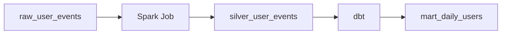
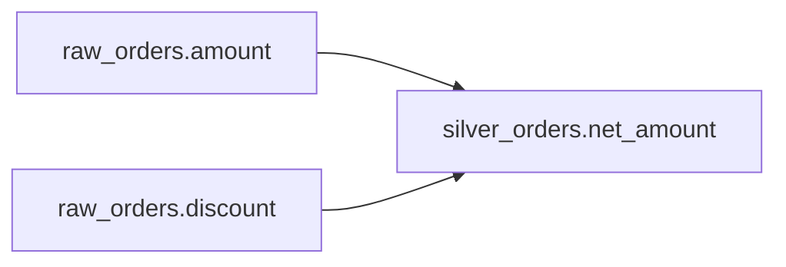

# Lineage and metadata platforms

This Learn page covers the studied roles of metadata, lineage, and catalogs. The datasets are hypothetical. It does not claim that collectors or platforms were built and tested. Metadata describes data. Lineage describes how data is created and used.

## Three metadata types

| Type | Information | Question |
| --- | --- | --- |
| Technical metadata | Table, column, type, schema, partition, file format | What is the structure? |
| Operational metadata | Last updated, job status, freshness, row count, processing time | Is it running normally now? |
| Business metadata | Description, owner, KPI definition, business term, classification | What does it mean for the business? |

## Is business metadata the same as a semantic layer?

The source asks whether these concepts are the same because they look similar. They overlap, but they are different. Business metadata explains meaning. A semantic layer provides that meaning as computable metric and dimension definitions.

Example description:

```text
Revenue
- Excludes VAT
- Excludes refunds
- Owner: Finance
```

Example calculation:

```text
Revenue = SUM(order_amount) - SUM(refund) - SUM(vat)
```

Business metadata answers “What is Revenue?” A semantic layer answers “How do we calculate Revenue?” BI, dashboards, and AI can use a shared definition. In this view, a semantic layer makes analytical parts of business metadata executable. The formula is conceptual, not an accounting rule or runnable syntax for a specific product. A real calculation needs agreement on grain, time period, currency, and whether any amount would be subtracted twice.

## Dataset lineage and direction

Dataset lineage describes source → job → target relationships.



Upstream produces the current data. Downstream uses it. Lineage helps with root cause investigation, impact analysis, and data trust. An edge in a graph does not prove that a specific run was correct.

## OpenLineage and Marquez

OpenLineage is a standard for expressing lineage information across tools. Its core entities are:

| Entity | Meaning | Example |
| --- | --- | --- |
| Job | A defined unit of work | `transform_orders` |
| Run | One execution of a job | One run of that transformation |
| Dataset | Input or output data | `bronze.orders`, `silver.orders` |

```text
bronze.orders → Job: transform_orders → silver.orders
```

OpenLineage is not itself a query UI. It defines events and metadata. The current object model also supports job and dataset metadata events that are not tied to a run. Do not assume every lineage event represents one execution. [OpenLineage object model](https://openlineage.io/docs/spec/object-model/)

Marquez collects and stores OpenLineage metadata. It provides a UI and API to query and visualize it. OpenLineage is the standard; Marquez is an implementation that handles the information. The source distinguishes its focus on lineage and job/run relationships from the broader role of a full catalog. [Marquez](https://marquezproject.ai/)

Product and standard descriptions were checked against official docs on 2026-09-24. Installing an integration does not prove that all runs and column lineage are collected. Check actual coverage separately.

## Column lineage and impact analysis

Column-level lineage is more detailed than a table relationship.



It helps find the cause of KPI errors, assess schema changes, and track sensitive data. Upstream analysis traces possible causes backward. Downstream impact analysis follows the consumers affected by a change.

```text
Type change in raw_orders.amount
→ stg_orders
→ fact_sales
→ mart_daily_sales
→ Dashboard
```

For this example, check the expected types in each downstream transformation and consumer. Lineage can have gaps. Absence from the graph is not proof of no impact.

## Catalog integration

A catalog combines information to help people find and understand data. This is a role-based integration example, not a product configuration that guarantees automatic connections.

| Information source | Information to combine |
| --- | --- |
| Iceberg | Technical metadata |
| dbt | Models, documentation, dependencies |
| Airflow | Pipelines, runs |
| OpenLineage | Lineage |
| Quality tool | Data quality |

A catalog can show descriptions, owners, freshness, quality, upstream/downstream links, classification, and access policies. Modern catalogs can combine discovery, metadata, lineage, and governance information beyond a table list. Displaying a policy and enforcing data access are different capabilities. [Governance](governance.md) also requires checking query engines and storage access paths.

## LLM in Practice: review a type change

**Situation:** Review a proposed type change to hypothetical `raw_orders.amount`.

**Context to Give the LLM:** Provide sanitized before-and-after schemas, collected table and column lineage, transformations, job/run history, KPI definitions, and unknown collection coverage.

**Example Prompt:**

=== "English"

    ```text {.prompt}
    [Context]
    Before/after schemas for raw_orders.amount: [proposed type change]
    Table/column lineage and transformations: [sanitized definitions]
    Job/run history, KPI definitions, and known collection gaps: [material]
    [Task]
    Assess this proposed type change before suggesting a redesign.
    List likely downstream impacts and upstream evidence to inspect.
    Separate facts, assumptions, hypotheses, and missing dependencies.
    [Output]
    Give validation checks for stg_orders and fact_sales.
    Include checks for mart_daily_sales and its dashboard.
    [Checks]
    Compare actual SQL, configuration, events, catalog entries, and sample results.
    Do not treat this review as approval or a complete impact analysis.
    ```

=== "한국어"

    ```text {.prompt}
    [맥락]
    raw_orders.amount 전후 schema: [타입 변경안]
    table·column lineage와 변환식: [비식별 정의]
    job/run 이력·KPI 정의·알려진 수집 누락: [자료]
    [요청]
    재설계를 제안하기 전에 이 타입 변경안을 평가하세요.
    downstream 영향 후보와 확인할 upstream 근거를 나열하세요.
    사실·가정·가설·누락 의존성을 구분하세요.
    [출력]
    stg_orders·fact_sales의 검증 항목을 주세요.
    mart_daily_sales와 해당 대시보드의 검증 항목도 주세요.
    [검증]
    실제 SQL·설정·수집 이벤트·catalog·샘플 결과를 대조하세요.
    검토를 변경 승인이나 완전한 영향 분석으로 취급하지 마세요.
    ```

**Expected Output:** A review of affected transformations, KPIs, and dashboards. It should list evidence to check and uncertainty caused by missing lineage.

**What the LLM Can Get Wrong:** It may treat observed lineage as the full dependency graph. It may infer a calculation from a business description alone.

**How to Validate:** Compare real SQL, run configuration, collected events, catalog entries, and sample results. Do not treat an LLM's estimate as change approval or a complete impact analysis.

[Data observability](data-observability.md) · [Governance](governance.md) · [Handbook home](../index.md)

[More practical prompts](../prompts/lineage-metadata.md)
