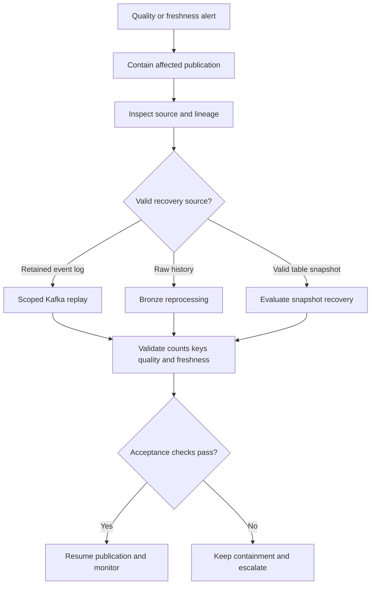

# Production data platform operations

This page records conceptual study and hypothetical incident drills. It does not claim that production recovery, drills, or performance tests were performed. It moves from how a technology works to **what to check and how to recover when it fails at 3 AM**. Product recovery behavior was checked against official documentation on 2026-09-26. Check the actual versions and settings again before use.

## Decide before an incident

For each critical dataset, define its owner, source of truth, recovery source, retention, maximum replay window, and SLO. Observe job success and data health separately. A fast recovery must not spread duplicates, gaps, or incorrect results.



This flow structures a recovery plan. Stopping publication, changing offsets, rolling back a snapshot, and publishing again require the system's approvals, controls for concurrent writes, and recovery prerequisites.

## Backfills and reprocessing

A **backfill** recomputes historical data for a defined range. Use it after pipeline outages, bug fixes, new business logic, missing data, or schema corrections. Define the affected scope first. Instead of recomputing all five years, target `2026-09-01 ~ 2026-09-03` or affected `event_date` partitions.

The requirements are idempotent tasks, date range parameters, predictable output replacement, and resource controls. Retries must not duplicate results. Operators must know which range is replaced. The dates above show a business scope. For execution, also specify the time zone and whether each boundary is inclusive.

Backfill is one form of **reprocessing**. Choose a recovery path based on the available source and failure type.

| Path | Flow | Suitable conditions and checks |
| --- | --- | --- |
| Kafka replay | Offset → consume events again | The Event Log is authoritative and the required events are still retained |
| Bronze replay | Raw history → corrected transformation → rebuild Silver/Gold | Check the history's scope and completeness, and the transformation version |
| Iceberg snapshot recovery | Bad current snapshot → evaluate a valid earlier snapshot | For recent corruption, compare with time travel and check rollback impact |
| Source replay | Operational DB or external source → ingest again | Check whether the source can reproduce the required historical state |

Decide whether the authoritative source is the operational DB, Kafka, Bronze, an Iceberg snapshot, or an external source before an incident. Returning to an earlier snapshot and replaying valid changes made after it are separate tasks. See [Iceberg](lakehouse-iceberg.md) and [orchestration](orchestration.md).

## Incident drill: schema break

The hypothetical change is `amount BIGINT → amount STRING`. Its impact may follow `Producer → CDC/Event → Flink/Spark → Silver → dbt → Dashboard`.

1. Detect the schema change.
2. Stop or quarantine incompatible data.
3. Use lineage to assess consumers and derived data.
4. Fix producer/consumer compatibility.
5. Backfill only the affected data.
6. Validate types, values, counts, and downstream results.

Use Data Contracts, a Schema Registry, compatibility checks, and CI/CD validation for prevention. Do not assume that automatic type conversion preserves business meaning. See [CDC](cdc-debezium.md) and [lineage](lineage-metadata.md).

## Incident drill: bad data

Suppose `latency_ms = -100`, or 90% of `user_id` values are NULL. Respond with **quality alert → contain → quarantine/stop publication → find cause → fix → reprocess → verify**. A technically successful pipeline must not silently publish bad business data. [Quality rules](data-quality.md) must also check business validity.

## Incident drill: data skew

Most Spark tasks may finish quickly while one runs for a very long time. A Flink key may become hot. Check key distribution, NULL/default value concentration, join cardinality, and traffic concentrated on particular customers or teams.

Possible responses are salting, pre-aggregation, special handling for heavy keys, a different partition strategy, and Spark AQE. Match each candidate to the measured bottleneck first. In streaming, preserve required ordering per key when considering re-keying or salting. See [Spark](spark.md) and [Flink](flink.md).

## Incident drill: small file explosion

Millions of tiny Parquet files add metadata overhead, slow query planning, increase object storage requests, and reduce task efficiency. Check excessive streaming commits, too many partitions, and many small writes.

Connect causes to responses: **consider compaction → adjust target file size → adjust write frequency → reconsider partition strategy**. Compaction also uses compute and I/O. Plan it with write and query traffic. [Iceberg maintenance](https://iceberg.apache.org/docs/latest/maintenance/) explains why small files may need rewriting.

## Incident drill: stale table

If it is 10:00 but Gold's latest data is from 08:40, do not rely on one layer's success signal. Check freshness along `Source → Kafka → Bronze → Silver → Gold → Dashboard`. Separate a late source from delays in transport, transformation, publication, or dashboard refresh. Measure freshness at several points. See [data observability](data-observability.md).

## Incident drill: corrupt transformation

Suppose a transformation uses `WHERE event_type = 'clik'` instead of the intended `click`. The job may succeed with zero output rows. **Pipeline GREEN / Data RED** can happen at the same time.

Detect the volume or quality anomaly, find the changed transformation, fix the code, and backfill the affected interval. Checking successful tasks alone misses this failure. Data quality and system health are separate signals.

## Incident drill: CDC failure

Separate a stopped connector, a lost offset, expired required WAL, duplicate replay, and a schema change. If the stored offset and required log are valid, the normal recovery path is **restart → stored offset → replay → idempotent downstream processing**. An unavailable offset or WAL may require a snapshot/re-bootstrap plan.

Snapshot selection and restart behavior depend on connector version, snapshot mode, and replication slot state. A restart cannot restore a lost log. Before re-bootstrap, define reconciliation, deduplication, and gap checks against existing downstream data. Compare the [official Debezium PostgreSQL documentation](https://debezium.io/documentation/reference/stable/connectors/postgresql.html) with the actual configuration.

## Capacity planning

Capacity planning estimates whether the platform can handle expected volume and concurrency. Inputs include events/s, GB or TB/day, retention days, peak multiplier, partition count, file count, Spark concurrency, query concurrency, and streaming state size.

```text
10,000 events/second
× average bytes/event
× 86,400 seconds/day
= estimated ingestion bytes/day
```

This estimates ingestion volume. It does not guarantee final storage or network capacity. Use a measured average size and check compression, replication, retention, and replay costs separately. Include peak traffic, backfill traffic, incident replay, month-end reports, and concurrent dashboards as well as averages.

| Layer | Inputs and questions | Operational boundary |
| --- | --- | --- |
| Kafka | Events/s, partitions, retention, consumers, replay traffic | Too few partitions limit consumer parallelism; too many increase operational overhead |
| Lakehouse | TB/day, files/day, average file size, partitions, snapshots, delete file growth | The same 1 TB in 8 files and in 1,000,000 files has different operational behavior |
| Spark | Concurrent jobs, shuffle volume, executor memory, task count, CPU, backfill overlap | A daily pipeline may succeed but fail when a concurrent 90-day backfill starts |
| Trino/SQL Warehouse/Snowflake | Concurrent users, dashboard refresh rate, scan size, join complexity, memory, peak BI windows | Consider separate compute pools for interactive and batch workloads |

Backfill needs its own capacity policy. Define concurrency, resource limits, and normal workload priority. Workload isolation can protect interactive queries from resource competition with batch jobs.

## Cost engineering

Major costs include compute, storage, network, object storage requests, serving stores, compaction, always-on streaming compute, and AI inference. Check the full system so that saving at one layer does not create a larger cost elsewhere.

- **Compute:** Reduce unnecessary scans, shuffle, recomputation, idle compute, and oversized clusters.
- **Storage:** Manage retention, snapshot expiration, orphan files, duplicate datasets, and raw data lifespan.
- **Serving:** Heavy analytics may fit a lakehouse. Low-latency operational reads may fit a serving store/cache. Do not send every read to an expensive analytical engine.
- **FinOps:** Group costs by team, project, environment, pipeline, and product to make ownership clear.

Deletion changes both cost and recovery ability. Expiring a snapshot removes that time-travel option. If orphan cleanup uses a retention interval shorter than an active write, it can delete files before they are committed. Different path representations can also cause incorrect deletion. Before deletion, check required recovery windows, referenced snapshots, write duration, actual paths, and candidate files. Use an approved procedure. These are constraints for a cleanup plan, not instructions to execute deletion. [Iceberg maintenance safety](https://iceberg.apache.org/docs/latest/maintenance/)

## DR: what must be recovered?

DR means Disaster Recovery. Scenarios include catalog loss, object storage problems, checkpoint loss, CDC state loss, a region outage, a bad deployment, and credential/policy corruption. Keep credentials out of public runbooks and LLM inputs. This page does not give a procedure to change actual credentials.

### Catalog recovery

A lakehouse table is more than files. Parquet files may remain while lost metadata/catalog makes the table unusable for now. Protect catalog metadata as production infrastructure. Prepare managed service durability, supported backup/export, infrastructure-as-code for configuration, and recovery procedures. Check what each provider and catalog supports.

### Table recovery

Candidates include Iceberg snapshots, time travel, rollback, Bronze replay, and source replay. The fastest correct path depends on the failure type. Check whether the snapshot remains, whether required files are accessible, and how valid later changes will be applied again.

### Checkpoint loss

After losing Spark/Flink checkpoint or state, first decide **where processing should resume**. Candidates include Kafka replay, recovery from a compatible Flink savepoint, rebuilding state, and restarting from a known timestamp. Resuming input at a timestamp alone does not restore earlier aggregate or join state.

Plan for duplicate processing, long recovery, and a downstream load spike. Flink checkpoints mainly support failure recovery. Savepoints support planned stop, change, and restore operations managed by operators. Do not confuse their lifecycles or restore conditions, or apply Flink savepoints directly to Spark. Check actual state and code compatibility. [Flink checkpoints and savepoints](https://nightlies.apache.org/flink/flink-docs-stable/docs/ops/state/checkpoints_vs_savepoints/)

## Dataset source-of-truth and recovery contract

Document these fields for every critical dataset.

| Field | Hypothetical `fact_llm_call` example |
| --- | --- |
| Source of Truth | Kafka raw events for 7 days + Iceberg Bronze after ingestion |
| Recovery Source | Replay Kafka for ranges under 7 days; rebuild ranges at least 7 days old from Bronze |
| Maximum Replay Window | The event range actually retained in Kafka; older recovery is separately limited by available Bronze history |
| Retention | State Bronze retention separately from the example 7-day Kafka policy |
| Owner | Assign the responsible team/role in the actual operations document |
| SLO | Dataset freshness, correctness, availability, and RTO/RPO targets |

Seven days is a hypothetical policy, not a product default. Check actual log retention/compaction, gaps, and completed ingestion. Disappearance from Kafka does not prove presence in Bronze. This contract turns recovery from improvisation into a checkable procedure.

## SLOs, RTO, and RPO

The numbers below are examples for discussing requirements. They are not measured achievements or universal recommendations.

| Category | Meaning | Example target |
| --- | --- | --- |
| Freshness | Data delay relative to the source | Gold is less than 15 minutes behind the source |
| Correctness | Duplicates, required field completeness, and similar checks | Duplicate rate < 0.01%; required field completeness > 99.9% |
| Availability | Fraction of time the query layer is available | 99.9% |
| RTO: Recovery Time Objective | Allowed time to recover | Critical dataset < 1 hour |
| RPO: Recovery Point Objective | Acceptable window of data loss | < 5 minutes |
| Query latency | Response time for user queries | Dashboard query p95 < 5 seconds |

RTO asks **how quickly recovery must finish**. RPO asks **how much historical data loss is acceptable**. Separate recovery completion time from the recoverable data point. Actual SLOs also need a measurement window, denominator, and observation point.

Use different targets for different datasets. Tier 1 covers executive/business-critical data with strict SLOs. Tier 2 covers standard analytics. Tier 3 covers experiments. Match recovery investment and cost to importance.

## Runbook fields and completion checks

For each critical pipeline, record Owner, Source, Destination, SLO, Alert, Failure Modes, Replay Procedure, Backfill Procedure, Rollback Procedure, Cost Owner, and Downstream Impact.

An operational document should state initial checks, evidence to separate hypotheses, impact scope, approved recovery steps, stop conditions, validation, and escalation roles. If prerequisites are unmet or recovery source completeness is unproven, escalate to the owner instead of guessing at offset, file, or permission changes. After recovery, check freshness, counts, duplicate keys, quality, and downstream results. Record prevention work.

A mature platform is judged by more than architecture diagrams. Operators must also know what to do when that architecture fails.

## LLM in Practice

### Review a scoped reprocessing plan

**Situation:** A transformation deployment leaves Gold with zero rows. Normal pipeline success records cannot establish recovery.

**Context to Give the LLM:** Sanitized change diff, affected time range, counts/freshness per layer, lineage, Kafka/Bronze retention, snapshot list, idempotency policy, resource limits, and RTO/RPO. Do not provide secrets or actual customer events.

**Example Prompt:**

=== "English"

    ```text {.prompt}
    [Context]
    Gold has zero rows after a transformation deployment, but the job succeeded.
    Inputs: [change diff], [affected range], [counts and freshness per layer], [lineage].
    Recovery evidence: [Kafka/Bronze retention], [snapshots], [idempotency], [resource limits], [RTO/RPO].
    [Task]
    Assess the current design first. Separate observations, assumptions, hypotheses, and missing evidence.
    Compare prerequisites for Kafka replay, Bronze reprocessing, and snapshot recovery.
    Propose a recovery plan limited to the approved affected range. Do not delete or execute anything.
    [Output]
    Give an evidence and next-check table for each hypothesis, selection reasons, prerequisites, and steps.
    Include duplicate, state, and concurrent-write risks, resource limits, stop conditions, and escalation.
    [Checks]
    Explain how to validate counts, keys, required values, freshness, and business results.
    Mark unverified source retention, permissions, and restore compatibility as unknown.
    Separate RTO from RPO. Require human review and execution approval.
    ```

=== "한국어"

    ```text {.prompt}
    [맥락]
    Gold 변환 배포 후 결과는 0행이고 job은 성공했습니다.
    입력: [변경 diff], [영향 범위], [계층별 건수와 freshness], [lineage].
    복구 근거: [Kafka/Bronze 보존], [snapshot], [멱등성], [자원 한도], [RTO/RPO].
    [요청]
    관찰, 가정, 가설, 누락 근거를 구분해 기존 설계를 먼저 평가하세요.
    Kafka replay, Bronze 재처리, snapshot 복구의 적합 조건을 비교하세요.
    승인된 영향 범위에 한정한 복구 계획만 제안하세요. 삭제나 실행은 하지 마세요.
    [출력]
    가설별 근거와 다음 점검 표, 선택 근거, 사전조건, 단계별 계획을 작성하세요.
    중복·state·동시 쓰기 위험, 자원 한도, 중단·에스컬레이션 기준을 포함하세요.
    [검증]
    건수, 키, 필수 값, freshness, 업무 결과를 검증할 방법을 적으세요.
    확인하지 못한 원본 보존·권한·복원 호환성은 미확인으로 표시하세요.
    RTO와 RPO를 구분하고 사람의 검토와 실행 승인을 요구하세요.
    ```

**Expected Output:** An investigation table that separates observations, assumptions, hypotheses, and missing evidence, plus a scoped recovery plan. Include range, source selection, prerequisites, resource limits, stop conditions, validation, and escalation criteria.

**What the LLM Can Get Wrong:** It may treat job success as healthy data, assume expired Kafka history exists, or assume snapshot rollback restores all downstream results. It may swap RTO/RPO or omit duplicates, state, and concurrent writes.

**How to Validate:** A person checks actual source retention, offsets, snapshots, transformation diff, lineage, and official documentation. Reprocess a small range in an approved isolated environment. Compare counts, keys, required values, freshness, and business results. Production execution requires separate approval and fulfilled prerequisites. LLM output is a working hypothesis, not an execution command or a confirmed cause.
