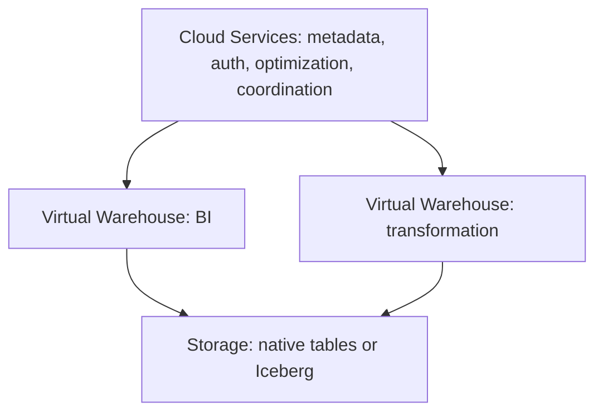

# Snowflake: a condensed model and design boundaries

Page type: Learn. Chapter 18 was intentionally summarized once and then skipped in the source study. `studied` refers to these condensed concepts. It does not mean detailed implementation, production experience, or completed deep-dive exercises. Examples were not run. Product behavior was checked against official documentation on 2026-09-26. It depends on edition, cloud, region, table type, and feature status.

## 18.1 Architecture

Snowflake is a managed cloud data platform with separate storage and compute. It grew from SQL/Data Warehouse workloads into data engineering, Iceberg, governance, and AI.



A Virtual Warehouse is an independent compute cluster for queries and DML. Separate warehouses can isolate workloads. Cloud Services handles metadata, authentication, query optimization, access control, and coordination. Distinguish Snowflake-managed storage from Iceberg configurations. [Official architecture](https://docs.snowflake.com/en/user-guide/intro-key-concepts).

## 18.2 Micro-partitions

Snowflake automatically places native table data in micro-partitions: `Table → Micro-partition 1, 2, 3 …`. Metadata such as value ranges supports pruning. Do not apply this native layout model directly to external Iceberg files.

## 18.3 Pruning

The illustrative filter `WHERE event_date = '2026-09-26'` can skip micro-partitions that cannot match. [Iceberg file pruning](lakehouse-iceberg.md) and Parquet row group pruning share the goal of avoiding unnecessary reads. Their metadata and execution differ. Check actual scans in the query profile.

## 18.4 Clustering

Clustering can help pruning when physical layout does not suit frequent filters. Large tables can be candidates for clustering keys. This does not mean manually partitioning every table. The goal is a useful value distribution for query patterns. Include maintenance cost in the decision. [Micro-partitions and clustering](https://docs.snowflake.com/en/user-guide/tables-clustering-micropartitions).

## 18.5 Streams

A Stream exposes source row changes for incremental processing. It is not a separate event log like Kafka. A Stream stores a source object offset rather than a copy of data. It uses table history to calculate changes. A plain SELECT does not advance that offset. Committing a DML transaction that consumes changes does. Monitor for streams that become stale beyond the retention window. [Streams](https://docs.snowflake.com/en/user-guide/streams-intro).

## 18.6 Tasks

A Task schedules or triggers SQL work. A common flow is `Table → Stream → Task → MERGE / SQL transform`. The Stream describes changes. The Task controls execution. SQL defines the result. [Tasks](https://docs.snowflake.com/en/user-guide/tasks-intro).

## 18.7 Dynamic Tables

A Dynamic Table declares a result query and desired freshness. Snowflake manages refresh. A chain such as `Raw → Dynamic Table(Silver) → Dynamic Table(Gold)` describes dataset dependencies.

An illustrative setting is `TARGET_LAG = '10 minutes'`. **It is neither a schedule to run every ten minutes nor a guarantee of at most ten minutes of lag.** It is a freshness target. Actual lag depends on warehouse capacity, data volume, query complexity, and dependency depth. Check actual lag and refresh history. Do not assume every SQL query supports incremental refresh. [Target lag](https://docs.snowflake.com/en/user-guide/dynamic-tables/target-lag).

## 18.8 Snowpipe / Snowpipe Streaming

Snowpipe loads staged files: `Object storage file → Snowpipe → Snowflake`. Snowpipe Streaming supports continuous low-latency ingestion without relying only on staged files. Measure ingestion latency, processing latency, and final mart freshness separately. Streaming ingestion does not imply the same complex event-time/state processing as [Flink](flink.md). [Snowpipe](https://docs.snowflake.com/en/user-guide/data-load-snowpipe-intro), [Snowpipe Streaming](https://docs.snowflake.com/en/user-guide/data-load-snowpipe-streaming-overview).

## 18.9 Iceberg Tables

The flow `Snowflake → Iceberg table → Object storage` separates compute, table format, and storage. Distinguish a Snowflake-managed catalog from an external catalog. Assign ownership of metadata commits and maintenance. Check read, write, authentication, and table feature support separately for external engines such as Spark and Trino. [Iceberg tables](https://docs.snowflake.com/en/user-guide/tables-iceberg).

The Horizon Iceberg REST endpoint can support multiple engines. This does not promise identical behavior for every Snowflake feature or external engine combination. [External engine access through Horizon](https://docs.snowflake.com/en/user-guide/tables-iceberg-access-using-external-query-engine-snowflake-horizon).

## 18.10 Governance: Horizon Catalog

Databricks Unity Catalog and Snowflake Horizon Catalog both address integrated governance. Horizon covers discovery, metadata, lineage, classification, masking, row access, governance, Iceberg visibility, and semantic/business context. Similar feature names do not imply equal policies, privileges, or external engine behavior. [Horizon Catalog](https://docs.snowflake.com/en/user-guide/snowflake-horizon).

## 18.11 Cortex / AI

Cortex AI, Search, Analyst, Agents, and AI interfaces bring AI closer to governed enterprise data. Distinguish retrieval, structured data analysis, and agent tool use. Check model, region, privilege, and data access requirements in the relevant feature documentation. [Snowflake AI and ML](https://docs.snowflake.com/en/guides-overview-ai-features).

## 18.12 Cost model

Compute uses credit-based billing. Include Virtual Warehouses, serverless compute, Cloud Services, and storage. A credit is not a fixed CPU count or a universal price for every feature.

Review Auto Suspend, warehouse sizing, scan reduction, efficient queries, and incremental refresh where supported. A smaller warehouse does not always lower total cost. Compare measured usage alongside runtime, queue time, and freshness. [Snowflake costs](https://docs.snowflake.com/en/user-guide/cost-understanding-overall).

## 18.13 Mental model

| Responsibility | Feature to remember |
|---|---|
| Storage | Native managed storage / Iceberg configurations |
| Compute | Virtual Warehouse |
| Native layout | Micro-partitions |
| Performance | Pruning + Clustering |
| Pipeline | Dynamic Tables or Streams + Tasks |
| Ingestion | Snowpipe / Snowpipe Streaming |
| Governance | Horizon Catalog |
| AI | Cortex / Search / Analyst / Agents |
| Billing | Credits plus storage and other charges |

Databricks expanded from Spark, data engineering, and AI into SQL. Snowflake expanded from SQL and warehouses into engineering, Iceberg, and AI. Their capabilities now overlap. Choose by workload rather than historical image. See [Platform comparison](platform-comparison.md), [Databricks](databricks.md), and [Analytical modeling](analytical-modeling.md).

## LLM in Practice

### Review Dynamic Table freshness

**Situation:** A hypothetical mart shows data older than its freshness target.

**Context to Give the LLM:** Provide a sanitized dependency DAG, target lag, refresh history, actual lag, warehouse use and queues, change volume, SQL, and refresh mode.

**Example Prompt:**

=== "English"

    ```text {.prompt}
    [Context]
    Dependencies: [Raw-Silver-Gold DAG and SQL]
    Settings: [target lag, warehouse, refresh mode]
    Observations: [refresh history, actual lag, queue, change volume]
    [Task]
    Do not treat target lag as an interval or guarantee.
    Separate ingestion delay from refresh delay and form hypotheses.
    Assess the current design and evidence before resizing.
    [Output]
    Table observations, assumptions, unknowns, and evidence that could reject each hypothesis.
    Propose small experiments with stop and recovery conditions.
    [Checks]
    Compare official requirements with actual refresh records.
    Compare freshness, cost, and correctness before and after the experiment; require human approval to run it.
    ```

=== "한국어"

    ```text {.prompt}
    [맥락]
    의존성: [Raw-Silver-Gold DAG와 SQL]
    설정: [target lag, warehouse, refresh mode]
    관찰: [refresh history, actual lag, queue, 변경량]
    [요청]
    target lag를 실행 주기나 보장으로 취급하지 말라.
    수집 지연과 refresh 지연을 분리해 원인 가설을 세워라.
    증설 전에 현재 설계와 증거를 평가하라.
    [출력]
    관찰, 가정, 미확인 항목, 가설별 반증 지표를 표로 작성하라.
    작은 실험과 중단·복구 조건을 제시하라.
    [검증]
    공식 기능 조건과 실제 refresh 기록을 대조하라.
    실험 전후 신선도, 비용, 결과 정확성을 비교하고 사람의 실행 승인을 요구하라.
    ```

**Expected Output:** Hypotheses for each delay, the purpose of diagnostic queries, small experiments, and cost/correctness/freshness criteria.

**What the LLM Can Get Wrong:** It may mistake target lag for an interval or guarantee and recommend a larger warehouse without evidence.

**How to Validate:** Check the official target lag definition and refresh mode requirements. Challenge hypotheses with refresh history and query profiles. Compare actual lag, cost, and results before and after a limited experiment. A person approves execution.
