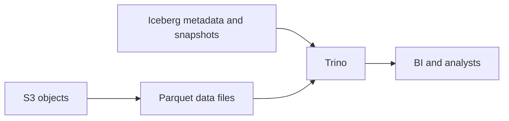

# Distributed SQL with Trino

This page records conceptual study of Trino. It does not claim verified query performance or production results. Official documentation was checked on 2026-09-24.

## Architecture and connectors

Trino is a distributed SQL query engine for data in external stores. It is not the primary data store itself. The coordinator parses SQL, plans queries, and manages stages and tasks. Workers run scans, joins, and aggregations. `Coordinator ≈ Spark driver` and `Worker ≈ Spark executor` are useful role comparisons. They do not mean the execution models are identical. [Trino concepts](https://trino.io/docs/current/overview/concepts.html)

A connector adapts Trino to an external system. Examples include Iceberg, PostgreSQL, and Hive connectors. Table names use `catalog.schema.table`.

```text
iceberg.analytics.fact_llm_call
postgres.public.users
```

A Trino catalog selects a configured connector and data source. An Iceberg catalog locates and manages table metadata. These are different meanings. A federated query can join systems in one SQL statement, but it does not guarantee good performance. Consider remote scans, data movement, and source load.

## Breaking a query into work

Conceptually, SQL becomes a query plan distributed across stages and tasks. Scans are divided into splits. `SQL → Query plan → Stage → Task → Split` is a learning model, not a complete execution model.

| Element | Role |
| --- | --- |
| Stage | A large execution step |
| Task | Part of a stage running on a worker |
| Split | A small unit of scan work |
| Exchange | Data redistribution between workers |

An exchange serves a similar purpose to a Spark shuffle. Joins and GROUP BY operations can require substantial redistribution. [Execution concepts](https://trino.io/docs/current/overview/concepts.html)

## Pushdown and pruning

Pushdown lets the data source do supported work to reduce scans and data movement.

- Predicate pushdown sends `WHERE` conditions toward the source.
- Projection pushdown reads only the required columns.
- Aggregation pushdown runs operations such as COUNT or SUM at the source when supported.

Support depends on the connector and query shape. A SQL filter does not guarantee pushdown. Check EXPLAIN and actual data read. Iceberg partition, file, row group, and column pruning also avoid unnecessary reads. They are not all the same operation as pushing aggregation to a remote database. [Trino pushdown](https://trino.io/docs/current/optimizer/pushdown.html)

## Joins and memory

A broadcast join copies the small table to participating workers. `Huge fact + tiny dimension` is a common candidate, but the small side must fit each worker's memory. A partitioned join redistributes data by join key. It can suit large-table joins but adds exchange costs. Data skew sends too much work for some keys to a few workers. Those workers can use more memory and finish later.

Joins, aggregations, and sorts keep intermediate data in memory. Distinguish worker memory from query memory. Spill writes intermediate data to disk to reduce memory pressure. Disk I/O can slow the query, and spill does not solve every out-of-memory failure. Current Trino documentation calls spill legacy functionality. It suggests considering fault-tolerant execution with an appropriate task retry policy and exchange manager. Check whether this fits the workload, connectors, and settings. [Trino spill](https://trino.io/docs/current/admin/spill.html)

## Trino and Spark roles

| Common Trino work | Common Spark work |
| --- | --- |
| Interactive SQL and query serving | Large-scale processing and transformation |
| BI, ad-hoc queries, concurrent SQL users | ETL, backfills, large joins, ML datasets, batch transforms |

These are common roles, not absolute feature boundaries or performance guarantees. They can work together: Spark creates data, and Trino queries it.

## Reading Iceberg data



S3 stores the objects or files. Parquet is the file format. Iceberg manages table metadata and snapshots. Trino executes SQL. Trino uses Iceberg metadata to find needed files and Parquet's columnar structure to read needed columns. Actual pruning depends on layout, metadata, filters, and connector behavior. [Trino Iceberg connector](https://trino.io/docs/current/connector/iceberg.html)

## LLM in Practice: investigate a slow federated query

Situation: a query joining an Iceberg fact to a PostgreSQL dimension is slow. Give the LLM anonymized SQL, EXPLAIN, actual scan and output rows and bytes, table sizes, key distributions, memory errors, and connector settings.

```text
Assess this federated query before redesigning it.
Separate observations from assumptions and hypotheses.
Check pushdown, join distribution, exchange volume, skew, and memory.
List missing evidence and small checks that could reject each hypothesis.
Do not assume spill or broadcast is always safe.
```

Expected output links possible bottlenecks to evidence and next checks. The LLM may assume pushdown support or only suggest switching to Spark. Check the actual plan, runtime statistics, and connector documentation. Use bounded query comparisons to test each hypothesis. No performance experiment was run here.

[Analytical modeling](analytical-modeling.md) · [dbt](dbt.md) · [Handbook home](../index.md)
