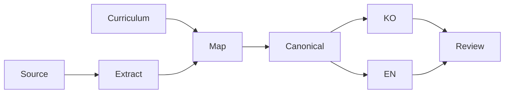

# Knowledge workflow

## Purpose and inputs

Build reusable knowledge instead of a timeline of a conversation. A curriculum guides the structure. Study sources provide the knowledge to preserve. Work can start with either input. A curriculum item alone does not mean the topic has been studied.

## Process



1. Read the whole source. Record parts that cannot be accessed. Prefer extracted Markdown over shared links.
2. Give stable knowledge IDs to concepts, examples, constraints, failures, misunderstandings, and useful questions.
3. Find existing topics and duplicates. Choose where each item belongs. Keep both correct existing knowledge and useful new knowledge.
4. Write Korean and simple-English pages. Match their knowledge, not each sentence.
5. Record a state and destination for every ID. Give a specific reason for each deferred or excluded item.
6. Review meaning, English, privacy, links, and the build. Save verified Markdown in Git and the vault.

## Status and validation

`not-started` means the topic has not been studied. Use `overview`, `studied`, and `deep-dive` based on actual sources and review depth. Study material alone does not prove that a design is ready for production.

Accounting for every item is different from publishing every item. Deferred items are tracked but are not published knowledge. Matching file pairs do not prove matching meaning. Compare examples, warnings, constraints, diagrams, and failure cases too.

## Risks

Do not publish company secrets or personal data. Keep the reusable concept and generalize identifiers in both languages. Separate study from actual experience. Check version-specific behavior against official docs and real configuration.

Git Markdown is the source of truth. The vault is a copy for reading and search. Files changed in the vault are not overwritten automatically. Review whether to merge those changes into Git before syncing again.

## LLM in Practice

### Scenario: Review knowledge coverage

#### Situation

You have draft pages from study material. You want to find missing knowledge.

#### Context to Give the LLM

Provide the sanitized source, manifest, coverage matrix, and complete Korean and English pages.

#### Example Prompt

```text
Compare the source items with both handbook pages.
List missing concepts, examples, constraints, and failure cases.
Separate observations from hypotheses.
Do not invent missing facts. Point to evidence for each finding.
```

#### Expected Output

Get knowledge IDs that may be missing, supporting evidence, and suggested places to add them.

#### What the LLM Can Get Wrong

It may treat similar words as the same knowledge. It may miss a weaker warning or add facts absent from the source.

#### How to Validate

Compare each finding with the source and both pages. Check technical facts using official docs, configuration, or tests. The answer is a working hypothesis, not a final source of truth.

## Related topics

[Glossary](../glossary/index.md) · [Home](../index.md)
