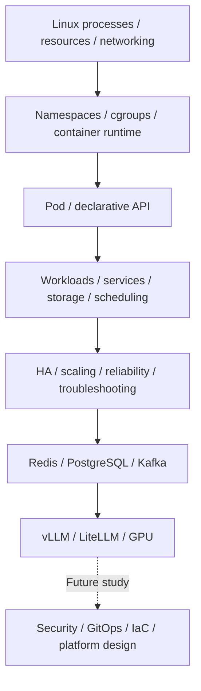

# Platform and infrastructure basics: study scope

This section covers Chapters 1–9 of the supplied **Platform / Infrastructure / AI Serving — Basic Study Notes**. The first source covered Linux, containers, and Kubernetes in Chapters 1–3. The continuation adds Redis, PostgreSQL, Kafka, vLLM, LiteLLM, and GPUs in Chapters 4–9. Security and the final AI platform design in Chapters 10–15 remain future topics.

“Completed” means **Basic conceptual study** for platform engineers. It does not mean Linux/Docker/Kubernetes commands were executed or a production cluster was built and tested. No specific distribution, kernel, cgroup, runtime, Kubernetes, CNI, CSI, or cloud version was supplied. Each topic separates version-sensitive behavior from its official evidence and conditions.

## Scope of the latest source

The scope, connected architecture, and progress sections below follow the new source. Each technical page separates corrections and conditions by section number in its supplement.

<!-- SOURCE INTRO START -->

# Platform / Infrastructure / AI Serving — Basic Study Notes

> Scope: Chapter 4 ~ Chapter 9  
> Previous file: Chapter 1 ~ Chapter 3  
> Level: Basic — core concepts every platform engineer should know  
> Includes: main study material + practical questions and supplementary explanations  
> Completed so far: Redis / PostgreSQL / Kafka operations / vLLM / LiteLLM / GPU Infrastructure

---

<!-- SOURCE INTRO END -->

## Learning path



This is a learning path, not a finished deployment or a required tool combination for every workload. The dotted arrow points to security and later topics that have not been studied.

| Completed chapter | Canonical topic | Scope |
|---|---|---|
| 1 | [Linux, networking, and containers](linux-containers.md) | Processes/PIDs, CPU/memory, FDs, networking, signals, namespaces, cgroups, runtimes, OCI images, container networking/storage, troubleshooting |
| 2 | [Kubernetes core](kubernetes-core.md) | Control plane/workers, declarative API, Pods, workload controllers, Services, Ingress/Gateway, configuration, storage, scheduling, resources, probes, networking |
| 3 | [Kubernetes operations basics](kubernetes-operations.md) | Cluster design/HA, etcd, CNI, CSI, CoreDNS, autoscaling, reliability, node operations, upgrades, symptom-based diagnosis |
| 4 | [Redis](redis.md) | Data structures, shared state, persistence, replication, Sentinel, Cluster, performance, Kubernetes |
| 5 | [PostgreSQL](postgresql.md) | Connections, MVCC, indexes, queries, HA, WAL, backup, PITR, operations, Kubernetes |
| 6 | [Kafka operations](kafka.md) | ISR, leaders, capacity, reliability settings, security, operations, Kubernetes |
| 7 | [vLLM](vllm.md) | Prefill/decode, GPU/KV Cache memory, batching, performance, parallelism, quantization, serving |
| 8 | [LiteLLM](litellm.md) | Gateway, routing, load balancing, retries, rate limits, budgets, authentication, caching |
| 9 | [GPU infrastructure and scheduling](gpu-infrastructure.md) | GPU stack, node pools, sharing, multiple GPUs/nodes, capacity, failure diagnosis |

Start with component roles and boundaries. Then connect source symptoms to the relevant layer: “Pod Pending → scheduling/resources,” “application unavailable → process/port/DNS/Service,” or “failed shutdown → signals/PID 1/grace period.” A symptom alone does not prove one cause. Check hypotheses against actual state, events, and logs.

## Future curriculum

These topics are **not-started** because their study content has not been supplied. Chapter 10 Platform Security is next.

| Chapter | Next topic |
|---|---|
| 10 | Platform Security — next |
| 11 | CI/CD, Helm, Argo CD & GitOps |
| 12 | Terraform & Infrastructure as Code |
| 13 | Multi-tenancy, Quotas & Cost Control |
| 14 | Internal Developer Platform / Self-Service |
| 15 | End-to-End AI Platform Architecture |

Connect the data-processing view in the [data platform curriculum](../data-platform/curriculum.md) with the service operations and serving view here. Chapters 4–9 were future topics in the first source and are now covered by the new source. Content for Chapters 10–15 is not invented.

## Using commands and practical examples

Shell and YAML snippets are learning examples. Names such as `server`, `backend`, and `my-api` are hypothetical targets, not actual addresses. Even diagnosis requires read access and care with sensitive output. Configuration changes, signals, drain, and restore need impact and recovery checks under actual authority. None of those commands were executed during this import.

The LLM example at the end of each technical page supports Korean/English tabs and copying with line breaks. Separate model output into observations, hypotheses, and further checks, then compare it with official documentation, settings, and state. An automated diagnosis alone does not authorize an operational change.

The [data platform architecture](../data-platform/architecture.md) explains data-processing roles. This section explains runtime environments and cluster operations. [Glossary](../glossary/index.md) · [Prompt library](../prompts/index.md) · [Home](../index.md)

## Source: the connection between Chapters 4–9

<!-- SOURCE CONNECTION START -->

# How Chapters 4 ~ 9 connect

```text
Redis
→ Fast shared state / Cache / Rate Limit

PostgreSQL
→ Persistent data / Transaction / HA / Backup

Kafka
→ Event streaming cluster operations

vLLM
→ GPU-based LLM inference

LiteLLM
→ LLM Gateway / Routing / Quota / Retry

GPU Infrastructure
→ Actual compute / Memory / Scheduling / HA
```

Full platform structure:

```text
Application / User
        ↓
     LiteLLM
        ↓
      vLLM
        ↓
       GPU

Backend Services
├─ Redis
├─ PostgreSQL
└─ Kafka

Kubernetes
├─ Pod / Deployment / StatefulSet
├─ Scheduling
├─ Storage
├─ Networking
└─ GPU Scheduling
```

---

<!-- SOURCE CONNECTION END -->

## Source: overall curriculum status

<!-- SOURCE STATUS START -->

# Current overall curriculum status

```text
1. Linux, Networking, Containers ✅
2. Kubernetes Core ✅
3. Kubernetes Production Operations ✅
4. Redis for Platform Systems ✅
5. PostgreSQL for Platform Systems ✅
6. Kafka for Platform Systems ✅
7. vLLM ✅
8. LiteLLM ✅
9. GPU Infrastructure & Scheduling ✅
10. Platform Security ← next
11. CI/CD, Helm, Argo CD & GitOps
12. Terraform & Infrastructure as Code
13. Multi-tenancy, Quotas & Cost Control
14. Internal Developer Platform / Self-Service
15. End-to-End AI Platform Architecture
```

> Continue the next study session with **Chapter 10. Platform Security**.

<!-- SOURCE STATUS END -->
