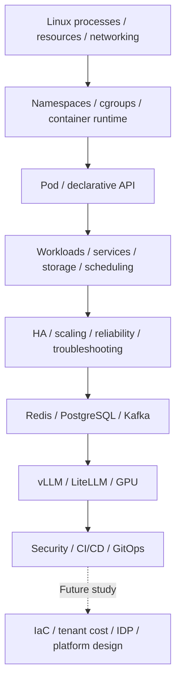

# Platform and infrastructure basics: study scope

Current study covers **Chapters 1–11**, connecting Linux, containers, and Kubernetes with data services, AI serving, security, and GitOps. **Chapter 12 Terraform & Infrastructure as Code** is next; study content for Chapters 12–15 has not been supplied.

“Completed” means **Basic conceptual study** for platform engineers. It does not mean Linux/Docker/Kubernetes commands were executed or a production cluster was built and tested. No specific distribution, kernel, cgroup, runtime, Kubernetes, CNI, CSI, or cloud version was supplied. Each topic separates version-sensitive behavior from its official evidence and conditions.

## Learning path



This is a learning path, not a finished deployment or a required tool combination for every workload. The dotted arrow points to Terraform and later topics that have not been studied.

| Completed chapter | Canonical topic | Scope |
|---|---|---|
| 1 | [Linux, networking, and containers](linux-containers.md) | Processes/PIDs, CPU/memory, FDs, networking, signals, namespaces, cgroups, runtimes, OCI images, container networking/storage, troubleshooting |
| 2 | [Kubernetes core](kubernetes-core.md) | Control plane/workers, declarative API, Pods, workload controllers, Services, Ingress/Gateway, configuration, storage, scheduling, resources, probes, networking |
| 3 | [Kubernetes operations basics](kubernetes-operations.md) | Cluster design/HA, etcd, CNI, CSI, CoreDNS, autoscaling, reliability, node operations, upgrades, symptom-based diagnosis |
| 4 | [Redis](redis.md) | Data structures, shared state, persistence, replication, Sentinel, Cluster, performance, Kubernetes |
| 5 | [PostgreSQL](postgresql.md) | Connections, MVCC, indexes, queries, HA, WAL, backup, PITR, operations, Kubernetes |
| 6 | [Kafka operations](kafka.md) | ISR, leaders, capacity, reliability settings, security, operations, Kubernetes |
| 7 | [vLLM](vllm.md) | Prefill/decode, GPU/KV Cache memory, batching, performance, parallelism, quantization, serving |
| 8 | [LiteLLM](litellm.md) | Gateway, routing, load balancing, retries, rate limits, budgets, authentication, caching |
| 9 | [GPU infrastructure and scheduling](gpu-infrastructure.md) | GPU stack, node pools, sharing, multiple GPUs/nodes, capacity, failure diagnosis |
| 10 | [Platform security](platform-security.md) | Identity, RBAC, Secrets, NetworkPolicy, TLS/mTLS, containers, supply chain, tenant isolation |
| 11 | [CI/CD, Helm, Argo CD, and GitOps](cicd-gitops.md) | Builds, environments, declarative deployment, sync/health, canaries, model changes, spare GPU capacity |

Start with component roles and boundaries. Then connect source symptoms to the relevant layer: “Pod Pending → scheduling/resources,” “application unavailable → process/port/DNS/Service,” or “failed shutdown → signals/PID 1/grace period.” A symptom alone does not prove one cause. Check hypotheses against actual state, events, and logs.

## Future curriculum

These topics are **not-started** because their study content has not been supplied. Chapter 12 Terraform & Infrastructure as Code is next.

| Chapter | Next topic |
|---|---|
| 12 | Terraform & Infrastructure as Code — next |
| 13 | Multi-tenancy, Quotas & Cost Control |
| 14 | Internal Developer Platform / Self-Service |
| 15 | End-to-End AI Platform Architecture |

Connect the data-processing view in the [data platform curriculum](../data-platform/curriculum.md) with the service operations and serving view here. Read each technical page’s supplement for corrections and conditions tied to source section numbers.

## Using commands and practical examples

Shell and YAML snippets are learning examples. Names such as `server`, `backend`, and `my-api` are hypothetical targets, not actual addresses. Even diagnosis requires read access and care with sensitive output. Configuration changes, signals, drain, and restore need impact and recovery checks under actual authority. None of those commands were executed during this import.

The LLM example at the end of each technical page supports Korean/English tabs and copying with line breaks. Separate model output into observations, hypotheses, and further checks, then compare it with official documentation, settings, and state. An automated diagnosis alone does not authorize an operational change.

The [data platform architecture](../data-platform/architecture.md) explains data-processing roles. This section explains runtime environments and cluster operations. [Glossary](../glossary/index.md) · [Prompt library](../prompts/index.md) · [Home](../index.md)

## Source: the connection between Chapters 4–9

<!-- SOURCE CONNECTION START -->

# How Chapters 4 ~ 9 connect

```text
Redis
→ Fast shared state / Cache / Rate Limit

PostgreSQL
→ Persistent data / Transaction / HA / Backup

Kafka
→ Event streaming cluster operations

vLLM
→ GPU-based LLM inference

LiteLLM
→ LLM Gateway / Routing / Quota / Retry

GPU Infrastructure
→ Actual compute / Memory / Scheduling / HA
```

Full platform structure:

```text
Application / User
        ↓
     LiteLLM
        ↓
      vLLM
        ↓
       GPU

Backend Services
├─ Redis
├─ PostgreSQL
└─ Kafka

Kubernetes
├─ Pod / Deployment / StatefulSet
├─ Scheduling
├─ Storage
├─ Networking
└─ GPU Scheduling
```

---

<!-- SOURCE CONNECTION END -->

## Latest source: Chapters 10–11 scope, connections, and progress

This source record connects the roles covered in Chapters 10–11. “Completed” means Basic conceptual study.

<!-- SOURCE SECURITY INTRO START -->

# Platform / Infrastructure / AI Serving — Basic Study Notes

> Scope: Chapter 10 ~ Chapter 11  
> Previous scope: Chapter 1~3, Chapter 4~9  
> Level: Basic — core concepts every platform engineer should know  
> Includes: main study material + practical questions and supplementary explanations  
> Next study starting point: Chapter 12. Terraform & Infrastructure as Code

---

<!-- SOURCE SECURITY INTRO END -->

<!-- SOURCE SECURITY CONNECTION START -->

# How Chapters 10 ~ 11 connect

```text
Platform Security

Identity
↓
RBAC
↓
Secrets
↓
NetworkPolicy
↓
TLS / mTLS
↓
Container Hardening
↓
Supply Chain Security
↓
Tenant Isolation
```

```text
CI/CD & GitOps

Developer
↓
Git
↓
CI
├─ Test
├─ Build
├─ Scan
└─ Registry Push
↓
Deployment Git
├─ Helm Chart
└─ Environment Values
↓
Argo CD
↓
Kubernetes
```

Connecting to AI serving:

```text
Git
↓
Model / vLLM / Helm Values
↓
Argo CD
↓
Deploy vLLM replicas
↓
Readiness
↓
LiteLLM Canary Routing
↓
Check metrics / quality
↓
Expand traffic or roll back
```

---

<!-- SOURCE SECURITY CONNECTION END -->

<!-- SOURCE SECURITY STATUS START -->

# Current overall curriculum status

```text
1. Linux, Networking, Containers ✅
2. Kubernetes Core ✅
3. Kubernetes Production Operations ✅
4. Redis for Platform Systems ✅
5. PostgreSQL for Platform Systems ✅
6. Kafka for Platform Systems ✅
7. vLLM ✅
8. LiteLLM ✅
9. GPU Infrastructure & Scheduling ✅
10. Platform Security ✅
11. CI/CD, Helm, Argo CD & GitOps ✅
12. Terraform & Infrastructure as Code ← current/next
13. Multi-tenancy, Quotas & Cost Control
14. Internal Developer Platform / Self-Service
15. End-to-End AI Platform Architecture
```

> Continue the next study session with **Chapter 12. Terraform & Infrastructure as Code**.

<!-- SOURCE SECURITY STATUS END -->

## Historical source records

The following introduction and progress describe the earlier Chapters 4–9 source. Use the Chapters 1–11 table and future-topic guide above for current progress. “Current” and “next” inside the source refer to that earlier point in time.

## Earlier source scope: Chapters 4–9

<!-- SOURCE INTRO START -->

# Platform / Infrastructure / AI Serving — Basic Study Notes

> Scope: Chapter 4 ~ Chapter 9  
> Previous file: Chapter 1 ~ Chapter 3  
> Level: Basic — core concepts every platform engineer should know  
> Includes: main study material + practical questions and supplementary explanations  
> Completed so far: Redis / PostgreSQL / Kafka operations / vLLM / LiteLLM / GPU Infrastructure

---

<!-- SOURCE INTRO END -->

## Earlier source: curriculum status after Chapters 4–9

<!-- SOURCE STATUS START -->

# Current overall curriculum status

```text
1. Linux, Networking, Containers ✅
2. Kubernetes Core ✅
3. Kubernetes Production Operations ✅
4. Redis for Platform Systems ✅
5. PostgreSQL for Platform Systems ✅
6. Kafka for Platform Systems ✅
7. vLLM ✅
8. LiteLLM ✅
9. GPU Infrastructure & Scheduling ✅
10. Platform Security ← next
11. CI/CD, Helm, Argo CD & GitOps
12. Terraform & Infrastructure as Code
13. Multi-tenancy, Quotas & Cost Control
14. Internal Developer Platform / Self-Service
15. End-to-End AI Platform Architecture
```

> Continue the next study session with **Chapter 10. Platform Security**.

<!-- SOURCE STATUS END -->
