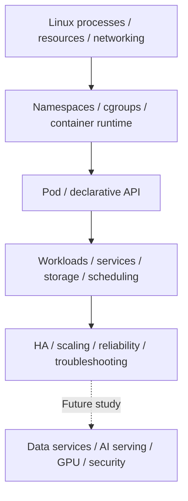

# Platform and infrastructure basics: study scope

This section covers Chapters 1–3 of the supplied **Platform / Infrastructure / AI Serving — Basic Study Notes**. It connects Linux program execution, containers, Kubernetes objects, and cluster operations. Although the source title includes AI Serving, vLLM, LiteLLM, GPUs, and the final AI platform architecture remain future topics.

“Completed” means **Basic conceptual study** for platform engineers. It does not mean Linux/Docker/Kubernetes commands were executed or a production cluster was built and tested. No specific distribution, kernel, cgroup, runtime, Kubernetes, CNI, CSI, or cloud version was supplied. Each topic separates version-sensitive behavior from its official evidence and conditions.

## Learning path

The dotted arrow shows the learning path toward future topics. It does not represent a finished deployment or a required tool combination for every workload.

| Completed chapter | Canonical topic | Scope |
|---|---|---|
| 1 | [Linux, networking, and containers](linux-containers.md) | Processes/PIDs, CPU/memory, FDs, networking, signals, namespaces, cgroups, runtimes, OCI images, container networking/storage, troubleshooting |
| 2 | [Kubernetes core](kubernetes-core.md) | Control plane/workers, declarative API, Pods, workload controllers, Services, Ingress/Gateway, configuration, storage, scheduling, resources, probes, networking |
| 3 | [Kubernetes operations basics](kubernetes-operations.md) | Cluster design/HA, etcd, CNI, CSI, CoreDNS, autoscaling, reliability, node operations, upgrades, symptom-based diagnosis |

Start with component roles and boundaries. Then connect source symptoms to the relevant layer: “Pod Pending → scheduling/resources,” “application unavailable → process/port/DNS/Service,” or “failed shutdown → signals/PID 1/grace period.” A symptom alone does not prove one cause. Check hypotheses against actual state, events, and logs.

## Future curriculum

The source lists the following next topics. They are **not-started**. Missing content is not invented or marked as completed study.

| Chapter | Next topic |
|---|---|
| 4 | Redis for Platform Systems — next |
| 5 | PostgreSQL for Platform Systems |
| 6 | Kafka for Platform Systems |
| 7 | vLLM |
| 8 | LiteLLM |
| 9 | GPU Infrastructure & Scheduling |
| 10 | Platform Security |
| 11 | CI/CD, Helm, Argo CD & GitOps |
| 12 | Terraform & Infrastructure as Code |
| 13 | Multi-tenancy, Quotas & Cost Control |
| 14 | Internal Developer Platform / Self-Service |
| 15 | End-to-End AI Platform Architecture |

The [data platform curriculum](../data-platform/curriculum.md) discusses PostgreSQL, Kafka, and AI data. That does not complete these separate future platform chapters. Later imports will integrate only the content actually supplied.

## Using commands and practical examples

Shell and YAML snippets are learning examples. Names such as `server`, `backend`, and `my-api` are hypothetical targets, not actual addresses. Even diagnosis requires read access and care with sensitive output. Configuration changes, signals, drain, and restore need impact and recovery checks under actual authority. None of those commands were executed during this import.

The LLM example at the end of each technical page supports Korean/English tabs and copying with line breaks. Separate model output into observations, hypotheses, and further checks, then compare it with official documentation, settings, and state. An automated diagnosis alone does not authorize an operational change.

The [data platform architecture](../data-platform/architecture.md) explains data-processing roles. This section explains runtime environments and cluster operations. [Glossary](../glossary/index.md) · [Prompt library](../prompts/index.md) · [Home](../index.md)
