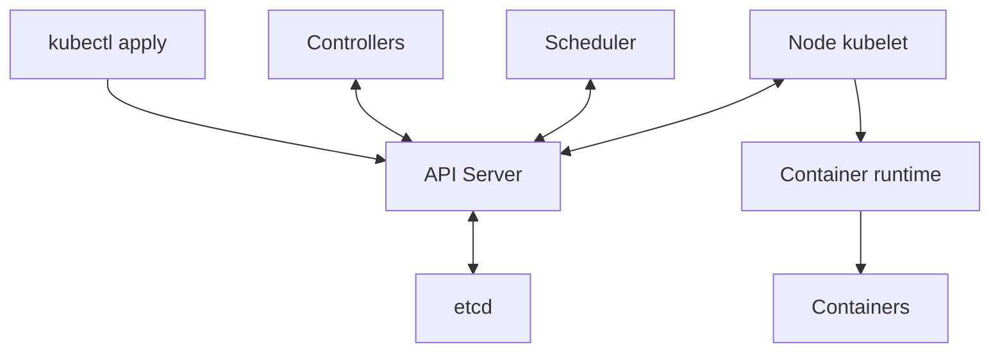
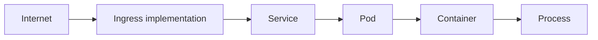

# Kubernetes Core

Kubernetes keeps containers across several servers close to a **declared desired state**. If the target is “keep three nginx instances,” controllers maintain three Pods and create a missing Pod when only two remain. This Learn page uses `studied` for concept study. No cluster setup, command execution, or failure experiment was performed. All addresses, settings, and numbers below are learning examples.

## 1. Control Plane and Worker Nodes

| Location | Component | Responsibility |
| --- | --- | --- |
| Control Plane | API Server | The entry point to the Kubernetes API. It handles requests such as `kubectl get pods` and returns information |
| Control Plane | Scheduler | Selects a Node for a Pod that has no assigned Node |
| Control Plane | Controller Manager | Runs controllers that reconcile observed state with desired state |
| Control Plane | etcd | Stores the cluster's API state |
| Worker Node | kubelet | The Node agent. It reads Pod specifications and manages containers through a runtime |
| Worker Node | Container runtime | An implementation such as containerd runs containers |
| Worker Node | kube-proxy or a replacement | Configures networking so Service traffic reaches endpoints |

The Control Plane manages the cluster. Workers run workloads. After `kubectl apply`, the API Server stores accepted state in etcd. Controllers create the needed objects. The Scheduler selects a Node. Its kubelet uses the runtime to reconcile execution. These components watch and update the API asynchronously. The diagram is not one synchronous call stack.



Repeated reconciliation is the key idea. If desired replicas are three and current replicas are two, a controller works to add the missing one. Scheduling, image, or resource constraints can prevent the target from being reached immediately.

## 2. Declarative API: Resources, Objects, spec, and status

Resources are API-managed entities such as Pods, Deployments, Services, ConfigMaps, and Secrets. A Deployment named `my-api` is an actual object of the Deployment kind. A declarative model says what state should exist rather than listing every execution step.

```yaml
apiVersion: apps/v1
kind: Deployment
metadata:
  name: my-api
spec:
  replicas: 3
```

This is an **incomplete teaching fragment** showing `apiVersion`, `kind`, `metadata`, and `spec`. It is not a complete deployable Deployment. Required fields such as a selector and Pod template are missing. `spec` describes desired state. `status` reports the state observed by the system. Controllers reconcile their goals with observations; they do not simply compare two JSON documents for equality.

With a complete manifest, the command form is `kubectl apply -f deployment.yaml`. The flow is YAML submission → object creation or update through the API Server → etcd storage → controller observation of spec → state reconciliation. An accepted API request does not mean the workload is ready.

## 3. Pods: The Container Execution Unit

A Pod is the smallest deployable unit in Kubernetes. It groups one or more containers. A common layout is `Pod → Container → App`. Another is `Pod → App + Sidecar`. Containers in the same Pod share an IP and port space, so they can use `localhost`. They can share configured volumes. This does not mean all filesystems and resources are shared automatically.

Example addresses are Pod A `10.244.1.10` and Pod B `10.244.2.15`. Replacement Pods may have different IPs, so clients normally use a Service. A Pod is a replaceable execution unit, not a permanent server.

| Concept | Meaning and example |
| --- | --- |
| Lifecycle | The basic flow is `Pending → Running → Succeeded / Failed`. `Unknown` is a separate phase when state cannot be obtained |
| `Always` | The default Pod restart policy restarts a terminated container regardless of its exit result |
| `OnFailure` | Restarts a container after a failure exit |
| `Never` | Does not restart a container under that policy |
| Regular init container | Completes preparation, such as creating a config file, before the main app |
| Sidecar | Runs a helper such as a log collector or proxy alongside the app |

`Running` does not mean all containers are ready to accept requests. A container can restart within an existing Pod. A replacement created by a controller is a new Pod object. Status descriptions such as `CrashLoopBackOff` are not Pod phases. Distinguish ordinary init-container completion from Kubernetes' dedicated sidecar lifecycle support. [Pod lifecycle](https://kubernetes.io/docs/concepts/workloads/pods/pod-lifecycle/), [Sidecar containers](https://kubernetes.io/docs/concepts/workloads/pods/sidecar-containers/)

## 4. ReplicaSets and Deployments

A ReplicaSet maintains the desired replica count. For a target of three, it adds one when there are two and removes one when there are four. Usually, a Deployment manages ReplicaSets for you.

```text
Deployment → ReplicaSet → Pod
v1 v1 v1 → v2 v1 v1 → v2 v2 v1 → v2 v2 v2
Revision 1: image v1
Revision 2: image v2
Revision 3: image v3
```

Deployments manage ReplicaSets and provide rollouts, rolling updates, and rollbacks. The sequence illustrates gradual replacement. Actual concurrent Pod counts depend on rollout settings and readiness. The source's “a revision for each deployment change” means a **Pod template change that triggers a rollout**. Scaling alone does not create a revision. Rollback restores the Pod template from a retained revision. It does not undo external database changes. [Deployments](https://kubernetes.io/docs/concepts/workloads/controllers/deployment/)

## 5. StatefulSets: Stable Identity and Storage

Deployment Pods are generally interchangeable and suit stateless apps. Use a StatefulSet when each Pod needs a stable name, network identity, and its own storage.

```text
postgres-0, postgres-1, postgres-2

db-0 → Volume 0
db-1 → Volume 1
db-2 → Volume 2

Ordered startup: db-0 → db-1 → db-2
```

A replacement for `db-1` can use the same ordinal name and associated storage. It is not the same Pod object, UID, or necessarily IP. PostgreSQL, Kafka, Redis Cluster, and ZooKeeper-family systems are learning examples. An Operator can add application-specific operations.

The default `OrderedReady` policy respects order and readiness. Pods are created in ascending ordinal order and terminated in reverse order during scale-down. This does not guarantee ordered shutdown when the StatefulSet resource itself is deleted. `Parallel` relaxes the ordering rules. A StatefulSet does not implement database replication, consensus, or backup by itself. You must provision storage and define application recovery separately. [StatefulSets](https://kubernetes.io/docs/concepts/workloads/controllers/statefulset/)

## 6. Choosing DaemonSet, Job, or CronJob

| Resource | Purpose | Source examples |
| --- | --- | --- |
| DaemonSet | Runs a Pod on each eligible Node | Log, monitoring, and network agents |
| Job | Runs work and tracks completion | Data migration, batch processing, one-time file conversion, database initialization |
| CronJob | Creates Jobs on a schedule | A backup at 2 a.m. each day; hourly statistics |

“Each Node” means Nodes that meet placement rules, including selectors and taints. “One-time work” does not guarantee exactly-once execution. Jobs can retry failures. Scheduled work must also account for duplicate or missed runs. Review time zones, concurrency, retries, and idempotency against operational requirements. The schedules above are examples, not live settings. [Jobs](https://kubernetes.io/docs/concepts/workloads/controllers/job/), [CronJob](https://kubernetes.io/docs/concepts/workloads/controllers/cron-jobs/)

## 7. Services: An Access Point for Changing Pods

A Service gives a stable abstraction for reaching a changing set of Pods. It usually selects Pods by labels. If Pods A, B, and C have `app=my-api` and the Service has that selector, they become target candidates. Readiness and other conditions affect actual delivery.

```text
Client → Service → Pod A / Pod B / Pod C
```

| Type | Purpose | Example and boundary |
| --- | --- | --- |
| ClusterIP | A virtual IP for access inside the cluster | Separates the access address from Pod replacement |
| NodePort | Access through a chosen port on Node addresses | `NodeIP:30080 → Service → Pod`; external reachability depends on routing, firewalls, and Node address settings |
| LoadBalancer | Integrates an external load balancer | `Internet → Cloud Load Balancer → Service → Pods`; a supporting implementation is required |
| Headless | Discovers endpoints without a virtual ClusterIP | `clusterIP: None`; useful for individual addresses in StatefulSets, database clusters, and Kafka |

A Service does not always provide one fixed virtual IP. Headless Services are an exception. A Kubernetes declaration also cannot create an external load balancer in every environment without a supporting implementation. [Service](https://kubernetes.io/docs/concepts/services-networking/service/)

## 8. Ingress and Gateway API: Routing HTTP Requests

Services expose sets of Pods. Ingress defines which Service should receive an external HTTP/HTTPS request based on its host or path.

```text
api.example.com → API Service
web.example.com → Web Service
example.com/api → API Service
example.com/web → Web Service

Ingress Resource → Ingress Controller → Service → Pod
Client --HTTPS--> Ingress --HTTP or HTTPS--> Service → Pod
Gateway → HTTPRoute → Service
```

An Ingress resource alone does not process traffic. An Ingress controller must implement its rules. TLS termination ends the client's HTTPS connection at the edge. Whether the backend connection uses HTTP or HTTPS depends on separate configuration and implementation support.

Gateway API offers extensible APIs such as `GatewayClass`, `Gateway`, and `HTTPRoute` with clearer role and routing boundaries. It also needs installed APIs and a supporting controller. Official guidance states that Ingress API is frozen and recommends Gateway API for new development. This does not mean existing Ingress is about to be removed. Check feature support against the selected implementation and version. [Ingress](https://kubernetes.io/docs/concepts/services-networking/ingress/), [Gateway API](https://kubernetes.io/docs/concepts/services-networking/gateway/)

## 9. ConfigMaps and Secrets: Separate Configuration from Images

| Item | Content | Example |
| --- | --- | --- |
| Container image | Application code and runtime artifacts | Reuse the same image in dev, staging, and production |
| ConfigMap | Non-sensitive environment settings | `APP_ENV=production`, `LOG_LEVEL=info`, `API_URL=http://backend` |
| Secret | Sensitive settings such as credentials | Key names `DB_PASSWORD`, `API_KEY`, `TOKEN`; no real values are shown |

Pass settings to a Pod through environment variables or file mounts. `DB_HOST=postgres` and `DB_PASSWORD=***` illustrate the shape. The asterisks are not a password. A ConfigMap can also appear as `/app/config.yaml`.

Base64 in a Secret is not encryption. Review API storage encryption at rest, least-privilege RBAC, workload access, log exposure, and rotation. Tools such as Vault or External Secrets can help, but do not guarantee complete security. Check the copy and access boundaries between external storage and Kubernetes Secrets. Do not paste real secrets into YAML, Git, or prompts. [Secrets](https://kubernetes.io/docs/concepts/configuration/secret/), [Secret good practices](https://kubernetes.io/docs/concepts/security/secrets-good-practices/)

## 10. Volumes, PVs, PVCs, and StorageClasses

| Term | Role |
| --- | --- |
| Volume | Storage or a data source used by a Pod; not every volume is persistent |
| PersistentVolume, PV | A cluster storage resource representing backing storage such as AWS EBS, NFS, or a cloud disk |
| PersistentVolumeClaim, PVC | A resource requesting storage capacity and access conditions for a workload |
| StorageClass | Defines a provisioner and storage type or policy. Example names are `fast-ssd`, `standard`, and `high-iops` |

```text
Pod → PVC → PV → Disk
PVC request → StorageClass → Provisioner → Disk + PV → PVC binding
postgres-0 → PVC-0 → Disk-0
postgres-1 → PVC-1 → Disk-1
```

Dynamic provisioning creates storage and a PV when a suitable StorageClass and provisioner are available. The arrows show logical dependencies. Binding timing depends on policy. A PV is an API object representing storage, not the disk itself. Even with a separate PVC for each StatefulSet Pod, review access modes, topology, reclaim policy, and backup. [Persistent volumes](https://kubernetes.io/docs/concepts/storage/persistent-volumes/), [Dynamic provisioning](https://kubernetes.io/docs/concepts/storage/dynamic-provisioning/)

## 11. Scheduling: Where Should a Pod Run?

This teaching fragment belongs inside a Pod spec. `gpu: "true"` selects a label. It does not request an actual GPU allocation.

```yaml
nodeSelector:
  gpu: "true"
```

| Mechanism | Question and role |
| --- | --- |
| Node Selector | Does the Node have the required label? |
| Node Affinity | More flexible Node conditions: `required` is mandatory; `preferred` is a preference |
| Pod Affinity | Should the Pod run close to certain Pods in the same topology domain? |
| Pod Anti-Affinity | Should certain Pods run apart? Example: A→Node 1, B→Node 2, C→Node 3 |
| Taint | Which Pods should a Node restrict? Behavior depends on the effect |
| Toleration | Can this Pod tolerate a taint? It neither guarantees placement nor attracts the Pod to the Node |
| Topology Spread | How evenly should Pods be spread across Nodes or availability zones? |

Node Selector/Affinity asks where a Pod should go. Taints/tolerations control which Pods a Node permits. They can be combined for dedicated GPU Nodes. Strict anti-affinity or spread rules can prevent scheduling even when resources are available. [Assigning Pods to Nodes](https://kubernetes.io/docs/concepts/scheduling-eviction/assign-pod-node/), [Taints and tolerations](https://kubernetes.io/docs/concepts/scheduling-eviction/taint-and-toleration/)

## 12. Requests, Limits, and QoS

This is a teaching fragment for a container's `resources` field.

```yaml
resources:
  requests:
    cpu: "500m"
    memory: "1Gi"
  limits:
    cpu: "1"
    memory: "2Gi"
```

A CPU request of `500m` means `0.5 CPU`. A limit of `1` means `1 CPU`. The Scheduler uses requests for resource accounting. If a Node has **two CPUs left in request-based allocation** and a new Pod requests three, it cannot fit. Low measured CPU use is not enough. The source's “minimum required resource” refers to this reservation and scheduling model. A request is not a usage ceiling.

A CPU limit restricts CPU time and can cause throttling. A memory limit can lead to a kernel OOM kill, observed with a reason such as `OOMKilled`. CPU and memory enforcement differ. A brief memory-limit overrun does not always appear as an immediate termination. Check the active cgroup and kubelet settings as well. [Resource management](https://kubernetes.io/docs/concepts/configuration/manage-resources-containers/)

The following basic model uses per-container CPU and memory settings.

| QoS | Classification criteria |
| --- | --- |
| Guaranteed | Every container has positive CPU and memory requests and limits, with request equal to limit for each resource |
| Burstable | Not Guaranteed, but at least one CPU or memory request or limit exists |
| BestEffort | No container has CPU or memory requests or limits |

Explicit requests and limits alone do not imply Guaranteed. The example has unequal values and is Burstable. With Pod-level resources in supported versions and configurations, Pod-level values also affect classification. Check the actual `status.qosClass`. QoS influences treatment under resource pressure. It is not a performance SLA or immunity from failure. [Pod QoS](https://kubernetes.io/docs/concepts/workloads/pods/pod-qos/)

## 13. Health Checks: Alive, Ready, and Started

| Probe | Question | Meaning of failure |
| --- | --- | --- |
| Liveness | Can the app keep working correctly? | At the configured failure condition, the container is terminated and restarted according to its restart policy |
| Readiness | Can the app accept requests now? | Marks the Pod unready, removing it from the normal ready endpoints of a Service; probe failure alone does not restart the container |
| Startup | Has startup finished? | Liveness and readiness probes wait until it succeeds; reaching its failure threshold can trigger restart handling |

A hypothetical vLLM sequence is `start → model load → GPU memory preparation → Ready after several minutes`. Size the startup-probe budget from measurements so slow initialization is not mistaken for a liveness failure. “Several minutes” is not a fixed recommendation. A Running Pod may not be Ready. Restarting is not always the right response to a readiness failure. Also check exceptions such as a Service configured to publish unready endpoints. [Probes](https://kubernetes.io/docs/concepts/workloads/pods/probes/)

## 14. Networking Roles: Pods, Services, DNS, and CNI

In the example, Pod A `10.244.1.10` talks to Pod B `10.244.2.20`. The Pod network implementation provides addresses and connectivity across Nodes. CNI stands for Container Network Interface. Implementations such as Calico and Cilium handle related networking roles. Distinguish the Kubernetes networking model from the features of a specific CNI plugin.

Service access follows `Client Pod → Service → Pod A/B/C`. A name such as `http://my-api:8080` works in the matching namespace and DNS search context. Normal Service DNS resolves the Service address. Headless Service DNS helps discover ready endpoint addresses. CoreDNS is a common cluster DNS implementation.

kube-proxy configures network rules that forward Service traffic to endpoints. This does not mean every packet passes through the kube-proxy process. Some network implementations replace kube-proxy with their own Service proxy. Treating CNI, DNS, and Service routing as the same component can lead to the wrong diagnosis. [Kubernetes networking](https://kubernetes.io/docs/concepts/services-networking/), [Service DNS](https://kubernetes.io/docs/concepts/services-networking/dns-pod-service/)



The diagram shows the logical route from an external request to an application process. The actual packet path may go directly to Pod endpoints, depending on the Ingress and Service implementation.

## Study Boundaries and Next Checks

This page preserves all 14 topics in source Chapter 2 and clarifies basic explanations against official documentation. Key boundaries include revision creation, Headless Services, Secret encoding, QoS, probes versus Pod phases, and networking implementations. Official documents were checked on 2026-09-27. No particular Kubernetes version was tested.

For an interview, connect these ideas first: the API stores desired state; controllers reconcile it; the Scheduler places Pods; kubelet and the runtime execute them; a Service abstracts access; readiness describes the ability to accept requests. In a real incident, compare objects, events, state, logs, configuration, and measurements. Continue with [Linux and containers](linux-containers.md) and [Kubernetes operations](kubernetes-operations.md).

## LLM in Practice: Separate Running from Ready for a Model Server

**Situation:** A hypothetical model-server Pod is Running, but Service requests fail. The cause may be model loading, probes, selectors, ports, or resources. It is not known yet.

**Context to Give the LLM:** Provide sanitized Pod status, events, termination reasons, Deployment and Service selectors and ports, probe settings, measured startup time, requests/limits, and CPU and memory metrics. Remove secret values and real internal addresses.

**Example Prompt:**

=== "English"

    ```text {.prompt}
    [Context]
    A hypothetical model server is Running, but Service requests fail.
    Pod status, events, and termination reasons: [sanitized observations]
    Selectors, ports, and probe settings: [configuration for review]
    Startup time, requests/limits, and CPU/memory metrics: [measurements]
    [Task]
    Review the existing request path and readiness before proposing a redesign.
    Separate observations, assumptions, hypotheses, and missing evidence.
    [Output]
    Give a table of evidence for and against each cause and the next read-only checks.
    Give the impact and validation conditions for each proposed change.
    [Checks]
    Distinguish Running from Ready and a restart from Pod replacement.
    Compare official docs, events, endpoints, probes, logs, and resource metrics.
    Do not request Secret values or execute commands, restarts, or resource changes.
    ```

=== "한국어"

    ```text {.prompt}
    [맥락]
    가상 모델 서버는 Running이지만 Service 요청이 실패합니다.
    Pod 상태·events·종료 이유: [비식별 관찰]
    selector·port·probe 설정: [검토할 설정]
    startup 시간·request/limit·CPU/memory 지표: [측정값]
    [요청]
    재설계 전에 기존 요청 경로와 준비 상태를 검토하세요.
    관찰·가정·가설·누락 근거를 구분하세요.
    [출력]
    가능한 원인별 지지·반박 근거와 다음 읽기 전용 확인을 표로 주세요.
    변경 후보별 영향 범위와 검증 조건을 주세요.
    [검증]
    Running과 Ready, restart와 Pod 교체를 구분하세요.
    공식 문서·events·endpoint·probe·로그·자원 측정으로 대조하세요.
    Secret 값을 요구하거나 명령·재시작·자원 변경을 실행하지 마세요.
    ```

**Expected Output:** A table separating observations from hypotheses, the next evidence to read, conditions that support or reject each hypothesis, and the impact to review before changes.

**What the LLM Can Get Wrong:** It may treat Running as Ready or call every 503 a liveness failure. It may confuse requests with usage, throttling with OOM, or Secret encoding with encryption.

**How to Validate:** Compare official docs for the actual version with object state, events, probe results, endpoints, logs, and resource measurements. An authorized person should test the smallest change in a safe test environment. LLM output is a hypothesis, not approval to execute commands, restart workloads, or add resources.

[Platform infrastructure guide](index.md) · [Handbook home](../index.md)
