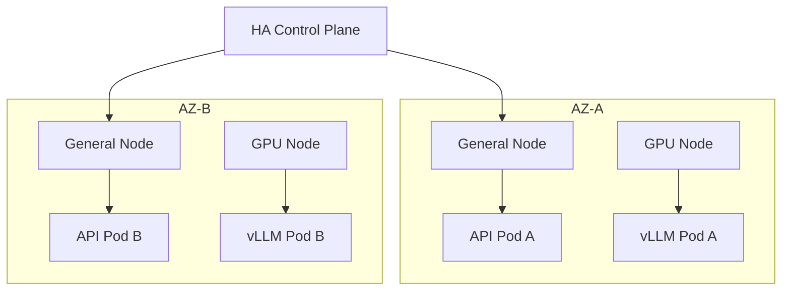
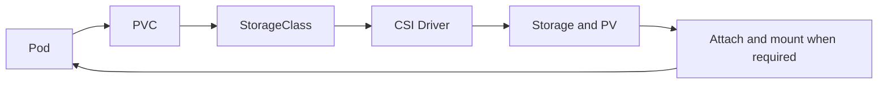
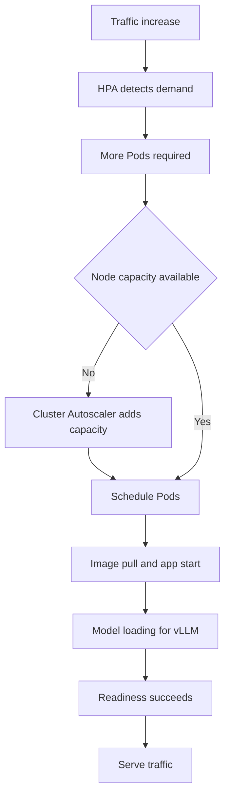

# Kubernetes operations basics

This page records concept study from Basic Chapter 3. It does not claim completed cluster operations, failure drills, upgrades, or command execution. The goal is to understand how to keep services running through server failures, traffic growth, Node replacement, and upgrades. Start with [Kubernetes core](kubernetes-core.md) and [Linux and containers](linux-containers.md). See the [platform infrastructure study guide](index.md) for the full scope.

The commands on this page are unrun learning examples. Use even read-only commands only in an authorized environment. `cordon`, `drain`, recovery, and replacement change operational state. Publishing these examples does not authorize real changes, deletion, or recovery.

## 3.1 Cluster design: tolerate one server failure

A single Control Plane can become a single point of failure for cluster management. Use multiple Control Plane instances for HA and spread workloads across multiple Worker Nodes. For example, Nodes A, B, and C can each run an API Pod. If one Node fails, Pods on the others can serve requests. More replicas on the same Node do not separate failure domains.

A Node Pool groups Nodes by purpose.

| Pool | Learning example | Design purpose |
| --- | --- | --- |
| General | Normal Backend | Capacity for general services |
| GPU | vLLM | Inference that needs GPUs |
| Batch | Batch Job | Capacity for batch work |

A failure domain is a group of resources that can fail together. Spread Pods 1, 2, and 3 across Nodes A, B, and C. In a cloud, also consider Availability Zone failures. A simple example places Node 1 and Pod A in AZ-A, and Node 2 and Pod B in AZ-B. At the platform level, each AZ can contain General and GPU Nodes. This is a hypothetical design example, not a real decision about a product or Node count.



In managed Kubernetes such as EKS, the cloud provider operates the Control Plane and etcd. This does not mean application replicas, placement rules, Node capacity, and data protection are automatically solved. Check the responsibility boundary for each managed service.

## 3.2 etcd: the cluster's memory

etcd stores Kubernetes cluster state. It holds API object state such as Pods, Deployments, Services, ConfigMaps, Secrets, and cluster configuration. The API Server communicates with etcd. An etcd failure can affect management work such as creating Pods or changing Deployments and Services. It does not mean every running application immediately stops.

Quorum is the majority required for consensus. A three-member cluster needs at least two members that can communicate and participate correctly. Running processes alone are not enough. Common odd-numbered configurations have three or five members. Their majorities are two and three, respectively.

```text
Healthy cluster → etcd snapshot → failure → restore from snapshot
```

Backups matter for cluster state recovery. An etcd snapshot is different from an application Volume backup. Review the recovery point, snapshot integrity, access to stored backups, and a separate Volume recovery process. Snapshots can contain sensitive state such as Secrets. Do not use them as material to share externally.

The official etcd 3.6 recovery guide uses `etcdctl snapshot save` to save a snapshot and `etcdutl snapshot restore` to restore it. Restore creates a new logical cluster. Members use the same snapshot. In Kubernetes, moving back to an older revision can affect informer caches and watches. Review revision bumps and compaction handling. Real recovery needs a procedure for the installed version and validation in an isolated recovery environment. No recovery was run here. [etcd 3.6 recovery guide](https://etcd.io/docs/v3.6/op-guide/recovery/)

## 3.3 CNI: Pod networking

CNI means Container Network Interface. Kubernetes network plugins use CNI to assign Pod IPs and set up communication between Pods. CNI itself is an interface specification. The plugin and its settings determine routing and policy behavior.

```text
Create Pod → assign IP → communicate with other Pods
```

| Implementation or mode | Main idea |
| --- | --- |
| Calico | Pod networking, routing, and NetworkPolicy |
| Cilium | eBPF-based network processing, NetworkPolicy, and network observability |
| Overlay | Pod → additional virtual network layer → host network |
| Routed | Pod IP → routing → Pod on another Node |

eBPF supports tasks such as network processing and observation inside the Linux kernel. Cilium uses it for networking, security, and observability. Both Calico and Cilium support network policies. Actual features and compatibility depend on the chosen configuration.

Do not map Overlay and Routed to fixed product names. Calico supports overlay and non-overlay modes. Cilium also offers several modes, including encapsulation and native routing. Review underlay routes for Pod IPs, MTU, and cloud constraints. [Calico network options](https://docs.tigera.io/calico/latest/networking/determine-best-networking), [Cilium routing](https://docs.cilium.io/en/stable/network/concepts/routing/)

## 3.4 CSI: storage connections and failure boundaries

CSI means Container Storage Interface. It provides a standard interface to storage systems such as AWS EBS, NFS, Ceph, Google Persistent Disk, and Azure Disk. Kubernetes declares storage needs. A CSI Driver handles integration with the actual system. Examples include EBS CSI Driver, EFS CSI Driver, and Ceph CSI.

The following diagram shows the concept of dynamic provisioning. A StorageClass is not required for every path, such as using some existing PVs.



An AWS example is `Pod → PVC → EBS CSI Driver → AWS EBS Volume`. When a Pod is scheduled on Node A, the EBS Volume may need attachment to Node A and a mount inside the container. Storage systems do not all share the same attachment process or limits. A PVC binds to a PV. A StorageClass names the provisioner and policies for dynamic provisioning. [Persistent Volumes](https://kubernetes.io/docs/concepts/storage/persistent-volumes/)

When a Pod stays in `Pending` or `ContainerCreating`, check these areas separately:

- PVC/PV state and events, StorageClass, and CSI Driver health
- Storage system failures and permissions
- Volume attachment or mount failures
- Zone compatibility between storage and the Node

A cloud disk can be bound to an AZ. A Volume in AZ-A may not attach to a Node in AZ-B. What looks like a Pod problem may be a storage topology problem.

## 3.5 CoreDNS: separate name resolution from connection

CoreDNS is a common internal DNS server in Kubernetes. Start with normal Service name resolution to a Service IP.

```text
API Pod → query redis name → CoreDNS → return Redis Service IP
API Pod → Redis Service → Redis Pod
```

The DNS query and the application request are separate steps. Within the same Namespace, a client can use Service names such as `redis`, `postgres`, or `my-api`. An example for another Namespace is `redis.cache`. A normal Service resolves to its ClusterIP. A headless Service follows different rules, such as returning Pod addresses. [Service and Pod DNS](https://kubernetes.io/docs/concepts/services-networking/dns-pod-service/)

A Service may be healthy but unreachable by name because of DNS trouble. For example, `10.0.0.10:5432` succeeds while `postgres:5432` fails. This is a fictional internal address from the source example. Check the name, Namespace, search path, DNS policy, and CoreDNS. One clue does not prove a CoreDNS failure.

```bash
nslookup postgres
dig postgres
kubectl get pods -n kube-system
```

The `nslookup` and `dig` examples assume the tools exist in an authorized diagnostic environment with DNS conditions equivalent to the affected Pod. As Pod count and DNS requests grow, CoreDNS replica count and CPU/Memory settings matter. Observe errors, latency, resources, and request volume together.

## 3.6 Autoscaling: Pod count, resource size, and Node count

| Tool | What it adjusts | Source learning example |
| --- | --- | --- |
| HPA | Pod replica count | API Pods grow from 3 to 6 as CPU use rises |
| VPA | Recommendations and changes to container CPU/Memory requests | CPU `500m`, Memory `1Gi` → CPU `1`, Memory `2Gi` |
| Cluster Autoscaler | Node count | HPA needs 10 Pods → insufficient capacity causes Pending → add Nodes |
| KEDA | Workload scaling based on events | Kafka lag or queue message count rises → add Consumer Pods |

HPA adjusts desired replicas using CPU, Memory, custom metrics, and other supported inputs. Ratios such as CPU utilization use requests as the baseline. Suitable requests and a working metrics path are needed. [HPA](https://kubernetes.io/docs/concepts/workloads/autoscaling/horizontal-pod-autoscale/)

VPA is a separate component. Its update mode can produce recommendations only or cause Pod replacement. In-place support also depends on Kubernetes and VPA versions and settings. Do not assume that VPA always increases memory without a restart. [VPA](https://kubernetes.io/docs/concepts/workloads/autoscaling/vertical-pod-autoscale/)

A Node autoscaler such as Cluster Autoscaler adjusts capacity based on unschedulable Pods and Node conditions. Adding Nodes does not solve every Pending Pod. Incorrect selectors, the wrong GPU pool, Storage Zones, cloud quotas, and pool limits need separate checks. [Node autoscaling](https://kubernetes.io/docs/concepts/cluster-administration/node-autoscaling/)

KEDA connects event sources and works with HPA by providing external metrics. It does not replace all HPA behavior or act as a separate Node autoscaler. [KEDA 2.18 concepts](https://keda.sh/docs/2.18/concepts/)



A normal application may not need the model-loading step. In all cases, detection, Pod creation and scheduling, image pull, application startup, and readiness take time. vLLM may add model-loading time. Separate the time a scale request is made from the time real serving capacity increases. Review spare capacity and startup time for traffic spikes.

## 3.7 Reliability: placement and shutdown

Reliability means keeping services available during failures and deployments. Review multiple replicas together with distribution, PDBs, readiness, and graceful shutdown.

| Mechanism | Learning example and boundary |
| --- | --- |
| PodDisruptionBudget | `minAvailable: 2` limits voluntary disruptions through the Eviction API, such as drain, to preserve two available Pods |
| Pod anti-affinity | Spread API Pods 1, 2, and 3 across Nodes A, B, and C |
| Topology spread | Spread across Nodes or AZs; an example places two Pods in each of AZ-A, AZ-B, and AZ-C |
| Readiness probe | Identify Pods that are ready to receive requests |
| Graceful termination | Reduce new traffic and finish existing requests before exit |

A PDB cannot prevent involuntary failures such as a failed Node. It also does not block every direct Pod deletion or a Deployment's own rolling update. Unavailable Pods affect the budget, but workload rollouts use their own update strategies. `minAvailable: 2` does not guarantee two healthy Pods through every failure. [Kubernetes disruptions](https://kubernetes.io/docs/concepts/workloads/pods/disruptions/)

The source's shutdown mental model is `start termination → stop new traffic → SIGTERM → finish existing requests → exit normally`. In practice, endpoint updates and process shutdown are not guaranteed to follow one perfect serial order. The application must handle termination signals and finish work within the grace period. Also consider routing propagation and existing connections. [Pod lifecycle](https://kubernetes.io/docs/concepts/workloads/pods/pod-lifecycle/)

## 3.8 Node operations: cordon, drain, pressure, and replacement

`cordon` marks a Node unschedulable. It blocks normal new scheduling while leaving existing Pods running. `drain` uses operations such as Pod eviction to empty a Node. The following change commands are unrun examples.

```bash
kubectl cordon node-a
kubectl drain node-a
```

Do not understand `drain` as moving a live Pod unchanged to another Node. Typically, the old Pod terminates and a workload controller creates a replacement that can be scheduled elsewhere. First check replacement capacity, controller ownership, PDBs, Storage, and data safety.

A basic `drain` can stop because of DaemonSets, Pods without a managing controller, local data, or other conditions. The option to ignore DaemonSets does not move those Pods elsewhere. Do not bypass all warnings with force options. Before reusing an existing Node after maintenance, check its health and complete the `uncordon` step. [Safely drain a Node](https://kubernetes.io/docs/tasks/administer-cluster/safely-drain-node/)

| Condition | Meaning and example causes | Effect |
| --- | --- | --- |
| MemoryPressure | Insufficient Node memory | Possible Pod eviction |
| DiskPressure | Too many container images, excessive logs, or insufficient ephemeral storage | Disk pressure and possible eviction |
| PIDPressure | Pressure on process-count limits | Problems operating processes and Pods |

Eviction can remove some Pods to protect a Node when resources run short. The flow is `resource shortage → pressure → some Pods evicted → replacement Pods may be scheduled elsewhere`. Replacement still needs a controller, resources, and compatible placement constraints. Success is not automatic.

Cloud operators may replace a faulty Node instead of repairing it. The source flow is `detect fault → cordon → drain → remove Node → create new Node`. Before real work, decide whether to add capacity first, how to protect local data and attached Volumes, and where to stop if a step fails.

## 3.9 Upgrades: check compatibility and change in stages

First review compatibility for the Control Plane's API Server, Scheduler, Controller Manager, and etcd. Upgrade the management components in their supported order, then proceed with Workers. Managed Kubernetes providers handle some steps. Addon and application compatibility still need separate checks. This does not mean changing etcd to the same version number as Kubernetes.

Workers run real Pods, so do not change them all at once. The basic flow is `cordon → drain → upgrade or replace → health check → reuse`. A rolling upgrade changes one Node or a small group at a time: complete and check Node A, then B, then C. Review both PDBs and available capacity during drain.

Before an upgrade, check:

1. Current Kubernetes component versions and target versions
2. The upgrade path and application compatibility
3. CNI and CSI compatibility
4. Ingress Controller compatibility
5. Deprecated and removed APIs in use
6. Backup and recovery readiness, PDBs, spare capacity, and stop criteria for each step

Version skew is the supported version difference between components. The official policy checked on 2026-09-27 requires HA API Servers to stay within one minor version of each other. A kubelet must not be newer than the API Server. It can generally be up to three minor versions older. For kubelet versions below 1.25, the limit is two minor versions. Mixed API Server versions narrow the allowed range. These rules alone do not prove support for every component combination. Tools and providers can impose stricter limits. Check the full policy for the actual target versions. [Version skew policy](https://kubernetes.io/releases/version-skew-policy/)

## 3.10 Troubleshooting: move from symptoms to the failing layer

An error state helps narrow candidate causes. `Pending` includes scheduling waits, but it can also include preparation such as image setup. It does not always mean the Pod has no assigned Node. `CrashLoopBackOff` is also a waiting-state display caused by repeated restarts, not a Pod phase or the root cause. [Pod lifecycle](https://kubernetes.io/docs/concepts/workloads/pods/pod-lifecycle/)

| Symptom | Candidate causes | First evidence to check |
| --- | --- | --- |
| Pending | CPU/Memory/GPU shortage, nodeSelector, nodeAffinity, taints/tolerations, Pod anti-affinity, PVC/Storage | Events in `describe pod`, placement rules, resources, and PVCs |
| CrashLoopBackOff | Application errors, bad ConfigMaps/Secrets, failed DB connection, wrong command, failed liveness probe | Container state, restart count, logs, and logs from the previous instance |
| OOMKilled | Memory limit exceeded or OOM related to Node memory conditions | Termination reason, memory trend, limit, and Node state |
| ImagePullBackOff | Wrong image name, missing tag, registry authentication failure, network trouble | Image path and tag, events, permissions, and connectivity |
| Only name-based connection fails | DNS, Namespace, search path, or CoreDNS | Compare IP and name, query DNS, and check DNS server state |
| Service connection fails | Service/EndpointSlice, port, CNI, NetworkPolicy | Check Pod, Service, and then Ingress boundaries |
| Long wait in ContainerCreating | Image preparation, storage attachment/mount, Pod network setup, or other causes | Events and the relevant Driver state |

### Logs, resources, and scheduling

The source's repeated-crash flow is `start → crash → restart → crash → restart`. Current logs may miss the cause, so also check logs from the previous instance. Below, `<pod>` is a placeholder for the actual authorized Pod name. For a Pod with multiple containers, also choose the right container.

```bash
kubectl get pods
kubectl describe pod <pod>
kubectl logs <pod>
kubectl logs <pod> --previous
```

The OOM learning example is `memory grows → limit exceeded → OOMKilled`. Check for memory leaks. Review a suitable limit change and ways to reduce application memory use. Raising a limit without investigation may leave a leak unresolved or increase Node pressure.

For scheduling, check CPU, Memory, GPU, nodeAffinity, nodeSelector, taints/tolerations, and Pod anti-affinity. `0/5 nodes are available` is a clue that none of the five Nodes meets the placement requirements. Read detailed events for each reason.

### Network, DNS, and storage

Narrow the network boundary in this order: `direct Pod access → Service access → Ingress access`. Check Pod IPs, Services, Endpoints/EndpointSlices, CNI, NetworkPolicy, and ports. For example, a connection can fail if the Service targets port `8080` but the application listens on `8000`.

`10.0.0.10:5432 → success` and `postgres:5432 → failure` is a learning example for starting DNS diagnosis. Use `nslookup postgres` to check resolution. CoreDNS is a possible cause, but an incorrect name or Namespace remains another possibility.

If a Stateful Pod stays in `Pending` or `ContainerCreating`, check PVC state, PV state, the CSI Driver, Volume attachment, and AZ. Networking and storage are shared lower layers. Inspect events and actual connection boundaries before repeatedly restarting the application.

### Investigation order and learning boundary

```text
1. Pod state
2. kubectl describe pod
3. Events
4. kubectl logs and previous logs when needed
5. CPU / Memory
6. Scheduling constraints
7. Network / DNS
8. Storage
```

This is a starting sequence, not a fixed rule for every incident. Follow the evidence and compare state before and after a change. The overall operations path is `Cluster HA → etcd → CNI/CSI/DNS → Autoscaling → Reliability → Node operations → Upgrade → Troubleshooting`. In an interview, explain why replicas alone do not guarantee availability. Include the boundaries of PDBs, Node capacity, Storage topology, and shutdown handling.

## LLM in Practice

### Review availability and possible blockers before Node drain

**Situation:** Review a maintenance plan for a Node running a hypothetical API with three replicas. No drain has run yet.

**Context to Give the LLM:** Sanitized Pod placement, spare Node resources, PDB state, readiness, Storage Zones, shutdown time, Kubernetes and addon versions, and the allowed maintenance scope. Exclude Secret values, credentials, and real internal addresses.

**Example Prompt:**

=== "English"

    ```text {.prompt}
    [Context]
    The API has 3 replicas and PDB minAvailable is 2.
    Placement, spare resources, readiness, Storage Zone: [sanitized observations]
    Kubernetes and addon versions: [versions]
    Maintenance scope and shutdown time: [constraints]
    No cordon or drain has been run.
    [Task]
    Review the plan first. Separate observations, assumptions, and missing evidence.
    Explain when the PDB or replacement capacity could block drain.
    Distinguish Node failure from disruption through the Eviction API.
    [Output]
    Create a table of hypotheses, read-only checks, go conditions, and stop conditions.
    Do not assume permission to run change or deletion commands.
    [Checks]
    Verify with actual Events, PDB state, resources, and version-specific official docs.
    List remaining uncertainty and checks for the responsible person before execution.
    ```

=== "한국어"

    ```text {.prompt}
    [맥락]
    API replica는 3개이며 PDB minAvailable은 2다.
    배치·여유 자원·readiness·Storage Zone: [비식별 관측값]
    Kubernetes와 addon 버전: [버전]
    유지보수 범위와 종료 시간: [조건]
    아직 cordon이나 drain은 실행하지 않았다.
    [요청]
    계획을 먼저 검토하고 관측 사실, 가정, 누락 근거를 분리하라.
    PDB와 재배치 용량 때문에 drain이 막힐 조건을 설명하라.
    Node 고장과 Eviction API 기반 중단의 차이를 반영하라.
    [출력]
    원인 가설, 필요한 조회, 진행 조건, 중단 조건 표를 작성하라.
    변경·삭제 명령의 실행 승인을 추정하지 말라.
    [검증]
    실제 Events, PDB 상태, 자원, 버전별 공식 문서로 확인하라.
    실행 전 담당자가 검토할 항목과 남은 불확실성을 제시하라.
    ```

**Expected Output:** A table that separates availability conditions, possible blockers, read-only investigation priorities, and stop and review criteria.

**What the LLM Can Get Wrong:** It may claim that PDBs prevent Node failures, describe drain as moving live Pods unchanged, or try to solve GPU or Zone constraints only by adding Nodes.

**How to Validate:** A person compares the actual state with version-specific official documents. Any check that needs execution belongs in a separately authorized test environment and change process. This is an authored example. It does not claim a verified model response or real maintenance result.
