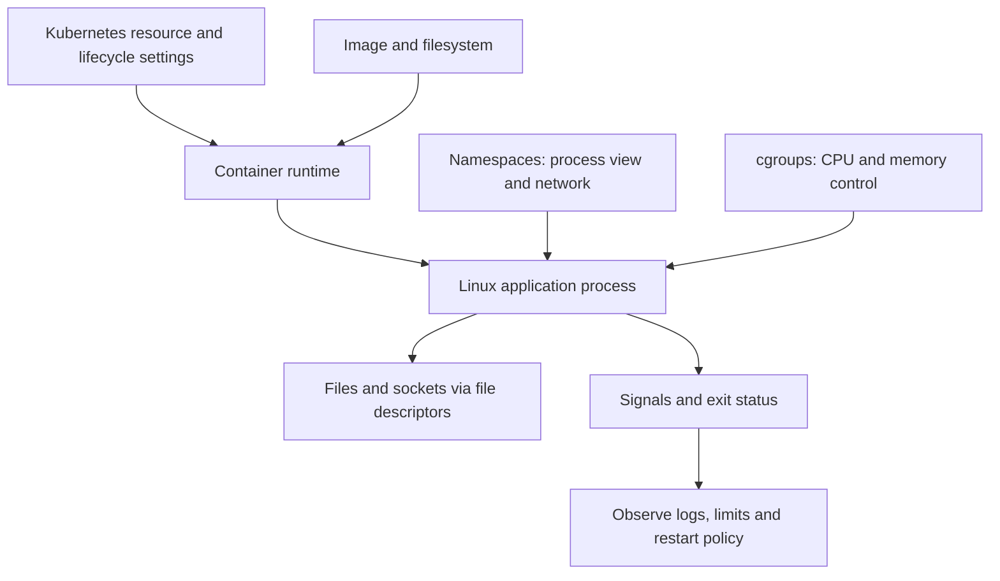

# Linux, networking, and containers

Page type: Learn / Reference. This page records concept study from Chapter 1. `studied` does not mean that Linux, Docker, or Kubernetes was deployed or tested in failure experiments. Commands, the Dockerfile, YAML, IP addresses, PIDs, and numbers are unexecuted examples. Replace `<PID>` and `<pod>` with the intended target. Use termination commands only in an isolated exercise after checking the target and permissions.

## Overall model



In practice, inspect the application process, resource control, networking, and storage together. The basic source model is preserved below. **Source clarifications** correct statements that were too broad.

## 1.1 Linux Process

A process is a running program. For example:

```bash
python app.py
```

The program is loaded into memory and Linux manages its execution as a process.

### PID

A PID (Process ID) identifies a process within a PID namespace. Inspect processes with:

```bash
ps aux
```

Example output:

```text
USER    PID   COMMAND
root      1   /sbin/init
user   1523   python app.py
user   1601   nginx
```

Use the PID to inspect or signal a particular process:

```bash
kill 1523
```

### Parent and child processes

Most processes are created by another process:

```text
bash (parent)
  ↓
python app.py (child)
```

PPID means Parent Process ID. View it with:

```bash
ps -ef
```

Example:

```text
UID   PID   PPID   CMD
user  1000  900    bash
user  1200  1000   python app.py
```

This relationship matters for container PID 1, graceful shutdown, and zombie processes.

### Process states

| State | Meaning |
|---|---|
| Running | Running on a CPU or waiting for CPU time |
| Sleeping | Waiting for I/O or an event |
| Stopped | Paused |
| Zombie | Execution has ended, but the parent has not collected the termination result |

A zombie is not a live process consuming CPU. Only some process-table information remains.

### Exit code

Programs return an exit status. By convention, `0` means success and nonzero means an error. Check the status of the preceding command:

```bash
ls /tmp
echo $?
```

An error example:

```bash
ls /not-exist
echo $?
```

Docker and Kubernetes also expose container exit codes to help distinguish normal and abnormal termination.

### /proc and the platform connection

Linux exposes current system and process state through `/proc`. For PID 1200, inspect:

```text
/proc/1200
/proc/1200/status
/proc/1200/cmdline
/proc/1200/fd
```

The platform model is:

```text
Kubernetes Pod
└── Container
    └── Linux process, for example vLLM
```

A process exits, leaves an exit status, and the container runtime observes it. Kubernetes may restart the container according to its restart policy.

Key points: a running program becomes a process; PID identifies it; processes have parent/child relationships; termination leaves a status; zombies await collection; `/proc` exposes process information.

## 1.2 CPU / Memory

For platform work, ask why a service becomes slow or why it exits.

### CPU and bottlenecks

The CPU executes program instructions. High CPU use often means that much computation is required. CPU-bound examples include JSON processing, compression, encryption, large calculations, and some LLM inference work.

CPU-bound means computation is the bottleneck. I/O-bound means waiting for a database, API, file, network, or disk is the bottleneck.

An 8-core CPU can run multiple tasks in parallel. The Linux scheduler shares CPU time even when there are more processes than cores.

### Memory, swap, and OOM

RAM holds data needed by a process, including application code, cache, request data, and model data.

When RAM is short, the system can move some data to disk-backed swap. Disk is much slower than RAM. Heavy swapping can make the server very slow.

OOM means Out Of Memory. The system cannot meet memory needs normally. Linux may kill a process through the OOM killer.

### Kubernetes requests and limits

Example:

```yaml
resources:
  requests:
    memory: "2Gi"
  limits:
    memory: "4Gi"
```

A request is the amount used for scheduling decisions. It does not preallocate memory or cap actual use. A limit controls resource use. A simplified failure path is:

```text
Application memory grows
  ↓
Container memory limit is reached
  ↓
A process may be killed if memory cannot be reclaimed
  ↓
Container status may show OOMKilled
```

Memory enforcement is reactive; exceeding a limit is not a promise of an immediate kill. See the source clarifications below.

CPU behaves differently. Reaching a CPU limit usually restricts CPU time and slows processing instead of killing the process. This is CPU throttling.

Key points: CPU performs computation; RAM stores working data; CPU-bound and I/O-bound workloads need different diagnosis; memory pressure can cause OOM; CPU limits commonly cause throttling.

## 1.3 File / File Descriptor

A file descriptor (FD) is a process-local number for an open file, socket, or pipe. Programs conventionally use these standard descriptors, though they can close or redirect them:

```text
0 = stdin
1 = stdout
2 = stderr
```

Redirect stdout to a file:

```bash
python app.py > output.log
```

Opening more files creates descriptors such as:

```text
FD 0 → stdin
FD 1 → stdout
FD 2 → stderr
FD 3 → config.yaml
FD 4 → log.txt
```

### Sockets also use FDs

Network connections consume descriptors too:

```text
FD 5 → Client A TCP connection
FD 6 → Client B TCP connection
FD 7 → Client C TCP connection
```

Linux uses descriptors for files, sockets, and pipes.

### Too many open files and connection leaks

A process has an FD limit. Inspect the shell limit with:

```bash
ulimit -n
```

An example value is `1024`; it is not a universal default. Reaching the limit can produce `Too many open files`.

A database or network connection leak follows this pattern:

```text
Create connection → use it → fail to close it
  → descriptors accumulate → FD exhaustion
```

The service can still be running while it can no longer accept new connections. Inspect the affected process:

```bash
lsof -p <PID>
ls /proc/<PID>/fd
```

An API server uses FDs for client sockets, database connections, Redis connections, and log files.

Key points: FDs are numbered handles; sockets consume them; limits exist; leaked connections can exhaust them; use `ulimit`, `lsof`, and `/proc/<PID>/fd` as diagnostic starting points.

## 1.4 Linux Networking

Understand IP, port, socket, DNS, and routing first.

### IP, port, and socket

A beginner's model is “IP selects the machine; port selects the program.” For example, `10.0.0.10:8080`. More precisely, IP identifies an interface/address and port identifies a transport endpoint; namespace and protocol matter.

A socket is a communication endpoint. `IP + port + protocol` is a useful starting model.

### TCP and UDP

| Protocol | Properties and examples |
|---|---|
| TCP | Connection-oriented; reliable ordered delivery with retransmission; common for HTTP and database connections |
| UDP | No connection setup; no built-in delivery or ordering guarantee; common for DNS; not guaranteed to be faster |

TCP begins with a handshake:

```text
Client       Server
  SYN      →
           ← SYN-ACK
  ACK      →
```

Data exchange follows. These protocol examples are common uses, not an exhaustive rule for every HTTP or DNS transport.

### 127.0.0.1 and 0.0.0.0

`127.0.0.1` is localhost, reachable within the current network namespace. Binding to `0.0.0.0` means listening on all local IPv4 interfaces. If an application binds only to container loopback, requests arriving from outside that namespace may not reach it. Listening is separate from publishing a port and from firewall policy.

### DNS, routing, CIDR, and NAT

DNS maps a name to an address, for example:

```text
api.example.com → 10.0.0.20
```

Inspect DNS:

```bash
dig example.com
```

Routing answers: “Which way should a packet go to reach this IP?” Inspect it with:

```bash
ip route
```

Example route:

```text
default via 10.0.0.1
```

A subnet/CIDR such as `10.0.0.0/24` describes an address range. Kubernetes also uses terms such as Pod CIDR and Service CIDR.

NAT translates an IP address or port. Example:

```text
Container IP 10.1.0.5
  ↓ NAT
Node IP 192.168.0.10
```

### Commands and initial network diagnosis

```bash
ip addr
ip route
ss -lntp
dig example.com
curl http://server:8080
```

Check in order:

1. Is the application running?
2. Is it listening on the intended port?
3. Is it bound to the correct address?
4. Does DNS work?
5. Is routing correct?
6. Is a firewall or NetworkPolicy blocking traffic?

Key points: IP and port locate endpoints; TCP provides reliable ordered streams; UDP does not guarantee delivery; loopback and all-interface binding differ; DNS resolves names; routing selects a path; CIDR describes a range; NAT translates addresses or ports.

## 1.5 Signal / Process Lifecycle

A process starts, receives signals, and exits. SIGTERM, SIGKILL, and graceful shutdown matter especially in platform work.

### Signals

A signal is a control notification to a process: for example, a termination request, a forced termination, or an interrupt.

`kill` sends SIGTERM by default:

```bash
kill <PID>
```

SIGTERM requests termination. An application with appropriate handlers can shut down gracefully:

```text
Receive SIGTERM
  → stop accepting new requests
  → finish existing requests
  → close database connections
  → flush files
  → exit
```

SIGKILL forces termination without an application cleanup opportunity:

```bash
kill -9 <PID>
```

SIGINT is usually generated by `Ctrl+C`.

### Graceful shutdown and Kubernetes

Killing an API server while it handles requests can fail those requests. Graceful shutdown stops new work, completes in-flight work, closes connections, and exits.

The basic Kubernetes model is:

```text
Pod deletion
  → termination signal, normally SIGTERM
  → wait within the grace period
  → SIGKILL if processes remain
```

The source clarifications explain hooks and configurable stop signals.

### PID 1

The first process in a container PID namespace is usually PID 1:

```text
Container
└── python app.py (PID 1)
```

If PID 1 does not handle or forward termination signals correctly, shutdown can reach the grace-period deadline and require SIGKILL. PID 1 has special signal rules and a role in reaping orphaned children.

Key points: SIGTERM requests orderly shutdown; SIGKILL allows no cleanup; Ctrl+C normally sends SIGINT; graceful shutdown finishes existing work; container PID 1 needs correct signal behavior.

## 1.6 Linux Namespace

Namespaces give processes different views of Linux resources. They are a core part of container isolation.

### PID namespace

PID namespaces separate process views. The same processes may have different IDs inside a container and on the host:

```text
Container: PID 1 python app.py; PID 20 worker
Host: PID 12345 python app.py; PID 12380 worker
```

### Network, mount, and UTS namespaces

A network namespace has its own IP addresses, network interfaces, routing table, and ports. Containers in different network namespaces can therefore listen on the same port number on one host.

A mount namespace separates the view of filesystem mounts. Containers appear to have separate filesystems. A UTS namespace separates the hostname and related identity.

```text
Linux Host
├── Container A: PID / Network / Mount namespaces
└── Container B: PID / Network / Mount namespaces
```

### VM and container comparison

A VM has its own guest OS. Linux containers isolate process environments while sharing the kernel of their Linux host.

Key points: namespaces control what a process can see; PID separates process views; network separates IP/port/routing state; mount separates mount views; UTS separates hostnames. cgroups, covered next, control how many resources a process can use.

## 1.7 cgroup

A cgroup measures and controls resources such as CPU and memory for a group of processes.

### CPU and memory limits

Example CPU allocations:

```text
Container A → maximum 1 CPU
Container B → maximum 2 CPUs
```

CPU limits usually cause throttling, not process termination.

Example memory limit:

```text
Container A → memory limit 2GB
  → pressure beyond the limit
  → possible OOM
  → a process may be terminated
```

A conceptual container combines namespaces, cgroups, and a filesystem:

```text
Container A
├── Namespaces: separate its environment
└── cgroup: limit it to 1 CPU and 2GB memory
```

The source uses `2GB` in this conceptual example and `2Gi` in YAML. Decimal GB and binary GiB are different units.

### Kubernetes connection

```yaml
resources:
  limits:
    cpu: "1"
    memory: "2Gi"
```

The enforcement path is:

```text
Kubernetes resource limit
  → container runtime
  → Linux cgroup
  → actual CPU / memory control
```

Key points: cgroups control and measure resources; CPU limits throttle; memory limits can lead to OOM; namespaces define the view, while cgroups constrain usage.

## 1.8 Container Fundamentals

A container runs a process in an isolated environment.

### Containers and VMs

A VM has a guest OS. Linux containers share their Linux host's kernel. Containers are generally lighter and faster to start, though actual performance depends on the workload and implementation.

This command still starts an ordinary Linux application process:

```bash
docker run nginx
```

The process inside the container is `nginx`.

### Docker, containerd, OCI, and runc

Docker provides tools to build, run, stop, push, and pull containers or their images.

containerd manages the container lifecycle. A common Kubernetes stack uses containerd. OCI defines common image and runtime specifications. runc is a low-level runtime that uses Linux facilities to create container processes.

A representative stack is:

```text
Kubernetes → containerd → runc → Linux process
```

This is a common implementation path, not a requirement that every Kubernetes cluster use containerd and runc.

### Lifecycle

```text
Image → container creation → start → process execution
  → stop → container exit
```

When the main container process ends, the container exits:

```text
Pod → Container → Application process
```

CrashLoopBackOff means repeated container exits have led to restart attempts with a growing delay under the restart policy. It describes the backoff state, not the underlying cause.

Key points: a container is an isolated Linux process environment; a VM has a guest OS; Docker is the user-facing toolset; containerd manages lifecycle; runc creates processes; OCI defines standards; the main process controls container lifetime.

## 1.9 Container Image / OCI

An image is the execution package used to create a container. It can contain a Python runtime, application code, libraries, and configuration:

```text
Image → create container → run process
```

### Layers and Dockerfile

Images can contain layers representing changes such as:

```text
Base Linux → install Python → install libraries → add app code
```

A Dockerfile defines how to build the image. Source example:

```dockerfile
FROM python:3.12

WORKDIR /app

COPY . .

RUN pip install -r requirements.txt

CMD ["python", "app.py"]
```

Unchanged build inputs can allow cached build steps to be reused. The example has not been built. The tag is illustrative, not a tested version claim. See the clarifications for cache and secret-handling limits.

### Registry

A registry stores images. Examples include Docker Hub, Amazon ECR, Google Artifact Registry, and GitHub Container Registry.

```text
Build → push to registry → server or Kubernetes pulls → run container
```

### Tag and digest

Tags are readable names that can change:

```text
myapp:1.0
myapp:latest
```

A digest identifies image content:

```text
myapp@sha256:abc123...
```

The shortened digest is explanatory, not a valid runnable reference. A digest pins content; a tag alone does not.

### Multi-stage build

Separate build tools from runtime tools to reduce the final image size:

```text
Build stage: compiler included → produce binary
Runtime stage: include the binary needed to run
```

### Kubernetes and image pulls

```text
Create Pod → select node → pull image
  → create container → run process
```

ImagePullBackOff indicates failed pulls followed by delayed retries. Possible causes include an incorrect image name, wrong tag, registry authentication failure, or network failure.

Key points: an image packages execution inputs; Dockerfile defines its build; layers capture filesystem changes; registry stores it; tags are mutable names; digests identify content; multi-stage builds reduce unnecessary runtime contents.

## 1.10 Container Networking

A container commonly has a network namespace and its own IP. Example addresses:

```text
Container A → 172.18.0.2
Container B → 172.18.0.3
```

### veth pair and Linux bridge

A veth pair is like a virtual cable connecting network namespaces:

```text
Container → veth pair → Host
```

A Linux bridge can connect multiple containers to the host network:

```text
Container A ─┐
             ├─ Linux Bridge ─ Host Network
Container B ─┘
```

### Port mapping and NAT

Source example:

```bash
docker run -p 8080:80 nginx
```

This maps host port 8080 to container port 80. Address translation may forward incoming traffic:

```text
External client → Host IP:8080 → NAT → Container IP:80
```

Omitting a host bind address can publish the port on all host interfaces. See the narrower local example in the source clarifications.

### Communication between containers and Pods

Containers on the same network can communicate when network policy allows it. Docker Compose commonly provides service-name lookup, for example `redis:6379`.

Kubernetes normally gives each Pod an IP and uses a CNI implementation for Pod networking. Containers within one Pod share its network namespace; each container does not necessarily have a separate Pod IP.

Key points: network namespaces permit separate network views; veth pairs connect them; bridges connect multiple endpoints; port mapping connects host and container ports; NAT translates addresses or ports; these ideas underpin Pod networking, though implementations differ.

## 1.11 Container Storage

A container's writable filesystem layer is tied to that container's lifetime:

```text
Create container → create file → remove container → lose that layer's file
```

Removing and recreating a container is different from merely stopping and starting the same Docker container.

### Bind mount

A bind mount connects a host directory to a container path:

```text
Host /data → Container /app/data
```

Source example:

```bash
docker run -v /data:/app/data myapp
```

### Volume

A volume is storage managed separately by the container runtime. It can outlive a container:

```text
Container → Volume → Persistent data
```

Examples include PostgreSQL data, Redis persistence data, and files stored by a file service.

### Separate application and data lifetimes

Aim for an application container that can be recreated and persistent data stored separately. Stateless application containers are usually easier to operate.

Kubernetes connects Pods to persistent storage through PVs, PVCs, and StorageClasses:

```text
Pod → PVC → Persistent storage
```

Key points: the writable container layer is ephemeral; keep important data separately; a bind mount uses a host path directly; a volume has a separate lifetime; use PV/PVC concepts for Kubernetes persistent storage. Persistence is not a substitute for backups.

## 1.12 Linux / Container Troubleshooting

Inspect layers rather than reading logs without a hypothesis.

### CPU

Symptoms: slow responses, lower throughput, and high CPU use. Start with:

```bash
top
ps aux
```

For containers and Kubernetes, also inspect CPU throttling.

### Memory

Symptoms: sudden process exit, container restarts, or `OOMKilled`.

```bash
free -h
kubectl describe pod <pod>
```

Host memory alone does not show whether an individual container reached its cgroup limit.

### Disk

```bash
df -h
```

A disk at 100% can prevent log writes, database writes, and normal container behavior.

### File descriptors

Symptoms: `Too many open files` or failure to create new connections.

```bash
ulimit -n
lsof -p <PID>
```

### Network

Check DNS, reachability of the IP, the listening port, and the application response:

```bash
dig example.com
curl http://server:8080
ss -lntp
ip route
```

### Process crash

Correlate the exit code, application logs, OOM evidence, and signals. Do not infer a single cause from an exit code alone.

### Overall workflow

1. Is the process alive?
2. Are CPU and memory normal?
3. Is the disk full?
4. Are FDs exhausted?
5. Is the intended port listening?
6. Do DNS and network paths work?
7. What do logs and exit status show?

For containers, also inspect the image, resource limits, restart state, and volumes.

The learning order is process → CPU/memory → FD → networking → signals → namespaces → cgroups → containers → images → container networking → container storage → troubleshooting.

A useful compact model is:

```text
Container = Linux process + namespaces + cgroups + filesystem
```

## Source clarifications and applicability

Official documents checked: 2026-09-27. These notes clarify the concepts. They do not claim execution tests or guarantee a particular installed version. Check the actual kernel, runtime, network mode, and Kubernetes configuration.

### Resource requests, limits, and exit causes

The source describes a request as the minimum resource amount desired. Treat it as an input to scheduling, not preallocated RAM. CPU limits commonly throttle; memory enforcement is reactive. Host free memory from `free -h` cannot rule out a container memory limit issue. [Kubernetes resource management](https://kubernetes.io/docs/concepts/configuration/manage-resources-containers/)

In cgroup v2, reaching `memory.max` without reclaiming memory can trigger OOM handling in that cgroup. It does not mean every brief excess immediately kills the whole Pod. The source's `2GB` and YAML `2Gi` use different units. [Linux cgroup v2](https://cdn.kernel.org/doc/html/latest/admin-guide/cgroup-v2.html)

### PID 1 and graceful shutdown

PIDs are namespace-specific. A PID namespace's init has special signal rules and reaps orphaned children. Distinguish installing a handler from forwarding signals to children. “PID 1 always ignores SIGTERM” is incorrect. [Linux PID namespaces](https://man7.org/linux/man-pages/man7/pid_namespaces.7.html)

SIGTERM is the usual stop signal in the basic Pod termination model. A `preStop` hook also consumes the grace period. An image `STOPSIGNAL` or supported configuration can change the signal. Processes still running after the deadline are forcibly stopped. CrashLoopBackOff describes restart delay; inspect exit status, previous logs, and events for the cause. [Kubernetes Pod lifecycle](https://kubernetes.io/docs/concepts/workloads/pods/pod-lifecycle/)

### Network addresses, isolation, and exposure

“IP equals machine; port equals program” is a beginner's model. An IP identifies an address/interface, while a port helps identify a transport endpoint. Protocol and namespace matter too. HTTP and DNS are common examples, not exclusive transport rules. UDP is not always faster. `127.0.0.1` is loopback in the current network namespace. A `0.0.0.0` bind listens on all local IPv4 interfaces.

`docker run -p 8080:80 nginx` omits the host address and can expose the port on all host interfaces. The example below narrows a local exercise. Also check firewall rules, direct routing, and Docker version. Before Docker 28.0.0, another host on the same L2 network could reach ports published to localhost. [Docker port publishing](https://docs.docker.com/engine/network/port-publishing/)

```bash
docker run -p 127.0.0.1:8080:80 nginx
```

Separate network namespaces allow reuse of port numbers. Containers in a Pod normally share a network namespace. Bridge/veth/NAT is one common model; host networking and other modes can differ. Kernel sharing refers to the Linux host. If Docker runs in a VM, distinguish that Linux host from the user's OS. containerd→runc is also a representative implementation. [Docker run modes](https://docs.docker.com/engine/containers/run/), [Kubernetes Pods](https://kubernetes.io/docs/concepts/workloads/pods/)

### Images, cache, storage, and command limits

`python:3.12` is the source's example tag, not a tested version. `sha256:abc123...` is an abbreviated, unusable digest. Changes to `COPY . .` can invalidate the later `RUN pip install` cache. Consider copying less frequently changed dependency inputs first. [Docker build cache](https://docs.docker.com/build/cache/invalidation/)

The source's image configuration and `COPY . .` are not permission to package secrets. Exclude sensitive files from the build context. Do not persist secrets in Dockerfile `ARG` or `ENV`; use build secret mounts. [Docker build secrets](https://docs.docker.com/build/building/secrets/)

Deleting a writable layer differs from stopping and starting the same Docker container. A volume's separate lifetime does not guarantee a backup. [Docker storage](https://docs.docker.com/engine/storage/)

A writable bind mount can change host files. Consider read-only mounts for paths that only need reads. [Docker bind mounts](https://docs.docker.com/engine/storage/bind-mounts/)

`ulimit -n` shows the current shell's limit, which may differ from a service process's limit. `1024` is an example, not a fixed default. `/proc`, `lsof`, and `ss` output depends on permissions and namespaces. `kill` changes state; it is not an observation command. An exit code alone cannot establish OOM or a particular signal as the cause.

## LLM in Practice

### Situation

A hypothetical API container shows higher latency and restarts. Build an initial investigation that separates CPU throttling, memory OOM, FD leaks, and an incorrect bind address. This is an authored scenario, not an actual incident or model result.

### Context to Give the LLM

Provide anonymized time series for CPU, memory, and FD count; requests/limits; exit reason; restart count; listen address; DNS results; and previous logs. Mark missing observations as unknown. Remove secrets, internal addresses, and user data.

### Example Prompt

=== "English"

    ```text {.prompt}
    [Context]
    Investigate higher latency and restarts in a hypothetical API container.
    Observations: [CPU, memory, FD count, exit reason, and logs over time].
    Configuration: [requests/limits, restart policy, listen address, DNS results].
    Missing observations are unknown. Sensitive information has been removed.
    [Task]
    Separate observed facts, assumptions, and missing evidence first.
    Compare CPU throttling, OOM, FD leaks, and bind or DNS issues.
    Give falsifiable hypotheses and an ordered set of read-only checks.
    [Output]
    Create a table: hypothesis / evidence / disproof / next command / expected observation.
    Do not run restarts, limit changes, or kill commands. List changes as separate proposals.
    [Checks]
    State whether each check applies to the actual namespace, cgroup, permissions, and version.
    Do not infer a cause from the exit code alone. Cross-check official docs and logs.
    A person reviews the result before choosing follow-up experiments in an isolated environment.
    ```

=== "한국어"

    ```text {.prompt}
    [맥락]
    가상 API 컨테이너의 지연 증가와 재시작을 조사한다.
    관측값: [시간대별 CPU·메모리·FD 수·exit reason·로그].
    설정: [requests/limits·restart policy·listen 주소·DNS 결과].
    미수집 항목은 미확인으로 표시했고 민감정보는 제거했다.
    [요청]
    관측 사실, 가정, 누락 증거를 먼저 분리하라.
    CPU throttling, OOM, FD 누수, bind/DNS 문제를 비교하라.
    원인별 반증 가능한 가설과 읽기 전용 확인 순서를 제안하라.
    [출력]
    가설 / 근거 / 반증 조건 / 다음 명령 / 기대 관측값 표를 작성하라.
    재시작·limit 변경·kill 같은 변경은 실행하지 말고 별도 제안하라.
    [검증]
    실제 namespace·cgroup·권한·버전에서 해석 가능한지 표시하라.
    exit code만으로 원인을 단정하지 말고 공식 문서와 로그로 교차 검증하라.
    사람이 결과를 검토한 뒤 격리 환경의 후속 실험을 결정한다.
    ```

### Expected Output

An investigation table that links each hypothesis to evidence, an ordered set of safe reads, unknown conditions, and changes requiring approval and experiments before execution.

### What the LLM Can Get Wrong

It may label every exit 137 as OOM, confuse CPU usage with throttling, treat host loopback or memory as container state, or raise limits without finding the cause.

### How to Validate

Check actual configuration, cgroup statistics, process state, listening sockets, and time-aligned logs and events. Check command namespaces and permissions, then collect missing evidence. After human review, test hypotheses in an isolated environment. No command or model was executed for this page.

## Related topics

- [Platform infrastructure study map](index.md)
- [Kubernetes Core](kubernetes-core.md)
- [Kubernetes operations and troubleshooting](kubernetes-operations.md)
