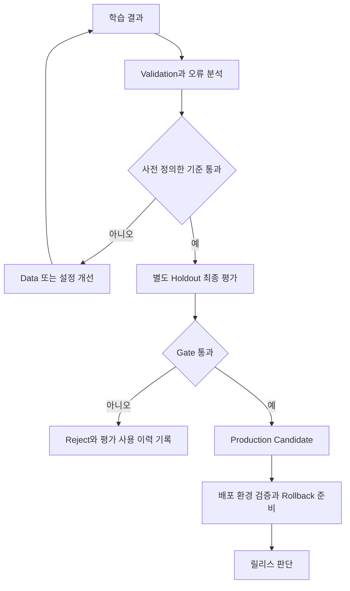

# Chapter 5. Evaluation과 Model Promotion

**읽기 안내:** 원문의 제목·번호·표·예시·text 도식을 그대로 보존했다. 원문 뒤의 **원문 절별 보완과 적용 조건**에서 실제 적용 조건을 함께 읽는다. 수치와 설정은 학습용 예시이며 이 문서에서 학습·배포·성능 시험을 실행하지 않았다.

<!-- SOURCE CORE START -->

## 5.1 Training 완료가 Production 완료는 아니다

Fine-Tuning이 끝났다고 바로 Production에 배포하면 안 된다.

```text
Training Complete
≠
Production Ready
```

학습 결과를 Golden Dataset으로 검증해야 한다.

---

## 5.2 Base Model과 Fine-Tuned Model 비교

동일한 Golden Dataset으로 비교한다.

```text
Golden Dataset
      │
      ├─ Base Model
      │
      ├─ Fine-Tuned Model A
      │
      └─ Fine-Tuned Model B
```

예:

| Metric | Base | Fine-Tuned |
|---|---:|---:|
| Task Accuracy | 76% | 89% |
| Format Pass | 81% | 97% |
| Hallucination | 9% | 4% |
| Latency | 120ms | 135ms |

중요:

> Training Loss가 낮다는 이유만으로 좋은 모델이라고 판단할 수 없다.

실제 업무에서 필요한 Metric으로 평가해야 한다.

---

## 5.3 Evaluation Metric

업무에 따라 다음과 같은 Metric을 사용할 수 있다.

```text
Accuracy
Task Success Rate
Format Pass Rate
Hallucination Rate
Safety
Human Preference
Latency
Token Usage
Cost
```

즉 Model Quality뿐 아니라 Serving 측면까지 함께 볼 수 있다.

---

## 5.4 Quality Gate

Evaluation 결과가 기준을 통과했을 때만 Production Candidate로 승격할 수 있다.

```text
Fine-Tuned Model
↓
Golden Evaluation
↓
Quality Gate
├─ PASS → Promote
└─ FAIL → Reject / Retrain
```

예:

```text
Accuracy >= 90%
Format Pass >= 98%
Hallucination <= 3%
Latency <= Target
```

과 같은 기준을 둘 수 있다.

---

## 5.5 Error Analysis

Evaluation에서 실패한 Sample을 분석하는 과정이 중요하다.

예:

```text
SAP 질문
→ 잘함

Kafka 기본 질문
→ 잘함

복잡한 장애 분석
→ 성능 낮음
```

그러면 원인을 분석한다.

```text
복잡한 장애 분석 Sample 부족
↓
관련 Training Data 추가
↓
Dataset v4 생성
↓
재학습
↓
재평가
```

즉 Fine-Tuning은 한 번의 작업이 아니라 반복적인 개선 Loop이다.

---

## 5.6 Model Improvement Loop

전체 Loop:

```text
문제 정의
↓
Data 수집 / 정제
↓
Training Dataset 생성
↓
Fine-Tuning
↓
Evaluation
↓
Error Analysis
↓
Dataset 개선
↓
Retraining
```

모델 개발에서 Dataset과 Evaluation이 중요한 이유가 여기에 있다.

---

<!-- SOURCE CORE END -->

## 원문 절별 보완과 적용 조건

2026-10-05에 아래 공식 평가 자료를 확인했다. 다음은 원문 예시의 해석과 평가 설계 권고이며 실측 결과가 아니다.

### 5.2–5.4: 예시 수치와 통과 기준

5.2의 76%→89%, 81%→97%, 9%→4%, 120ms→135ms는 가상의 비교값이다. 같은 후보에 5.4의 기준을 적용하면 Accuracy 89%는 90% 미만, Format Pass 97%는 98% 미만, Hallucination 4%는 3% 초과이므로 세 기준 모두 실패한다. Latency 목표값은 없어 통과 여부를 판단할 수 없다. Base 대비 개선과 절대 gate 통과를 구분한다.

설계 권고: 평가 dataset·rubric·prompt·generation 설정을 고정하고 모델별로 맞는 chat template을 기록한다. Latency는 같은 hardware·부하·입출력 길이 조건에서 측정하고 percentile을 명시한다. 범주별 표본 수와 실패 분포도 남긴다. 자세한 운영 평가 설계는 [AI Evaluation](../data-platform/ai-evaluation.md)에 연결한다.

### 5.5–5.6: 개선용 평가와 최종 Holdout

Golden set의 실패를 보고 반복해서 dataset·설정을 고르면 그 점수도 모델 선택에 사용된 것이다. 그대로 “미사용 최종 시험”이라고 부르지 않는다. Validation으로 개선하고 별도 holdout으로 최종 확인하며, train과 평가의 중복·유사 샘플을 관리한다. 이는 일반적인 leakage 방지 원칙을 이 개선 loop에 적용한 권고다. [scikit-learn 평가 분리](https://scikit-learn.org/stable/modules/cross_validation.html), [Data leakage](https://scikit-learn.org/stable/common_pitfalls.html)

“복잡한 장애 분석 sample 부족”은 가능한 원인이다. Label 오류·template·truncation·base 역량 등 다른 원인도 확인한 뒤 데이터를 추가한다. 실패 질문을 그대로 training에 복사하고 같은 질문의 향상을 일반화 성능으로 보고하지 않는다.

## 보완 도식: 평가 통과와 배포 검증

원문의 text 흐름에 최종 holdout과 배포 검증을 덧붙인 설계 예시다. 승격 후보라는 상태가 실제 배포 완료를 뜻하지 않는다.



## 관련 문서

[QLoRA 학습](qlora-training.md) · [모델 교체와 재학습](model-retraining.md) · [AI Evaluation](../data-platform/ai-evaluation.md) · [Data Quality](../data-platform/data-quality.md)
