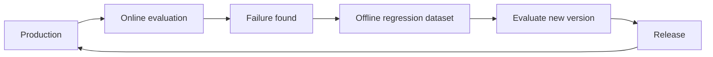
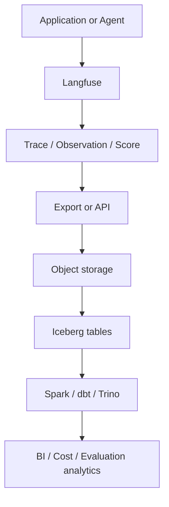

# AI 평가 데이터 플랫폼

이 페이지는 16.2–16.12의 개념 학습 기록이다. 아래 데이터·점수·비용·버전·게이트는 설명용 가상 예시이며 실제 운영 측정값이나 구현 결과가 아니다. [온라인 평가](online-evaluation.md)는 실제 실행을 관찰하고, offline 평가는 고정 사례로 변경을 비교한다. 실패를 회귀 사례로 전환하고 실행에 버전 묶음을 연결하는 것이 두 흐름의 접점이다.

## 16.2 Offline 평가 데이터셋

같은 평가 데이터셋을 서로 다른 prompt·model·agent 버전에 실행하면 조건을 맞춰 비교할 수 있다. 다른 기간의 운영 traffic끼리 비교하는 것보다 입력 차이의 영향을 줄인다. 예를 들어 `Dataset v5 → Agent v10 / Agent v11 → Scores`를 비교한다.

| Dataset v5 사례 | 확인할 범위 |
|---|---|
| Case 1 | 일반 요청 |
| Case 2 | tool 사용 요청 |
| Case 3 | 권한 위반 시도 |
| Case 4 | 어려운 RAG 요청 |
| Case 5 | 알려진 운영 회귀 |

항목에는 `input`, `expected_output`, `expected_behavior`, `expected_tool`, `rubric`, `category`, `difficulty`, `metadata`를 담을 수 있다. Agent는 정답 문자열 하나보다 행동 조건이 중요할 수 있다. “지난주 팀별 AI 비용을 보여 줘”의 기대 행동은 analytics tool 호출, 허용된 데이터셋 사용, 팀별 집계, 사용자 수준 PII 비노출이다.

범주는 General, Tool Usage, RAG, Security, Complex Reasoning, Edge Cases, Regression으로 나눌 수 있다. 전체 점수 `88%`만 보면 취약 범주를 놓친다.

| 범주 | 설명용 결과 |
|---|---|
| General | 95% |
| Tool Usage | 91% |
| RAG | 84% |
| Security | 100% |
| Regression | 70% |



핵심은 **운영 실패 → offline regression case**다. 고정 입력은 공정한 비교를 돕지만 evaluator·데이터 권한·검색 상태까지 자동으로 고정하지는 않는다. 이는 재현성을 위한 추가 설계 주의사항이다.

## 16.3 Human feedback

사람이 응답을 직접 평가하여 품질 데이터를 만든다. 👍/👎는 낮은 품질 trace 탐색, 실패 데이터셋 구성, 사람 검토 우선순위에 유용하다. 세부 rating 예시는 accuracy `4/5`, helpfulness `5/5`, relevance `3/5`다.

전문가는 기술적 정확성, tool 선택, 정책 준수, citation 품질, 도메인 정확성을 검토할 수 있다. 전문·고위험 분야에서는 해당 지식이 있는 검토자가 필요하다. “좋은 답인가?”보다 rubric을 명시하면 기준을 맞추기 쉽다.

| Rubric 차원 | 설명용 척도 |
|---|---|
| Accuracy | 0–2 |
| Relevance | 0–2 |
| Groundedness | 0–2 |
| Tool Selection | 0–2 |
| Format | 0–2 |

사람도 완벽한 정답은 아니다. 같은 응답을 Reviewer A는 `5`, B는 `3`으로 평가할 수 있다. **Inter-rater agreement**는 평가자 간 일치도를 뜻한다. 사람 label도 잡음이 있는 데이터로 관리한다.

운영 흐름은 `Production Trace → Thumbs Down → Human Review → Failure Label → Regression Dataset`이다. 실패 label 예시는 `wrong_tool_selection`, `hallucination`, `retrieval_failure`, `permission_violation`, `bad_format`이다.

## 16.4 Model-as-Judge

다른 LLM을 평가자로 사용한다. `Input + Response + Optional Context → Judge LLM → Score + Reason`으로 기록한다. Accuracy, Relevance, Helpfulness, Groundedness, Tool Usage, Format Compliance, Safety를 평가 차원으로 삼을 수 있다. RAG는 `Question + Retrieved Context + Response`를 주어 제공 문서에 응답이 근거하는지 평가한다.

점수 `0.72`만 남기지 말고 `judge_model`, `judge_model_version`, `judge_prompt_version`, `score`, `reason`, `timestamp`를 함께 저장한다. Agent가 같아도 judge v1의 `0.85`와 judge v2의 `0.72`는 다를 수 있다. 점수 하락을 곧바로 agent 퇴행으로 판단하지 않는다.

표본의 Human Score와 Judge Score를 비교하여 보정한다. 지속적인 불일치가 있으면 judge 모델이나 prompt를 검토한다. 설명용 규모 예시는 `100,000 traces → Model-as-Judge`, `중요한 1,000 traces → Human Review`다. Judge는 규모를 확보하고, 사람 검토는 보정의 신뢰도를 높이는 역할이다. 사람도 오류가 있으므로 완전한 정답 보장은 아니다.

## 16.5 Prompt 버전

Prompt를 버전 있는 자산으로 관리하고 trace·평가와 연결한다.

| 예시 버전 | 지시 | 설명용 평가 |
|---|---|---|
| v1 | 사용자에게 답하세요. | 0.78 |
| v2 | 사용자에게 답하세요. 근거가 없으면 추측하지 마세요. 필요하면 tool을 사용하세요. | 0.89 |

유용한 필드는 `prompt_id`, `prompt_version`, `prompt_text`, `created_at`, `created_by`, `change_description`이다. 예를 들어 `prompt_id=agent_system_prompt`, `prompt_version=12`, 변경 내용 “tool 사용 규칙 명확화”를 기록한다. 실제 작성자 정보는 내부 권한과 개인정보 기준에 따라 관리하며 공개 예시에는 넣지 않는다.

`Trace → Agent v5 / Model A / Prompt v12 / Score 0.91`처럼 연결하면 v11과 v12의 품질, tool 성공, 비용, latency를 비교할 수 있다. A/B traffic을 `50% → Prompt v10`, `50% → Prompt v11`로 나누는 설명용 예시는 다음과 같다.

| Prompt | 성공률 | 비용 |
|---|---|---|
| v10 | 87% | $0.12 |
| v11 | 91% | $0.17 |

품질이 가장 높은 prompt가 운영상 최선이라는 뜻은 아니다. 필요하면 `system_prompt`, `tool_instruction`, `retrieval_prompt`, `judge_prompt`, `summarization_prompt`를 따로 버전 관리한다.

## 16.6 Model 버전

결과를 생성한 정확한 모델 버전을 기록한다. `model=model-X`만으로는 부족할 수 있다. 제공자가 serving snapshot을 바꾼 경우 같은 이름의 6월과 9월 모델이 다를 수 있다. `provider`, `model_name`, `model_version`, `deployment_id`, `endpoint`를 기록하되 내부 endpoint와 credential은 공개 문서에 넣지 않는다.

`Dataset v5`, `Prompt v12`, `Agent v7`을 고정한 비교 예시다.

| Model | 품질 | Latency | 비용 |
|---|---|---|---|
| A | 0.88 | 1.2s | $0.04 |
| B | 0.91 | 2.0s | $0.02 |

vLLM 등으로 자체 호스팅할 때도 `checkpoint`, `quantization`, `tokenizer_version`, `serving_config`가 재현 조건이다. Fine-tuned 모델은 `base_model`, `training_dataset_version`, `training_config`, `checkpoint_version`을 연결한다. 예시는 `Base Model M1 → Training Set train_v4 → Fine-tune ft_v7`이다.

## 16.7 Agent 버전

Agent는 system prompt, model, tool set, tool routing logic, retrieval, memory, workflow를 포함한다. Prompt가 같아도 v10의 tools A·B가 v11에서 A·B·C와 새 routing rule로 바뀌면 행동이 달라진다.

기록할 필드는 `agent_version`, `prompt_version`, `model_version`, `tool_set_version`, `workflow_version`, `retrieval_config_version`, `memory_config_version`이다. Agent version은 전체 **bundle version**으로 볼 수 있다.

```text
agent_version = v12
prompt        = v8
model         = model-A-v3
toolset       = v4
workflow      = v6
retrieval     = v2
```

Dataset v7을 고정한 예시:

| Agent | 품질 | 비용 | Latency |
|---|---|---|---|
| v10 | 0.84 | $0.08 | 4.2s |
| v11 | 0.91 | $0.11 | 5.0s |

품질·비용·latency 외에 tool 성공률, tool 오류율, retrieval 품질도 평가한다.

## 16.8 Experiment tracking

실험 설정과 결과를 함께 기록한다. 예를 들어 Experiment A는 Dataset `eval_v5`, Prompt `prompt_v12`, Model `model_A`, Agent `agent_v7`이며 품질 `0.88`, latency `3.2s`, 비용 `$0.05`다.

실험 필드는 `experiment_id`, `dataset_version`, `prompt_version`, `model_version`, `agent_version`, `evaluator_version`, `runtime_config`다. 결과에는 accuracy, groundedness, tool_success_rate, latency, cost를 포함한다.

가능하면 한 변수를 바꾼다. Prompt v10과 v11을 비교할 때 dataset·model·agent logic을 고정한다. Prompt·model·agent·dataset을 동시에 바꾸면 결과 차이를 해석하기 어렵다. Offline 실험은 고정 평가 데이터로 Agent A/B를 비교하여 배포 전 위험을 줄인다. Online 실험은 실제 traffic의 A/B 분할로 현실 조건의 근거를 얻는다. Online 결과는 traffic 구성과 실험 조건도 함께 검토한다.

## 16.9 Regression 데이터셋

과거에 실패했던 사례가 이후 릴리스에서도 계속 통과해야 한다. “지난주 팀별 AI 비용” 요청에서 잘못된 tool을 선택한 trace를 수정 후 regression case로 만든다. Agent v10·v11·v12를 같은 회귀 데이터에 실행한다.

범주는 `tool_selection_regression`, `rag_regression`, `security_regression`, `format_regression` 등이 있다. 설명용 release gate는 Critical Security Regression `100%` 통과, General Regression `>=98%`다. 이 값은 보편적 안전 기준이 아니며 실제 위험과 요구사항에 맞춰 정한다. 데이터셋도 `regression_v1 → v2 → v3`으로 버전 관리한다.

**Production Failure → Regression Case → Release Test**가 반복 구조다. 통과율에는 실패와 미평가를 구분하는 분모 정의가 필요하다.

## 16.10 Cost / Quality / Latency

세 축을 함께 본다. Model A는 품질 `92`, latency `5s`, 비용 `$0.10`이고 Model B는 품질 `90`, latency `1.5s`, 비용 `$0.02`일 수 있다. 제품 요구사항 없이 보편적인 승자를 정할 수 없다.

| 축 | 지표 예시 |
|---|---|
| Quality | accuracy, groundedness, success_rate, tool_success_rate, user_satisfaction, judge_score, regression_pass_rate |
| Cost | input_tokens, output_tokens, model_cost, tool_cost, total_cost, cost_per_execution, cost_per_success, cost_per_team |
| Latency | TTFT, LLM latency, tool latency, retrieval latency, total latency; p50, p95, p99 |

`cost_per_success`는 요청당 원가보다 유용할 수 있다. 예를 들어 순차 실행 `LLM 2s + Tool 5s + LLM 2s = Total 9s`는 tool이 큰 지연 원인임을 보여 준다. 평균뿐 아니라 percentile을 본다.

큰 모델은 품질·비용·지연이 함께 증가할 수 있다. Tool 호출을 늘리면 품질을 개선할 가능성이 있지만 비용과 latency도 늘 수 있다. Context를 줄이면 비용·latency가 감소할 수 있지만 품질도 떨어질 수 있다. 이들은 경향과 가설이며 항상 성립하는 법칙이 아니다. 목표는 품질을 유지·개선하면서 가능한 비용과 latency를 줄이는 것이다.

## 16.11 Langfuse + Iceberg

역할 분리는 제안 아키텍처이며 배포 사실이나 자동 연동 보장이 아니다. Langfuse는 traces, LLM/tool calls, prompt/response, scores, feedback, experiments, evaluation datasets의 운영에 쓴다. Iceberg는 장기 이력, 대규모 분석, 도메인 간 join, governance, BI, 과거 버전 분석을 위한 테이블 계층이다.



Object storage의 export 파일이 자동으로 Iceberg 테이블이 되는 것은 아니다. 수집·변환·commit 경로가 필요하다. Langfuse는 blob storage export와 public API를 제공한다. 지원 형식·필드·버전·호스팅 옵션은 도입 시 확인한다. [Export 문서](https://langfuse.com/docs/api-and-data-platform/features/export-to-blob-storage), [Public API](https://langfuse.com/docs/api-and-data-platform/features/public-api).

설명용 사실 테이블은 `fact_agent_execution`, `fact_llm_call`, `fact_tool_call`, `fact_evaluation`이다. 차원은 `dim_agent`, `dim_model`, `dim_prompt`, `dim_team`이다.

| 계층 | 데이터와 변환 |
|---|---|
| Bronze | raw traces / observations / scores |
| Silver | call 정규화, version 연결, 비용 정규화, 오류 분류 |
| Gold | 팀 AI 비용, agent 성공률, prompt 품질, model p95 latency, 성공 실행당 비용 |

Langfuse만으로 충분하지 않은 경우는 trace에 HR 조직 데이터, 재무 비용, 제품 사용량, business KPI를 결합해야 할 때다. 이런 통합 분석은 데이터 플랫폼의 역할이다. 실제 민감 데이터 결합은 목적과 접근 범위에 맞게 제한한다.

Source of truth의 설명용 분리는 Git의 agent code/workflow/config, Langfuse의 AI trace/prompt/evaluation 운영, Iceberg의 장기 분석 이력이다. [Iceberg](lakehouse-iceberg.md), [분석 모델링](analytical-modeling.md), [AI-ready 데이터](ai-ready-data.md)와 연결된다.

## 16.12 모든 버전은 어디에서 관리하는가?

한 시스템에 몰아넣기보다 자산별 관리 시스템을 정하고 experiment/release ID로 연결한다. 다음은 일반적인 선택지이며 제품마다 동일한 버전 의미나 기능을 보장하지 않는다.

| 자산 | 관리 선택지 |
|---|---|
| Prompt version | Langfuse / MLflow / Git |
| Model version | MLflow Model Registry / provider model snapshot |
| Agent version | Git release / application release |
| Tool / workflow version | Git / config registry |
| Evaluation dataset version | Langfuse / MLflow / lakehouse |
| Judge version | Langfuse / MLflow + Git |
| Embedding model | Model registry / config |
| Retrieval config | Git / config registry |
| Full experiment | Langfuse / MLflow |

구조 예시는 다음과 같다.

```text
Git
  Agent code / Tool logic / Workflow / Retrieval config / Deployment config
Langfuse or MLflow
  Prompt versions / Traces / Scores / Feedback / Evaluation datasets / Experiments
Model registry
  Self-hosted models / Fine-tuned models
Iceberg
  Long-term telemetry history / Evaluation history / Enterprise analytics
```

통합 기록 예시에서 commit과 모델명 등은 설명용 가상 값이다.

```text
experiment_id       = EXP-1042
agent_release       = 1.7.3
git_commit          = abc123
prompt_version      = 12
model_version       = model-A-2026-09
dataset_version     = eval-v8
evaluator_version   = judge-v4
retrieval_version   = v3
toolset_version     = v5
quality_score       = 0.92
latency_p95         = 3.4s
cost_per_execution  = $0.08
```

이 연결은 재현·설명에 필요한 근거다. ID만으로 동일 실행이 자동 보장되지는 않으므로 실제 artifact·입력·runtime과 외부 상태도 보존해야 한다.

### 제품별 버전 주의사항

공식 문서 확인일은 2026-09-26이며 설치·실행 검증은 하지 않았다. Langfuse dataset item 변경은 timestamp 기반 버전을 만들지만 dataset schema 변경은 같은 버전 관리에 포함되지 않는다. 평가에 사용한 item 버전과 schema 정의를 구분하여 기록한다. [Langfuse datasets](https://langfuse.com/docs/evaluation/experiments/datasets).

MLflow prompt version은 변경 불가능한 버전이며 alias는 가리키는 버전이 바뀔 수 있다. Model Registry도 alias로 모델 버전을 참조할 수 있다. 따라서 재현 기록에는 움직이는 alias만 남기지 말고 실제 사용한 버전을 저장한다. [Prompt Registry](https://mlflow.org/docs/latest/genai/prompt-registry/), [Model Registry workflow](https://mlflow.org/docs/latest/ml/model-registry/workflow/).

## LLM in Practice: 릴리스 평가 설계 검토

- **상황:** 새 agent 릴리스의 품질·비용·latency 개선 주장을 배포 전에 검토한다.
- **제공 맥락:** 비식별 실험 기록, 고정 데이터셋 버전, 버전 묶음, evaluator 변경 이력, 범주별 결과, 회귀 게이트, 누락·실패 수.
- **예시 prompt:**

=== "한국어"

    ```text {.prompt}
    [맥락]
    릴리스 전후 실험과 범주별 결과: [비식별 자료]
    데이터셋·prompt·model·agent·evaluator 버전: [기록]
    회귀 게이트·비용·p95 latency·미평가 수: [기준과 관측]
    [요청]
    고정된 조건과 바뀐 조건을 나누고 비교 가능성을 검토하세요.
    전체 평균과 별도로 보안·tool·RAG 회귀를 살펴보세요.
    [출력]
    관측·가정·누락 근거·다음 검증을 표로 작성하세요.
    배포 판단에 필요한 추가 비교와 조건부 결론을 적으세요.
    [검증]
    judge 변경과 agent 변경을 혼동하지 마세요.
    미평가를 성공으로 세거나 임의의 안전 기준을 만들지 마세요.
    도구 실행·배포 없이 검토안만 작성하고 사람이 확인할 근거를 연결하세요.
    ```

=== "English"

    ```text {.prompt}
    [Context]
    Before/after experiments and category results: [sanitized material]
    Dataset, prompt, model, agent, and evaluator versions: [records]
    Regression gates, cost, p95 latency, and unscored counts: [criteria and observations]
    [Task]
    Separate fixed and changed conditions and assess comparability.
    Review security, tool, and RAG regressions separately from the overall average.
    [Output]
    Make a table of observations, assumptions, missing evidence, and next checks.
    List further comparisons needed for a release decision and conditional conclusions.
    [Checks]
    Do not confuse judge changes with agent changes.
    Do not count unscored cases as passes or invent safety thresholds.
    Draft a review without running tools or deploying; link evidence for human review.
    ```

- **기대 결과:** 비교 가능성 표, 누락 근거, 범주별 회귀 위험, 조건부 릴리스 검토안.
- **오류 가능성:** judge 변경을 agent 개선으로 해석하거나 평균 점수로 보안 실패를 가리고, 예시 게이트를 보편적 기준으로 사용할 수 있다.
- **검증:** 사람이 원본 experiment·trace·버전 artifact와 분모를 대조한다. 승인된 격리 평가로 필요한 비교를 실행하고 결과를 다시 검토한다. 이 문서에서는 실행하지 않았다.

[온라인 평가](online-evaluation.md) · [AI-ready 데이터](ai-ready-data.md) · [학습 범위](curriculum.md)
