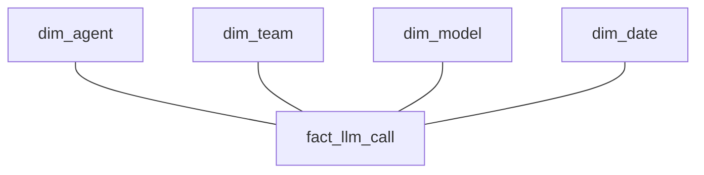

# 분석 데이터 모델링

이 문서는 grain, fact, dimension, metric을 학습한 기록이다. AI platform schema는 가상의 설계 예시이며 실제 사용자·조직 데이터나 구현 경험을 담지 않는다.

## Grain부터 정한다

Grain은 table 한 행이 무엇을 뜻하는지 정의한다.

| Table | 한 행의 의미 |
| --- | --- |
| `fact_order` | 주문 1건 |
| `fact_order_item` | 주문 항목 1건 |
| `fact_llm_call` | LLM 호출 1회 |

Grain을 잘못 이해하면 join 이후 중복 집계가 생긴다. 예를 들어 주문 1건을 여러 주문 항목과 join한 뒤 주문 금액을 다시 합산하면 금액이 반복될 수 있다. 학습상의 설계 순서는 `Grain → Fact → Dimension → Metric`이다. 물리 column부터 정하기 전에 한 행의 업무 의미를 합의한다. [Kimball: Grain](https://www.kimballgroup.com/data-warehouse-business-intelligence-resources/kimball-techniques/dimensional-modeling-techniques/grain/)

## Fact와 dimension

Fact table은 사건이나 측정값을 담는다.

| Fact 유형 | 예시 |
| --- | --- |
| Event fact | 클릭, API 호출 |
| Transaction fact | 주문, 결제 |
| Periodic snapshot fact | 일별 재고, 일별 잔액처럼 일정 주기의 상태 |
| Accumulating snapshot fact | 하나의 프로세스가 여러 단계를 통과한 상태 |

Accumulating snapshot의 주문 예시는 `order_created_at`, `paid_at`, `shipped_at`, `delivered_at`이다. 하나의 행이 주문 프로세스의 진행 시점을 담는다. 여기서 event/transaction 구분은 업무 설명을 위한 것이며 모든 모델링 방법론에서 서로 배타적인 fact 분류라는 뜻은 아니다.

Dimension은 fact를 설명하는 속성이다. 예를 들어 `dim_customer`, `dim_product`, `dim_model`, `dim_team`이 있다. Natural key는 원본 시스템 식별자다. Surrogate key는 분석 시스템에서 별도로 만든 key이며 SCD Type 2의 version을 구분할 때 유용하다.

## Star schema와 이력

Star schema는 중앙 fact와 주변 dimension으로 구성한다. 다음 구조는 설명하기 쉽고, BI query에서 역할이 명확하다.



SCD(Slowly Changing Dimension)는 dimension의 변화를 다룬다. Type 1은 현재 값만 필요할 때 overwrite한다. Type 2는 과거 행을 보존하고 새 version을 추가한다.

```text
customer_sk | customer_id | region | valid_from | valid_to
```

이 구조로 과거 시점의 region을 분석할 수 있다. 분석 시점에 맞는 version을 join해야 하며, 같은 natural key의 유효 구간이 겹치면 행이 늘어날 수 있다. 유효 구간과 종료 경계의 의미를 명확히 한다.

## Denormalization의 범위

OLTP는 정규화로 변경 일관성을 관리하는 경우가 많다. OLAP은 조회 편의와 성능을 위해 일부 중복을 허용해 join을 줄이기도 한다. 하지만 모든 정보를 하나의 table에 넣는 것도 문제다. 서로 다른 grain과 변경 주기가 섞이면 반복 값과 집계 오류가 생길 수 있다. 편의성뿐 아니라 이력과 유지보수 비용을 비교한다.

## AI platform 예시

Agent execution, LLM call, user event는 서로 다른 grain이다. 하나의 agent 실행에 여러 LLM call이 있을 수 있으므로 같은 행 단위로 취급하지 않는다.

| Table | Grain | 예시 필드 |
| --- | --- | --- |
| `fact_agent_execution` | Agent 실행 1회 | `execution_id`, `agent_id`, `user_id`, `team_id`, `started_at`, `completed_at`, `status`, `total_latency`, `total_cost` |
| `fact_llm_call` | LLM 호출 1회 | `llm_call_id`, `execution_id`, `model_id`, `input_tokens`, `output_tokens`, `latency`, `cost` |
| `fact_user_event` | 사용자 event 1개 | 업무별 event schema로 별도 정의 |
| `dim_agent` | Agent 설명 | Agent 속성 |
| `dim_model` | Model 설명 | Model 속성 |
| `dim_team` | 조직 설명 | Team 속성 |

같은 dimension의 의미·key 규칙을 여러 fact가 일관되게 공유하면 conformed dimension으로 사용할 수 있다. 실행 비용을 LLM call과 join한 뒤 합산할 때는 실행 행이 호출 수만큼 반복되는지 확인한다. 위 `user_id` 같은 이름은 schema 예시일 뿐 실제 개인 식별값을 포함하지 않는다.

## Metric과 semantic layer

Metric 모델링은 KPI 정의를 일관되게 관리한다. 다음은 실행 grain 기준의 예시다.

```text
agent_execution_error_rate
= failed execution count / total execution count
```

Base metric에는 `execution_count`, `token_count`, `cost`가 있다. Derived metric에는 `error_rate`, `cost_per_execution`이 있다. 같은 기간·필터·대상 집합으로 분자와 분모를 계산하고 분모가 0일 때의 의미를 정한다.

Semantic layer는 DAU, Total Cost, Error Rate, Average Latency 같은 업무 metric의 의미와 계산법을 중앙에서 정의한다. Dashboard, analyst, AI agent가 같은 정의를 쓰도록 돕는다. 이름만 같아도 grain이나 제외 조건이 다르면 같은 metric이 아니다.

## LLM 활용: 비용 중복 집계 검토

상황: 실행 비용이 호출 수에 비례해 커진다. 제공할 맥락은 각 table의 grain, key, 관계 cardinality, join SQL, 소규모 가상 sample, metric 정의다.

=== "한국어"

    ```text {.prompt}
    [맥락]
    Table별 grain·key·cardinality·join SQL: [맥락]
    작은 가상 데이터와 metric 정의: [샘플·정의]

    [요청]
    각 table에 명시된 grain을 사용해 이 비용 query를 검토해 주세요.
    각 join 이후 행 수와 중복되는 measure를 보여 주세요.
    관찰한 사실·가설·부족한 정보를 구분해 주세요.
    최소 수정안과 합계를 확인하는 작은 예시를 제안해 주세요.

    [출력]
    Measure가 반복되는 위치와 검증 예시를 주세요.

    [검증]
    원본 grain 합계와 join 합계를 비교하고 여러 호출·0회 호출·SCD 경계를 확인해 주세요.
    ```

=== "English"

    ```text {.prompt}
    [Context]
    Grains, keys, cardinality, and join SQL by table: [context]
    Small synthetic data and metric definitions: [samples and definitions]

    [Task]
    Review this cost query using the stated grain of each table.
    Show row counts and duplicated measures after each join.
    Separate observed facts from hypotheses and missing information.
    Propose a minimal correction and a small example that checks the total.

    [Output]
    Return the location of repeated measures and a validation example.

    [Checks]
    Compare totals at the original grain and after joins; check multiple calls, zero calls, and SCD boundaries.
    ```

기대 결과는 join에서 measure가 반복되는 위치와 검증 예시다. LLM은 `DISTINCT`로 증상을 숨기거나 다른 grain의 비용을 합칠 수 있다. 원본 grain에서 계산한 합계와 join 후 합계를 비교하고 여러 호출·0회 호출·SCD version 경계 사례를 확인한다. 이 문서는 실제 query를 실행한 기록이 아니다.

[dbt](dbt.md) · [Trino](trino.md) · [핸드북 홈](../index.md)

[관련 실무 프롬프트 6개](../prompts/analytical-modeling.md)
