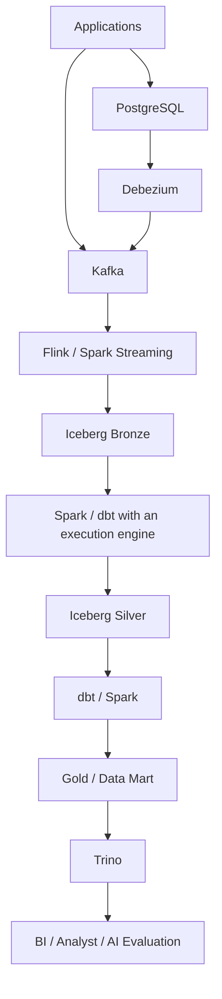
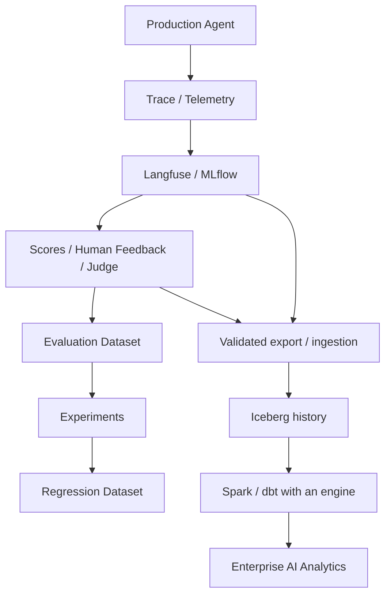

# 데이터 플랫폼 전체 구조와 역할

원문의 보충 설명과 최종 mental model을 통합했다. 아래는 구성 요소의 관계를 설명하는 학습용 구조이며 구축 완료된 시스템이나 모든 조직에 필요한 고정 설계가 아니다. 제품별 동작·제약의 근거는 연결된 주제 문서에서 확인한다.

## 데이터 경로

애플리케이션 이벤트는 Kafka로, PostgreSQL의 변경은 Debezium을 거쳐 Kafka로 전달하는 예다. Flink 또는 Spark Streaming으로 Bronze에 적재하고 Spark·dbt 변환으로 Silver와 Gold를 만든 뒤 Trino로 분석한다. dbt의 SQL은 연결된 실행 엔진에서 수행된다.



원문의 간략 그림은 Bronze 다음 Spark로 Silver를 만들고, dbt로 Gold/Data Mart를 만드는 역할 구분을 강조한다. 위 그림은 동일한 학습 구조에서 변환 도구의 조합을 표시했다. 각 도구의 연결은 호환되는 connector·catalog·실행 엔진을 선택해야 하며 이 자료에서 end-to-end로 검증하지 않았다.

## 구성 요소의 경계

| 구성 요소 | 핵심 역할 | 자세한 내용 |
|---|---|---|
| Kafka | 이벤트 전달과 내구성 있는 로그 | [Kafka](event-architecture.md) |
| S3 | Object storage | [S3](foundations.md) |
| Parquet | 분석용 columnar 파일 포맷 | [Parquet](foundations.md) |
| Iceberg | 테이블 포맷·메타데이터·snapshot | [Iceberg](lakehouse-iceberg.md) |
| Spark | 대규모 연산·배치 처리 | [Spark](spark.md) |
| Flink | 상태를 가진 실시간 처리 | [Flink](flink.md) |
| Debezium | 데이터베이스 변경 캡처 | [Debezium](cdc-debezium.md) |
| dbt | SQL 변환 관리 | [dbt](dbt.md) |
| Trino | 분산·대화형 SQL 질의 | [Trino](trino.md) |
| Airflow | 워크플로 orchestration | [Airflow](orchestration.md) |
| OpenLineage | 계보 이벤트 표준 | [OpenLineage](lineage-metadata.md) |
| Catalog | 메타데이터 검색·탐색 | [Catalog](lineage-metadata.md) |
| Governance | 정책·접근 통제·감사 | [Governance](governance.md) |
| Langfuse | AI telemetry·observability·평가 | [Langfuse](ai-ready-data.md) |


Storage, file format, table format, compute, query, transformation management, orchestration은 서로 다른 역할이다. 예를 들어 S3는 파일의 저장 위치, Parquet은 파일 표현, Iceberg는 테이블 상태 관리, Spark/Flink는 처리, Trino는 SQL 조회, dbt는 SQL 모델 관리, Airflow는 작업 의존성과 실행 순서를 담당한다.

## 횡단 관심사

| 기능 | 확인하는 질문 |
|---|---|
| Airflow | 작업을 어떤 의존성과 순서로 실행하는가? |
| Data quality | 정한 규칙을 만족하고 데이터를 신뢰할 수 있는가? |
| Data observability | 지금 최신성·양·분포·정확성에 이상이 있는가? |
| Metadata / catalog | 어떤 데이터가 있으며 무슨 뜻인가? |
| Lineage / OpenLineage | 어디서 왔고 어디로 가는가? |
| Governance | 누가 어떤 정책 아래 사용할 수 있는가? |
| Langfuse | AI 실행에서 무엇이 일어났고 품질은 어땠는가? |
| AI-ready data | AI가 통제된 조건 아래 재사용하고 실험 조건을 재구성할 수 있는가? |

## Quality와 observability

[Data quality](data-quality.md)는 not null, unique, accepted values, accuracy처럼 정한 규칙을 만족하는지 묻는다. [Data observability](data-observability.md)는 freshness, volume, schema, distribution, anomaly, alert를 통해 운영 중 변화와 이상 위치를 살핀다. Quality rule을 지속 관찰하는 관측 체계로 연결할 수 있다. Pipeline 성공만으로 데이터 정확성이 증명되지는 않는다.

## Metadata, catalog, semantic layer

Metadata는 데이터를 설명하는 정보이고 catalog는 이를 검색·탐색하는 시스템이다. Business metadata는 업무 의미를 설명한다. Semantic layer는 metric·dimension의 의미와 계산을 실제 질의에서 재사용할 수 있게 정의한다. Lineage는 생성·변환 관계, governance는 사용 정책과 그 적용을 다룬다. [계보와 메타데이터](lineage-metadata.md), [분석 모델링](analytical-modeling.md), [거버넌스](governance.md)로 이어진다.

## AI 관측과 범용 데이터 플랫폼

Langfuse 같은 도구는 trace, LLM/tool call, prompt/response, token/cost/latency, score, dataset, experiment를 다룬다. Enterprise analytics, lakehouse storage, cross-domain join, governance, 장기 이력, 통합 catalog 전체를 대체한다고 가정하지 않는다. 학습 구조에서는 AI 실행 단위 관측·평가는 Langfuse가, 장기 분석 자산은 데이터 플랫폼이 담당한다. 이것은 제품 도입을 확정한 결정이 아니다.

[AI-ready 데이터](ai-ready-data.md) · [온라인 평가](online-evaluation.md) · [학습 범위와 다음 과정](curriculum.md)

## 구성 요소를 도입하는 이유

새 자료 Chapter 21의 역할·선택 기준을 기존 구조에 합쳤다. 아래는 설계 검토용 예시이며 제품 도입을 확정한 ADR이나 실행한 시스템이 아니다.

| 요소 | 필요한 문제와 기능 | 생략·대안 판단 |
|---|---|---|
| Kafka | 내구성 있는 이벤트 전달, 보존 범위 내 replay, producer/consumer 분리. 여러 consumer가 독립적으로 같은 이벤트를 읽고 비동기로 처리할 때 유용하다. 분석 DB 역할은 아니다. | 작은 시스템은 애플리케이션 → DB 또는 직접 batch export로 충분할 수 있다. |
| Flink | 낮은 지연, event time·watermark, 큰 state, 복잡한 window·session을 가진 stateful streaming. | 지연 요구가 완화되면 Kafka → Spark Structured Streaming → Iceberg가 더 단순한 후보일 수 있다. |
| Bronze | 소스에 가까운 이력을 보존해 replay·audit·debug·재처리·새 변환·과거 원본 조회를 지원한다. | 필요한 보존 기간과 접근·삭제 정책을 함께 정한다. 원본 이력이 없으면 잘못된 변환 복구가 어려워진다. |
| Iceberg | Object storage의 파일 위에 schema·snapshot·metadata·partition evolution·atomic commit·time travel·update/delete/merge를 위한 테이블 추상화를 제공한다. | 실제 다중 엔진 읽기·쓰기와 행 변경은 engine·catalog·format version 호환성을 확인한다. |
| Spark | 큰 ETL·join·aggregation·backfill·compaction·ML dataset과 Silver/Gold 변환. | 저장소가 아닌 연산 엔진이며 workload가 작으면 더 작은 SQL 실행 환경으로 충분할 수 있다. |
| dbt | staging·intermediate·mart, test·documentation·lineage·metric 중심 SQL 모델 관리. | Spark의 큰 연산과 보완 관계다. SQL 실행은 연결된 엔진이 맡는다. |
| Gold / mart | 소비자가 raw event 내부 구조를 몰라도 업무 데이터를 쓸 수 있게 한다. | 예: `fact_agent_execution`, `fact_llm_call`, `dim_model`, `dim_team`, `mart_daily_ai_usage`. Grain과 업무 의미를 먼저 정한다. |
| Trino / SQL warehouse | Iceberg Gold → Trino → dashboard/analyst 같은 대화형 SQL 경로. | Managed 환경에서는 Databricks SQL Warehouse 또는 Snowflake Virtual Warehouse가 이 역할을 맡을 수 있다. |
| Airflow / Lakeflow Jobs | 일정·의존성·retry·backfill·실패 처리·parameter·alert를 연결한다. | Airflow는 cross-platform, Lakeflow Jobs는 Databricks 중심의 후보로 검토한다. |

## 품질·맥락·정책의 질문

품질은 completeness·uniqueness·validity·consistency·freshness·accuracy·volume을 확인한다. 잘못된 데이터는 조용히 버리지 말고 격리 이유와 재처리 경로를 남긴다. 관측은 freshness·volume·schema·distribution과 pipeline health/data health를 함께 본다. **정상 실행과 정확한 데이터는 다르다.**

Catalog에서는 “어떤 table이 있는가, column은 무슨 뜻인가, owner는 누구인가, 최신이고 신뢰할 수 있는가”를 찾는다. Lineage는 유래·목적지·변경 영향에 답하며 root cause·debug·governance·민감 데이터 추적에 쓴다.

Governance는 owner, 접근 주체, 민감 여부, masking, 보존·삭제, 접근 이력을 다룬다. Ownership·classification·retention·deletion·masking·row/column access·audit·data contract가 구체적 수단이다. AI-ready 데이터에는 trust·freshness·versioning·discovery·governance·provenance가 함께 필요하다. AI에 관리되지 않은 기업 데이터를 무조건 제공하는 구조가 아니다.

## AI 평가와 장기 분석 연결



새 자료의 핵심 그림은 Gold/mart에서 Trino·BI·AI 평가로 갈라지는 소비 경로를 보여 준다. 기존 그림의 Trino 경유 경로는 한 예이며 모든 소비자가 반드시 Trino를 거쳐야 하는 것은 아니다.

연결선은 논리적 데이터 이동이다. 자동 연동이나 전체 기능 동등성을 뜻하지 않는다. [AI 평가 플랫폼](ai-evaluation.md)에서 trace/평가 ID·정규화·버전과 Langfuse export/API 경로를 확인한다. 장기 분석과 실행 단위 관측의 책임을 구분한다.

결과는 `experiment_id` 또는 `trace_id`를 통해 다음 버전으로 연결할 수 있어야 한다.

```text
Agent version → Prompt version → Model version → Tool version
Retrieval config → Embedding version → Dataset version
Evaluator version → Git commit
```

화살표는 버전 의존성 목록을 읽는 순서이며, 하나의 선형 실행 체인을 강제하지 않는다. 데이터·prompt·model·agent·tools·retrieval·evaluator·code의 조합을 보존한다. 이 연결은 조건 재구성의 기반이며 외부 데이터 변화나 비결정적 모델 출력을 완전히 재현한다는 보장은 아니다.

## 장애 동작과 일관성 경계

| 장애 | 복구 판단과 경계 |
|---|---|
| Kafka | 설정된 replication·ack·보존 범위와 실제 가용 replica를 확인한다. 남아 있는 로그에서 consumer를 재개/replay할 수 있으며, 어떤 장애에도 무조건 무손실이라고 가정하지 않는다. |
| Flink | Checkpoint/savepoint와 source offset의 일치·가용성을 확인하고 state를 복원한다. |
| Spark | 실패 task/job을 재시도한다. 작업·출력의 idempotency와 이미 성공한 쓰기를 확인한다. |
| Iceberg write | Metadata의 atomic commit은 일관된 table 상태를 보호한다. Commit되지 않은 파일은 orphan이 될 수 있다. 활성 writer·보존 기간을 확인하지 않고 삭제하지 않는다. |
| Airflow | 성공한 upstream 출력이 아직 유효한지 확인하고 실패한 task부터 재개한다. 전체 재실행을 기본값으로 삼지 않는다. |
| CDC | 보존된 offset/log 상태에서 재개하고 필요할 때 snapshot 또는 재초기화를 검토한다. |
| Data quality | Downstream 게시 전에 확산을 막고 quarantine한 뒤 원인·영향·재처리를 확인한다. |

| 구간 | 보장과 확인 범위 |
|---|---|
| Kafka | Partition 내부 순서. At-least-once 등의 전달 의미와 transaction 기능은 producer·consumer 사용 방식에 달려 있다. |
| Flink | Checkpointed state. End-to-end exactly-once는 source + state + sink 전체 조건에 달려 있다. |
| Iceberg | Snapshot 기준 일관된 table 읽기와 atomic commit. 여러 독립 table의 업무 트랜잭션을 자동 보장하지 않는다. |
| dbt / batch | 정해진 입력 범위와 idempotent transformation·쓰기 정책이 정확성에 큰 영향을 준다. |

“전체 플랫폼은 exactly-once”라고 말하기 전에 입력·state·출력·부작용·장애의 경계를 명시한다. [운영·복구](production-operations.md)와 각 엔진의 공식 문서로 복구 가능 지점과 중복 처리를 확인한다.

## Backfill과 복구 설계

우선순위 예시는 **영향받은 partition/range만 재계산 → Bronze 이력 활용 → retention 안의 Kafka replay → 필요한 경우 source 재추출**이다. 반드시 이 순서로 명령을 실행하라는 뜻은 아니며 실제 원본 가용성과 실패 종류에 따라 선택한다.

시간 범위를 parameter로 받고, idempotency·resource limit·quality 검증·lineage 영향 분석을 함께 설계한다. Retry·replay·backfill·rollback이 필요해질 것을 전제로, 정당한 범위의 raw history, 변환 버전, source of truth를 남긴다. 실제 절차에는 owner·SLO·data contract·복구 입력·게시 조건을 붙인다.

## 확장 단위와 비용

| 요소 | 확장하는 단위 | 주요 비용 |
|---|---|---|
| Kafka | Partition·broker·consumer parallelism | Broker·storage·network |
| Flink | Operator parallelism·TaskManager·state backend와 자원 | 상시 stream compute·state |
| Spark | Executor·task·partition·cluster/serverless compute | Batch compute |
| Iceberg | Object storage·metadata·file layout·partitioning·compaction | Object storage·유지보수 |
| Trino / SQL | Worker/warehouse size·concurrency·query 최적화 | Query compute |
| BI / AI | 동시 사용자와 workload, inference·검색 경로 | BI 동시성, AI token·inference·search |

한 요소를 키운다고 다른 곳의 병목이 자동으로 사라지지는 않는다. 불필요한 raw retention을 줄일 때는 replay·감사·보존 요구를 먼저 확인한다. Scan 감소, file layout 개선, 증분 변환, 중복 materialization 제거, compute right-sizing을 전체 구조 관점에서 비교한다. [플랫폼 비교](platform-comparison.md)의 총비용에는 통합·업그레이드·on-call도 포함한다.

## 작은 규모에서 무엇을 빼는가

| 규모·요구의 예 | 가능한 구조 | 생략 후보 |
|---|---|---|
| 매우 작은 시스템 | Application → PostgreSQL → dbt/SQL → BI | Kafka·Flink·Iceberg·Trino·별도 metadata platform |
| 작은 분석 플랫폼 | PostgreSQL/files → object storage → Spark 또는 managed SQL → warehouse/lakehouse → BI | Kafka·Flink가 여전히 불필요할 수 있음 |
| 중간 event-driven 플랫폼 | Application → Kafka → Spark Structured Streaming → Iceberg → Spark/dbt → Trino | Stateful 낮은 지연 요구가 없다면 Flink |
| 큰 실시간 플랫폼 | Kafka → Flink → Iceberg → Spark → Trino | 조직·데이터 복잡성에 맞춰 catalog·observability·quality·governance 도구를 추가 |

별도 도구를 생략해도 필요한 품질·접근 정책·복구 책임까지 없어지는 것은 아니다. Reference architecture에 있다는 이유로 넣지 말고 실제 문제가 있는지 먼저 묻는다.

## Open Lakehouse와 managed 대안

Open 중심 예시는 **Applications → Kafka → Flink → Iceberg on S3 → Spark → dbt → Trino → BI**다. dbt 단계는 호환 실행 엔진에서 SQL을 수행한다.

| 주변 역할 | 예시 도구 |
|---|---|
| Orchestration | Airflow |
| Lineage event standard | OpenLineage |
| Catalog | DataHub / OpenMetadata |
| Quality | Soda / Great Expectations |
| System observability | Prometheus / Grafana |
| Data observability | Freshness·volume·drift 관측 계층 |
| AI lifecycle | MLflow / Langfuse |

장점은 유연성·portability·control이다. 부담은 integration·운영·upgrade·security 통합·on-call 복잡성이다. Open format을 사용해도 SQL·catalog·IAM·운영 방식의 이식성은 별도 확인해야 한다.

Databricks 중심 후보는 다음과 같다.

```text
Sources → Kafka / Lakeflow Connect
→ Lakeflow Pipelines / Spark Streaming
→ Delta / Iceberg
→ Databricks Runtime / dbt → Gold
→ SQL Warehouse → BI

Unity Catalog: governance / lineage
Lakeflow Jobs: orchestration
MLflow: ML / AI lifecycle
AI Search: retrieval
Model Serving: inference
```

직접 운영하던 Spark·Trino·Airflow·catalog·lineage·MLflow·vector store 일부가 Runtime·SQL Warehouse·Lakeflow·Unity Catalog·MLflow·AI Search로 통합될 수 있다. Kafka·Flink·external dbt·cross-platform Airflow·특수 저장소는 남을 수 있다. “기능 이름이 있으니 완전히 대체된다”고 판단하지 않는다. 통합·platform engineering 부담 감소와 빠른 연결을 vendor dependency·platform cost와 비교한다.

Snowflake 중심 후보는 다음과 같다.

```text
Sources → Snowpipe / Streaming / external ingestion
→ Snowflake / Iceberg
→ Dynamic Tables / SQL transformation → Data marts
→ Virtual Warehouses → BI

Horizon: governance
Cortex / Search / Agents: AI
```

Warehouse·SQL compute·transformation·Dynamic Tables·governance·Iceberg access·AI service를 통합하는 후보이며, Kafka·Flink·external Spark·Airflow·특수 운영 시스템은 남을 수 있다. SQL/analytics 중심 조직에서 자연스러운 후보라는 학습용 판단이며 항상 더 낫다는 성능·비용 결론은 아니다.

제품의 cloud·region·edition·runtime·table mode·connector별 조건을 확인한다. [Databricks](databricks.md)와 [Snowflake](snowflake.md)에 기능·제약·공식 근거를 정리했다. Managed diagrams도 실제로 실행한 연결을 뜻하지 않는다.

## 도입 결정 질문과 설계 원칙

| 후보 | 답할 질문 |
|---|---|
| Kafka | Replayable event transport가 필요한가? 여러 consumer가 같은 event를 독립적으로 읽는가? |
| Flink | Stateful low-latency streaming이 실제로 필요한가? |
| Iceberg | Object storage의 open analytical table·snapshot·다중 엔진·대량 이력이 필요한가? |
| Spark | 대규모 transformation·backfill workload가 있는가? |
| dbt | 재사용 SQL 모델과 변환 관리가 필요한가? |
| Trino | Open lakehouse 위의 interactive SQL이 필요한가? |
| Airflow | 여러 시스템의 workflow를 orchestration해야 하는가? |
| Catalog / lineage | 데이터를 찾고 이해하고 변경 영향을 판단하기 어려워졌는가? |
| Quality / observability | 잘못되거나 오래된 데이터가 실질적인 업무 피해를 만드는가? |
| Managed platform | 통합·운영 부담 감소가 vendor 비용·의존성을 감수할 가치가 있는가? |

일곱 원칙은 다음과 같다.

1. 도구보다 문제에서 시작한다. “현대 플랫폼은 Kafka를 쓴다”보다 “5개 시스템이 독립 소비할 replayable event가 필요하다”가 근거다.
2. Storage·file format·table format·compute·transformation·query·orchestration·catalog의 역할을 분리한다.
3. Retry·replay·backfill·rollback을 위한 raw history·idempotency·시간 범위·변환 버전·원본을 설계한다.
4. Job success와 data correctness를 각각 관찰한다.
5. AI는 model만이 아니라 data·prompt·model·agent·tools·retrieval·evaluator·code 전체를 버전 관리한다.
6. Open의 control·portability·platform work와 managed의 통합 부담 감소·빠른 전달·vendor dependency를 비교한다. 어느 쪽도 항상 정답은 아니다.
7. 실제 요구로 복잡성을 정당화하지 못하는 구성 요소는 제거 후보로 검토한다. 도구 수가 성숙도의 기준은 아니다.

최종 경로는 **운영 DB → CDC / events → Kafka → streaming → raw/Bronze → lakehouse table → batch → Silver → modeling/dbt → Gold/mart → SQL serving → BI/analytics/AI**로 읽는다. 그 위에 orchestration의 실행 순서, quality의 신뢰, observability의 현재 건강, metadata의 발견, lineage의 유래·영향, governance의 사용 정책, AI evaluation의 결과 품질, versioning의 실행 조건, cost의 자원 소비, recovery의 올바른 상태 복구를 겹쳐 본다.

## LLM in Practice

**상황:** 참조 구조를 작은 팀의 실제 요구에 맞춰 단순화하려 한다.

**LLM에 제공할 맥락:** 비식별 workload, 지연·복구 목표, consumer 수, 현재 구성, 담당 인력, 보존·접근 제약.

**예시 프롬프트**

=== "한국어"

    ```text {.prompt}
    [맥락]
    현재 구조·workload·consumer: [비식별 설명]
    지연·복구·보존·권한·운영 인력 조건: [요구]

    [요청]
    먼저 현재 구조의 역할과 실제 요구를 대조해 주세요.
    유지·생략·managed 통합 후보를 근거와 함께 나눠 주세요.
    관찰·가정·누락 근거를 구분하고 end-to-end 보장을 단정하지 마세요.

    [출력]
    구성 요소별 요구·대안·실패 영향·trade-off 표를 주세요.
    원본·재처리·품질·접근 정책의 책임이 남는지 명시해 주세요.

    [검증]
    실제 버전의 지원 범위와 설정을 대조할 항목을 주세요.
    같은 입력의 결과·지연·복구를 비교하는 제한된 검증 계획을 주세요.
    ```

=== "English"

    ```text {.prompt}
    [Context]
    Current architecture, workload, and consumers: [sanitized description]
    Latency, recovery, retention, access, and staffing constraints: [requirements]

    [Task]
    First compare current component roles with actual requirements.
    List candidates to retain, remove, or combine in a managed platform, with reasons.
    Separate observations, assumptions, and missing evidence; do not assume end-to-end guarantees.

    [Output]
    Return requirements, options, failure impact, and trade-offs for each component.
    State who still owns source data, reprocessing, quality, and access policies.

    [Checks]
    List checks against actual version support and settings.
    Propose a bounded comparison of results, latency, and recovery on the same input.
    ```

**기대 결과:** 책임이 비는 곳을 드러내는 구성 요소 결정표와 검증 계획.

**LLM이 틀릴 수 있는 부분:** Managed 제품의 기능 이름을 완전한 대체·권한 전파·일관성 보장으로 오해하거나 작은 규모에서 필요한 통제 책임까지 제거할 수 있다.

**검증 방법:** 담당자가 workload·지원 문서·설정·동일 입력의 결과·지연·복구 증거를 대조한다. 실제 변경은 이 예시가 승인하지 않는다.

## 근거와 검증 범위

2026-09-26에 [Databricks data engineering](https://docs.databricks.com/aws/en/data-engineering)과 [Snowflake architecture](https://docs.snowflake.com/en/user-guide/intro-key-concepts)를 확인했다. 세부 제품 비교는 연결된 정규 문서의 공식 근거를 따른다. 원문 구조와 원칙을 통합한 개념 문서이며 connector 연동·SQL·장애 복구·성능을 실제 실행하지 않았다.
