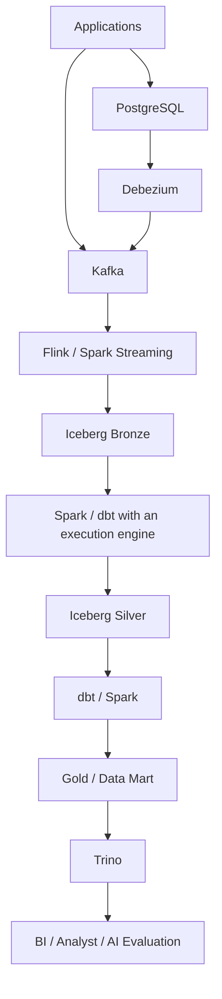

# 데이터 플랫폼 전체 구조와 역할

원문의 보충 설명과 최종 mental model을 통합했다. 아래는 구성 요소의 관계를 설명하는 학습용 구조이며 구축 완료된 시스템이나 모든 조직에 필요한 고정 설계가 아니다. 제품별 동작·제약의 근거는 연결된 주제 문서에서 확인한다.

## 데이터 경로

애플리케이션 이벤트는 Kafka로, PostgreSQL의 변경은 Debezium을 거쳐 Kafka로 전달하는 예다. Flink 또는 Spark Streaming으로 Bronze에 적재하고 Spark·dbt 변환으로 Silver와 Gold를 만든 뒤 Trino로 분석한다. dbt의 SQL은 연결된 실행 엔진에서 수행된다.

원문의 간략 그림은 Bronze 다음 Spark로 Silver를 만들고, dbt로 Gold/Data Mart를 만드는 역할 구분을 강조한다. 위 그림은 동일한 학습 구조에서 변환 도구의 조합을 표시했다. 각 도구의 연결은 호환되는 connector·catalog·실행 엔진을 선택해야 하며 이 자료에서 end-to-end로 검증하지 않았다.

## 구성 요소의 경계

| 구성 요소 | 핵심 역할 | 자세한 내용 |
|---|---|---|
| Kafka | 이벤트 전달과 내구성 있는 로그 | [Kafka](event-architecture.md) |
| S3 | Object storage | [S3](foundations.md) |
| Parquet | 분석용 columnar 파일 포맷 | [Parquet](foundations.md) |
| Iceberg | 테이블 포맷·메타데이터·snapshot | [Iceberg](lakehouse-iceberg.md) |
| Spark | 대규모 연산·배치 처리 | [Spark](spark.md) |
| Flink | 상태를 가진 실시간 처리 | [Flink](flink.md) |
| Debezium | 데이터베이스 변경 캡처 | [Debezium](cdc-debezium.md) |
| dbt | SQL 변환 관리 | [dbt](dbt.md) |
| Trino | 분산·대화형 SQL 질의 | [Trino](trino.md) |
| Airflow | 워크플로 orchestration | [Airflow](orchestration.md) |
| OpenLineage | 계보 이벤트 표준 | [OpenLineage](lineage-metadata.md) |
| Catalog | 메타데이터 검색·탐색 | [Catalog](lineage-metadata.md) |
| Governance | 정책·접근 통제·감사 | [Governance](governance.md) |
| Langfuse | AI telemetry·observability·평가 | [Langfuse](ai-ready-data.md) |

Storage, file format, table format, compute, query, transformation management, orchestration은 서로 다른 역할이다. 예를 들어 S3는 파일의 저장 위치, Parquet은 파일 표현, Iceberg는 테이블 상태 관리, Spark/Flink는 처리, Trino는 SQL 조회, dbt는 SQL 모델 관리, Airflow는 작업 의존성과 실행 순서를 담당한다.

## 횡단 관심사

| 기능 | 확인하는 질문 |
|---|---|
| Airflow | 작업을 어떤 의존성과 순서로 실행하는가? |
| Data quality | 정한 규칙을 만족하고 데이터를 신뢰할 수 있는가? |
| Data observability | 지금 최신성·양·분포·정확성에 이상이 있는가? |
| Metadata / catalog | 어떤 데이터가 있으며 무슨 뜻인가? |
| Lineage / OpenLineage | 어디서 왔고 어디로 가는가? |
| Governance | 누가 어떤 정책 아래 사용할 수 있는가? |
| Langfuse | AI 실행에서 무엇이 일어났고 품질은 어땠는가? |
| AI-ready data | AI가 통제된 조건 아래 재사용하고 실험 조건을 재구성할 수 있는가? |

## Quality와 observability

[Data quality](data-quality.md)는 not null, unique, accepted values, accuracy처럼 정한 규칙을 만족하는지 묻는다. [Data observability](data-observability.md)는 freshness, volume, schema, distribution, anomaly, alert를 통해 운영 중 변화와 이상 위치를 살핀다. Quality rule을 지속 관찰하는 관측 체계로 연결할 수 있다. Pipeline 성공만으로 데이터 정확성이 증명되지는 않는다.

## Metadata, catalog, semantic layer

Metadata는 데이터를 설명하는 정보이고 catalog는 이를 검색·탐색하는 시스템이다. Business metadata는 업무 의미를 설명한다. Semantic layer는 metric·dimension의 의미와 계산을 실제 질의에서 재사용할 수 있게 정의한다. Lineage는 생성·변환 관계, governance는 사용 정책과 그 적용을 다룬다. [계보와 메타데이터](lineage-metadata.md), [분석 모델링](analytical-modeling.md), [거버넌스](governance.md)로 이어진다.

## AI 관측과 범용 데이터 플랫폼

Langfuse 같은 도구는 trace, LLM/tool call, prompt/response, token/cost/latency, score, dataset, experiment를 다룬다. Enterprise analytics, lakehouse storage, cross-domain join, governance, 장기 이력, 통합 catalog 전체를 대체한다고 가정하지 않는다. 학습 구조에서는 AI 실행 단위 관측·평가는 Langfuse가, 장기 분석 자산은 데이터 플랫폼이 담당한다. 이것은 제품 도입을 확정한 결정이 아니다.

[AI-ready 데이터](ai-ready-data.md) · [온라인 평가](online-evaluation.md) · [학습 범위와 다음 과정](curriculum.md)
