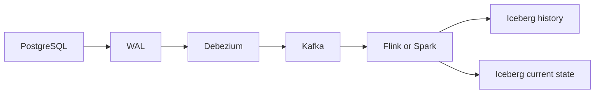

# CDC와 Debezium

이 문서는 개념 학습 기록이다. 아래 경로와 복구 절차는 설명용이며 실제 운영·장애 복구를 수행한 기록이 아니다. 제품 동작은 2026-09-24에 공식 문서와 대조했다. 실행 환경에서는 connector와 DB 버전 및 설정을 다시 확인한다.

## 변경을 전달하는 이유

CDC(Change Data Capture)는 DB의 INSERT, UPDATE, DELETE를 다른 시스템으로 전달한다. 로그 기반 CDC는 transaction log를 읽는다. PostgreSQL에서는 WAL(Write-Ahead Log)과 logical decoding을 사용한다.

Polling의 간단한 사고 실험은 다음과 같다. `last_time`은 저장한 처리 시점을 뜻하는 의사 SQL 변수다.

```sql
SELECT *
FROM orders
WHERE updated_at > last_time
```

이 방식은 반복 쿼리 부하, 삭제 감지, 변경 순서 관리, polling 간격에 따른 지연 문제가 있다. 특히 삭제된 행은 위 쿼리로 찾을 수 없다. 로그 기반 CDC는 변경 기록을 이용하지만 로그 보존과 소비 위치 관리가 필요하다.



## Connector, offset, 초기 snapshot

Debezium connector는 PostgreSQL, MySQL, SQL Server 같은 DB별 CDC reader다. Kafka Connect는 connector를 실행·관리하는 플랫폼이다. Offset은 읽은 DB 로그 위치를 기록한다. 초기 snapshot은 CDC를 시작하기 전에 존재하던 데이터를 복제한다.

목표는 `기존 데이터 + snapshot 중 변경 + 이후 변경`을 연결하는 것이다. Snapshot과 로그 위치를 연결해 snapshot 이후 변경을 이어 읽는다. 정상적으로 완료한 초기 snapshot과 유효한 offset이 있으면 보통 재시작 때 이어 읽는다. 다만 재시작이 항상 snapshot을 생략하는 것은 아니다. Snapshot 도중 실패했거나 설정된 snapshot mode가 다르면 다시 snapshot할 수 있다. [Debezium PostgreSQL connector](https://debezium.io/documentation/reference/stable/connectors/postgresql.html)

## 이벤트를 읽는 방법

| 변경 | before | after | op |
| --- | --- | --- | --- |
| INSERT | null | 새 행 | `c` |
| UPDATE | 이전 값이 제공되는 범위 | 새 행 | `u` |
| DELETE | 이전 값이 제공되는 범위 | null | `d` |
| Snapshot read | 해당 이벤트 형식 확인 | 읽은 행 | `r` |

대표 필드는 `before`, `after`, operation type, source metadata, transaction metadata다. Source metadata에는 database, schema, table, WAL position, timestamp가 들어갈 수 있다. Transaction metadata는 transaction ID와 순서 정보를 제공할 수 있으며 지원·설정을 확인해야 한다.

원문의 `before = old row`는 개념 설명이다. PostgreSQL UPDATE/DELETE의 이전 값 범위는 `REPLICA IDENTITY`와 decoding 조건에 따라 달라진다. 항상 완전한 이전 행을 얻는다고 가정하면 안 된다. [Replica identity 설명](https://debezium.io/documentation/reference/stable/connectors/postgresql.html#postgresql-replica-identity)

## 같은 key의 순서와 삭제

CDC에서 특히 중요한 것은 같은 entity/key의 변경 순서다. 예를 들어 주문 100은 `CREATED → PAID → SHIPPED` 순서로 적용해야 한다. Kafka는 partition 안의 순서를 보존하지만 여러 partition의 global order를 제공하지 않는다. 동일 primary key가 같은 partition으로 가도록 하는 설계가 도움을 준다. DB transaction 하나가 여러 table을 바꾸더라도 downstream에서는 서로 다른 partition의 여러 event가 될 수 있다.

DELETE event는 DB 삭제 사실을 담는다. Tombstone은 Kafka log compaction을 위한 `key + null value` record다. 둘을 같은 업무 이벤트로 취급하지 않는다. Downstream 정책도 구분한다.

- Physical delete: downstream 행을 실제로 지운다.
- Logical delete: `deleted = true` 같은 상태를 남긴다.
- Bronze history: 삭제 이벤트를 포함한 모든 변경을 저장한다.
- Silver current state: 현재 존재하는 행만 유지한다. 논리 삭제 모델이면 소비 쿼리의 제외 규칙도 정한다.

## Schema 변화와 Iceberg 반영

Column 추가·삭제·rename·type·nullable 변경은 `Source → Kafka → Flink/Spark → Iceberg → dbt → BI` 전체에 영향을 줄 수 있다. Nullable column 추가는 상대적으로 호환되기 쉽지만 소비자가 자동 수용한다는 보장은 없다. Type 변경, 삭제, rename은 특히 주의한다. 변경을 감지하고, compatibility를 확인하고, downstream에 반영한다.

PostgreSQL logical decoding은 DDL change event를 직접 전달하지 않는다. 따라서 CDC가 모든 DDL을 자동 통지한다고 가정하지 말고 schema 비교와 배포 절차를 함께 설계한다. [PostgreSQL connector 제약](https://debezium.io/documentation/reference/stable/connectors/postgresql.html)

History table은 주문 100의 CREATED, PAID, SHIPPED 이벤트를 모두 남긴다. Current-state table은 최신 SHIPPED 상태를 남긴다. MERGE/upsert는 새 key를 INSERT하고 기존 key를 UPDATE한다. 삭제 처리는 별도 규칙이 필요하다. 오래된 변경이 늦게 도착하면 source sequence/position을 비교해 최신 상태를 덮어쓰지 않게 한다. 비교 기준의 범위를 명시해야 하며, 서로 다른 source의 position을 하나의 전역 순서로 간주하지 않는다. Replay로 같은 이벤트를 재처리해도 결과가 같아야 한다.

## 장애 복구와 검증

정상 복구의 개념 흐름은 `Connector failure → restart → stored offset → WAL replay`다. Replay는 중복을 만들 수 있으므로 downstream idempotency가 필요하다. Offset은 처리 위치, replay는 재처리, idempotency는 중복 안전성을 뜻한다.

Offset을 잃거나 필요한 WAL이 이미 사라졌다면 재초기화 snapshot이 필요할 수 있다. Snapshot으로 현재 상태를 복구할 수 있어도 사라진 로그의 중간 변경 이력까지 복원되는 것은 아니다. 복구 전 offset, replication slot, 필요한 WAL의 가용성, snapshot mode를 확인한다. 이후 샘플 key의 순서, 중복, 삭제 반영, source/current-state 일치를 검증한다. [장애 대응 동작](https://debezium.io/documentation/reference/stable/connectors/postgresql.html#postgresql-when-things-go-wrong)

## LLM 활용: 재처리 후 상태 역전 조사

상황: replay 이후 SHIPPED 주문이 PAID로 되돌아갔다. 제공할 맥락은 익명화한 같은 key의 event 순서·source position, offset, 적용 SQL, connector 설정이다.

```text
Review this CDC replay example. Separate observations from hypotheses.
Check event order, source positions, duplicate handling, and delete handling.
List missing evidence and the smallest tests before proposing a fix.
Do not assume all before fields are complete or all positions are globally ordered.
```

기대 결과는 원인 후보와 확인 순서다. LLM은 timestamp만으로 순서를 정하거나 `MERGE`만으로 멱등성이 완성된다고 오해할 수 있다. 실제 event와 설정을 대조하고 중복·역순·삭제 이벤트를 넣은 제한된 재현으로 검증한다. 여기서는 해당 재현을 실행하지 않았다.

[오케스트레이션](orchestration.md) · [dbt](dbt.md) · [핸드북 홈](../index.md)
