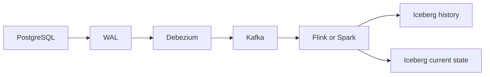

# Chapter 6 — CDC / Debezium

이 문서는 개념 학습 기록이다. 아래 경로와 복구 절차는 설명용이며 실제 운영·장애 복구를 수행한 기록이 아니다. 제품 동작은 2026-09-24에 공식 문서와 대조했다. 실행 환경에서는 connector와 DB 버전 및 설정을 다시 확인한다.

본문은 제공된 원문의 번호·문단·목록·예시·순서를 그대로 보존했다. 원문의 단순화된 설명에 필요한 조건과 기존 추가 설명은 뒤의 **적용 시 보완할 점**에서 구분한다.

**본문 안내:** 아래 원문 구역은 원래 순서와 형태를 보존한 본문이다. 원문의 단순화된 설명에 대한 정정·적용 조건과 추가 설명은 문서 뒤 보완 구역에서 해당 절 번호와 함께 확인한다.

<!-- SOURCE CORE START -->
## 6.1 CDC Fundamentals

CDC = Change Data Capture.

목적:

> **DB의 INSERT / UPDATE / DELETE 변경을 지속적으로 다른 시스템에 전달**

Polling 방식:

```sql
SELECT *
FROM orders
WHERE updated_at > last_time
```

문제:

- DB Query 부하
- DELETE 감지 어려움
- 변경 순서 관리 어려움
- 실시간성 제한

CDC는 DB Transaction Log를 읽는다.

PostgreSQL:

```text
WAL
Write-Ahead Log
```

구조:

```text
PostgreSQL
 ↓
WAL
 ↓
Debezium
 ↓
Kafka
```

---

## 6.2 Debezium Architecture

### Debezium Connector

DB별 CDC Reader.

예:
- PostgreSQL
- MySQL
- SQL Server

### Kafka Connect

Connector 실행/관리 Platform.

### Offset

DB Log를 어디까지 읽었는지 기억.

### Snapshot

CDC 시작 전에 이미 존재하던 데이터를 초기 복제.

---

## 6.3 Initial Snapshot

처음 CDC를 시작하면 기존 데이터가 이미 존재한다.

```text
Existing Table
 ↓
Initial Snapshot
 ↓
WAL Streaming CDC
```

Snapshot 동안에도 변경이 발생할 수 있으므로 WAL 위치를 관리해 Snapshot 이후 변경을 이어서 읽는다.

목표:

```text
기존 데이터
+
Snapshot 중 변경
+
이후 변경
```

을 모두 놓치지 않는 것.

Connector Restart 때마다 전체 Snapshot을 다시 하는 것은 아니다.

Offset이 있으면 이어서 읽는다.

---

## 6.4 CDC Event Structure

대표 정보:

- before
- after
- operation type
- source metadata
- transaction metadata

### INSERT

```text
before = null
after = new row
```

### UPDATE

```text
before = old row
after  = new row
```

### DELETE

```text
before = old row
after = null
```

Operation 예:

- c: create
- u: update
- d: delete
- r: snapshot read

Source Metadata:

- database
- schema
- table
- WAL position
- timestamp

Transaction Metadata:

- transaction id
- order information

---

## 6.5 Ordering

핵심:

> **CDC에서는 global ordering보다 같은 entity/key의 변경 순서가 중요하다.**

Kafka는 Partition 내부 Ordering은 유지하지만 Partition 간 global order는 보장하지 않는다.

같은 Primary Key를 같은 Partition으로 보내면 같은 entity의 순서를 유지하기 쉽다.

```text
order 100:
CREATED
→ PAID
→ SHIPPED
```

DB Transaction 하나에서 여러 Table 변경이 발생하더라도 Kafka에서는 여러 Event가 되어 서로 다른 Partition으로 갈 수 있다.

---

## 6.6 Deletes

### DELETE Event

실제 DB 삭제를 표현.

### Tombstone

Kafka Log Compaction에서 특정 key가 삭제되었음을 표현하는 `key + null value` record.

DELETE Event와 Tombstone은 목적이 다르다.

### Physical Delete

Downstream에서도 실제 삭제.

### Logical Delete

```text
deleted = true
```

같이 상태로 보존.

### History vs Current State

```text
Bronze History
→ 삭제 Event 포함 모든 변경 보존

Silver Current State
→ 현재 존재하는 row만 유지
```

---

## 6.7 Schema Changes

Source DB Schema는 바뀔 수 있다.

예:

- Column 추가
- Column 삭제
- Rename
- Type 변경
- Nullable 변경

상대적으로 안전한 변경:

```text
nullable column 추가
```

위험한 변경:

```text
type 변경
column 삭제
rename
```

CDC에서는 Schema Change가:

```text
Source
→ Kafka
→ Flink/Spark
→ Iceberg
→ dbt
→ BI
```

전체에 영향을 줄 수 있다.

따라서:

```text
감지
→ Compatibility 확인
→ downstream 반영
```

이 중요하다.

---

## 6.8 CDC → Iceberg

대표 구조:

```text
PostgreSQL
 ↓
Debezium
 ↓
Kafka
 ↓
Flink / Spark
 ↓
Iceberg
```

### History Table

모든 변경 Event를 저장.

```text
order 100 CREATED
order 100 PAID
order 100 SHIPPED
```

### Current-State Table

최신 상태만 유지.

```text
order 100 SHIPPED
```

### MERGE / Upsert

```text
new row
→ INSERT

existing row
→ UPDATE
```

### Late Change

오래된 변경이 최신 상태를 덮어쓰지 않도록 sequence/source position 등을 고려해야 한다.

### Idempotency

Replay로 같은 CDC Event가 다시 와도 결과가 깨지지 않아야 한다.

---

## 6.9 CDC Failure Recovery

정상적인 복구:

```text
Connector Failure
 ↓
Restart
 ↓
Stored Offset
 ↓
WAL Replay
```

Replay 때문에 Duplicate가 발생할 수 있다.

따라서 Downstream은 Idempotent해야 한다.

Offset을 잃거나 필요한 WAL이 이미 삭제됐다면 새 Snapshot이 필요할 수 있다.

핵심:

```text
Offset
→ 처리 위치

Replay
→ 다시 처리

Idempotency
→ 중복 안전성

Snapshot Recovery
→ 복구 불가능 시 재초기화
```

---

<!-- SOURCE CORE END -->

## 적용 시 보완할 점

### 기존 흐름도


```mermaid
flowchart LR
  P[PostgreSQL] --> W[WAL]
  W --> D[Debezium]
  D --> K[Kafka]
  K --> C[Flink or Spark]
  C --> H[Iceberg history]
  C --> S[Iceberg current state]
```

### 원문 6.1~6.4의 설명 범위

CDC에는 여러 접근이 있으며, 원문의 transaction log 설명은 로그 기반 CDC에 해당한다. PostgreSQL에서는 WAL과 logical decoding을 사용한다. 로그 보존과 소비 위치 관리가 필요하다.

Polling SQL의 `last_time`은 저장한 처리 시점을 뜻하는 의사 변수다. 삭제된 행은 이 쿼리로 찾을 수 없다. Polling 간격에 따른 지연도 생긴다.

Snapshot read(`r`)는 읽은 행을 전달한다. `before` 등 세부 필드는 실제 이벤트 형식을 확인한다.

### Snapshot과 이전 행의 조건

정상적으로 완료한 초기 snapshot과 유효한 offset이 있으면 보통 재시작 때 이어 읽는다. Snapshot 도중 실패했거나 snapshot mode가 다르면 다시 snapshot할 수 있다. [Debezium PostgreSQL connector](https://debezium.io/documentation/reference/stable/connectors/postgresql.html)

이벤트의 `before = old row`는 개념 설명이다. PostgreSQL UPDATE/DELETE의 이전 값 범위는 `REPLICA IDENTITY`와 decoding 조건에 따라 달라진다. 항상 완전한 이전 행을 얻는다고 가정하면 안 된다. Transaction metadata의 지원·설정도 확인한다. [Replica identity 설명](https://debezium.io/documentation/reference/stable/connectors/postgresql.html#postgresql-replica-identity)

### Schema와 현재 상태 적용

Nullable column 추가도 소비자가 자동 수용한다는 보장은 없다. PostgreSQL logical decoding은 DDL change event를 직접 전달하지 않는다. Schema 비교와 배포 절차를 함께 설계한다. [PostgreSQL connector 제약](https://debezium.io/documentation/reference/stable/connectors/postgresql.html)

MERGE/upsert의 INSERT·UPDATE와 삭제 처리는 구분한다. 논리 삭제 모델이면 소비 쿼리의 제외 규칙도 정한다. Late change를 판별할 source sequence/position의 비교 범위를 명시한다. 서로 다른 source의 position을 하나의 전역 순서로 간주하지 않는다.

### 복구 전후 확인

Snapshot으로 현재 상태를 복구할 수 있어도 사라진 로그의 중간 변경 이력까지 복원되는 것은 아니다.

- 복구 전: offset, replication slot, 필요한 WAL의 가용성, snapshot mode를 확인한다.
- 복구 후: 샘플 key의 순서, 중복, 삭제 반영, source/current-state 일치를 검증한다.

[장애 대응 동작](https://debezium.io/documentation/reference/stable/connectors/postgresql.html#postgresql-when-things-go-wrong)

## LLM 활용: 재처리 후 상태 역전 조사

상황: replay 이후 SHIPPED 주문이 PAID로 되돌아갔다. 제공할 맥락은 익명화한 같은 key의 event 순서·source position, offset, 적용 SQL, connector 설정이다.

=== "한국어"

    ```text {.prompt}
    [맥락]
    같은 key의 익명화한 event·source position: [샘플]
    Offset·적용 SQL·connector 설정: [맥락]

    [요청]
    이 CDC replay 예시를 검토하고 관찰과 가설을 구분해 주세요.
    Event 순서·source position·중복 처리·삭제 처리를 확인해 주세요.
    수정안을 제안하기 전에 부족한 근거와 가장 작은 테스트를 나열해 주세요.
    모든 before 필드가 완전하거나 모든 position이 전역 순서를 갖는다고 가정하지 말아 주세요.

    [출력]
    원인 후보와 각 후보의 확인 순서를 주세요.

    [검증]
    가상 중복·역순·삭제 event와 실제 설정으로 가설을 검증해 주세요.
    ```

=== "English"

    ```text {.prompt}
    [Context]
    Anonymized events and source positions for one key: [sample]
    Offsets, write SQL, and connector settings: [context]

    [Task]
    Review this CDC replay example. Separate observations from hypotheses.
    Check event order, source positions, duplicate handling, and delete handling.
    List missing evidence and the smallest tests before proposing a fix.
    Do not assume all before fields are complete or all positions are globally ordered.

    [Output]
    Return possible causes and checks for each one.

    [Checks]
    Validate hypotheses with synthetic duplicate, reversed, and delete events and actual settings.
    ```

기대 결과는 원인 후보와 확인 순서다. LLM은 timestamp만으로 순서를 정하거나 `MERGE`만으로 멱등성이 완성된다고 오해할 수 있다. 실제 event와 설정을 대조하고 중복·역순·삭제 이벤트를 넣은 제한된 재현으로 검증한다. 여기서는 해당 재현을 실행하지 않았다.

[오케스트레이션](orchestration.md) · [dbt](dbt.md) · [핸드북 홈](../index.md)

[관련 실무 프롬프트 6개](../prompts/cdc-debezium.md)
