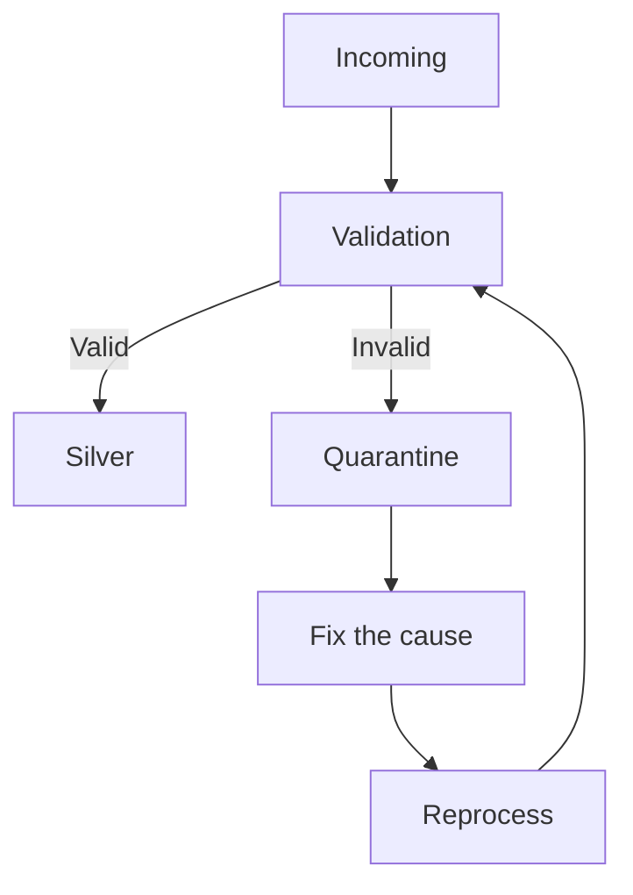

# 데이터 품질 엔지니어링

이 문서는 데이터 품질의 개념과 가상 운영 예시를 학습한 Learn 문서다. 실제 시스템 구축이나 장애 대응을 수행했다는 뜻은 아니다. 품질은 “데이터를 믿고 사용할 수 있는가?”라는 질문이며, 서비스가 응답해도 결과가 틀리면 데이터 장애다.

## 품질을 보는 일곱 차원

하나의 정상 지표가 다른 모든 차원을 보장하지 않는다. 다음은 가상의 `fact_llm_call` 테이블에 적용한 질문이다.

| 차원 | 확인할 내용 | AI 호출 데이터 예시 |
| --- | --- | --- |
| Completeness, 완전성 | 필요한 값이 빠지지 않았는가 | `model_id`가 NULL인가 |
| Uniqueness, 유일성 | 유일해야 할 값이 중복되지 않는가 | `llm_call_id`가 중복되는가 |
| Validity, 유효성 | 형식과 허용 범위를 지키는가 | latency가 음수인가 |
| Consistency, 일관성 | 관련 데이터와 모순되지 않는가 | `model_id`가 `dim_model`에 존재하는가 |
| Freshness, 최신성 | 필요한 시간 안에 도착했는가 | 최근 이벤트가 5분 이내인가 |
| Accuracy, 정확성 | 실제 세계의 값과 맞는가 | 기록한 cost가 billing과 일치하는가 |
| Volume, 데이터 양 | 건수가 예상 범위인가 | 호출량이 급증하거나 급감했는가 |

5분은 학습용 예시이며 모든 데이터의 기본 목표가 아니다. 값이 형식에 맞는다는 사실만으로 실제 청구 금액까지 정확하다고 판단하면 안 된다.

## 검증 계층

| 계층 | 주요 검사 | 검사 목적 |
| --- | --- | --- |
| Ingestion | schema, format, required field, parsing | 입력을 읽을 수 있고 약속한 형태인가 |
| Silver | deduplication, relationships, business rules, valid values | 정리된 데이터의 논리가 맞는가 |
| Gold | KPI, freshness, aggregate consistency, expected volume | 최종 비즈니스 결과를 신뢰할 수 있는가 |

초기는 형식, 중간은 데이터 논리, 최종은 비즈니스 결과에 초점을 둔다. 앞 계층을 통과했다는 이유만으로 뒤 계층의 검사를 생략하지 않는다.

## 잘못된 레코드 격리

Quarantine은 잘못된 데이터를 조용히 버리는 대신 별도 경로에 보관해 진단과 재처리를 가능하게 한다.



격리 항목에는 raw payload, error type, error message, received time을 기록할 수 있다. 원인을 수정한 뒤 검증 경로로 다시 처리한다. 격리 건수와 오류 사유별 추이를 함께 감시해야 한다. 계속 쌓이기만 하는 격리는 복구 절차가 아니다.

운영 설계 시 raw payload와 오류 메시지도 민감정보를 포함할 수 있는 데이터로 분류한다. 보관 범위와 접근 권한은 [거버넌스 정책](governance.md)과 함께 정한다. 이 문서에는 실제 payload가 없다.

## dbt 검사와 전용 도구

`not_null`, `unique`, `relationships`, `accepted_values`는 모델과 테이블의 값에 선언한 조건을 확인하는 기본 검사다. 자료의 “정적 검증”은 고정된 규칙이라는 뜻으로 이해해야 한다. dbt data test는 실제 데이터에 SQL을 실행하며, 단순한 코드 정적 분석이 아니다. 사용자 정의 SQL 검사로 비즈니스 규칙도 표현할 수 있다. [dbt data tests](https://docs.getdbt.com/docs/build/data-tests)

기본 네 가지 검사만으로 volume anomaly, distribution drift, freshness anomaly를 모두 해결하지 못한다. 다만 dbt가 최신성을 전혀 검사하지 못한다는 뜻도 아니다. source freshness는 별도의 기능이며, 통계적 이상 탐지에는 이력과 기준선 설계가 추가로 필요하다. [dbt source freshness](https://docs.getdbt.com/docs/deploy/source-freshness)

| 도구 | 학습한 역할 | 확인할 경계 |
| --- | --- | --- |
| Soda | rule/check 중심 자동 검사 | 규칙과 연결된 데이터 소스의 지원 범위 |
| Great Expectations | expectation으로 기대 조건을 표현하고 검증 | 실행 환경과 데이터 연결 방식 |
| Deequ | Spark 기반 대규모 데이터 품질 검사 | Spark와 해당 라이브러리 버전 호환성 |

세 도구의 기능은 겹친다. 여기서는 범주를 이해하며, 특정 도구의 구현이나 우열을 검증했다고 주장하지 않는다. 제품 설명은 2026-09-24에 공식 문서를 확인했다. [SodaCL v3](https://docs.soda.io/soda-documentation/soda-v3/sodacl-reference/metrics-and-checks), [GX Core](https://docs.greatexpectations.io/docs/core/define_expectations/), [Deequ](https://github.com/awslabs/deequ)

## 품질 SLI와 SLO

SLI는 실제 측정값이고 SLO는 목표 수준이다. 가상의 목표는 다음과 같다.

```text
Freshness < 5 min
Completeness > 99.9%
Duplicate Rate < 0.01%
```

데이터셋마다 업무 요구가 다르다. 실시간 대시보드와 월간 보고서는 서로 다른 freshness 목표가 필요하다. 운영에 적용할 때는 시간 기준, 측정 구간, 분모, 대상 데이터셋을 명시해야 한다. 이 수치는 실측 결과나 승인된 운영 기준이 아니다.

## 데이터 장애 대응

1. **Detect:** SLO 위반을 감지한다.
2. **Contain:** 잘못된 데이터가 downstream으로 퍼지는 것을 차단한다.
3. **Fix:** 근본 원인을 수정한다.
4. **Reprocess:** 영향을 받은 범위를 backfill 또는 replay한다.
5. **Verify:** 품질 검사를 다시 수행하고 사용을 재개한다.

가용한 서비스도 잘못된 데이터를 제공할 수 있다. 따라서 job 성공만으로 복구를 종료하지 않는다. 재처리 범위, 중복 가능성, downstream 결과를 확인한다. [데이터 관측성](data-observability.md)은 지속적인 상태 측정을, [lineage](lineage-metadata.md)는 영향 경로 확인을 돕는다.

## LLM in Practice: 품질 장애의 검사 순서 검토

**상황:** 작업은 성공했으나 가상의 호출 테이블에 중복이 증가했다.

**LLM에 제공할 맥락:** 개인정보를 제거한 스키마, 이벤트 키, 배치 구간, retry/replay 이력, 중복률, 관련 SLO, downstream 목록을 제공한다.

**예시 프롬프트:**

=== "한국어"

    ```text {.prompt}
    [맥락]
    작업은 성공했지만 llm_call_id 중복이 늘었습니다.
    스키마·이벤트 키·배치 구간: [비식별 정의]
    retry·replay 이력과 중복률: [측정과 로그]
    SLO와 downstream 데이터셋: [목록]
    [요청]
    재설계를 제안하기 전에 이 데이터 장애를 검토하세요.
    관찰·가정·가설·누락 근거를 구분하세요.
    [출력]
    전파 차단 선택지와 다음 확인 순서를 주세요.
    안전한 재처리 범위와 downstream 재개 전 품질 검사를 주세요.
    [검증]
    키 정의·로그·재처리 구간·전후 품질·downstream 집계로 확인하세요.
    가설을 운영 승인으로 취급하거나 실제 조치를 실행하지 마세요.
    ```

=== "English"

    ```text {.prompt}
    [Context]
    The job succeeded, but duplicate llm_call_id values increased.
    Schema, event key, and batch window: [sanitized definitions]
    Retry and replay history and duplicate rate: [measurements and logs]
    SLOs and downstream datasets: [list]
    [Task]
    Review this data incident before proposing a redesign.
    Separate observations, assumptions, hypotheses, and missing evidence.
    [Output]
    Give containment options and the next checks.
    Give a safe reprocessing scope and quality checks before downstream use resumes.
    [Checks]
    Check key definitions, logs, replay windows, quality changes, and downstream totals.
    Do not treat hypotheses as approval or execute operational actions.
    ```

**기대 결과:** 원인 가설, 우선 확인할 증거, 전파 차단 선택지, 재처리와 재개 조건을 구분한 점검안이다.

**틀릴 수 있는 부분:** retry와 중복의 상관관계를 원인으로 확정하거나 deduplication 키와 grain을 잘못 가정할 수 있다.

**검증 방법:** 실제 키 정의, 로그, 재처리 구간, 전후 품질 측정값과 downstream 집계를 확인한다. LLM 출력은 가설이며 운영 승인을 대신하지 않는다.

[핸드북 홈](../index.md)

[더 많은 실무 프롬프트](../prompts/data-quality.md)
