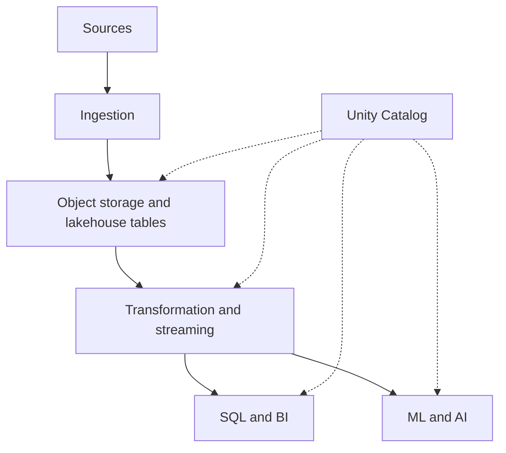

# Databricks: 통합 Lakehouse와 운영 경계

문서 유형: Learn. 제공된 17장의 개념 학습을 정리했다. `studied`는 실제 구축·운영 경험을 뜻하지 않는다. 예시는 가상이며 실행하지 않았다. 제품 범위는 2026-09-26 공식 문서로 확인했으며, 클라우드·리전·Runtime·접근 모드·테이블 기능에 따라 달라진다.

## 17.1 Lakehouse Architecture

Databricks는 개별적으로 운영하던 데이터 엔지니어링, SQL, 거버넌스, ML, AI 기능을 한 데이터 기반에 통합하는 관리형 플랫폼이다. 자체 운영의 `Kafka → Flink → Iceberg → Spark → dbt → Trino → BI`와 주변 Airflow·Catalog·Lineage·Governance·MLflow 역할 중 여러 부분을 묶는다. 모든 역할을 없애는 것은 아니다.



Storage는 S3 같은 클라우드 object storage이고 Compute는 Databricks가 제공한다. Delta 중심의 역사를 가지며 Iceberg도 지원한다. Runtime은 Spark 기반이며 Photon 실행 엔진을 함께 사용한다. Medallion은 **Bronze 원본 → Silver 정제·검증·조인 → Gold 비즈니스 fact·dimension·mart**의 책임 분리다. 도구를 켜는 것만으로 각 계층의 품질이 보장되지는 않는다. 기본 구조는 [Lakehouse와 Iceberg](lakehouse-iceberg.md)를 참고한다.

## 17.2 Databricks Runtime과 Photon

Runtime은 Spark에 실행 환경, 최적화, 라이브러리, 커넥터, 플랫폼 통합을 묶는다. 자체 Spark의 JVM/Python, 라이브러리, 커넥터, 클러스터 설정, 성능 튜닝 책임 중 일부를 관리형 환경으로 옮긴다. Runtime 버전은 Spark·JDK·라이브러리와 동작 변경을 포함하므로 운영 업그레이드는 호환성 검증과 함께 계획한다.

`SQL/DataFrame → Catalyst 계획 → 지원 연산의 Photon 실행`으로 이해할 수 있다. Photon은 scan, filter, join, aggregation, shuffle, Parquet 처리 등 지원되는 연산을 위한 native vectorized 실행 계층이다. Spark의 API·계획·분산 실행 프레임워크 전체를 대체하지 않는다. 실제 적용 여부와 지원 밖 연산은 실행 계획으로 확인한다. [Photon 공식 범위](https://docs.databricks.com/aws/en/compute/photon).

## 17.3 SQL Warehouses

SQL Warehouse는 테이블 저장소가 아니라 ad-hoc SQL, BI, dashboard, reporting, 분석가 탐색, SQL 변환을 위한 Compute다. `Delta/Iceberg 테이블 → SQL Warehouse → 분석가/BI`로 연결하며, 열린 구조의 [Trino](trino.md)와 역할을 비교할 수 있다.

Serverless SQL은 부하에 따른 Compute 확장·축소와 클러스터 운영 부담 감소를 제공한다. 동시 사용자 요구와 실제 대기 시간을 측정해 크기·설정을 선택한다. 쿼리는 Unity Catalog 거버넌스와 연결된다. Metric Views는 중앙 지표 정의, dimension, 일관된 비즈니스 의미를 다루는 semantic layer 영역이다. 기능별 지원 조건은 [Databricks SQL](https://docs.databricks.com/aws/en/sql/)과 [Metric Views](https://docs.databricks.com/aws/en/metric-views/)에서 확인한다.

## 17.4 Unity Catalog

Unity Catalog는 데이터와 AI 자산의 통합 거버넌스 계층이다. 계층은 `Metastore → Catalog → Schema → Object`, 테이블 이름은 `catalog.schema.table`이다. 가상 예시 `production.ai.fact_llm_call`은 실제 조직 이름이 아니다.

| 객체/구분 | 책임과 예시 |
|---|---|
| Tables, Views, Functions, Models | 표 데이터, 조회 정의, 함수, 모델 등 관리 |
| Volumes | PDF, 이미지, JSON, 문서, 아티팩트처럼 파일 단위 자산 관리 |
| RAG 배치 예시 | 원문 PDF는 Volume, chunk와 embedding은 Table |
| Managed Table | UC가 metadata, 저장 위치, 수명주기와 지원되는 최적화 관리 |
| External Table | 사용자가 관리하는 object 경로에 데이터, UC는 등록된 metadata와 접근 제어 관리 |

권한은 catalog, schema, table, view, volume, model 등 securable object에 부여한다. 계층에 따라 권한 상속이 가능하지만 모든 권한·정책의 상속을 같다고 가정하지 않는다. **외부 경로에 직접 접근한 읽기·쓰기는 UC 정책만으로 보호되지 않는다.** 클라우드 IAM과 외부 엔진 경로도 점검한다. [Unity Catalog](https://docs.databricks.com/aws/en/data-governance/unity-catalog/), [외부 접근 경계](https://docs.databricks.com/aws/en/external-access).

## 17.5 Lakeflow Jobs

Lakeflow Job은 Airflow DAG와 비슷하게 task, dependency, schedule/trigger를 정의한다. Notebook, SQL, dbt, pipeline, Python/Spark, ML 작업을 구성할 수 있다. 시간, 파일 도착, 테이블 업데이트, 연속 실행 등의 트리거는 작업 종류와 지원 조건에 맞춰 선택한다. [Lakeflow Jobs](https://docs.databricks.com/aws/en/jobs/).

Databricks 내부 작업이 대부분이면 별도 Airflow를 줄일 수 있다. Databricks, AWS Lambda, Kubernetes, Snowflake, SaaS API, 내부 시스템을 함께 조정한다면 [범용 orchestration](orchestration.md)이 여전히 유용하다. 이름이 비슷하다고 DAG 기능, 재시도, backfill 의미가 모두 같은 것은 아니다.

## 17.6 Lakeflow Pipelines

Lakeflow의 역할은 **Connect 수집 / Pipelines 변환 / Jobs 실행 순서**로 나눈다. 원문의 Lakeflow Pipelines와 과거 Delta Live Tables(DLT)는 현재 공식 문서의 Spark Declarative Pipelines 계열과 연결해서 읽는다. 문서·환경에 따라 Lakeflow Spark Declarative Pipelines 명칭도 보인다. [현재 Pipelines 문서](https://docs.databricks.com/aws/en/ldp/), [Lakeflow Connect](https://docs.databricks.com/aws/en/ingestion/lakeflow-connect).

절차형은 “Bronze notebook 실행 → Silver notebook 실행 → Gold SQL 실행”을 지정한다. 선언형은 `bronze_events → silver_events → gold_metrics`의 데이터셋 관계를 정의한다. 엔진은 의존성, 증분 갱신, 실행 순서, 병렬화, 모니터링의 더 많은 부분을 관리한다. 주요 객체는 Pipeline, Flow, Streaming Table, Materialized View다. 배치와 스트리밍을 다루며 Spark Structured Streaming과 연결된다. 선언형이라고 모든 쿼리가 항상 증분 실행되거나 아무 설정 없이 목표 신선도를 만족하는 것은 아니다.

## 17.7 Delta / Iceberg 상호운용

Delta와 Iceberg는 object storage·Parquet 위의 table metadata로 transaction, snapshot, schema evolution, time travel, table management를 제공한다. **Delta와 Iceberg는 다른 포맷이다.** Databricks 중심 작업에는 Delta가 자연스러운 선택일 수 있고 다중 엔진에는 Iceberg가 후보지만, 실제 reader/writer 조합으로 검증해야 한다.

| 방식 | 의미 | 확인할 경계 |
|---|---|---|
| UC managed Iceberg | UC가 관리하는 Iceberg 테이블과 Parquet | 지원 기능, table version, 외부 writer |
| Delta UniForm / Iceberg reads | 같은 Parquet에 Delta metadata와 호환 Iceberg metadata 제공 | Delta가 원본 포맷; 읽기 호환을 임의의 Iceberg 쓰기 허용으로 해석하지 않기 |
| Iceberg REST Catalog | Spark/Flink/Trino 등과 catalog 인터페이스 연결 | 클라이언트·인증·권한·읽기/쓰기·table feature별 지원 |

UniForm의 Iceberg metadata 생성은 비동기다. 원본 Delta commit과 Iceberg에서 보이는 버전이 같거나 즉시 갱신된다고 가정하지 않는다. metadata 생성 상태와 외부 읽기 신선도를 확인한다. 포맷·스토리지·카탈로그·거버넌스 통합은 각각 별도 축이다. [Iceberg reads](https://docs.databricks.com/aws/en/delta/iceberg-reads), [외부 시스템 접근](https://docs.databricks.com/aws/en/external-access), [Iceberg REST 명세](https://iceberg.apache.org/rest-catalog-spec/).

## 17.8 Lineage와 Governance

예시 계보는 `bronze.llm_calls → Spark → silver.llm_calls → SQL/dbt → gold.ai_usage → Dashboard`다. 열 수준 lineage는 변경 영향 분석을 돕는다. 분류 예시는 `email → PII`, `employee_id → Sensitive Internal`이다. 실제 값은 수집하거나 공개하지 않는다.

UC는 lineage, classification, access control, masking, row filters, audit를 연결한다. RBAC는 역할에 권한을 연결하고 ABAC는 속성·태그에 정책을 연결한다. 예를 들어 PII 태그를 일반 분석가에게 마스킹하고 별도 승인된 보안 역할에만 원문을 허용할 수 있다. **태그만 붙여서는 마스킹이 생기지 않는다.** 정책 설정과 사용자별 허용/거부 테스트가 필요하다.

외부 자산 lineage와 모델·모델 서비스·agent·AI 서비스까지 범위가 확장되지만, 수집되는 계보와 적용되는 정책의 경계는 통합별로 확인한다. [UC 거버넌스 범위](https://docs.databricks.com/aws/en/data-governance/unity-catalog/). 원칙은 [Governance](governance.md), 계보는 [Lineage와 Metadata](lineage-metadata.md)를 참고한다.

## 17.9 MLflow

MLflow는 전통적인 ML과 GenAI/agent를 함께 다룬다. Experiment Run은 parameters, metrics, code version, artifacts를 연결한다. Model Registry는 model name, version, alias, tags, lineage를 관리하며 Databricks에서는 UC와 통합한다.

`User → Agent → Retriever → LLM → Tool → Response` trace에 input/output, latency, tokens, cost, tool calls, retrieval을 연결할 수 있다. Evaluation datasets, scorers, LLM judges, custom rules, Prompt Registry의 prompt version, human feedback/review도 평가에 연결한다. 수집 범위·비용 필드의 가용성과 민감정보 처리는 실제 instrumentation으로 확인한다. [MLflow on Databricks](https://docs.databricks.com/aws/en/mlflow/).

원문의 MLflow 3와 Langfuse 비교는 tracing, tool/retrieval 추적, prompt management, evaluation, judge, human feedback, experiments에서 **기능 영역이 겹친다**는 의미다. 동일한 동작·UI·보존·운영 모델을 보장하지 않는다. MLflow는 전통 ML과 Model Registry가 중심 영역이고 Databricks UC와 native 통합한다. Langfuse는 LLM 중심이며 전통 ML registry가 주목적은 아니다. 원문의 UC 연동 비교에서 Langfuse는 외부 통합 경로다. Databricks가 중심이라면 중복 플랫폼을 줄일 후보지만 실제 필수 기능을 먼저 대조한다.

## 17.10 AI / Vector 기능

통합 흐름은 `Lakehouse → AI Search → Model/Agent → Serving → Application`이다. RAG는 `문서 → chunking → embeddings → AI Search → retriever → LLM`으로 이어진다. AI Search는 이전 Vector Search의 현재 명칭이다. 지원 소스의 동기화형 인덱스와 직접 갱신형 인덱스의 차이를 확인한다. 모든 인덱스가 자동 갱신되는 것은 아니다. 지원되는 동기화형 인덱스는 source 변경을 증분 반영할 수 있지만 endpoint 종류에 따라 일부 재구축이 필요할 수 있다. [AI Search](https://docs.databricks.com/aws/en/ai-search/ai-search).

Model Serving은 custom model, foundation model, external provider를 관리형 endpoint로 연결할 수 있다. Agent는 LLM, AI Search, SQL tool, MCP, external API를 조합한다. UC는 governance, MLflow는 trace/evaluation, Lakehouse는 data, AI Search는 retrieval, Serving은 inference 역할을 맡는다.

**권한 없는 문서를 검색한 뒤 화면에서 숨기는 방식은 안전하지 않다.** 검색 전에 접근을 제한해야 한다. 확인한 AI Search 공식 문서는 row/column permissions를 지원하지 않으며 filter API로 애플리케이션 ACL을 구현할 수 있다고 명시한다. UC 통합을 원본 row policy의 자동 전파로 가정하지 않는다. 서버가 신뢰하는 사용자·권한 정보로 필터를 구성하고 우회·권한 없는 문서·권한 변경을 테스트한다. [AI Search limitations](https://docs.databricks.com/aws/en/ai-search/ai-search#limitations).

## 17.11 Databricks 비용 모델

DBU는 compute/service 사용을 나타내는 정규화된 과금 단위이며 고정 CPU 개수가 아니다. Classic은 개념적으로 **DBU + cloud VM + storage/network**다. Serverless는 인프라 운영을 옮기지만 외부 storage/network 비용이 남을 수 있다. Spark Jobs, SQL Warehouse, Pipelines, Serverless, Model Serving, AI Search, storage, network, background optimization을 모두 비용 범위에 넣는다.

Pruning은 scan을 줄이고, compaction은 읽기 효율을 높이며, incremental processing은 전체 재계산을 피할 수 있다. 실행 시간 감소가 실제 청구 감소로 이어지는지는 과금 단위·상시 자원·유지보수 비용까지 확인한다. `team / project / environment / job / workspace` 태그로 배분한다. Serverless의 운영 편의·시작 시간·확장·idle 감소가 항상 더 저렴함을 뜻하지 않는다. 단가를 고정하지 말고 실제 workload와 [비용 관리](https://docs.databricks.com/aws/en/admin/account-settings/usage)를 확인한다.

## 17.12 자체 운영 구성요소를 어디까지 대체하는가

| 기존 책임 | 통합 후보 | 판단 |
|---|---|---|
| Spark cluster | Runtime / Serverless | 높은 통합 가능성 |
| Trino 역할의 BI serving | SQL Warehouse | SQL·동시성·connector 요구 확인 |
| 자체 Spark pipeline framework | Pipelines | 지원 변환·실패 복구 확인 |
| Catalog / Governance | Unity Catalog | 외부 접근 정책 경계 확인 |
| OpenLineage / Marquez 형태의 내부 계보 | UC Lineage | 외부 시스템 계보는 별도 검토 |
| 자체 MLflow | Managed MLflow | 저장·인증·기능 차이 검토 |
| Databricks 중심 RAG Vector DB | AI Search | 검색 품질·권한·동기화 요구 확인 |
| Airflow | Jobs로 부분 대체 | 범용 cross-platform 조정은 남을 수 있음 |
| Langfuse | MLflow 기능 중첩 | 필수 trace/evaluation 기능별 비교 |
| dbt | SQL / Pipelines와 일부 중첩 | dbt 자체도 유효한 선택 |
| Kafka | 보통 별도 유지 | durable event log / event bus |
| Flink | 필요하면 유지 | 저지연·복잡한 stateful streaming |

S3·테이블·엔진·오케스트레이션·catalog·lineage·MLflow·검색·AI 관측을 각각 설치, 업그레이드, 통합, 보안, 모니터링할 부담을 줄이는 것이 가치다. 운영 복잡도 감소와 통합 속도 이점은 플랫폼 의존성·lock-in·비용 증가 가능성과 함께 판단한다. [플랫폼 비교](platform-comparison.md)에서 전체 선택을 다룬다.

## LLM in Practice

### 관리형 전환 범위 검토

**상황:** 가상의 Spark·Trino·Airflow·RAG 검색 구성을 Databricks로 통합할지 검토한다.

**LLM에 제공할 맥락:** 비식별 workload 목록, latency/freshness SLO, DAG 외부 의존성, table format와 reader/writer 버전, 사용자별 검색 권한, 비용·운영시간을 제공한다.

**예시 프롬프트:**

=== "한국어"

    ```text {.prompt}
    [맥락]
    구성: [workload 목록과 외부 의존성]
    제약: [SLO, reader/writer 버전, 검색 권한, 비용과 운영시간]
    [요청]
    먼저 현 구조의 책임과 실제 문제를 평가하라.
    Databricks로 유지 또는 이관할 범위를 근거와 함께 비교하라.
    Kafka/Flink 잔존, 외부 catalog 접근, 검색 전 ACL을 별도로 검토하라.
    [출력]
    관찰 사실, 가정, 미확인 지원 조건을 분리하라.
    책임별 후보표와 단계적 실험, 실패 기준, rollback 계획을 작성하라.
    [검증]
    제품 동등성이나 비용 절감을 단정하지 말라.
    공식 문서, 실제 설정, 권한 거부 테스트, 측정해야 할 지표를 연결하라.
    ```

=== "English"

    ```text {.prompt}
    [Context]
    Stack: [workloads and external dependencies]
    Constraints: [SLOs, reader/writer versions, retrieval permissions, costs and operating hours]
    [Task]
    Assess current responsibilities and observed problems first.
    Compare which responsibilities to keep or move to Databricks with evidence.
    Review remaining Kafka/Flink needs, external catalog access, and pre-retrieval ACLs separately.
    [Output]
    Separate observations, assumptions, and unknown support requirements.
    Give a responsibility table, phased experiments, failure criteria, and a rollback plan.
    [Checks]
    Do not promise product equivalence or cost savings.
    Link claims to official docs, real settings, denied-access tests, and metrics to measure.
    ```

**기대 출력:** 역할별 유지/이관 후보표, 미확인 지원 조건, 단계적 실험·권한 테스트·rollback 계획.

**LLM이 틀릴 수 있는 점:** UC가 모든 외부 접근과 검색 row 권한을 자동 보호하거나 Kafka/Flink가 무조건 사라진다고 주장할 수 있다.

**검증 방법:** 현재 공식 지원표와 실제 설정을 대조한다. 격리 환경에서 외부 읽기/쓰기, 권한 없는 검색, 재시도·복구를 검증한다. 실제 청구와 운영시간을 측정하고 사람이 승인한다.
