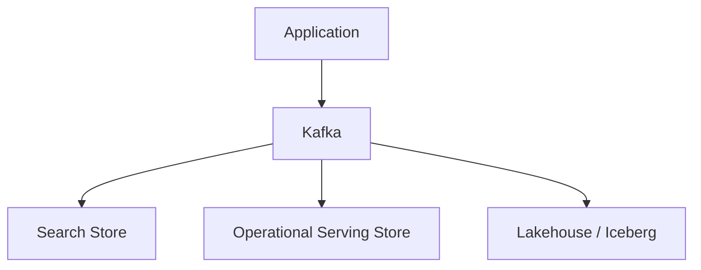

# 이벤트 데이터 아키텍처

문서 유형: Learn. 제공된 학습 자료의 개념과 설계 예시를 정리했다. `studied`는 개념 학습을 뜻하며, 직접 구현하거나 운영 검증했다는 뜻이 아니다. SQL과 수치는 설명용 예시이며 실행하지 않았다.

Kafka Broker, ISR, Replica 운영 상세는 범위 밖이다. 여기서는 데이터 엔지니어링 관점의 이벤트 의미를 다룬다.

## 2.1 Event Modeling

Event는 과거에 발생한 사실을 표현하는 데이터다.

예:

```text
user clicked button
order created
agent executed
llm called
tool failed
```

좋은 Event는 가능하면 immutable하게 설계한다.

즉 과거 Event를 수정하기보다 새로운 Event를 추가한다.

---

### 주요 필드

#### Event ID

이벤트 고유 식별자.

```text
event_id
```

중복 제거와 추적에 중요하다.

#### Event Time

실제로 사건이 발생한 시간.

#### Ingestion Time

데이터 플랫폼이 이벤트를 받은 시간.

둘은 다를 수 있다.

```text
event_time     = 10:00:01
ingestion_time = 10:00:05
```

#### Producer Timestamp

Producer가 기록한 생성 시각.

#### Trace / Session Identifier

여러 이벤트를 하나의 실행이나 사용자 세션으로 연결한다.

예:

```text
trace_id
session_id
execution_id
```

## 2.2 Event Contracts

Event Contract는 Producer와 Consumer 사이에서 Event의 의미를 합의하는 것이다.

예:

```text
field: latency_ms
type: integer
unit: millisecond
required: true
owner: AI Platform Team
```

Contract에 포함할 수 있는 항목:

- Required / Optional
- Data Type
- Unit
- Semantic Definition
- Ownership
- Version
- Compatibility Rule

핵심:

> **Schema만 같다고 의미까지 같은 것은 아니다.**

예를 들어 `latency=5`가:

- 5ms
- 5초

중 무엇인지 Contract가 정의해야 한다.

## 2.3 Schema Evolution

Event Schema는 시간이 지나며 변한다.

예:

```text
v1:
event_id
user_id
event_time

v2:
event_id
user_id
event_time
device_type
```

---

### JSON vs Avro vs Protobuf

#### JSON

장점:
- 사람이 읽기 쉬움
- 유연함

단점:
- Schema 강제력이 약할 수 있음
- 데이터 크기가 상대적으로 큼

#### Avro

Schema 기반 serialization에 자주 사용된다.

Kafka + Schema Registry 환경에서 많이 볼 수 있다.

#### Protobuf

명확한 Schema와 compact binary format을 제공한다.

---

### Schema Registry

Event Schema를 중앙 관리한다.

역할:

```text
Schema Version 관리
Compatibility 검사
Breaking Change 방지
```

---

### Backward Compatibility

새 Consumer가 과거 데이터를 읽을 수 있는가.

### Forward Compatibility

과거 Consumer가 새로운 데이터를 처리할 수 있는가.

### Breaking Change

기존 Consumer를 깨뜨릴 수 있는 변경.

예:

- 필수 field 삭제
- incompatible type 변경
- 의미 변경

## 2.4 Delivery Semantics

### At-Most-Once

최대 한 번 전달.

보장 범위 안에서는 중복 전달하지 않지만 유실 가능.

```text
0회 또는 1회
```

### At-Least-Once

최소 한 번 전달.

유실 방지에 유리하지만 중복 가능.

```text
1회 이상
```

### Exactly-Once

중요한 질문:

> **Exactly-once가 어디부터 어디까지 보장되는가?**

Kafka 내부, Stream Processor State, Sink까지 범위가 다를 수 있다.

Data Engineering에서는 흔히:

```text
At-Least-Once
+
Idempotency
+
Deduplication
```

으로 최종 결과를 한 번만 반영되도록 설계하기도 한다.

---

### Idempotency

같은 작업을 여러 번 실행해도 최종 결과가 같아야 한다.

```text
event A 처리
event A 다시 처리

최종 결과 동일
```

### Deduplication

동일 이벤트가 여러 번 도착했을 때 하나만 남기는 것.

예:

```text
event_id
```

를 이용해 중복을 찾을 수 있다.

## 2.5 Replay

Kafka 같은 Event Log의 중요한 장점은 과거 Event를 다시 읽을 수 있다는 것이다.

### Offset Replay

특정 offset부터 다시 읽는다.

```text
offset 100
→ 101
→ 102
...
```

### Downstream Rebuild

예:

```text
Kafka
  ↓ replay
새로운 Search Index
```

또는:

```text
Kafka
  ↓
새로운 Lakehouse Table
```

을 다시 만들 수 있다.

### Backfill from Kafka

과거 Event를 다시 처리해 누락된 데이터나 새 로직을 채울 수 있다.

### Replay Safety

Replay에서는 중복 이벤트가 발생할 수 있으므로:

- Idempotency
- Deduplication
- Deterministic processing

이 중요하다.

## 2.6 Event → Serving + Lakehouse Dual Path

하나의 논리적 Event가 여러 목적에 materialize될 수 있다.



예를 들어 사용자 click event 하나가:

- 실시간 Dashboard
- 검색/추천
- 장기 분석
- AI Evaluation

에 동시에 사용될 수 있다.

핵심:

> **Event Stream은 전달 경로이고, 하나의 Event가 목적에 따라 여러 저장 형태로 materialize될 수 있다.**

## 적용 시 보완할 점

위 `owner` 값은 가상의 팀 이름이다. JSON 자체와 JSON Schema를 통한 검증을 구분한다. Schema Registry가 단위 변경 같은 모든 의미 오류를 막아 주지는 않는다. Backward/Forward의 정확한 허용 변경은 포맷·필드 기본값·설정에 따라 다르다. 전체 이력 replay가 필요하면 직전 버전과의 호환성만 확인하는지, 전체 과거 버전까지 확인하는 transitive 설정인지 구분한다. [Confluent 스키마 호환성](https://docs.confluent.io/platform/current/schema-registry/fundamentals/schema-evolution.html)

At-least-once는 시스템의 보존·복구 가정 안에서 설명하는 보장이다. Deduplication은 event ID 정의와 상태 보존 기간이 필요하며, replay 범위가 그 기간보다 길면 별도 검증이 필요하다. Kafka replay는 남아 있는 이력에 한정된다. 처리 로직이 과거 schema도 읽는지 확인한다. 분리된 serving/lakehouse 경로는 각자의 lag, 복구, 결과 일관성을 확인해야 한다.

## 연결해서 읽기

[데이터 기초](foundations.md), [Flink](flink.md), [Iceberg](lakehouse-iceberg.md).

## LLM 실전: Replay 안전성 검토

- 상황: 가상의 신규 search index를 과거 이벤트로 재구축한다.
- 제공할 맥락: Schema 버전, offset 범위, 보존 기간, event ID 규칙, sink write 방식, 기존 consumer 상태를 제공한다.
- 기대 결과: 중복·유실 위험, 호환성 점검, 검증할 결과다.
- 오류 가능성: Kafka 보장만으로 외부 sink까지 exactly-once라고 할 수 있다.
- 검증 방법: 작은 범위를 두 번 replay하고 event ID별 최종 결과와 누락 수를 비교한다.

예시 프롬프트:

```text
Assess this replay design before redesigning it. State the delivery guarantee boundary. Separate facts, assumptions, duplicate risks, and missing evidence. Propose a bounded replay test and expected sink results.
```

LLM 출력은 작업 가설이다. 공식 문서와 실제 설정·로그·측정으로 검증한다. 외부 문서 확인일: 2026-09-24. 구현 버전을 시험했다는 의미는 아니다.
