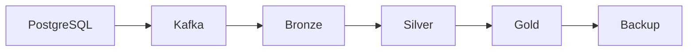

# 데이터 거버넌스

이 Learn 문서는 소유권, 정책, 접근, 감사의 개념을 학습한 내용이다. 기간과 데이터셋은 가상 예시다. 실제 보안 정책을 배포하거나 법적 의무를 검증한 기록이 아니다. 거버넌스는 “누가 어떤 조건으로 데이터를 사용할 수 있는가?”에 답한다.

## 데이터셋 소유권과 분류

| 책임 | 담당 범위 |
| --- | --- |
| Technical owner | Pipeline, schema, quality, SLO |
| Business owner | 업무 의미, KPI, business definition |

Owner가 없으면 장애와 변경에 누가 대응할지 불명확해진다. 두 책임을 데이터셋마다 명시한다.

Classification은 중요도와 민감도를 분류하는 것이다. Public, Internal, Confidential, PII, Sensitive는 가능한 분류의 예다. 이들은 하나의 엄격한 순서나 모든 조직의 공통 등급이 아니다. PII는 데이터의 성격을 나타내므로 중요도 등급과 함께 사용할 수 있다.

```text
email → PII
team_id → Internal
```

Column-level classification도 필요하다. 분류를 access, masking, retention 정책에 연결한다. 위 필드명은 예시일 뿐이며 실제 조직의 식별값은 포함하지 않는다.

## 보관 기간과 삭제 범위

Retention은 얼마나 오래 보관할지 정한다. 비용, 법·규제상 요구, 민감도, 분석 가치를 함께 고려한다. 아래 기간은 학습용이며 법적 기준이나 권장 기본값이 아니다.

| 데이터 예 | 가상 보관 정책 |
| --- | --- |
| Debug log | 14일 |
| User event | 1년 |
| Aggregated metrics | 장기 보관 |

Hot, Cold, Archive tier로 나눌 수 있다. Iceberg snapshot expiration도 보관 정책과 연결되지만, snapshot과 원본 데이터의 보관 요구를 구분해야 한다.

Deletion은 언제, 어디서, 어떤 방식으로 제거할지 정한다. 원본만 지우면 모든 사본이 사라지는 것은 아니다.



이 그림은 추적할 사본과 파생 데이터의 예다. 실제 backup은 여러 단계에서 생길 수 있다. 모든 copy와 derived data를 조사해야 한다. Logical delete는 삭제 표시이고 physical delete는 실제 제거다.

Iceberg에서 현재 snapshot에 보이지 않아도 과거 snapshot이 파일을 참조할 수 있다. Snapshot expiration은 보존 중인 snapshot이 더 이상 참조하지 않는 파일의 정리와 연결되고, orphan cleanup은 metadata가 참조하지 않는 파일을 다룬다. 활성 작업이 아직 쓰는 파일을 orphan으로 오인하지 않도록 보존 간격을 잡아야 한다. 현재 조회 결과만으로 물리 삭제 완료를 주장하면 안 된다. [Iceberg maintenance](https://iceberg.apache.org/docs/latest/maintenance/)

## Masking과 접근 제어

| 방식 | 의미 |
| --- | --- |
| Static masking | 가린 값을 별도 데이터로 저장 |
| Dynamic masking | 조회 user 또는 role에 따라 보여 주는 값을 바꿈 |
| Row-level access | 사용자나 팀이 볼 수 있는 row를 제한 |
| Column-level access | 민감 column의 조회 자체를 제한 |
| RBAC | Role 단위로 권한 관리 |

Column access는 column을 볼 수 있는지 정한다. Masking은 column을 보더라도 실제 값을 가린다. Masking과 encryption은 서로 다른 제어다. PII classification → masking policy로 연결할 수 있고, AI prompt와 response도 정책 대상이 될 수 있다.

실제 접근 경로에서 정책이 적용되는지 확인해야 한다. 예를 들어 Databricks의 row filter와 column mask는 runtime, compute 방식, API 등에 제약이 있다. 공식 제한 사항에는 정책이 있는 table의 path-based 접근과 특정 REST API 접근이 지원되지 않는다고 설명한다. Catalog에 정책이 보인다는 사실만으로 모든 외부 엔진과 storage 경로의 보호를 가정하지 않는다. [Databricks filters and masks](https://docs.databricks.com/aws/en/data-governance/unity-catalog/filters-and-masks)

## 감사 가능성

Auditability는 누가 언제 어떤 데이터에 접근하고 변경했는지 남기는 능력이다. Access audit의 개념 필드는 다음과 같다.

```text
user
dataset
time
action
query
```

Change audit는 schema, policy, owner, retention 변경을 기록한다. Observability가 “시스템과 데이터가 정상인가?”라면 audit는 “누가 무엇을 했는가?”를 묻는다. 실제 audit 로그의 user와 query도 민감할 수 있으므로 공개 학습 자료에 그대로 옮기지 않는다.

## 데이터 계약

Data contract는 producer와 consumer 사이의 약속이다. Schema contract보다 넓고 schema, semantics, quality, SLO, ownership, version을 포함할 수 있다.

```text
event_id → required + unique
latency_ms → integer, millisecond, >= 0
Freshness → < 5 min
Owner → AI Platform Team
```

타입이 integer라는 정의만으로 단위까지 알 수는 없다. 계약에는 millisecond라는 의미와 음수 금지 조건도 적는다. 예시의 owner는 가상의 책임 팀이며 5분은 실제 승인된 SLO가 아니다.

## 거버넌스 플랫폼의 역할과 한계

2026-09-24에 공식 문서를 확인한 범주 수준의 비교다. 제품을 배포하거나 모든 기능을 테스트하지 않았다.

| 플랫폼 | 자료에서 학습한 중심 역할 | 기능 범주와 확인할 경계 |
| --- | --- | --- |
| Databricks Unity Catalog | Databricks lakehouse의 중앙 data/AI governance 계층 | Catalog/discovery, access control, row/column control, masking, classification, lineage, audit. Runtime과 접근 경로별 지원 확인 |
| AWS Lake Formation | AWS S3 data lake 중심 governance | Glue Data Catalog와 연결하고 table/column/row 권한 및 AWS analytics 서비스 통합 제공. 서비스별 data-filter 지원 확인 |
| Snowflake Horizon Catalog | Snowflake를 중심으로 한 governance와 catalog | Catalog, classification, tags, masking, row access, access history, lineage, data quality, AI governance 범주. Edition과 기능별 조건 확인 |

위 표는 각 제품이 동일한 방식과 범위로 모든 정책을 강제한다는 뜻이 아니다. Unity Catalog의 전체 범주와 세부 제한, Lake Formation의 통합 엔진별 지원, Horizon의 개별 기능 요구사항을 구별한다. 예를 들어 Snowflake Access History는 Enterprise Edition 이상을 요구한다. [Unity Catalog](https://docs.databricks.com/aws/en/data-governance/unity-catalog/), [Lake Formation data filtering](https://docs.aws.amazon.com/lake-formation/latest/dg/data-filtering.html), [Horizon Catalog](https://docs.snowflake.com/en/user-guide/snowflake-horizon), [Snowflake Access History](https://docs.snowflake.com/en/user-guide/access-history)

플랫폼을 검토할 때 유지할 질문은 다음과 같다.

- 이 데이터는 무엇이고 owner는 누구인가?
- 누가 볼 수 있고, 민감한가?
- 어디서 왔고 어디에 쓰이는가?
- 누가 접근했고, 데이터는 정상인가?

## LLM in Practice: 삭제 정책의 사본 범위 검토

**상황:** 가상 데이터셋에 삭제 정책을 설계하며 원본과 파생 사본을 빠뜨리지 않는지 확인한다.

**LLM에 제공할 맥락:** 익명화한 lineage, 보관 정책, snapshot·backup 구조, consumer 목록, 현재 접근 정책, 확인되지 않은 사본 목록을 제공한다. 실제 개인정보는 넣지 않는다.

**예시 프롬프트:**

=== "한국어"

    ```text {.prompt}
    [맥락]
    lineage·보관 규칙·snapshot 및 backup 구조: [비식별 자료]
    consumer·접근 정책·알 수 없는 사본 위치: [목록]
    [요청]
    삭제 정책을 검토하되 삭제는 실행하지 마세요.
    논리 삭제·물리 정리·미검증 범위를 구분하세요.
    PostgreSQL·Kafka·Bronze·Silver·Gold·backup의 사본을 조사하세요.
    사실·가정·위험·누락 근거를 구분하세요.
    [출력]
    확인할 사본과 파생 데이터 목록을 주세요.
    검증 기준과 정책 owner에게 할 질문을 주세요.
    [검증]
    법적 요구를 만들거나 삭제 완료를 주장하지 마세요.
    storage·snapshot 참조·backup·consumer 상태·승인 정책을 대조하세요.
    ```

=== "English"

    ```text {.prompt}
    [Context]
    Lineage, retention rules, snapshots, and backups: [sanitized material]
    Consumers, access policies, and unknown copy locations: [list]
    [Task]
    Review this deletion policy; do not execute deletion.
    Separate logical deletion, physical cleanup, and unverified scope.
    Inspect copies across PostgreSQL, Kafka, Bronze, Silver, Gold, and backups.
    Separate facts, assumptions, risks, and missing evidence.
    [Output]
    List the copies and derived data to inspect.
    Give verification criteria and questions for the policy owners.
    [Checks]
    Do not invent legal requirements or claim deletion is complete.
    Compare storage, snapshot references, backups, consumers, and approved policies.
    ```

**기대 결과:** 추적할 사본 목록, 담당 owner 질문, 논리 삭제와 물리 정리의 구분, 완료 증거가 없는 범위를 명시한 검토안이다.

**틀릴 수 있는 부분:** 현재 쿼리에서 보이지 않으면 삭제됐다고 판단하거나 가상의 보관 기간을 법적 기준으로 오해할 수 있다.

**검증 방법:** 실제 storage와 snapshot 참조, backup 정책, 각 consumer의 상태, 승인된 보관·삭제 정책을 확인한다. 법적 요구는 해당 책임자가 확인한다. LLM은 검토 보조이며 정책 승인과 삭제 완료 증거를 대신하지 않는다.

[Lineage와 metadata](lineage-metadata.md) · [데이터 품질](data-quality.md) · [데이터 관측성](data-observability.md) · [핸드북 홈](../index.md)

[더 많은 실무 프롬프트](../prompts/governance.md)
