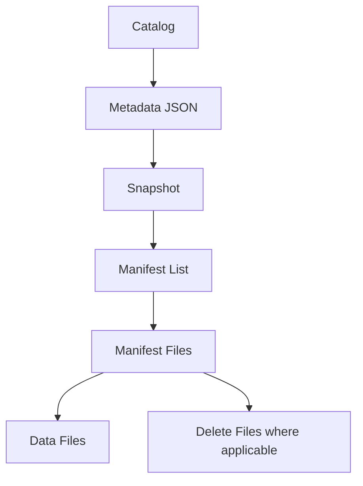

# Lakehouse와 Apache Iceberg

문서 유형: Learn. 제공된 학습 자료의 개념과 설계 예시를 정리했다. `studied`는 개념 학습을 뜻하며, 직접 구현하거나 운영 검증했다는 뜻이 아니다. SQL과 수치는 설명용 예시이며 실행하지 않았다.

## 3.1 Lakehouse Architecture

Lakehouse는 Data Lake의 열린 Storage와 Data Warehouse의 Table Management 기능을 결합하려는 구조다.

큰 그림:

```text
Object Storage
   ↓
Parquet Files
   +
Table Format
   ↓
Iceberg
   ↓
Compute
Spark / Trino / Flink
   ↓
Catalog / Governance
```

주요 계층:

- Storage Layer
- Compute Layer
- Table Format
- Catalog
- Governance / Control Plane

---

### Data Plane vs Control Plane

Data Plane:

- 실제 Parquet 파일
- 실제 Query / Read / Write

Control Plane:

- Metadata
- Catalog
- Access Policy
- Governance
- Table Definition

정도로 개념적으로 나눌 수 있다.

## 3.2 Iceberg Metadata Internals

Iceberg의 핵심은 단순히 Parquet 파일을 저장하는 것이 아니라 **Table Metadata를 관리하는 것**이다.

구조를 단순화하면:



---

### Metadata JSON

Table의 현재 상태를 설명한다.

포함될 수 있는 정보:

- 현재 Snapshot
- Schema
- Partition Spec
- Sort Order
- Snapshot History

---

### Current Snapshot

현재 Table 상태를 가리키는 Snapshot.

---

### Snapshot Log

과거 Snapshot 이력을 기록한다.

따라서 Metadata JSON이 시간에 따라 여러 버전 존재할 수 있다.

질문:

> Iceberg에 Table Metadata가 여러 개일 수 있는가?

답:

> 가능하다. Table 상태 변화에 따라 새로운 Metadata 파일이 만들어지고 Catalog/metadata pointer가 현재 Metadata를 가리키는 방식으로 이해할 수 있다.

---

### Manifest List / Manifest File

Snapshot이 직접 모든 Data File을 하나씩 들고 있는 대신 중간 Metadata 계층을 사용한다.

개념:

```text
Snapshot
  ↓
Manifest List
  ↓
Manifest
  ↓
Data File
```

이를 통해 대규모 Table의 File 목록과 Statistics를 효율적으로 관리한다.

---

### Data Files

실제 데이터가 있는 Parquet/ORC/Avro 파일.

### Delete Files

Merge-on-Read 같은 방식에서 삭제 정보를 별도 파일로 관리할 수 있다.

## 3.3 Snapshot Semantics

Snapshot은 특정 시점의 Table 상태다.

중요한 점:

> Snapshot마다 모든 파일을 새로 복사하는 것이 아니다.

여러 Snapshot이 동일한 Data File을 공유할 수 있다.

```text
Snapshot 1
→ A, B, C

Snapshot 2
→ A, B, C, D
```

A/B/C는 그대로 공유되고 D만 추가될 수 있다.

---

### Time Travel

과거 Snapshot을 기준으로 Query할 수 있다.

### Rollback

Table을 과거 Snapshot 상태로 되돌릴 수 있다.

### Consistent Read

Query는 특정 Snapshot 기준으로 일관된 Table 상태를 읽는다.

### Snapshot Isolation Intuition

동시에 Write가 발생하더라도 Query는 중간 상태가 아니라 특정 Snapshot의 일관된 상태를 읽는다고 이해하면 된다.

## 3.4 Atomic Commit Model

여러 Writer가 동시에 Table을 변경할 수 있다.

Iceberg는 **Optimistic Concurrency** 방식으로 이해할 수 있다.

개념적으로:

```text
현재 Metadata = M1

Writer A
→ M1 기준 변경

Writer B
→ M1 기준 변경
```

한 Writer가 먼저 Commit하면 현재 Metadata가 바뀐다.

다른 Writer는:

- Conflict 확인
- 필요한 경우 retry

할 수 있다.

---

### Compare-and-Swap Intuition

"내가 작업을 시작했을 때의 Table 상태가 아직 현재 상태인가?"를 확인하고 Commit한다고 이해하면 된다.

---

### Orphan Files

File은 만들어졌는데 Commit에 실패하면 Table Metadata에서 참조되지 않는 파일이 남을 수 있다.

이런 File은 나중에 cleanup 대상이 된다.

## 3.5 Partitioning in Iceberg

Iceberg는 **Hidden Partitioning** 개념이 중요하다.

사용자는 Query에서 Partition Column을 직접 의식하지 않고 논리 column 조건을 사용할 수 있다.

예:

```sql
WHERE event_time >= ...
```

Iceberg가 내부 Partition Transform을 이용해 Pruning할 수 있다.

---

### Partition Transforms

대표:

- day
- hour
- bucket
- truncate

예:

```text
day(event_time)
bucket(32, user_id)
```

---

### Partition Evolution

Table을 다시 전체 Rewrite하지 않고 Partition Spec을 변경할 수 있다.

예:

```text
기존: day(event_time)
변경: hour(event_time)
```

과거 데이터와 새 데이터가 서로 다른 Partition Spec을 사용해도 Metadata를 통해 관리할 수 있다.

---

### High Cardinality Design

`user_id`처럼 cardinality가 높은 값은 직접 Partition하지 않고 bucket transform 등을 고려할 수 있다.

## 3.6 Query Pruning

Iceberg Query 성능에서 핵심은:

> **얼마나 적은 데이터를 읽게 할 수 있는가**

Pruning 단계:

```text
Partition Pruning
   ↓
Manifest Pruning
   ↓
Data File Pruning
   ↓
Parquet Row Group Pruning
   ↓
Column Pruning
```

---

### Scan Amplification

실제로 필요한 데이터보다 훨씬 많은 데이터를 읽으면 Scan Amplification이 크다고 볼 수 있다.

좋은 Layout은 이를 줄인다.

## 3.7 Sort Order and Clustering

File min/max statistics가 효과적이려면 값이 어느 정도 모여 있는 것이 좋다.

예:

```text
random user_id distribution
```

보다:

```text
user_id 순으로 어느 정도 정렬
```

되어 있으면 특정 user 범위를 찾을 때 File Pruning이 더 유리할 수 있다.

핵심:

> **Sort / Clustering은 Query Pattern을 기준으로 설계해야 한다.**

## 3.8 UPDATE / DELETE / MERGE

Object Storage의 Parquet 파일은 일반 DB row처럼 작은 단위로 즉시 수정하기 어렵다.

Iceberg는 Table Format 차원에서 Update/Delete를 지원한다.

---

### Copy-on-Write

변경된 row가 포함된 Data File을 다시 작성한다.

장점:
- 읽기가 단순

단점:
- Write 비용 증가

---

### Merge-on-Read

원본 Data File은 유지하고 변경/삭제 정보를 별도 파일로 저장한 뒤 Read할 때 합친다.

장점:
- 빠른 Write 가능

단점:
- Read가 복잡해질 수 있음
- Delete File 관리 필요

---

### Position Delete

특정 File의 특정 row position을 삭제 대상으로 표시.

### Equality Delete

특정 key/value 조건에 해당하는 row를 삭제 대상으로 표현.

---

### UPDATE

개념적으로:

```text
기존 row 삭제
+
새 row 삽입
```

처럼 이해할 수 있다.

### MERGE

CDC Upsert 등에 사용 가능하지만 큰 Table에서는 비용을 고려해야 한다.

## 3.9 Maintenance

Lakehouse는 파일 기반이므로 Maintenance가 중요하다.

### Data File Compaction

작은 Data File들을 적절한 크기로 합친다.

### Delete File Rewrite

Delete File이 너무 많이 쌓이면 Rewrite한다.

### Manifest Rewrite

Manifest가 비효율적으로 많아질 경우 재정리한다.

### Snapshot Expiration

오래된 Snapshot을 제거한다.

### Orphan Cleanup

Metadata에서 더 이상 참조되지 않는 File을 제거한다.

핵심:

> **Iceberg를 도입했다고 Maintenance가 사라지는 것은 아니다.**

## 3.10 Catalogs

Iceberg Table을 운영하려면 현재 Metadata를 찾을 수 있어야 한다.

Catalog의 역할:

- Table 이름 등록
- 현재 Metadata 위치 관리
- Namespace 관리

대표 Catalog:

- Hive Metastore
- AWS Glue
- REST Catalog
- JDBC Catalog
- Nessie
- Unity Catalog concepts

## 3.11 Catalog vs Governance

둘은 관련 있지만 같은 개념이 아니다.

### Catalog 기본 역할

```text
table name
→ current metadata
```

같은 Table Registration / Discovery.

### Governance

더 넓은 역할:

- Access Policy
- Ownership
- Classification
- Audit
- Lineage
- Masking

---

### Unity Catalog와 Iceberg Catalog

질문:

> Unity Catalog는 Iceberg Catalog에 여러 정보를 추가한 형태인가?

단순히 동일하다고 보기는 어렵다.

개념적으로:

```text
Iceberg Catalog
→ Iceberg Table을 찾고 Metadata pointer를 관리

Unity Catalog
→ Catalog 기능 + Access Control + Lineage + Governance + 여러 Data/AI Asset 관리
```

즉 Unity Catalog는 훨씬 넓은 Governance Layer로 이해하는 것이 맞다.

## 적용 시 보완할 점

계층 그림은 책임을 나눈 개념 모델이다. Compute 다음에만 Catalog가 실행된다는 직렬 처리 순서가 아니다. Catalog가 현재 metadata를 찾게 하고 엔진이 metadata와 실제 파일을 읽는다. Pruning 목록도 여러 최적화 계층을 보여 주며 반드시 같은 순서로 실행되는 것은 아니다.

원자적 commit의 구현은 catalog에 달려 있다. 모든 충돌이 retry로 성공하지는 않는다. Update에서 새 값은 data file에도 기록해야 한다. Position/equality delete 설명은 주로 v2 모델이다. 새로운 format version에는 deletion vector 등 다른 표현도 있으므로 엔진과 테이블 버전의 지원 범위를 확인한다. Partition spec 변경만으로 옛 파일이 자동 재배치되지는 않는다. [Iceberg 사양](https://iceberg.apache.org/spec/)

현재 snapshot에 없는 파일도 유지 중인 과거 snapshot이 참조할 수 있다. Orphan 정리는 진행 중인 write보다 충분히 긴 보존 여유와 경로 일치 검증이 필요하다. 너무 이른 삭제는 데이터 손상을 일으킬 수 있다. Snapshot expiration은 time travel/rollback 가능 범위도 줄인다. [Iceberg 유지보수](https://iceberg.apache.org/docs/latest/maintenance/)

Unity Catalog는 data/AI 자산의 접근 제어·lineage·audit 등을 포함하는 governance 계층이다. Iceberg 연동 가능 여부와 지원 방식은 실제 환경에서 따로 확인한다. [Databricks Unity Catalog](https://docs.databricks.com/aws/en/data-governance/unity-catalog/)

## 연결해서 읽기

[파일과 partition 기초](foundations.md), [Spark](spark.md), [Flink](flink.md).

## LLM 실전: Commit 실패 분석

- 상황: 가상 concurrent writer 작업에서 commit 충돌과 참조되지 않는 파일이 보인다.
- 제공할 맥락: Catalog/engine/format 버전, snapshot 이력, writer 로그, 진행 중 작업, retention 정책을 제공한다.
- 기대 결과: 충돌 후보, snapshot 참조 확인, 안전한 후속 확인 순서다.
- 오류 가능성: 현재 snapshot에 없는 파일을 바로 orphan으로 분류할 수 있다.
- 검증 방법: 유지 중인 모든 snapshot과 진행 중 write를 확인하고 공식 catalog 동작과 로그를 대조한다.

예시 프롬프트:

=== "한국어"

    ```text {.prompt}
    [맥락]
    환경: [catalog·engine·format 버전·snapshot 이력]
    작업 상태: [writer 로그·진행 중 write·retention 정책]

    [요청]
    Commit 실패를 분석하고 관찰·충돌 가설·누락 근거를 나눠 줘.
    아직 참조 중일 수 있는 파일을 식별해 줘.

    [출력]
    충돌 후보와 파일 참조 확인의 조사 순서를 작성해 줘.

    [검증]
    Retry나 cleanup 전에 읽기 전용 확인을 제안하고 삭제 명령은 만들지 마.
    ```

=== "English"

    ```text {.prompt}
    [Context]
    Environment: [catalog, engine, format versions, snapshot history]
    Work state: [writer logs, in-flight writes, retention policy]

    [Task]
    Assess the commit failures.
    Separate observations, conflict hypotheses, and missing evidence.
    Identify files that may still be referenced.

    [Output]
    Return conflict candidates and an ordered file-reference investigation.

    [Checks]
    Propose read-only checks before retry or cleanup; do not produce deletion commands.
    ```

[이 주제의 실무 프롬프트 6개 더 보기](../prompts/lakehouse-iceberg.md)

LLM 출력은 작업 가설이다. 공식 문서와 실제 설정·로그·측정으로 검증한다. 외부 문서 확인일: 2026-09-24. 구현 버전을 시험했다는 의미는 아니다.
