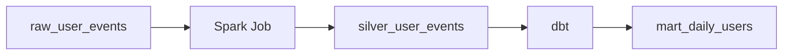
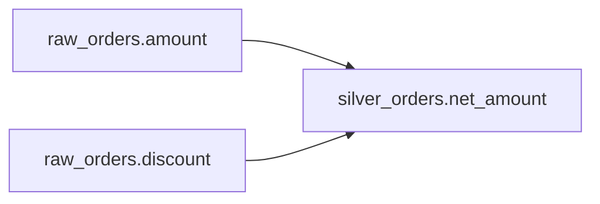

# Lineage와 metadata 플랫폼

이 Learn 문서는 metadata, lineage, catalog의 역할을 학습한 내용이다. 예시는 가상 데이터셋이며 수집기나 플랫폼을 구축해 검증한 기록이 아니다. Metadata는 데이터를 설명하는 데이터이고, lineage는 데이터가 생성되고 사용되는 경로다.

## 세 종류의 metadata

| 종류 | 포함 정보 | 답하려는 질문 |
| --- | --- | --- |
| Technical metadata | table, column, type, schema, partition, file format | 구조가 어떻게 생겼는가 |
| Operational metadata | last updated, job status, freshness, row count, processing time | 지금 정상적으로 운영되는가 |
| Business metadata | description, owner, KPI definition, business term, classification | 업무적으로 무엇을 의미하는가 |

## Business metadata와 semantic layer는 같은가

자료의 보충 질문은 “Business metadata가 semantic layer와 유사해 보이는데 같은가?”였다. 둘은 겹치지만 동일하지 않다. Business metadata는 의미를 설명한다. Semantic layer는 그 의미를 계산 가능한 metric과 dimension 정의로 제공한다.

설명 예시:

```text
Revenue
- VAT 제외
- Refund 제외
- Owner: Finance
```

계산 정의 예시:

```text
Revenue = SUM(order_amount) - SUM(refund) - SUM(vat)
```

Business metadata는 “Revenue가 무엇인가?”에, semantic layer는 “어떻게 계산하는가?”에 답한다. BI, dashboard, AI가 같은 정의를 사용하도록 한다. 이 관점에서 semantic layer는 business metadata 중 실행 가능한 분석 정의를 구체화한다. 식은 개념 예시이며 실제 회계 규칙이나 특정 제품의 실행 문법이 아니다. 실제 계산에는 grain, 기간, 통화, 중복 차감 여부 등의 합의가 필요하다.

## Dataset lineage와 방향

Dataset lineage는 source → job → target 관계다.



Upstream은 현재 데이터를 만드는 쪽이고 downstream은 현재 데이터를 사용하는 쪽이다. Lineage는 root cause 조사, impact analysis, 데이터 신뢰도 판단에 사용한다. 연결이 존재한다는 사실만으로 특정 실행이 정확했음을 증명하지는 않는다.

## OpenLineage와 Marquez

OpenLineage는 서로 다른 도구가 lineage 정보를 공통 형식으로 표현하도록 하는 표준이다. 핵심 entity는 다음과 같다.

| Entity | 의미 | 예시 |
| --- | --- | --- |
| Job | 정의된 작업 | `transform_orders` |
| Run | 특정 job의 실행 1회 | 해당 변환의 한 번의 실행 |
| Dataset | 입력 또는 출력 데이터 | `bronze.orders`, `silver.orders` |

```text
bronze.orders → Job: transform_orders → silver.orders
```

OpenLineage 자체를 조회 UI로 이해하면 안 된다. 실행 이벤트와 metadata 표현을 정의하며, 현재 object model은 run에 연결되지 않는 job/dataset metadata event도 지원한다. 따라서 모든 lineage event가 실행 1회만을 표현한다고 한정하면 안 된다. [OpenLineage object model](https://openlineage.io/docs/spec/object-model/)

Marquez는 OpenLineage metadata를 수집·저장하고 UI와 API로 조회·시각화하는 시스템이다. OpenLineage가 표준이라면 Marquez는 그 정보를 다루는 구현이다. 자료에서는 종합 catalog 전체보다 lineage와 job/run 관계에 초점을 둔 역할로 구분했다. [Marquez](https://marquezproject.ai/)

제품과 표준 설명은 2026-09-24에 공식 문서로 확인했다. 연결 도구를 설치했다는 사실만으로 모든 실행과 column lineage가 수집된다고 가정하지 않는다. 실제 수집 범위를 별도로 확인해야 한다.

## Column lineage와 영향 분석

Column-level lineage는 table 관계보다 세밀하다.



이 관계는 KPI 오류의 원인 조사, schema 변경 영향 분석, 민감 데이터 추적에 유용하다. Upstream analysis는 문제 원인을 거슬러 올라가며, downstream impact analysis는 변경의 영향을 받는 대상을 따라간다.

```text
raw_orders.amount type 변경
→ stg_orders
→ fact_sales
→ mart_daily_sales
→ Dashboard
```

위 예에서 type 변경을 발견하면 각 downstream 변환과 소비자의 기대 타입을 확인한다. Lineage 누락이 있을 수 있으므로 그래프에 없다는 이유만으로 영향이 없다고 확정하지 않는다.

## Catalog 통합

Catalog는 여러 출처의 정보를 모아 발견과 이해를 돕는다. 다음은 역할을 보여 주는 통합 예시이며 자동 연결을 보장하는 제품 구성도가 아니다.

| 정보 출처 | 합칠 정보 |
| --- | --- |
| Iceberg | Technical metadata |
| dbt | Model, documentation, dependencies |
| Airflow | Pipeline, runs |
| OpenLineage | Lineage |
| Quality tool | Data quality |

Catalog에서 description, owner, freshness, quality, upstream/downstream, classification, access policy를 함께 볼 수 있다. 현대 catalog는 table 목록을 넘어 discovery, metadata, lineage, governance 정보를 통합할 수 있다. 다만 정책을 표시하는 것과 실제 데이터 접근을 강제하는 것은 별개다. [거버넌스](governance.md)에서는 실행 엔진과 storage 접근 경로까지 확인한다.

## LLM in Practice: 타입 변경 영향 검토

**상황:** 가상의 `raw_orders.amount` 타입 변경을 검토한다.

**LLM에 제공할 맥락:** 익명화한 schema 전후 비교, 수집된 table/column lineage, 변환식, job/run 이력, KPI 정의, 확인되지 않은 수집 구간을 제공한다.

**예시 프롬프트:**

=== "한국어"

    ```text {.prompt}
    [맥락]
    raw_orders.amount 전후 schema: [타입 변경안]
    table·column lineage와 변환식: [비식별 정의]
    job/run 이력·KPI 정의·알려진 수집 누락: [자료]
    [요청]
    재설계를 제안하기 전에 이 타입 변경안을 평가하세요.
    downstream 영향 후보와 확인할 upstream 근거를 나열하세요.
    사실·가정·가설·누락 의존성을 구분하세요.
    [출력]
    stg_orders·fact_sales의 검증 항목을 주세요.
    mart_daily_sales와 해당 대시보드의 검증 항목도 주세요.
    [검증]
    실제 SQL·설정·수집 이벤트·catalog·샘플 결과를 대조하세요.
    검토를 변경 승인이나 완전한 영향 분석으로 취급하지 마세요.
    ```

=== "English"

    ```text {.prompt}
    [Context]
    Before/after schemas for raw_orders.amount: [proposed type change]
    Table/column lineage and transformations: [sanitized definitions]
    Job/run history, KPI definitions, and known collection gaps: [material]
    [Task]
    Assess this proposed type change before suggesting a redesign.
    List likely downstream impacts and upstream evidence to inspect.
    Separate facts, assumptions, hypotheses, and missing dependencies.
    [Output]
    Give validation checks for stg_orders and fact_sales.
    Include checks for mart_daily_sales and its dashboard.
    [Checks]
    Compare actual SQL, configuration, events, catalog entries, and sample results.
    Do not treat this review as approval or a complete impact analysis.
    ```

**기대 결과:** 영향을 받을 변환·KPI·대시보드와 확인할 증거, 수집 누락 때문에 확정할 수 없는 범위를 나눈 검토안이다.

**틀릴 수 있는 부분:** 관측된 lineage를 전체 의존성으로 가정하거나 business description만으로 실행 계산식을 추정할 수 있다.

**검증 방법:** 실제 SQL과 실행 설정, 수집 이벤트, catalog 정보, 샘플 결과를 대조한다. LLM의 추정을 변경 승인이나 완전한 영향 분석으로 취급하지 않는다.

[데이터 관측성](data-observability.md) · [거버넌스](governance.md) · [핸드북 홈](../index.md)

[더 많은 실무 프롬프트](../prompts/lineage-metadata.md)
