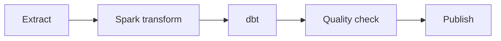

# 데이터 오케스트레이션

이 문서는 Airflow를 중심으로 한 개념 학습이다. 실제 DAG를 배포·운영했다는 뜻이 아니다. 공식 문서는 2026-09-24에 확인했다.

## DAG의 역할

Orchestrator는 여러 작업의 순서, 시간, 실패, 재실행을 관리한다. DAG는 전체 workflow, task는 실행 단위, dependency는 작업 간 선행 조건, schedule은 실행 시점이나 주기를 뜻한다.



Airflow는 대규모 데이터를 직접 처리하기보다 계산 시스템을 지휘한다. Operator는 task 실행 방식을 정의한다. Python·SQL·Bash 작업, Spark job 제출, dbt command 실행 등이 예다. Airflow는 orchestration, Spark는 batch compute, Flink는 streaming, dbt는 SQL transformation 정의, Trino는 query, Iceberg는 table 계층을 맡는 역할 분리가 가능하다. 이 구분은 설계 예시이며 고정된 제품 조합은 아니다.

## Retry와 멱등성

일시 실패에는 network timeout, DB 연결 오류, 잠깐의 cluster 문제가 있다. Retry가 도움이 될 수 있다. SQL syntax error, 잘못된 schema, code bug 같은 영구 실패는 원인을 고치기 전까지 retry로 해결되지 않는다.

Retry-safe task는 여러 번 실행해도 같은 최종 결과를 내야 한다. 무조건 append하면 중복이 생기기 쉽다. 특정 partition overwrite, MERGE, replace는 대안이지만 입력 구간과 key, transaction 경계를 올바르게 설계해야 멱등적이다. 명령 이름 자체가 안전성을 보장하지 않는다. 공식 지침도 retry 중 중복을 피하고 특정 partition을 읽고 쓰도록 권한다. [Airflow best practices](https://airflow.apache.org/docs/apache-airflow/stable/best-practices.html)

## Backfill과 명시적 구간

Backfill은 과거 데이터를 다시 계산하는 일이다. Pipeline 장애, logic bug 수정, 누락 데이터, 새 column, business logic 변경 때문에 필요할 수 있다. Full backfill은 전체 기간, partial/partition backfill은 필요한 날짜나 partition만 처리한다. 둘 다 멱등성이 필요하다.

같은 DAG는 `process_date`, `start_date`, `end_date`, `environment`, `data_interval` 같은 parameter로 재사용할 수 있다. “오늘 데이터”보다 “2026-09-24 데이터”처럼 대상 구간을 명시하면 재실행과 backfill이 쉽다. 구간 경계와 timezone도 명확히 한다. 실행 시각의 `now()`나 최신 데이터에 의존하면 같은 과거 작업을 다시 돌려도 다른 결과가 나올 수 있다. [특정 partition과 data interval 사용](https://airflow.apache.org/docs/apache-airflow/stable/best-practices.html)

## Schedule과 준비 상태

Sensor는 특정 조건이 충족될 때까지 기다리는 task다. S3 file 도착, upstream DAG 완료, 데이터 준비 상태를 기다릴 수 있다. “02:00 실행 시도”와 “입력이 실제 준비됨”은 다르다. Schedule을 정했다고 데이터 dependency가 해결된 것은 아니다. 조건 확인에는 polling 방식과 event 기반 방식이 있다. 사용 가능한 sensor·event 기능은 Airflow와 provider 버전에 따라 확인한다.

## 실패 지점부터 복구

다음 상태에서는 전체 DAG를 처음부터 다시 돌릴 필요가 없을 수 있다.

```text
Extract: success
Spark: success
dbt: failed
Quality: not run
Publish: not run
```

dbt 문제를 고친 뒤 실패 task부터 재실행한다. 다만 기존 upstream 결과가 유효한지, 동일 구간인지 먼저 확인한다. 일반적인 `all_success` dependency는 upstream 성공을 기다린다. `all_done` 같은 다른 trigger rule은 실패·skip 뒤에도 실행될 수 있으므로 “upstream 실패 시 downstream이 항상 막힌다”는 설명은 부정확하다. Publish gate의 실제 trigger rule을 확인한다. [Airflow trigger rules](https://airflow.apache.org/docs/apache-airflow/stable/core-concepts/dags.html#trigger-rules)

실패 알림에는 DAG, task, 실패 시각, retry 수, error를 넣는다. 해당 실행과 데이터 구간을 함께 식별하면 조사에 도움이 된다.

## 피해야 할 설계

- Airflow worker 안에서 대규모 compute를 수행하면 orchestration 자원이 계산 부하에 묶인다.
- XCom으로 대용량 데이터를 넘기지 않는다. 작은 상태·경로를 전달하고 실제 데이터는 외부 저장소에 둔다.
- DAG 간 의존성을 과도하게 얽으면 장애 전파와 재실행 범위를 이해하기 어렵다.
- Airflow를 streaming engine처럼 사용하지 않는다. 지속적 event 처리는 적합한 engine에 맡긴다.

XCom은 작은 메시지에 쓰고 큰 데이터는 공유 저장소에 두는 방식이 공식 권고와 일치한다. [작업 간 통신](https://airflow.apache.org/docs/apache-airflow/stable/best-practices.html)

## LLM 활용: backfill 계획 검토

상황: logic bug를 고친 뒤 7일치 데이터를 재처리한다. 제공할 맥락은 DAG 의존성, 명시적 날짜 구간, source 보존 기간, 출력 partition, write 방식, 실패 상태, 검증 기준이다.

```text
Review this seven-day backfill plan before changing it.
Separate known facts, assumptions, risks, and missing evidence.
Check input intervals, retry safety, downstream gates, and validation.
Return a bounded rerun plan and checks for duplicate or missing rows.
```

기대 결과는 재실행 범위와 검증 목록이다. LLM은 MERGE를 자동으로 안전하다고 보거나 전체 DAG 재실행을 제안할 수 있다. 실제 key·trigger rule·구간 설정을 확인하고 작은 partition에서 재실행 전후 결과를 비교한다. 이 문서는 그러한 실행을 했다고 주장하지 않는다.

[dbt](dbt.md) · [CDC와 Debezium](cdc-debezium.md) · [핸드북 홈](../index.md)
