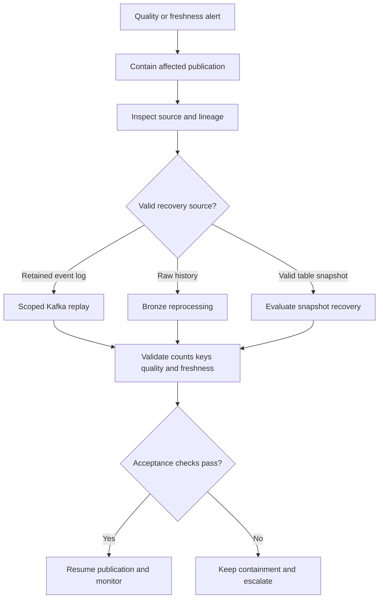

# 프로덕션 데이터 플랫폼 운영

이 문서는 개념 학습과 가상 장애 훈련을 정리한다. 실제 장애 대응·복구 훈련·성능 측정을 수행했다는 기록이 아니다. 기술의 작동 원리에서 한 걸음 더 나아가 **새벽 3시에 장애가 나면 무엇을 확인하고 어떻게 복구할지**를 다룬다. 제품별 복구 동작은 2026-09-26에 공식 문서를 확인했으며 실제 버전·설정에 맞게 다시 검증해야 한다.

## 먼저 정할 것

중요 데이터마다 책임자, 기준 원본(source of truth), 복구 원본, 보존 기간, 최대 replay 가능 구간, SLO를 정한다. 작업 성공 여부와 데이터 건강 상태를 따로 관찰한다. 복구 속도만 높이다가 중복·누락·잘못된 결과를 확산시키지 않는다.



이 흐름은 복구 계획의 구조다. 실제 publish 중지, offset 변경, snapshot rollback, 재게시에는 해당 시스템의 승인·동시 쓰기 제어·복구 사전조건이 필요하다.

## Backfill과 재처리

**Backfill**은 정해진 과거 범위의 데이터를 다시 계산하는 일이다. 파이프라인 장애, 버그 수정, 새 업무 로직, 누락 데이터, 스키마 수정에 사용한다. 영향 범위를 먼저 정한다. 5년 전체를 재계산하기보다 `2026-09-01 ~ 2026-09-03` 또는 영향받은 `event_date` partition만 대상으로 삼는다.

필수 조건은 멱등 작업, 날짜 범위 매개변수, 예측 가능한 출력 교체, 자원 제어다. 재시도해도 결과가 중복되지 않아야 하고 어느 범위를 교체하는지 알 수 있어야 한다. 원본의 날짜 표기는 업무 범위 예시다. 실행 시에는 시간대와 시작·끝 경계의 포함 여부도 명시한다.

Backfill은 **reprocessing**의 한 형태다. 복구 경로는 남아 있는 원본과 장애 종류에 따라 고른다.

| 경로 | 흐름 | 적합한 조건과 확인할 점 |
| --- | --- | --- |
| Kafka replay | Offset → 이벤트 다시 소비 | Event Log가 기준 원본이며 필요한 이벤트가 실제 보존되어 있음 |
| Bronze replay | Raw history → 수정한 변환 → Silver/Gold 재구축 | 원시 이력의 범위·완전성과 적용할 변환 버전을 확인 |
| Iceberg snapshot recovery | 잘못된 현재 snapshot → 유효한 이전 snapshot 검토 | 최근 손상에서 time travel로 비교하고 rollback의 영향 범위를 확인 |
| Source replay | Operational DB 또는 외부 원본 → 재수집 | 원본이 필요한 과거 상태까지 재현할 수 있는지 확인 |

기준 원본은 Operational DB, Kafka, Bronze, Iceberg snapshot, 외부 원본 중 무엇인지 장애 전에 결정한다. 이전 snapshot으로 되돌리는 것과 그 시점 이후의 정상 변경을 재생하는 것은 별도 문제다. [Iceberg](lakehouse-iceberg.md)와 [오케스트레이션](orchestration.md)을 함께 본다.

## 장애 훈련: 스키마 변경

가상 변경은 `amount BIGINT → amount STRING`이다. 영향은 `Producer → CDC/Event → Flink/Spark → Silver → dbt → Dashboard`로 이어질 수 있다.

1. 스키마 변경을 감지한다.
2. 호환되지 않는 데이터를 중지하거나 격리한다.
3. Lineage로 소비자와 파생 데이터의 영향을 조사한다.
4. Producer/consumer의 호환성 문제를 수정한다.
5. 영향 데이터만 backfill한다.
6. 타입·값·건수와 downstream 결과를 검증한다.

Data Contract, Schema Registry, 호환성 검사, CI/CD 검증으로 예방한다. 자동 타입 변환이 업무 의미까지 보존한다고 가정하지 않는다. [CDC](cdc-debezium.md), [Lineage](lineage-metadata.md)를 참고한다.

## 장애 훈련: 잘못된 데이터

`latency_ms = -100` 또는 `user_id`의 90%가 NULL인 상황을 가정한다. 대응 순서는 **품질 경보 → 확산 차단 → 격리/게시 중지 → 원인 확인 → 수정 → 재처리 → 검증**이다. 기술적으로 성공한 파이프라인이 잘못된 업무 데이터를 조용히 게시하게 두지 않는다. [품질 규칙](data-quality.md)은 업무상 유효성까지 확인해야 한다.

## 장애 훈련: 데이터 skew

Spark task 대부분은 빨리 끝나지만 하나가 매우 오래 걸리거나 Flink의 특정 key만 뜨거워지는 것이 증상이다. 키 분포, NULL/기본값 집중, join cardinality, 특정 고객·팀의 데이터 집중을 확인한다.

후보 대응은 salting, 사전 집계, heavy key 별도 처리, partition 전략 변경, Spark AQE다. 먼저 측정한 병목과 후보가 맞는지 확인한다. Streaming에서 re-keying/salting을 적용할 때는 필요한 키별 순서를 보존해야 한다. [Spark](spark.md), [Flink](flink.md)에 관련 원리가 있다.

## 장애 훈련: 작은 파일 폭증

수백만 개의 작은 Parquet 파일은 metadata 부담, 느린 query planning, 많은 object storage 요청, 낮은 task 효율을 만든다. 과도한 streaming commit, 지나친 partition 분할, 많은 작은 쓰기를 조사한다.

**Compaction 검토 → 목표 파일 크기 조정 → 쓰기 빈도 조정 → partition 전략 재검토** 순서로 원인과 대응을 연결한다. Compaction도 compute와 입출력을 사용한다. 쓰기·쿼리 부하와 함께 계획한다. [Iceberg 유지보수](https://iceberg.apache.org/docs/latest/maintenance/)가 작은 파일 재작성의 배경을 설명한다.

## 장애 훈련: 오래된 테이블

현재 10:00인데 Gold 최신 데이터가 08:40이라면 한 계층의 성공 표시만 보지 않는다. `Source → Kafka → Bronze → Silver → Gold → Dashboard`를 따라 freshness를 확인한다. 원본 자체가 늦는지, 전송·변환·게시·dashboard 갱신 중 어디에서 지연되는지 구분한다. 여러 지점에서 freshness를 측정해야 한다. [데이터 관측성](data-observability.md)을 참고한다.

## 장애 훈련: 잘못된 변환

의도한 `click`을 `WHERE event_type = 'clik'`으로 잘못 적었다고 가정한다. Job은 성공하지만 결과는 0행일 수 있다. **Pipeline GREEN / Data RED**가 동시에 가능하다.

건수·품질 이상을 감지하고, 변경된 변환을 찾고, 코드를 수정한 다음 영향 구간을 backfill한다. 성공한 task만 확인하면 이 장애를 놓친다. 데이터 품질과 시스템 건강은 별개의 신호다.

## 장애 훈련: CDC 실패

Connector 중지, offset 손실, 필요한 WAL 만료, 중복 replay, 스키마 변경을 구분한다. 저장 offset과 필요한 로그가 유효한 정상 복구 경로는 **재시작 → 저장 offset → replay → 멱등 downstream 처리**다. Offset이나 WAL을 사용할 수 없으면 snapshot/re-bootstrap 계획이 필요할 수 있다.

Snapshot 선택과 재시작 동작은 connector 버전·snapshot mode·replication slot 상태에 따라 다르다. 단순 재시작이 손실된 로그를 복원하지는 않는다. 재부트스트랩 전에는 기존 downstream 데이터와의 정합·중복 제거·누락 검증을 정한다. [Debezium PostgreSQL 공식 문서](https://debezium.io/documentation/reference/stable/connectors/postgresql.html)를 실제 설정과 대조한다.

## 용량 계획

용량 계획은 예상 데이터량과 동시 작업을 감당할 수 있는지 추정하는 일이다. 입력은 events/s, GB 또는 TB/day, retention days, peak multiplier, partition 수, 파일 수, Spark 동시성, query 동시성, streaming state 크기다.

```text
10,000 events/second
× average bytes/event
× 86,400 seconds/day
= estimated ingestion bytes/day
```

이것은 수집량 산식이지 최종 저장·네트워크 용량 보장은 아니다. 실제 평균 크기를 넣고 압축·복제·보존·재처리 비용을 별도로 확인한다. 평균뿐 아니라 peak traffic, backfill, 장애 replay, 월말 보고서, 동시 dashboard도 고려한다.

| 계층 | 확인할 입력·질문 | 운영상 경계 |
| --- | --- | --- |
| Kafka | events/s, partition 수, retention, consumer 수, replay traffic | Partition이 너무 적으면 consumer 병렬성이 제한되고 너무 많으면 운영 부담 증가 |
| Lakehouse | TB/day, file count/day, 평균 파일 크기, partition 수, snapshot 수, delete file 증가량 | 같은 1 TB라도 파일 8개와 1,000,000개는 다른 운영 특성을 가짐 |
| Spark | 동시 job, shuffle량, executor memory, task 수, CPU, backfill 겹침 | 평소 일별 작업이 성공해도 90일 backfill과 겹치면 실패할 수 있음 |
| Trino/SQL Warehouse/Snowflake | 동시 사용자, dashboard 갱신 빈도, scan 크기, join 복잡도, memory, BI 피크 | Interactive와 batch workload의 compute pool 분리를 검토 |

Backfill에는 별도 용량 정책이 필요하다. 동시 실행 수와 자원 한도, 정상 작업 우선순위를 정한다. Workload isolation은 대화형 쿼리를 batch의 자원 경쟁으로부터 보호하는 선택지다.

## 비용 엔지니어링

주요 비용은 compute, storage, network, object storage requests, serving stores, compaction, 상시 streaming compute, AI inference다. 한 가지 비용만 줄이다가 다른 계층의 비용을 늘리지 않도록 전체를 본다.

- **Compute:** 불필요한 scan, shuffle, 재계산, idle compute, 과도하게 큰 cluster를 줄인다.
- **Storage:** retention, snapshot expiration, orphan files, 중복 dataset, raw data 수명을 관리한다.
- **Serving:** 무거운 분석은 lakehouse, 저지연 운영 조회는 serving store/cache가 적합할 수 있다. 모든 조회를 비싼 분석 엔진으로 보내지 않는다.
- **FinOps:** team, project, environment, pipeline, product로 비용을 분류해 책임자를 드러낸다.

삭제는 비용 절감과 복구 능력을 함께 바꾼다. Snapshot을 만료하면 해당 time travel 경로를 잃는다. Orphan cleanup의 보존 구간이 진행 중인 쓰기보다 짧으면 아직 commit하지 않은 파일을 삭제할 수 있다. 경로 표기 불일치도 잘못된 삭제를 일으킬 수 있다. 삭제 전에는 필요한 복구 구간·참조 snapshot·쓰기 기간·실제 파일 경로·후보 목록을 확인하고 승인된 절차를 사용한다. 이것은 정리 계획의 제약이며 삭제 실행 지시가 아니다. [Iceberg 유지보수 안전 조건](https://iceberg.apache.org/docs/latest/maintenance/)

## DR: 무엇을 복구해야 하는가

DR(Disaster Recovery)의 시나리오는 catalog 손실, object storage 문제, checkpoint 손실, CDC state 손실, region 장애, 잘못된 배포, credential/policy 손상이다. 자격 증명 자체를 공개 runbook이나 LLM 입력에 넣지 않는다. 이 문서는 실제 자격 증명 변경 절차를 제시하지 않는다.

### Catalog 복구

Lakehouse table은 파일만으로 이루어지지 않는다. Parquet 파일이 남아 있어도 metadata/catalog를 잃으면 table을 즉시 사용할 수 없을 수 있다. Catalog metadata를 프로덕션 인프라로 보호한다. Managed service의 내구성, 지원되는 backup/export, 설정용 infrastructure-as-code, 복구 절차를 함께 준비한다. 제공자·catalog별 지원 범위를 확인한다.

### Table 복구

Iceberg snapshot, time travel, rollback, Bronze replay, source replay가 후보이다. 장애 유형에 따라 가장 빠르고 올바른 경로가 다르다. Snapshot이 남아 있는지, 필요한 파일에 접근 가능한지, 복구 후의 정상 변경을 어떻게 다시 적용할지 확인한다.

### Checkpoint 손실

Spark/Flink의 checkpoint/state를 잃으면 **어디에서 처리를 재개할지**를 먼저 정해야 한다. Kafka replay, 호환되는 Flink savepoint 복원, state 재구축, 알려진 timestamp에서 재시작이 후보다. Timestamp에서 입력을 재개하는 것만으로 과거 집계·join state까지 복원되는 것은 아니다.

중복 처리, 긴 복구 시간, downstream 부하 급증을 계획에 반영한다. Flink checkpoint는 주로 장애 복구용이며 savepoint는 운영자가 관리하는 계획된 중단·변경·복원에 쓰인다. 둘의 수명과 복원 조건을 혼동하거나 Flink savepoint를 Spark에 그대로 적용하지 않는다. 실제 상태·코드 호환성을 확인한다. [Flink checkpoint와 savepoint](https://nightlies.apache.org/flink/flink-docs-stable/docs/ops/state/checkpoints_vs_savepoints/)

## Dataset별 기준 원본과 복구 계약

각 중요 dataset의 문서에는 다음 항목을 둔다.

| 항목 | 가상 `fact_llm_call` 예시 |
| --- | --- |
| Source of Truth | 7일 동안의 Kafka raw events + 수집 후 Iceberg Bronze |
| Recovery Source | 7일 미만 범위는 Kafka replay, 7일 이상 된 범위는 Bronze 재구축 |
| Maximum Replay Window | Kafka에 실제 남은 event 구간; 오래된 구간은 Bronze 가용 이력으로 별도 제한 |
| Retention | Kafka 7일이라는 예시 정책과 별도로 Bronze 보존 기간을 명시 |
| Owner | 책임 팀/담당 역할을 실제 운영 문서에 지정 |
| SLO | Dataset의 freshness, correctness, availability, RTO/RPO 목표 |

7일은 제품 기본값이 아닌 가상 정책이다. 실제 log retention/compaction, 누락, 수집 완료 여부를 확인한다. Kafka에서 사라졌다고 Bronze에 반드시 존재하는 것은 아니다. 이 계약은 복구를 즉흥 판단에서 확인 가능한 절차로 바꾼다.

## SLO, RTO, RPO

아래 숫자는 요구사항을 논의하기 위한 예시이며 달성한 측정값이나 보편적인 권장값이 아니다.

| 범주 | 의미 | 예시 목표 |
| --- | --- | --- |
| Freshness | 원본 대비 데이터 지연 | Gold가 원본보다 15분 미만 지연 |
| Correctness | 중복과 필수 필드 완전성 등 | Duplicate rate < 0.01%; required field completeness > 99.9% |
| Availability | 쿼리 계층을 사용할 수 있는 비율 | 99.9% |
| RTO: Recovery Time Objective | 복구까지 허용하는 시간 | 중요 dataset < 1시간 |
| RPO: Recovery Point Objective | 허용 가능한 데이터 손실 구간 | < 5분 |
| Query latency | 사용자 쿼리의 응답 지연 | Dashboard query p95 < 5초 |

RTO는 **얼마나 빨리 복구해야 하는가**, RPO는 **얼마나 많은 과거 데이터 손실을 허용하는가**다. 복구 완료 시간과 복구 가능한 데이터 시점을 구분한다. 측정 구간·분모·관측 지점도 실제 SLO에 명시한다.

Dataset별로 목표를 나눈다. Tier 1은 경영·업무 핵심 데이터로 엄격한 SLO를 적용한다. Tier 2는 일반 분석, Tier 3는 실험 데이터다. 중요도에 맞는 복구 투자와 비용을 선택한다.

## Runbook 필수 항목과 완료 판단

중요 파이프라인마다 Owner, Source, Destination, SLO, Alert, Failure Modes, Replay Procedure, Backfill Procedure, Rollback Procedure, Cost Owner, Downstream Impact를 기록한다.

운영 문서에는 최초 점검, 가설을 구분할 근거, 영향 범위, 승인된 복구 절차, 중단 조건, 검증 방법, 에스컬레이션 역할을 구체화한다. 사전조건을 충족하지 못하거나 복구 원본의 완전성을 입증하지 못하면 추측으로 offset·파일·권한을 변경하지 않고 담당자에게 에스컬레이션한다. 복구 후에는 freshness·건수·키 중복·품질·downstream 결과를 확인하고 재발 방지 조치를 기록한다.

성숙한 플랫폼은 아키텍처 그림뿐 아니라 그 구조가 고장 났을 때 작업자가 무엇을 해야 하는지 아는 것으로도 평가된다.

## LLM in Practice

### 제한된 재처리 계획 검토

**상황:** 변환 배포 후 Gold 결과가 0행이 되었다. 정상 pipeline 실행 기록만으로 복구 완료를 판단할 수 없다.

**LLM에 제공할 맥락:** 익명화한 변경 diff, 영향 시간 범위, 계층별 건수·freshness, lineage, Kafka/Bronze 보존 현황, snapshot 목록, 멱등성 정책, 자원 한도와 RTO/RPO. 비밀값이나 실제 고객 이벤트를 제공하지 않는다.

**예시 프롬프트:**

=== "한국어"

    ```text {.prompt}
    [맥락]
    Gold 변환 배포 후 결과는 0행이고 job은 성공했습니다.
    입력: [변경 diff], [영향 범위], [계층별 건수와 freshness], [lineage].
    복구 근거: [Kafka/Bronze 보존], [snapshot], [멱등성], [자원 한도], [RTO/RPO].
    [요청]
    관찰, 가정, 가설, 누락 근거를 구분해 기존 설계를 먼저 평가하세요.
    Kafka replay, Bronze 재처리, snapshot 복구의 적합 조건을 비교하세요.
    승인된 영향 범위에 한정한 복구 계획만 제안하세요. 삭제나 실행은 하지 마세요.
    [출력]
    가설별 근거와 다음 점검 표, 선택 근거, 사전조건, 단계별 계획을 작성하세요.
    중복·state·동시 쓰기 위험, 자원 한도, 중단·에스컬레이션 기준을 포함하세요.
    [검증]
    건수, 키, 필수 값, freshness, 업무 결과를 검증할 방법을 적으세요.
    확인하지 못한 원본 보존·권한·복원 호환성은 미확인으로 표시하세요.
    RTO와 RPO를 구분하고 사람의 검토와 실행 승인을 요구하세요.
    ```

=== "English"

    ```text {.prompt}
    [Context]
    Gold has zero rows after a transformation deployment, but the job succeeded.
    Inputs: [change diff], [affected range], [counts and freshness per layer], [lineage].
    Recovery evidence: [Kafka/Bronze retention], [snapshots], [idempotency], [resource limits], [RTO/RPO].
    [Task]
    Assess the current design first. Separate observations, assumptions, hypotheses, and missing evidence.
    Compare prerequisites for Kafka replay, Bronze reprocessing, and snapshot recovery.
    Propose a recovery plan limited to the approved affected range. Do not delete or execute anything.
    [Output]
    Give an evidence and next-check table for each hypothesis, selection reasons, prerequisites, and steps.
    Include duplicate, state, and concurrent-write risks, resource limits, stop conditions, and escalation.
    [Checks]
    Explain how to validate counts, keys, required values, freshness, and business results.
    Mark unverified source retention, permissions, and restore compatibility as unknown.
    Separate RTO from RPO. Require human review and execution approval.
    ```

**기대 출력:** 관찰·가정·가설·누락 근거가 분리된 조사 표와 제한된 복구 계획. 범위, 원본 선택, 사전조건, 자원 한도, 중단·검증·에스컬레이션 기준을 포함한다.

**LLM이 틀릴 수 있는 점:** Job 성공을 데이터 정상으로 해석하거나, 만료된 Kafka 이력이 있다고 가정하거나, snapshot rollback이 모든 downstream 결과를 복원한다고 오해할 수 있다. RTO/RPO를 뒤바꾸거나 중복·state·동시 쓰기 영향을 빠뜨릴 수 있다.

**검증 방법:** 사람이 실제 source retention, offset, snapshot, 변환 diff, lineage와 공식 문서를 확인한다. 승인된 격리 환경에서 작은 범위로 재처리해 건수·키·필수 값·freshness와 업무 결과를 대조한다. 운영 실행은 별도 승인과 사전조건을 충족한 뒤에만 진행한다. LLM 출력은 실행 명령이나 확인된 원인이 아닌 작업 가설이다.
