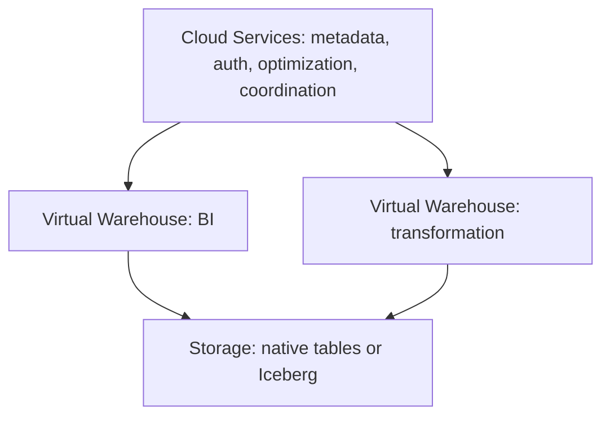

# Snowflake: 요약 개념과 설계 경계

문서 유형: Learn. 원문 18장은 한 번 요약하고 넘어간 학습 범위다. `studied`는 이 요약 개념의 학습이며 상세 구현·운영 경험이나 심화 실습 완료를 뜻하지 않는다. 예시는 실행하지 않았다. 제품 동작은 2026-09-26 공식 문서로 확인했으며 edition, cloud, region, table type, feature 상태에 따라 달라진다.

## 18.1 Architecture

Snowflake는 storage와 compute를 분리한 관리형 클라우드 데이터 플랫폼이다. SQL/Data Warehouse에서 출발해 data engineering, Iceberg, governance, AI로 확장했다.



Virtual Warehouse는 query/DML을 실행하는 독립 compute cluster다. 서로 다른 warehouse로 workload를 격리할 수 있다. Cloud Services는 metadata, authentication, query optimization, access control, coordination을 맡는다. Storage는 Snowflake 관리형 저장 또는 Iceberg 구성으로 구분한다. [공식 아키텍처](https://docs.snowflake.com/en/user-guide/intro-key-concepts).

## 18.2 Micro-partitions

Snowflake native table 데이터는 자동으로 micro-partitions에 배치된다. `Table → Micro-partition 1, 2, 3 …`이며 값 범위 등의 metadata가 pruning을 돕는다. 이 설명을 외부 Iceberg 파일의 물리 구조에 그대로 적용하지 않는다.

## 18.3 Pruning

설명용 필터 `WHERE event_date = '2026-09-26'`가 있으면 일치할 수 없는 micro-partition을 읽지 않을 수 있다. [Iceberg file pruning](lakehouse-iceberg.md), Parquet row group pruning과 “불필요한 읽기 제거”라는 목적은 비슷하지만 metadata와 실행 방식은 다르다. 효과는 실제 query profile의 scan으로 확인한다.

## 18.4 Clustering

빈번한 filter에 맞지 않는 물리 배치에서는 clustering이 pruning을 도울 수 있다. 큰 테이블은 clustering key를 검토할 수 있다. 모든 테이블을 수동 partition하라는 뜻이 아니다. 쿼리 패턴에 맞는 값 분포를 만드는 것이 목적이며 유지 비용도 비교한다. [Micro-partitions와 clustering](https://docs.snowflake.com/en/user-guide/tables-clustering-micropartitions).

## 18.5 Streams

Stream은 source table의 row 변화 정보를 증분 처리에 제공한다. Kafka 같은 독립 event log로 보면 안 된다. Stream 자체는 데이터 복사본 대신 source object의 offset을 보관하고 table history를 통해 변경을 계산한다. 단순 SELECT는 offset을 진행시키지 않는다. 변경을 소비하는 DML transaction의 commit이 기준이다. 보존 범위를 벗어난 stale stream을 감시한다. [Streams](https://docs.snowflake.com/en/user-guide/streams-intro).

## 18.6 Tasks

Task는 SQL 작업을 스케줄하거나 트리거한다. 대표 흐름은 `Table → Stream → Task → MERGE / SQL transform`이다. 무엇이 변경됐는지는 Stream, 언제 처리할지는 Task, 결과를 어떻게 만들지는 SQL의 역할이다. [Tasks](https://docs.snowflake.com/en/user-guide/tasks-intro).

## 18.7 Dynamic Tables

Dynamic Table은 결과 쿼리와 원하는 신선도를 선언하고 Snowflake가 refresh를 관리한다. `Raw → Dynamic Table(Silver) → Dynamic Table(Gold)`처럼 데이터셋 의존성을 표현한다.

설명용 설정은 `TARGET_LAG = '10 minutes'`다. **10분마다 실행하라는 스케줄도, 지연을 반드시 10분 이하로 보장하는 계약도 아니다.** 신선도 목표이며 실제 지연은 warehouse, 데이터 양, 쿼리 복잡도, 의존성 깊이의 영향을 받는다. 실제 lag와 refresh history를 확인한다. 모든 SQL이 incremental refresh에 적합하다고 가정하지 않는다. [Target lag](https://docs.snowflake.com/en/user-guide/dynamic-tables/target-lag).

## 18.8 Snowpipe / Snowpipe Streaming

Snowpipe는 `Object storage file → Snowpipe → Snowflake`처럼 staged file을 수집한다. Snowpipe Streaming은 파일 staging에만 의존하지 않고 지속적으로 낮은 지연의 데이터를 수집하는 방식이다. 수집 지연, 처리 지연, 최종 mart 신선도는 별도로 측정한다. 스트리밍 수집이 [Flink](flink.md)의 복잡한 event-time/state 처리와 같은 기능을 뜻하지 않는다. [Snowpipe](https://docs.snowflake.com/en/user-guide/data-load-snowpipe-intro), [Snowpipe Streaming](https://docs.snowflake.com/en/user-guide/data-load-snowpipe-streaming-overview).

## 18.9 Iceberg Tables

`Snowflake → Iceberg table → Object storage`로 표 형식, compute, storage를 구분한다. Snowflake-managed catalog와 external catalog 구성을 구별하고 누가 metadata commit과 maintenance를 책임지는지 정한다. Spark/Trino 같은 외부 엔진의 읽기·쓰기·인증·table feature 지원을 각각 확인한다. [Iceberg tables](https://docs.snowflake.com/en/user-guide/tables-iceberg).

Horizon의 Iceberg REST endpoint는 다중 엔진 접근에 참여할 수 있다. 이것이 모든 Snowflake 기능이나 모든 외부 엔진 조합에서 동일한 동작을 보장하지는 않는다. [Horizon을 통한 외부 엔진 접근](https://docs.snowflake.com/en/user-guide/tables-iceberg-access-using-external-query-engine-snowflake-horizon).

## 18.10 Governance: Horizon Catalog

Databricks Unity Catalog와 Snowflake Horizon Catalog는 “통합 거버넌스”라는 개념 영역에서 비교할 수 있다. Horizon은 discovery, metadata, lineage, classification, masking, row access, governance, Iceberg visibility, semantic/business context를 다룬다. 기능 이름 대응을 정책·권한·외부 엔진의 완전한 동등성으로 해석하지 않는다. [Horizon Catalog](https://docs.snowflake.com/en/user-guide/snowflake-horizon).

## 18.11 Cortex / AI

Cortex AI, Search, Analyst, Agents, AI 인터페이스는 관리되는 기업 데이터 가까이에서 AI를 쓰려는 기능 영역이다. 검색, 구조화 데이터 분석, agent 도구 사용을 구분한다. 모델·리전·권한·데이터 접근 범위는 실제 기능 문서에서 확인한다. [Snowflake AI와 ML](https://docs.snowflake.com/en/guides-overview-ai-features).

## 18.12 비용 모델

Compute 사용은 credit 기반으로 과금하며 Virtual Warehouse, serverless compute, Cloud Services와 storage를 함께 계산한다. credit을 고정 CPU 개수나 모든 기능에 동일한 금액으로 해석하지 않는다.

Auto Suspend, 적절한 warehouse 크기, scan 감소, 효율적인 query, 가능한 incremental refresh가 검토 대상이다. 크기를 줄이는 것만으로 총비용이 낮아진다고 가정하지 않는다. 실행시간·대기·신선도와 함께 실제 사용량으로 비교한다. [Snowflake 비용](https://docs.snowflake.com/en/user-guide/cost-understanding-overall).

## 18.13 멘탈모델

| 책임 | 기억할 기능 |
|---|---|
| Storage | Native managed storage / Iceberg 구성 |
| Compute | Virtual Warehouse |
| Native layout | Micro-partitions |
| Performance | Pruning + Clustering |
| Pipeline | Dynamic Tables 또는 Streams + Tasks |
| Ingestion | Snowpipe / Snowpipe Streaming |
| Governance | Horizon Catalog |
| AI | Cortex / Search / Analyst / Agents |
| Billing | Credits와 storage 등 전체 항목 |

Databricks는 Spark/data engineering/AI에서 SQL로, Snowflake는 SQL/warehouse에서 engineering/Iceberg/AI로 확장했다. 현재 겹치는 영역이 많으므로 역사적 이미지보다 workload를 기준으로 고른다. [플랫폼 비교](platform-comparison.md), [Databricks](databricks.md), [분석 모델링](analytical-modeling.md)을 함께 본다.

## LLM in Practice

### Dynamic Table 신선도 검토

**상황:** 가상의 mart가 목표보다 오래된 데이터를 보여준다.

**LLM에 제공할 맥락:** 비식별 의존성 DAG, target lag, refresh history, 실제 지연, warehouse 사용률·queue, 변경량, SQL과 refresh mode를 제공한다.

**예시 프롬프트:**

=== "한국어"

    ```text {.prompt}
    [맥락]
    의존성: [Raw-Silver-Gold DAG와 SQL]
    설정: [target lag, warehouse, refresh mode]
    관찰: [refresh history, actual lag, queue, 변경량]
    [요청]
    target lag를 실행 주기나 보장으로 취급하지 말라.
    수집 지연과 refresh 지연을 분리해 원인 가설을 세워라.
    증설 전에 현재 설계와 증거를 평가하라.
    [출력]
    관찰, 가정, 미확인 항목, 가설별 반증 지표를 표로 작성하라.
    작은 실험과 중단·복구 조건을 제시하라.
    [검증]
    공식 기능 조건과 실제 refresh 기록을 대조하라.
    실험 전후 신선도, 비용, 결과 정확성을 비교하고 사람의 실행 승인을 요구하라.
    ```

=== "English"

    ```text {.prompt}
    [Context]
    Dependencies: [Raw-Silver-Gold DAG and SQL]
    Settings: [target lag, warehouse, refresh mode]
    Observations: [refresh history, actual lag, queue, change volume]
    [Task]
    Do not treat target lag as an interval or guarantee.
    Separate ingestion delay from refresh delay and form hypotheses.
    Assess the current design and evidence before resizing.
    [Output]
    Table observations, assumptions, unknowns, and evidence that could reject each hypothesis.
    Propose small experiments with stop and recovery conditions.
    [Checks]
    Compare official requirements with actual refresh records.
    Compare freshness, cost, and correctness before and after the experiment; require human approval to run it.
    ```

**기대 출력:** 지연 구간별 가설, 확인 쿼리의 목적, 작은 실험, 비용·정확성·신선도 판단 기준.

**LLM이 틀릴 수 있는 점:** target lag를 실행 주기나 보장으로 착각하고 증거 없이 warehouse 증설을 권할 수 있다.

**검증 방법:** 공식 target lag 정의와 refresh mode 조건을 확인한다. refresh history와 query profile로 가설을 반박하고 제한된 실험 전후의 actual lag·비용·결과 일치를 비교한다. 실행 승인은 사람이 한다.
