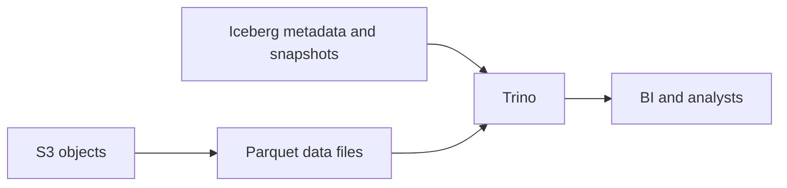

# Trino의 분산 SQL 실행

이 문서는 Trino를 개념적으로 학습한 기록이다. Query 성능이나 실제 운영 결과를 검증했다는 뜻이 아니다. 공식 문서는 2026-09-24에 확인했다.

## Architecture와 connector

Trino는 외부 저장소의 데이터를 SQL로 조회하는 분산 query engine이다. Trino 자체가 주 데이터 저장소인 것은 아니다. Coordinator는 SQL 분석, query plan, stage/task 관리를 담당한다. Worker는 scan, join, aggregation을 실행한다. `Coordinator ≈ Spark driver`, `Worker ≈ Spark executor`는 역할 이해를 위한 비유이며 실행 모델이 같다는 뜻은 아니다. [Trino concepts](https://trino.io/docs/current/overview/concepts.html)

Connector는 Trino와 외부 시스템 사이의 adapter다. Iceberg, PostgreSQL, Hive connector 등이 있다. Table 이름은 `catalog.schema.table` 형태다.

```text
iceberg.analytics.fact_llm_call
postgres.public.users
```

Trino catalog는 어떤 connector/data source 설정을 사용할지 구분한다. Iceberg catalog는 table metadata를 찾고 관리하는 계층이므로 같은 의미가 아니다. 서로 다른 시스템을 한 SQL에서 join하는 federated query도 가능하지만 성능이 자동으로 좋아지는 것은 아니다. 원격 scan, 데이터 이동, source 부하를 함께 고려한다.

## Query가 작업으로 나뉘는 방식

개념적으로 SQL을 query plan으로 만들고 stage와 task로 분산한다. Scan은 split 단위로 나눈다. `SQL → Query plan → Stage → Task → Split`은 이해를 돕는 단순화이며 모든 실행 요소를 표현한 것은 아니다.

| 요소 | 역할 |
| --- | --- |
| Stage | 큰 실행 단계 |
| Task | worker에서 실행하는 stage의 일부 |
| Split | scan 작업의 작은 단위 |
| Exchange | worker 사이의 데이터 재분배 |

Exchange는 Spark shuffle과 비슷한 목적을 가진다. Join과 GROUP BY에서 재분배가 많이 발생할 수 있다. [실행 요소](https://trino.io/docs/current/overview/concepts.html)

## Pushdown과 pruning

Pushdown은 가능한 연산을 데이터가 있는 쪽에 맡겨 이동량과 scan을 줄인다.

- Predicate pushdown: `WHERE` 조건을 source 쪽으로 전달한다.
- Projection pushdown: 필요한 column만 읽도록 한다.
- Aggregation pushdown: 지원되는 경우 COUNT/SUM 같은 집계를 source에서 수행한다.

지원 범위는 connector와 query 형태에 따라 다르다. SQL에 filter를 썼다고 pushdown이 반드시 일어나는 것은 아니다. EXPLAIN과 실제 읽은 데이터량으로 확인한다. Iceberg의 partition/file/row group/column pruning도 불필요한 읽기를 줄이지만 모든 pruning을 원격 DB의 aggregation pushdown과 동일하게 취급하지 않는다. [Trino pushdown](https://trino.io/docs/current/optimizer/pushdown.html)

## Join과 memory

Broadcast join은 작은 table을 관련 worker들에 복제한다. `Huge fact + tiny dimension`이 대표 후보지만 작은 쪽이 각 worker의 memory에 맞는지 확인해야 한다. Partitioned join은 join key로 데이터를 재분배한다. 큰 table끼리 join할 때 후보가 되며 exchange 비용이 발생한다. 특정 key가 한쪽으로 몰리는 data skew는 일부 worker의 부하와 memory 사용을 키운다.

Join, aggregation, sort는 중간 데이터를 memory에 유지한다. Worker memory와 query memory 범위를 나누어 이해한다. Spill은 memory 압박을 줄이려고 중간 데이터를 disk로 내보내는 방식이다. Disk I/O 때문에 느려질 수 있고 모든 OOM을 해결하지도 않는다. 현재 Trino 문서는 spill을 legacy 기능으로 설명하고 적절한 task retry policy와 exchange manager를 사용하는 fault-tolerant execution 검토를 안내한다. 적용 가능 여부는 workload·connector·설정으로 확인해야 한다. [Trino spill](https://trino.io/docs/current/admin/spill.html)

## Trino와 Spark의 역할

| Trino가 자주 맡는 일 | Spark가 자주 맡는 일 |
| --- | --- |
| Interactive SQL, query serving | 대규모 processing, transformation |
| BI, ad-hoc query, 여러 사용자의 동시 SQL | ETL, backfill, large join, ML dataset, batch transform |

이는 절대적인 기능 경계나 성능 보장이 아니다. 둘을 함께 쓰면 Spark가 데이터를 만들고 Trino가 그 데이터를 조회하는 구조가 가능하다.

## Iceberg 데이터 조회



S3는 실제 object/file을 저장하고 Parquet은 file format이다. Iceberg는 table metadata와 snapshot을 관리하고 Trino는 SQL을 실행한다. Trino는 Iceberg metadata로 필요한 file을 찾고 Parquet의 columnar 구조로 필요한 column을 읽는다. 실제 pruning 효과는 layout, metadata, filter, connector 구현에 달려 있다. [Trino Iceberg connector](https://trino.io/docs/current/connector/iceberg.html)

## LLM 활용: 느린 federated query 조사

상황: Iceberg fact와 PostgreSQL dimension을 join한 query가 느리다. 제공할 맥락은 익명화한 SQL, EXPLAIN, 실제 scan/output rows와 bytes, table 크기, key 분포, memory 오류, connector 설정이다.

```text
Assess this federated query before redesigning it.
Separate observations from assumptions and hypotheses.
Check pushdown, join distribution, exchange volume, skew, and memory.
List missing evidence and small checks that could reject each hypothesis.
Do not assume spill or broadcast is always safe.
```

기대 결과는 근거별 병목 후보와 확인 순서다. LLM은 pushdown을 지원한다고 단정하거나 Spark 전환만 제안할 수 있다. 실제 query plan·runtime 통계·connector 문서를 확인하고 제한된 query 비교로 가설을 검증한다. 여기서는 해당 성능 실험을 하지 않았다.

[분석 데이터 모델링](analytical-modeling.md) · [dbt](dbt.md) · [핸드북 홈](../index.md)
