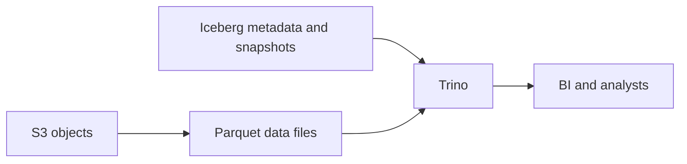

# Chapter 10 — Trino

이 문서는 Trino를 개념적으로 학습한 기록이다. Query 성능이나 실제 운영 결과를 검증했다는 뜻이 아니다. 공식 문서는 2026-09-24에 확인했다.

**본문 안내:** 아래 원문 구역은 원래 순서와 형태를 보존한 본문이다. 원문의 단순화된 설명에 대한 정정·적용 조건과 추가 설명은 문서 뒤 보완 구역에서 해당 절 번호와 함께 확인한다.

<!-- SOURCE CORE START -->

## 10.1 Architecture

Trino:

> **외부 데이터 저장소를 빠르게 SQL로 조회하는 분산 SQL Query Engine**

Trino 자체가 주 Storage는 아니다.

### Coordinator

- SQL 분석
- Query Plan
- Stage/Task 관리

### Worker

- 실제 Scan
- Join
- Aggregation

개념 비교:

```text
Trino Coordinator ≈ Spark Driver
Trino Worker ≈ Spark Executor
```

---

## 10.2 Connector Model

Connector는 Trino와 외부 시스템 사이 Adapter.

예:

- Iceberg Connector
- PostgreSQL Connector
- Hive Connector

Trino Catalog 이름 구조:

```text
catalog.schema.table
```

예:

```text
iceberg.analytics.fact_llm_call
postgres.public.users
```

Trino Catalog와 Iceberg Catalog는 의미가 다르다.

Trino Catalog:

> 어떤 Connector/Data Source를 사용할지 구분.

Federated Query로 서로 다른 시스템을 한 SQL에서 Join할 수도 있지만 성능을 무조건 보장하는 것은 아니다.

---

## 10.3 Query Execution

구조:

```text
SQL
 ↓
Query Plan
 ↓
Stage
 ↓
Task
 ↓
Split
```

### Stage

큰 실행 단계.

### Task

특정 Worker에서 실행되는 Stage 일부.

### Split

Scan의 작은 작업 단위.

### Exchange

Worker 간 Data Redistribution.

Spark Shuffle과 비슷한 개념.

Join / GroupBy에서 Exchange가 많이 발생할 수 있다.

---

## 10.4 Pushdown

목적:

> **가능한 연산을 데이터가 있는 쪽에서 먼저 수행해 이동/Scan을 줄인다.**

### Predicate Pushdown

`WHERE` 조건을 Source로 내려보냄.

### Projection Pushdown

필요한 Column만.

### Aggregation Pushdown

가능하면 COUNT/SUM 등을 Source에서 수행.

Iceberg에서는 Partition/File/Row Group/Column Pruning이 비슷한 목적을 수행한다.

---

## 10.5 Join Strategies

### Broadcast Join

작은 Table을 모든 Worker에 복사.

```text
Huge Fact
+
Tiny Dimension
```

### Partitioned Join

큰 Table끼리 Join Key 기준 재분배.

Exchange 비용 발생.

### Data Skew

특정 key가 특정 Worker에 몰릴 수 있다.

---

## 10.6 Memory

Trino는 Join/Aggregation/Sort의 중간 데이터를 Memory에 유지한다.

주요 개념:

- Worker Memory
- Query Memory
- Spill

Spill:

```text
Memory 부족
 ↓
Disk 사용
```

Query 실패를 피할 수 있지만 느려진다.

---

## 10.7 Trino vs Spark

핵심:

```text
Trino
→ Interactive SQL / Query Serving

Spark
→ Large-scale Processing / Transformation
```

Trino:

- BI
- Ad-hoc Query
- 다수 사용자 동시 SQL

Spark:

- ETL
- Backfill
- Large Join
- ML Dataset
- Batch Transform

함께 사용:

```text
Spark
→ Data 생성

Trino
→ 생성된 Data 조회
```

---

## 10.8 Trino + Iceberg

구조:

```text
S3
 ↓
Parquet
 +
Iceberg Metadata
 ↓
Trino
 ↓
BI / Analyst
```

Trino는 Iceberg Metadata를 이용해 필요한 File을 찾고 Parquet Columnar 특성을 이용해 필요한 Column만 읽는다.

역할:

```text
S3
→ 실제 File

Parquet
→ File Format

Iceberg
→ Table Metadata / Snapshot

Trino
→ SQL Query
```

---

<!-- SOURCE CORE END -->

## 부록: 기존 보완 설명

위 본문은 제공된 Markdown의 9~11장 중 이 페이지에 해당하는 장을 원문 형식 그대로 보존했다. 아래는 원문과 구분한 기존 설명·주의사항이다.

### Architecture와 실행 모델

Coordinator/Worker와 Spark Driver/Executor의 비교는 역할 비유다. 실행 모델이 같다는 뜻은 아니다. `SQL → Query Plan → Stage → Task → Split`도 학습용 단순화이며 모든 실행 요소를 표현하지 않는다. [Trino concepts](https://trino.io/docs/current/overview/concepts.html)

Trino Catalog는 설정된 connector와 data source를 구분한다. Iceberg Catalog는 table metadata를 찾고 관리한다. Federated query의 성능은 원격 scan, 데이터 이동, source 부하를 함께 고려한다.

### Pushdown과 join 검증

Pushdown 지원은 connector와 query 형태에 달려 있다. SQL에 filter가 있어도 반드시 적용되는 것은 아니다. EXPLAIN과 실제 읽은 데이터량으로 확인한다.

Iceberg pruning과 원격 DB의 aggregation pushdown은 읽기와 이동량을 줄이려는 목적을 공유하지만 같은 연산은 아니다. [Trino pushdown](https://trino.io/docs/current/optimizer/pushdown.html)

원문의 “모든 Worker”는 join에 참여하는 worker를 기준으로 이해한다. Broadcast할 작은 table이 각 worker의 memory에 맞는지 확인한다. Skew가 생기면 일부 worker에 부하와 memory 사용이 집중되어 늦게 끝날 수 있다.

### Spill과 역할 분담의 조건

Spill은 memory 압박을 줄이는 데 도움이 될 수 있지만 모든 OOM을 해결하지는 않는다. Disk I/O 때문에 query가 느려질 수 있다.

2026-09-24에 확인한 Trino 문서는 spill을 legacy 기능으로 설명하고, 적절한 task retry policy와 exchange manager를 쓰는 fault-tolerant execution 검토를 안내했다. 실제 적용은 workload·connector·설정으로 확인한다. 이번 편집에서 공식 문서를 새로 확인하거나 성능 실험을 수행한 것은 아니다. [Trino spill](https://trino.io/docs/current/admin/spill.html)

Trino/Spark 비교는 자주 맡는 역할을 설명한다. 절대적인 기능 경계나 성능 보장이 아니다.

Iceberg pruning 효과도 layout, metadata, filter, connector 구현에 따라 달라진다. [Trino Iceberg connector](https://trino.io/docs/current/connector/iceberg.html)

### 기존 개념도

원문의 text 그림과 별도로 기존 Mermaid 그림을 보존한다.


```mermaid
flowchart LR
  S[S3 objects] --> P[Parquet data files]
  I[Iceberg metadata and snapshots] --> T[Trino]
  P --> T
  T --> B[BI and analysts]
```

## LLM 활용: 느린 federated query 조사

상황: Iceberg fact와 PostgreSQL dimension을 join한 query가 느리다. 제공할 맥락은 익명화한 SQL, EXPLAIN, 실제 scan/output rows와 bytes, table 크기, key 분포, memory 오류, connector 설정이다.

=== "한국어"

    ```text {.prompt}
    [맥락]
    익명화한 SQL·EXPLAIN·scan/output rows·bytes: [샘플]
    Table 크기·key 분포·memory 오류·connector 설정: [맥락]

    [요청]
    이 federated query를 재설계하기 전에 평가해 주세요.
    관찰·가정·가설을 구분해 주세요.
    Pushdown·join distribution·exchange volume·skew·memory를 확인해 주세요.
    부족한 근거와 각 가설을 반박할 수 있는 작은 확인 작업을 나열해 주세요.
    Spill이나 broadcast가 항상 안전하다고 가정하지 말아 주세요.

    [출력]
    근거별 병목 후보와 확인 순서를 주세요.

    [검증]
    실제 plan·runtime 통계·connector 문서와 제한된 query 비교로 검증해 주세요.
    ```

=== "English"

    ```text {.prompt}
    [Context]
    Anonymized SQL, EXPLAIN, and scan and output rows and bytes: [samples]
    Table sizes, key distributions, memory errors, and connector settings: [context]

    [Task]
    Assess this federated query before redesigning it.
    Separate observations from assumptions and hypotheses.
    Check pushdown, join distribution, exchange volume, skew, and memory.
    List missing evidence and small checks that could reject each hypothesis.
    Do not assume spill or broadcast is always safe.

    [Output]
    Return possible bottlenecks, their evidence, and ordered checks.

    [Checks]
    Validate with actual plans, runtime statistics, connector documentation, and bounded query comparisons.
    ```

기대 결과는 근거별 병목 후보와 확인 순서다. LLM은 pushdown을 지원한다고 단정하거나 Spark 전환만 제안할 수 있다. 실제 query plan·runtime 통계·connector 문서를 확인하고 제한된 query 비교로 가설을 검증한다. 여기서는 해당 성능 실험을 하지 않았다.

[분석 데이터 모델링](analytical-modeling.md) · [dbt](dbt.md) · [핸드북 홈](../index.md)

[관련 실무 프롬프트 6개](../prompts/trino.md)
