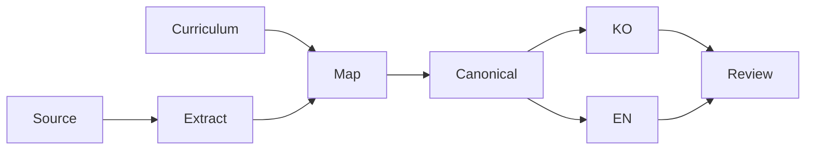

# 지식 관리 방법

## 목적과 입력

대화의 시간순 요약 대신 다시 찾아 쓸 수 있는 지식을 만든다. 커리큘럼은 구조를 정하고 학습 자료는 보존할 내용을 제공한다. 둘 중 하나만 있어도 시작할 수 있다. 커리큘럼만 있는 주제를 이미 학습한 것처럼 채우지 않는다.

## 처리 과정



1. 자료 전체를 읽는다. 접근하지 못한 부분은 명시한다. 추출된 Markdown이 있으면 공유 링크보다 우선한다.
2. 개념, 예시, 제약, 실패 상황, 오해와 질문에 안정적인 지식 ID를 부여한다.
3. 기존 주제와 중복을 찾고 통합할 위치를 정한다. 기존의 올바른 지식과 새 지식을 함께 보존한다.
4. 한국어와 쉬운 영어 페이지를 만든다. 두 언어는 문장 대신 지식 수준에서 같아야 한다.
5. 모든 ID의 반영 상태와 목적지를 기록한다. 보류와 제외에는 구체적인 이유를 남긴다.
6. 의미, 영어 표현, 개인정보, 링크와 빌드를 검토한다. 검증한 Markdown을 Git과 vault에 저장한다.

## 상태와 검증

`not-started`는 아직 학습하지 않은 상태다. `overview`, `studied`, `deep-dive`는 실제 자료와 검토 깊이에 맞춰 사용한다. 학습 자료만으로 운영 준비가 끝났다고 판단하지 않는다.

모든 항목의 처리 상태를 기록한 것과 모든 항목을 공개한 것은 다르다. 보류 항목도 추적은 되지만 공개 지식의 범위에는 들어가지 않는다. 파일이 쌍으로 존재해도 의미가 같다는 증거는 아니다. 예시, 경고, 제약, 다이어그램과 실패 시나리오까지 비교한다.

## 주의할 점

회사 내부 정보와 개인정보는 공개하지 않는다. 재사용할 개념을 남기고 식별자를 양쪽 언어에서 동일하게 일반화한다. 공부한 내용과 실제 경험을 구분한다. 버전별 동작은 공식 문서와 실제 설정으로 확인한다.

Git의 Markdown이 원본이다. vault는 읽고 검색할 수 있는 사본이다. vault에서 바뀐 파일은 자동으로 덮어쓰지 않는다. 변경을 원본에 반영할지 검토한 뒤 다시 동기화한다.

## LLM in Practice

### 시나리오: 지식 누락 검토

#### 상황

학습 자료에서 문서 초안을 만들었고 중요한 내용이 빠졌는지 확인하려 한다.

#### LLM에 제공할 맥락

민감 정보를 제거한 원문, 지식 목록, 반영표와 한영 문서 전체를 제공한다.

#### 예시 프롬프트

```text
Compare the source items with both handbook pages.
List missing concepts, examples, constraints, and failure cases.
Separate observations from hypotheses.
Do not invent missing facts. Point to evidence for each finding.
```

#### 기대 결과

누락이 의심되는 지식 ID, 해당 근거와 수정 후보 위치를 받는다.

#### LLM이 틀릴 수 있는 부분

비슷한 표현을 같은 지식으로 오해하거나 경고의 강도 차이를 놓칠 수 있다. 원문에 없는 내용을 채울 수도 있다.

#### 검증 방법

각 지적을 원문과 두 언어 문서에 대조한다. 기술 사실은 공식 문서, 설정 또는 테스트로 검증한다. LLM의 답은 작업 가설이며 최종 사실 판정이 아니다.

## 관련 항목

[용어집](../glossary/index.md) · [홈](../index.md)
