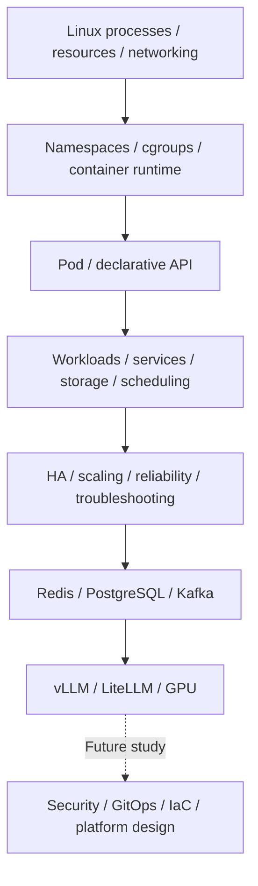

# 플랫폼·인프라 기초와 학습 현황

제공된 **Platform / Infrastructure / AI Serving — Basic Study Notes**의 Chapter 1~9를 정리했다. 첫 자료는 Linux·컨테이너·Kubernetes 1~3장까지였고, 후속 자료로 Redis·PostgreSQL·Kafka·vLLM·LiteLLM·GPU의 4~9장을 추가했다. 보안과 최종 AI 플랫폼 설계 등 10~15장은 후속 목차다.

이 자료의 “완료”는 플랫폼 엔지니어가 알아야 할 **Basic 핵심 개념 학습**이다. 실제 Linux/Docker/Kubernetes 명령을 실행했거나 운영 클러스터를 구축·시험했다는 의미가 아니다. 구체적인 배포판·kernel·cgroup·runtime·Kubernetes·CNI·CSI·cloud 버전은 제공되지 않았다. 버전에 민감한 동작은 각 문서에서 공식 근거와 조건을 구분한다.

## 최신 자료의 범위

아래 범위·연결 구조·진도 구역은 새 원문을 그대로 보존했다. 각 기술 문서에서는 본문 뒤 보완 구역에서 해당 절의 정정·적용 조건을 확인한다.

<!-- SOURCE INTRO START -->

# Platform / Infrastructure / AI Serving — Basic Study Notes

> 범위: Chapter 4 ~ Chapter 9  
> 이전 파일: Chapter 1 ~ Chapter 3  
> 수준: Basic — 플랫폼 엔지니어가 반드시 알아야 할 핵심 개념 중심  
> 포함: 본 학습 내용 + 중간 실무 질문/보충 설명  
> 현재까지 완료: Redis / PostgreSQL / Kafka 운영 / vLLM / LiteLLM / GPU Infrastructure

---

<!-- SOURCE INTRO END -->

## 학습 경로



학습 순서이며 완성된 배포 구조나 모든 작업에 필요한 도구 조합을 뜻하지 않는다. 점선은 아직 학습하지 않은 보안 이후 주제를 가리킨다.

| 완료한 장 | 정규 문서 | 범위 |
|---|---|---|
| 1 | [Linux·네트워크·컨테이너](linux-containers.md) | Process/PID·CPU/memory·FD·network·signal·namespace·cgroup·runtime·OCI image·container network/storage·troubleshooting |
| 2 | [Kubernetes 핵심](kubernetes-core.md) | Control plane/worker·선언형 API·Pod·workload controllers·Service·Ingress/Gateway·config·storage·scheduling·resources·probes·network |
| 3 | [Kubernetes 운영 기초](kubernetes-operations.md) | Cluster design/HA·etcd·CNI·CSI·CoreDNS·autoscaling·reliability·node operations·upgrade·증상별 진단 |
| 4 | [Redis](redis.md) | 자료 구조·공유 상태·영속성·복제·Sentinel·Cluster·성능·Kubernetes |
| 5 | [PostgreSQL](postgresql.md) | 연결·MVCC·index·query·HA·WAL·backup·PITR·운영·Kubernetes |
| 6 | [Kafka 운영](kafka.md) | ISR·leader·용량·신뢰성 설정·보안·운영·Kubernetes |
| 7 | [vLLM](vllm.md) | Prefill/decode·GPU/KV Cache 메모리·batching·성능·병렬화·양자화·서빙 |
| 8 | [LiteLLM](litellm.md) | Gateway·routing·load balancing·retry·rate limit·budget·auth·cache |
| 9 | [GPU 인프라·스케줄링](gpu-infrastructure.md) | GPU stack·node pool·sharing·multi-GPU/node·용량·장애 조사 |

처음에는 각 구성 요소의 역할과 경계를 읽는다. 이후 “Pod Pending → scheduling/resource”, “앱 응답 실패 → process/port/DNS/Service”, “종료 실패 → signal/PID 1/grace period”처럼 원문의 증상을 해당 계층과 연결한다. 원인 하나를 증상만으로 확정하지 않고 실제 상태·event·log로 가설을 검증한다.

## 후속 커리큘럼

아래는 아직 본문이 제공되지 않은 **not-started** 과정이다. 다음 학습은 Chapter 10 Platform Security다.

| Chapter | 다음 주제 |
|---|---|
| 10 | Platform Security — 다음 과정 |
| 11 | CI/CD, Helm, Argo CD & GitOps |
| 12 | Terraform & Infrastructure as Code |
| 13 | Multi-tenancy, Quotas & Cost Control |
| 14 | Internal Developer Platform / Self-Service |
| 15 | End-to-End AI Platform Architecture |

[데이터 플랫폼 과정](../data-platform/curriculum.md)의 데이터 처리 관점과 이번 서비스 운영·서빙 관점을 연결해 읽는다. 이전 1~3장 자료가 후속으로 남겼던 4~9장은 이번 자료로 갱신했고, 10~15장의 학습 내용을 만들어 넣지 않는다.

## 명령과 실무 예시 사용

문서의 shell·YAML은 학습용 예시다. `server`, `backend`, `my-api` 등은 가상 대상이며 실제 주소가 아니다. 진단도 읽을 권한과 출력의 민감정보를 확인하고, 설정 변경·신호 전송·drain·restore 같은 작업은 영향과 복구 조건을 검토한 뒤 실제 권한 아래 수행한다. 이 자료 반입 과정에서는 그러한 명령을 실행하지 않았다.

각 기술 문서 끝의 LLM 예시는 한국어·English 탭으로 선택하고 줄바꿈을 유지해 복사할 수 있다. 모델 답변은 관찰·가설·추가 확인으로 나누고 실제 공식 문서·설정·상태와 대조한다. 자동 진단 결과만으로 운영 변경을 승인하지 않는다.

[데이터 플랫폼 전체 구조](../data-platform/architecture.md)는 데이터 처리 역할을, 이 영역은 실행 환경과 클러스터 운영을 설명한다. [용어집](../glossary/index.md) · [실무 프롬프트 모음](../prompts/index.md) · [홈](../index.md)

## 원문: 4~9장 전체 연결

<!-- SOURCE CONNECTION START -->

# Chapter 4 ~ 9 전체 연결

```text
Redis
→ 빠른 공유 상태 / Cache / Rate Limit

PostgreSQL
→ 영구 데이터 / Transaction / HA / Backup

Kafka
→ Event Streaming Cluster 운영

vLLM
→ GPU 기반 LLM Inference

LiteLLM
→ LLM Gateway / Routing / Quota / Retry

GPU Infrastructure
→ 실제 Compute / Memory / Scheduling / HA
```

전체 Platform 구조:

```text
Application / User
        ↓
     LiteLLM
        ↓
      vLLM
        ↓
       GPU

Backend Services
├─ Redis
├─ PostgreSQL
└─ Kafka

Kubernetes
├─ Pod / Deployment / StatefulSet
├─ Scheduling
├─ Storage
├─ Networking
└─ GPU Scheduling
```

---

<!-- SOURCE CONNECTION END -->

## 원문: 전체 커리큘럼 상태

<!-- SOURCE STATUS START -->

# 현재 전체 커리큘럼 상태

```text
1. Linux, Networking, Containers ✅
2. Kubernetes Core ✅
3. Kubernetes Production Operations ✅
4. Redis for Platform Systems ✅
5. PostgreSQL for Platform Systems ✅
6. Kafka for Platform Systems ✅
7. vLLM ✅
8. LiteLLM ✅
9. GPU Infrastructure & Scheduling ✅
10. Platform Security ← 다음
11. CI/CD, Helm, Argo CD & GitOps
12. Terraform & Infrastructure as Code
13. Multi-tenancy, Quotas & Cost Control
14. Internal Developer Platform / Self-Service
15. End-to-End AI Platform Architecture
```

> 다음 학습은 **Chapter 10. Platform Security**부터 이어진다.

<!-- SOURCE STATUS END -->
