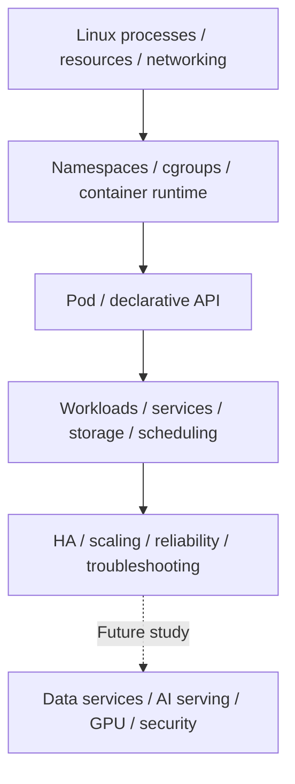

# 플랫폼·인프라 기초와 학습 현황

제공된 **Platform / Infrastructure / AI Serving — Basic Study Notes**의 Chapter 1~3을 정리했다. Linux에서 프로그램이 실행되는 방식부터 컨테이너, Kubernetes 객체와 운영의 연결을 이해하는 기초 과정이다. 제목에 AI Serving이 있지만 vLLM·LiteLLM·GPU·최종 AI 플랫폼 구조는 아직 후속 목차다.

이 자료의 “완료”는 플랫폼 엔지니어가 알아야 할 **Basic 핵심 개념 학습**이다. 실제 Linux/Docker/Kubernetes 명령을 실행했거나 운영 클러스터를 구축·시험했다는 의미가 아니다. 구체적인 배포판·kernel·cgroup·runtime·Kubernetes·CNI·CSI·cloud 버전은 제공되지 않았다. 버전에 민감한 동작은 각 문서에서 공식 근거와 조건을 구분한다.

## 학습 경로

점선은 앞으로 배울 주제로 이어지는 학습 순서다. 완성된 배포 구조나 모든 작업에 필요한 도구 조합을 뜻하지 않는다.

| 완료한 장 | 정규 문서 | 범위 |
|---|---|---|
| 1 | [Linux·네트워크·컨테이너](linux-containers.md) | Process/PID·CPU/memory·FD·network·signal·namespace·cgroup·runtime·OCI image·container network/storage·troubleshooting |
| 2 | [Kubernetes 핵심](kubernetes-core.md) | Control plane/worker·선언형 API·Pod·workload controllers·Service·Ingress/Gateway·config·storage·scheduling·resources·probes·network |
| 3 | [Kubernetes 운영 기초](kubernetes-operations.md) | Cluster design/HA·etcd·CNI·CSI·CoreDNS·autoscaling·reliability·node operations·upgrade·증상별 진단 |

처음에는 각 구성 요소의 역할과 경계를 읽는다. 이후 “Pod Pending → scheduling/resource”, “앱 응답 실패 → process/port/DNS/Service”, “종료 실패 → signal/PID 1/grace period”처럼 원문의 증상을 해당 계층과 연결한다. 원인 하나를 증상만으로 확정하지 않고 실제 상태·event·log로 가설을 검증한다.

## 후속 커리큘럼

아래는 자료에 있는 다음 과정의 목차다. 상태는 **not-started**이며, 제공되지 않은 내용을 만들어 학습 완료로 표시하지 않는다.

| Chapter | 다음 주제 |
|---|---|
| 4 | Redis for Platform Systems — 다음 과정 |
| 5 | PostgreSQL for Platform Systems |
| 6 | Kafka for Platform Systems |
| 7 | vLLM |
| 8 | LiteLLM |
| 9 | GPU Infrastructure & Scheduling |
| 10 | Platform Security |
| 11 | CI/CD, Helm, Argo CD & GitOps |
| 12 | Terraform & Infrastructure as Code |
| 13 | Multi-tenancy, Quotas & Cost Control |
| 14 | Internal Developer Platform / Self-Service |
| 15 | End-to-End AI Platform Architecture |

[데이터 플랫폼 과정](../data-platform/curriculum.md)에서 PostgreSQL·Kafka의 역할이나 AI 데이터를 다뤘어도 이 별도 플랫폼 과정의 후속 장을 완료했다는 뜻은 아니다. 다음 자료가 들어오면 실제로 제공된 범위만 통합한다.

## 명령과 실무 예시 사용

문서의 shell·YAML은 학습용 예시다. `server`, `backend`, `my-api` 등은 가상 대상이며 실제 주소가 아니다. 진단도 읽을 권한과 출력의 민감정보를 확인하고, 설정 변경·신호 전송·drain·restore 같은 작업은 영향과 복구 조건을 검토한 뒤 실제 권한 아래 수행한다. 이 자료 반입 과정에서는 그러한 명령을 실행하지 않았다.

세 기술 문서 끝의 LLM 예시는 한국어·English 탭으로 선택하고 줄바꿈을 유지해 복사할 수 있다. 모델 답변은 관찰·가설·추가 확인으로 나누고 실제 공식 문서·설정·상태와 대조한다. 자동 진단 결과만으로 운영 변경을 승인하지 않는다.

[데이터 플랫폼 전체 구조](../data-platform/architecture.md)는 데이터 처리 역할을, 이 영역은 실행 환경과 클러스터 운영을 설명한다. [용어집](../glossary/index.md) · [실무 프롬프트 모음](../prompts/index.md) · [홈](../index.md)
