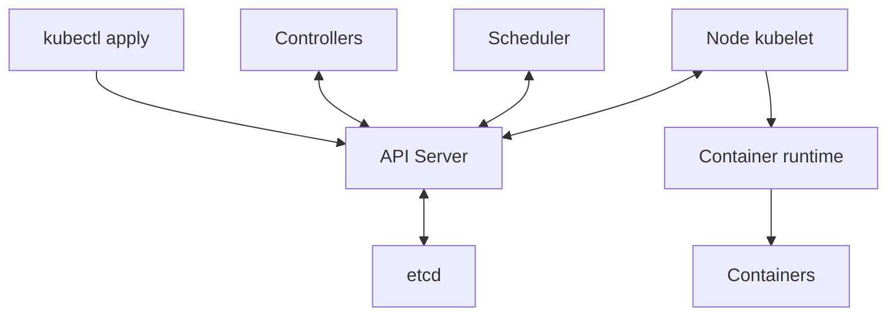
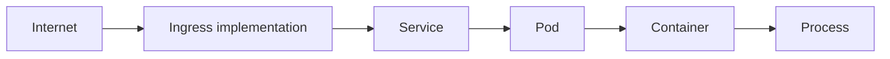

# Kubernetes 핵심 개념

Kubernetes는 여러 서버에서 컨테이너를 **선언한 상태로 계속 맞추는 시스템**이다. “nginx 3개를 유지”하도록 선언하면 3개일 때 유지하고 2개가 되면 controller가 부족한 Pod를 생성하도록 동작한다. 이 Learn 문서의 `studied`는 개념 학습을 뜻한다. 실제 클러스터 구축·명령 실행·장애 실험은 수행하지 않았다. 아래 IP·도메인·설정·수치는 가상 학습 예시다.

## 1. Control Plane과 Worker Node

| 위치 | 구성요소 | 책임 |
| --- | --- | --- |
| Control Plane | API Server | Kubernetes API의 중앙 입구. `kubectl get pods` 요청을 받아 정보를 반환한다 |
| Control Plane | Scheduler | 아직 배정되지 않은 Pod를 실행할 Node를 선택한다 |
| Control Plane | Controller Manager | controller들을 실행하여 관찰한 상태를 desired state에 맞춘다 |
| Control Plane | etcd | 클러스터의 API 상태 데이터를 저장한다 |
| Worker Node | kubelet | Node의 agent. Pod 명세를 보고 runtime을 통해 컨테이너를 관리한다 |
| Worker Node | Container runtime | containerd 같은 구현체가 컨테이너를 실행한다 |
| Worker Node | kube-proxy 또는 대체 구현 | Service 트래픽이 endpoint로 전달되도록 네트워크를 구성한다 |

Control Plane은 클러스터를 관리하고 Worker는 실제 workload를 실행한다. `kubectl apply` 후 API Server가 받아들인 상태가 etcd에 저장된다. 관련 controller가 필요한 객체를 만들고 Scheduler가 Node를 선택한다. 해당 Node의 kubelet은 runtime을 통해 실행 상태를 맞춘다. 각 구성요소가 API를 보고 비동기로 동작하므로, 아래 그림은 하나의 동기식 함수 호출 스택을 뜻하지 않는다.



controller의 반복적인 조정이 핵심이다. 예를 들어 desired replicas가 3인데 현재 2이면 부족한 하나를 보충하도록 조정한다. 스케줄링·이미지·자원 등의 제약 때문에 목표에 즉시 도달하지 못할 수도 있다.

## 2. 선언형 API: Resource, Object, spec, status

Resource는 Pod, Deployment, Service, ConfigMap, Secret 같은 API 관리 대상이다. `Deployment` 종류의 실제 인스턴스 `my-api`는 object다. 선언형 모델은 “어떻게 매번 실행할지”보다 “어떤 상태여야 하는지”를 표현한다.

```yaml
apiVersion: apps/v1
kind: Deployment
metadata:
  name: my-api
spec:
  replicas: 3
```

이것은 네 필드 `apiVersion`, `kind`, `metadata`, `spec`를 보여주는 **불완전한 설명용 조각**이다. 적용 가능한 Deployment 전체가 아니며 selector와 Pod template 등 필수 정의가 더 필요하다. `spec`는 원하는 상태이고 `status`는 시스템이 관찰하여 보고하는 현재 상태다. 단순히 두 JSON이 같은지 비교하는 것이 아니라, controller가 자신이 담당하는 목표와 관찰 결과를 조정한다.

완전한 manifest를 준비했을 때의 명령 형식은 `kubectl apply -f deployment.yaml`이다. 흐름은 YAML 제출 → API Server에서 object 생성 또는 갱신 → etcd 저장 → controller의 spec 관찰 → 실제 상태 조정이다. API 요청 성공과 workload 준비 완료는 다르다.

## 3. Pod: 컨테이너의 실행 단위

Pod는 Kubernetes에서 배포하는 최소 실행 단위로, 하나 이상의 컨테이너를 묶는다. 일반적인 `Pod → Container → App` 외에 `Pod → App + Sidecar` 구조도 있다. 같은 Pod의 컨테이너는 IP·포트 공간을 공유하여 `localhost`로 통신하고, 설정한 volume을 함께 사용할 수 있다. 모든 파일시스템이나 모든 리소스가 자동으로 공유된다는 뜻은 아니다.

가상 IP 예시는 Pod A `10.244.1.10`, Pod B `10.244.2.15`다. Pod가 대체되면 IP가 바뀔 수 있으므로 보통 Service를 통해 접근한다. Pod는 영구 서버가 아니라 교체 가능한 실행 단위다.

| 개념 | 의미와 예시 |
| --- | --- |
| Lifecycle | 기본 흐름은 `Pending → Running → Succeeded / Failed`. 별도로 상태를 알 수 없는 `Unknown` phase도 있다 |
| `Always` | 컨테이너 종료 시 성공 여부와 관계없이 재시작하는 기본 Pod restart policy |
| `OnFailure` | 실패 종료한 컨테이너를 재시작 |
| `Never` | 해당 policy에 따라 컨테이너를 재시작하지 않음 |
| 일반 Init Container | main app 전에 설정 파일 준비 같은 작업을 완료 |
| Sidecar | app과 함께 로그 수집기·proxy 같은 보조 기능을 실행 |

`Running`은 모든 컨테이너가 준비되어 요청을 받을 수 있다는 뜻이 아니다. 컨테이너 재시작은 기존 Pod 내부에서 일어날 수 있지만 controller가 만드는 대체 Pod는 새 object다. `CrashLoopBackOff` 같은 화면의 상태 설명도 Pod phase와 구분한다. 일반 init container의 완료 순서와 Kubernetes의 별도 sidecar lifecycle 기능을 혼동하지 않는다. [Pod lifecycle](https://kubernetes.io/docs/concepts/workloads/pods/pod-lifecycle/), [Sidecar containers](https://kubernetes.io/docs/concepts/workloads/pods/sidecar-containers/)

## 4. ReplicaSet과 Deployment

ReplicaSet은 필요한 replica 개수를 유지한다. 목표가 3이면 2개일 때 하나를 만들고 4개일 때 하나를 줄이는 식이다. 보통 ReplicaSet을 직접 운영하기보다 Deployment를 사용한다.

```text
Deployment → ReplicaSet → Pod
v1 v1 v1 → v2 v1 v1 → v2 v2 v1 → v2 v2 v2
Revision 1: image v1
Revision 2: image v2
Revision 3: image v3
```

Deployment는 ReplicaSet을 관리하며 rollout, rolling update, rollback을 제공한다. 위 순서는 점진적 교체를 설명한 그림으로 실제 동시 실행 수는 rollout 설정과 준비 상태에 따라 달라진다. 원문의 “배포 변경마다 revision”은 정확히 **Pod template 변경이 rollout을 일으킬 때**로 한정한다. replica 수만 바꾸는 scaling은 새 revision을 만들지 않는다. rollback은 보존된 이전 revision의 Pod template으로 되돌리는 것이며 외부 DB 변경까지 취소하지 않는다. [Deployments](https://kubernetes.io/docs/concepts/workloads/controllers/deployment/)

## 5. StatefulSet: 안정적인 정체성과 저장공간

Deployment의 Pod는 일반적으로 서로 대체 가능하며 stateless 앱에 맞는다. StatefulSet은 각 Pod의 안정적인 이름, 네트워크 정체성, 개별 저장공간이 중요할 때 사용한다.

```text
postgres-0, postgres-1, postgres-2

db-0 → Volume 0
db-1 → Volume 1
db-2 → Volume 2

Ordered startup: db-0 → db-1 → db-2
```

예를 들어 `db-1`이 대체되면 같은 ordinal 이름과 연결된 저장소를 다시 사용할 수 있다. 이는 동일한 Pod object·UID·IP가 살아난다는 의미는 아니다. PostgreSQL, Kafka, Redis Cluster, ZooKeeper 계열이 대표 학습 예시이며 Operator가 애플리케이션별 운영 로직을 추가할 수 있다.

기본 `OrderedReady`는 순서와 readiness를 고려한다. Pod 생성은 ordinal 오름차순이며 scale-down 종료는 역순이다. StatefulSet 리소스 자체를 삭제할 때 순차 종료가 보장된다는 뜻은 아니다. `Parallel` policy는 순서 제약을 완화한다. StatefulSet 이름만으로 DB 복제·합의·백업이 구현되지는 않는다. 저장소를 실제로 준비하고 애플리케이션 복구 절차를 별도로 설계해야 한다. [StatefulSets](https://kubernetes.io/docs/concepts/workloads/controllers/statefulset/)

## 6. DaemonSet, Job, CronJob 선택

| Resource | 실행 목적 | 원문 예시 |
| --- | --- | --- |
| DaemonSet | 조건에 맞는 각 Node에 Pod 실행 | 로그 수집·모니터링·네트워크 agent |
| Job | 완료될 작업을 실행하고 완료를 추적 | 데이터 마이그레이션, 배치 처리, 일회성 파일 변환, DB 초기화 |
| CronJob | 일정에 따라 Job 생성 | 매일 새벽 2시 백업, 매시간 통계 집계 |

“각 Node”는 selector·taint 등 배치 조건을 만족하는 Node 범위다. “한 번 하는 작업”이 정확히 한 번 실행을 보장하지는 않는다. Job은 실패 후 재시도할 수 있고 예약 작업도 중복·누락 가능성을 고려해야 한다. 시간대, 동시 실행, 재시도와 idempotency를 운영 요구에 맞춰 검토한다. 위 일정은 실제 운영 설정이 아니다. [Jobs](https://kubernetes.io/docs/concepts/workloads/controllers/job/), [CronJob](https://kubernetes.io/docs/concepts/workloads/controllers/cron-jobs/)

## 7. Service: 바뀌는 Pod 앞의 접근 지점

Service는 바뀌는 Pod 집합에 접근하는 안정적인 추상화다. 보통 label selector로 대상을 찾는다. Pod A·B·C에 `app=my-api` label이 있고 Service selector가 같으면 해당 Pod들이 대상 후보가 된다. 준비 상태 등도 실제 전달에 영향을 준다.

```text
Client → Service → Pod A / Pod B / Pod C
```

| 유형 | 목적 | 예시와 경계 |
| --- | --- | --- |
| ClusterIP | 클러스터 내부 접근용 가상 IP | Pod 교체와 접근 주소를 분리 |
| NodePort | Node 주소의 지정 포트로 접근 | `NodeIP:30080 → Service → Pod`; 실제 외부 접근은 routing·방화벽·Node 주소 설정에 따름 |
| LoadBalancer | 외부 load balancer와 연동 | `Internet → Cloud Load Balancer → Service → Pods`; 지원하는 구현체가 필요 |
| Headless | 가상 ClusterIP 없이 endpoint를 발견 | `clusterIP: None`; StatefulSet·DB cluster·Kafka처럼 개별 주소가 필요한 경우 |

Service가 항상 하나의 고정 가상 IP를 제공하는 것은 아니다. Headless Service는 이 설명의 예외다. 또한 Kubernetes 선언만으로 모든 환경에 외부 load balancer가 생기는 것은 아니다. [Service](https://kubernetes.io/docs/concepts/services-networking/service/)

## 8. Ingress와 Gateway API: HTTP 요청의 목적지

Service는 Pod 집합의 접근 지점을 제공한다. Ingress는 외부 HTTP/HTTPS 요청의 host·path를 보고 어느 Service로 보낼지 정의한다.

```text
api.example.com → API Service
web.example.com → Web Service
example.com/api → API Service
example.com/web → Web Service

Ingress Resource → Ingress Controller → Service → Pod
Client --HTTPS--> Ingress --HTTP or HTTPS--> Service → Pod
Gateway → HTTPRoute → Service
```

Ingress Resource만 생성해서 트래픽 처리가 시작되지는 않는다. 해당 규칙을 구현하는 Ingress Controller가 필요하다. TLS termination은 edge에서 클라이언트 HTTPS 연결을 끝내는 방식이다. 그 뒤 구간을 HTTP로 할지 HTTPS로 보호할지는 별도 설정·구현에 달려 있다.

Gateway API는 `GatewayClass`, `Gateway`, `HTTPRoute` 등으로 역할과 routing을 더 명확히 나누는 확장 가능한 API다. 역시 지원 controller와 API 설치가 필요하다. 공식 문서는 Ingress API가 동결되어 새 기능 개발은 Gateway API를 권장한다고 설명한다. 기존 Ingress가 즉시 제거된다는 뜻은 아니다. 실제 지원 기능은 선택한 구현체와 버전에서 확인한다. [Ingress](https://kubernetes.io/docs/concepts/services-networking/ingress/), [Gateway API](https://kubernetes.io/docs/concepts/services-networking/gateway/)

## 9. ConfigMap과 Secret: Image에서 설정 분리

| 구분 | 내용 | 예시 |
| --- | --- | --- |
| Container Image | 앱 코드와 실행 구성물 | 동일 image를 dev·staging·production에서 재사용 |
| ConfigMap | 민감하지 않은 환경별 설정 | `APP_ENV=production`, `LOG_LEVEL=info`, `API_URL=http://backend` |
| Secret | 자격증명 같은 민감한 설정 | 이름 예시 `DB_PASSWORD`, `API_KEY`, `TOKEN`; 실제 값은 없음 |

Pod에 환경변수 또는 파일 mount로 전달할 수 있다. 예를 들어 `DB_HOST=postgres`, `DB_PASSWORD=***`는 전달 모양이며 `***`는 실제 비밀번호가 아니다. ConfigMap을 `/app/config.yaml` 파일로 연결하는 방식도 있다.

Secret의 base64는 암호화가 아니다. API 저장소의 at-rest encryption, 최소 권한 RBAC, workload 접근 범위, 로그 노출 방지와 rotation을 검토해야 한다. Vault나 External Secrets 같은 도구를 조합할 수 있지만 자동으로 완전한 보안을 보장하지 않는다. 외부 저장소와 Kubernetes Secret 사이의 복사·접근 경계도 확인한다. 실제 secret을 YAML·Git·프롬프트에 붙여 넣지 않는다. [Secrets](https://kubernetes.io/docs/concepts/configuration/secret/), [Secret good practices](https://kubernetes.io/docs/concepts/security/secrets-good-practices/)

## 10. Volume, PV, PVC, StorageClass

| 용어 | 역할 |
| --- | --- |
| Volume | Pod가 사용하는 저장공간 또는 데이터 제공 방식; 모두 영구 저장소는 아님 |
| PersistentVolume, PV | 클러스터에서 관리하는 storage resource. AWS EBS·NFS·cloud disk 같은 실제 저장소를 표현 |
| PersistentVolumeClaim, PVC | workload가 필요한 용량·접근 조건 등의 storage를 요청하는 resource |
| StorageClass | provisioner와 storage 유형·정책을 정의. 이름 예시는 `fast-ssd`, `standard`, `high-iops` |

```text
Pod → PVC → PV → Disk
PVC request → StorageClass → Provisioner → Disk + PV → PVC binding
postgres-0 → PVC-0 → Disk-0
postgres-1 → PVC-1 → Disk-1
```

Dynamic provisioning은 적합한 StorageClass와 provisioner가 준비되었을 때 요청에 맞춰 storage와 PV를 만든다. 위 화살표는 논리적 의존 관계이며 binding 시점은 정책에 따라 달라질 수 있다. PV는 disk 자체가 아니라 이를 나타내는 API object다. StatefulSet의 Pod별 PVC로 저장공간을 연결해도 access mode·topology·reclaim 정책·백업을 별도로 검토해야 한다. [Persistent volumes](https://kubernetes.io/docs/concepts/storage/persistent-volumes/), [Dynamic provisioning](https://kubernetes.io/docs/concepts/storage/dynamic-provisioning/)

## 11. Scheduling: 어디에 배치할 것인가

아래는 Pod spec 안에 들어갈 설명용 조각이다. `gpu: "true"`는 label 선택이며 실제 GPU 할당 요청을 대신하지 않는다.

```yaml
nodeSelector:
  gpu: "true"
```

| 수단 | 질문과 역할 |
| --- | --- |
| Node Selector | 지정 label을 가진 Node인가 |
| Node Affinity | 더 유연한 Node 조건. `required`는 필수, `preferred`는 선호 |
| Pod Affinity | 특정 Pod와 같은 topology 영역에 가깝게 둘 것인가 |
| Pod Anti-Affinity | 특정 Pod들을 떨어뜨릴 것인가. 예: A→Node 1, B→Node 2, C→Node 3 |
| Taint | Node가 어떤 Pod의 배치·실행을 제한할 것인가; effect에 따라 동작이 다름 |
| Toleration | Pod가 해당 taint를 견딜 수 있는가; 배치를 보장하거나 그 Node로 끌어오지는 않음 |
| Topology Spread | Node·AZ 같은 영역 사이에 Pod 분포를 얼마나 고르게 할 것인가 |

Node Selector/Affinity는 “이 Pod가 어디로 가야 하는가”, taint/toleration은 “이 Node에 어떤 Pod를 허용할 것인가”를 다룬다. GPU Node 전용 배치에서 함께 쓸 수 있다. anti-affinity와 spread 조건을 너무 엄격하게 설정하면 자원이 있어도 배치되지 않을 수 있다. [Assigning Pods to Nodes](https://kubernetes.io/docs/concepts/scheduling-eviction/assign-pod-node/), [Taints and tolerations](https://kubernetes.io/docs/concepts/scheduling-eviction/taint-and-toleration/)

## 12. Requests, Limits, QoS

아래는 컨테이너의 `resources` 설명용 조각이다.

```yaml
resources:
  requests:
    cpu: "500m"
    memory: "1Gi"
  limits:
    cpu: "1"
    memory: "2Gi"
```

CPU request `500m`는 `0.5 CPU`, limit `1`은 `1 CPU`다. request는 Scheduler의 자원 배치 계산 기준이다. Node에 **request 기준으로 할당 가능한 CPU가 2개** 남았는데 새 Pod request가 3개이면 배치할 수 없다. 실제 CPU 사용률이 낮다는 것만으로 충분하지 않다. 원문의 “최소 필요 자원”은 이 예약·배치 기준을 말하며 request가 실제 사용의 상한이라는 뜻은 아니다.

CPU limit은 CPU 시간을 제한하여 throttling으로 나타날 수 있다. memory limit은 초과 사용에 대해 커널의 OOM kill이 발생할 수 있으며 `OOMKilled` 원인으로 관찰된다. CPU와 memory의 enforcement 방식은 다르며 순간적인 limit 초과가 항상 즉시 종료로 관찰되는 것은 아니다. 적용되는 cgroup·kubelet 설정도 확인한다. [Resource management](https://kubernetes.io/docs/concepts/configuration/manage-resources-containers/)

컨테이너별 CPU·memory 설정을 사용하는 기본 모델에서 QoS를 구분한다.

| QoS | 분류 조건 |
| --- | --- |
| Guaranteed | 모든 컨테이너의 CPU와 memory에 양수 request·limit이 있고, 각 자원에서 request = limit |
| Burstable | Guaranteed가 아니면서 하나 이상의 CPU 또는 memory request/limit이 있음 |
| BestEffort | 모든 컨테이너에 CPU·memory request/limit이 없음 |

“request와 limit을 명확히 설정”하는 것만으로 Guaranteed가 되지 않는다. 위 예시는 값이 달라 Burstable에 해당한다. Pod-level resources를 사용하는 버전·설정에서는 Pod 수준 값도 분류에 참여하므로 실제 `status.qosClass`를 확인한다. QoS는 자원 압박 시 처리에 영향을 주는 분류이며 성능 SLA나 장애 면제를 뜻하지 않는다. [Pod QoS](https://kubernetes.io/docs/concepts/workloads/pods/pod-qos/)

## 13. Health Checks: 살아 있음, 준비됨, 시작됨

| Probe | 질문 | 실패 시 의미 |
| --- | --- | --- |
| Liveness | 앱이 계속 정상 동작할 수 있는가 | 설정된 실패 조건에 도달하면 해당 컨테이너 종료·restart policy에 따른 재시작으로 이어짐 |
| Readiness | 지금 요청을 받아도 되는가 | Pod를 unready로 표시하여 일반적인 Service의 ready endpoint 대상에서 제외; probe 실패 자체로 컨테이너를 재시작하지 않음 |
| Startup | 시작 과정이 완료됐는가 | 성공하기 전에는 liveness와 readiness probe를 시작하지 않음; 실패 임계값 도달 시 재시작 대상이 될 수 있음 |

가상 vLLM 예시는 `시작 → Model Load → GPU Memory 준비 → 몇 분 뒤 Ready`다. 느린 초기화를 liveness 장애로 오인하지 않도록 startup probe의 시간 여유를 실제 측정에 맞춘다. “몇 분”은 고정 권장값이 아니다. `Running`이어도 `Ready`가 아닐 수 있고 readiness 실패를 재시작으로 해결할 이유도 항상 있는 것은 아니다. Service 설정이 unready endpoint를 게시하도록 되어 있다면 일반적인 제외 설명의 예외도 살핀다. [Probes](https://kubernetes.io/docs/concepts/workloads/pods/probes/)

## 14. Pod, Service, DNS, CNI의 네트워크 역할

Pod A `10.244.1.10`과 Pod B `10.244.2.20`이 통신하는 가상 예시에서 Pod 네트워크 구현은 주소와 Node 간 연결을 제공한다. CNI는 Container Network Interface이며 Calico·Cilium 같은 구현체가 관련 역할을 맡는다. Kubernetes networking model과 CNI plugin의 실제 지원 범위는 구분한다.

Service 접근은 `Client Pod → Service → Pod A/B/C`다. `http://my-api:8080` 같은 Service 이름은 같은 namespace의 DNS 검색 맥락에서 사용할 수 있다. 일반 Service DNS는 Service 주소를, Headless Service DNS는 준비된 endpoint 주소를 찾는 데 쓰인다. CoreDNS는 흔히 사용하는 cluster DNS 구현이다.

kube-proxy는 Service에서 endpoint로 보내는 네트워크 규칙을 구성한다. 모든 패킷이 kube-proxy 프로세스를 통과한다는 뜻은 아니다. 일부 네트워크 구현체는 자체 Service proxy 기능으로 kube-proxy를 대체한다. CNI·DNS·Service routing을 같은 구성요소로 취급하면 장애 위치를 잘못 짚을 수 있다. [Kubernetes networking](https://kubernetes.io/docs/concepts/services-networking/), [Service DNS](https://kubernetes.io/docs/concepts/services-networking/dns-pod-service/)



위 그림은 외부 요청이 앱 process에 도달하는 논리적 경로다. 실제 패킷 경로는 Ingress와 Service 구현에 따라 Pod endpoint에 직접 연결될 수 있다.

## 학습 경계와 다음 확인

이 문서는 원문 Chapter 2의 14개 항목을 보존하며 원문의 기초 설명을 공식 문서에 맞춰 보완했다. 특히 revision의 발생 조건, Headless Service, Secret encoding, QoS, probe와 Pod phase, 네트워크 구현의 경계를 구분했다. 공식 문서 확인일은 2026-09-27이며 특정 Kubernetes 버전에서 실행했다는 주장은 하지 않는다.

면접에서는 “선언한 상태는 API에 저장하고 controller가 조정한다. Scheduler는 배치하고 kubelet/runtime은 실행한다. Service는 접근을 추상화하고 readiness는 요청을 받을 상태를 나타낸다”는 연결부터 설명한다. 실제 장애에서는 object·events·상태·로그·설정·측정값을 대조한다. 이어서 [Linux·컨테이너 기초](linux-containers.md)와 [Kubernetes 운영](kubernetes-operations.md)을 읽는다.

## LLM in Practice: 모델 서버의 Running과 Ready 구분

**상황:** 가상의 모델 서버 Pod는 Running이지만 Service 요청이 실패한다. 초기 모델 로딩인지 probe·selector·port·자원 문제인지 아직 모른다.

**LLM에 제공할 맥락:** 비식별 Pod status·events·종료 이유, Deployment와 Service의 selector·port, probe 설정, startup 시간 측정, request/limit 및 CPU·memory 지표를 준다. secret 값과 실제 내부 주소는 제거한다.

**예시 프롬프트:**

=== "한국어"

    ```text {.prompt}
    [맥락]
    가상 모델 서버는 Running이지만 Service 요청이 실패합니다.
    Pod 상태·events·종료 이유: [비식별 관찰]
    selector·port·probe 설정: [검토할 설정]
    startup 시간·request/limit·CPU/memory 지표: [측정값]
    [요청]
    재설계 전에 기존 요청 경로와 준비 상태를 검토하세요.
    관찰·가정·가설·누락 근거를 구분하세요.
    [출력]
    가능한 원인별 지지·반박 근거와 다음 읽기 전용 확인을 표로 주세요.
    변경 후보별 영향 범위와 검증 조건을 주세요.
    [검증]
    Running과 Ready, restart와 Pod 교체를 구분하세요.
    공식 문서·events·endpoint·probe·로그·자원 측정으로 대조하세요.
    Secret 값을 요구하거나 명령·재시작·자원 변경을 실행하지 마세요.
    ```

=== "English"

    ```text {.prompt}
    [Context]
    A hypothetical model server is Running, but Service requests fail.
    Pod status, events, and termination reasons: [sanitized observations]
    Selectors, ports, and probe settings: [configuration for review]
    Startup time, requests/limits, and CPU/memory metrics: [measurements]
    [Task]
    Review the existing request path and readiness before proposing a redesign.
    Separate observations, assumptions, hypotheses, and missing evidence.
    [Output]
    Give a table of evidence for and against each cause and the next read-only checks.
    Give the impact and validation conditions for each proposed change.
    [Checks]
    Distinguish Running from Ready and a restart from Pod replacement.
    Compare official docs, events, endpoints, probes, logs, and resource metrics.
    Do not request Secret values or execute commands, restarts, or resource changes.
    ```

**기대 결과:** 관찰과 가설을 나눈 표, 다음에 읽을 증거, 각 가설을 지지·반박할 조건, 변경 전 검토해야 할 영향 범위다.

**틀릴 수 있는 부분:** Running을 Ready로 간주하거나 모든 503을 liveness 실패로 단정할 수 있다. request와 실제 사용량, CPU throttling과 OOM, Secret encoding과 암호화를 혼동할 수 있다.

**검증 방법:** 실제 버전의 공식 문서와 object 상태·events·probe 결과·endpoint·로그·자원 측정을 대조한다. 권한 있는 사람이 안전한 시험 환경에서 최소 변경을 검증한다. LLM 출력은 가설이며 실행·재시작·자원 증설 승인이 아니다.

[플랫폼 인프라 학습 안내](index.md) · [핸드북 홈](../index.md)
