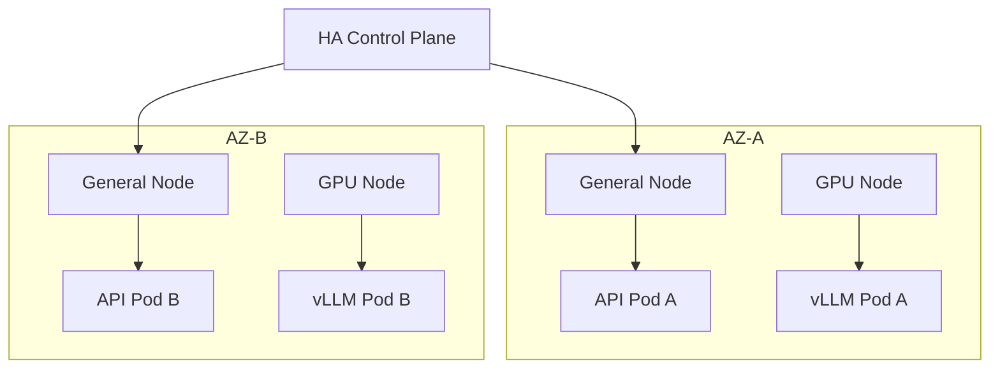
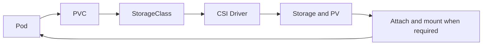
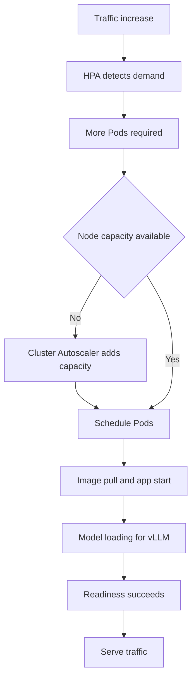

# Kubernetes 운영 기초

Basic Chapter 3의 개념 학습 기록이다. 실제 클러스터 운영, 장애 훈련, 업그레이드나 명령 실행을 완료했다는 뜻은 아니다. 목표는 Pod 실행에 더해 서버 장애, 트래픽 증가, Node 교체, 업그레이드에서도 서비스를 유지하는 방법을 이해하는 것이다. 선행 내용은 [Kubernetes 핵심](kubernetes-core.md)과 [Linux·컨테이너](linux-containers.md), 전체 범위는 [플랫폼 인프라 학습 안내](index.md)에서 확인한다.

이 페이지의 명령은 실행하지 않은 학습 예제다. 조회 명령도 허가된 환경에서 사용하며, `cordon`, `drain`, 복구·교체는 운영 상태를 바꾼다. 예제 게시는 실제 변경·삭제·복구 실행에 대한 승인이 아니다.

## 3.1 클러스터 설계: 한 대의 장애를 견디는 구조

단일 Control Plane은 관리 기능의 Single Point of Failure가 될 수 있다. 여러 Control Plane으로 HA를 구성하고, Worker도 여러 대에 분산한다. 예를 들어 Node A/B/C가 각각 API Pod를 실행하면 한 Node 장애 시 다른 Node의 Pod가 요청을 처리할 수 있다. replica 수만 늘리고 같은 Node에 모아두면 장애 범위를 분리하지 못한다.

Node Pool은 용도별 Node 그룹이다.

| Pool | 학습 예 | 설계 의도 |
| --- | --- | --- |
| General | 일반 Backend | 일반 서비스 용량 |
| GPU | vLLM | GPU가 필요한 추론 |
| Batch | Batch Job | 배치 작업 용량 |

Failure Domain은 함께 실패할 수 있는 범위다. Pod 1/2/3을 Node A/B/C에 나누고, Cloud에서는 AZ 장애도 고려한다. 간단한 예는 AZ-A의 Node 1/Pod A와 AZ-B의 Node 2/Pod B다. 플랫폼 전체로 확장하면 각 AZ에 General·GPU Node를 둘 수 있다. 이는 가상 설계 예이며 특정 제품·노드 수에 대한 실제 운영 결정이 아니다.



EKS 같은 관리형 Kubernetes에서는 Cloud Provider가 Control Plane과 etcd 운영을 맡는다. 애플리케이션 replica, 배치 정책, Node 용량과 데이터 보호까지 자동 해결됐다고 해석하지 않는다. 관리형 서비스별 책임 범위를 따로 확인한다.

## 3.2 etcd: 클러스터의 기억장치

etcd는 Kubernetes의 클러스터 상태 저장소다. Pod, Deployment, Service, ConfigMap/Secret, 클러스터 설정 같은 API 객체 상태를 저장하며 API Server가 etcd와 통신한다. etcd에 문제가 생기면 새 Pod 생성이나 Deployment·Service 변경 같은 관리 작업이 영향을 받는다. 이미 실행 중인 모든 애플리케이션이 즉시 중단된다는 뜻은 아니다.

Quorum은 합의를 유지하는 과반수다. 멤버가 3개면 최소 2개가 통신하며 정상적으로 참여해야 한다. 단순히 프로세스가 살아 있는 것만으로 충분하지 않다. 흔한 홀수 구성은 3개와 5개이며 각각 과반수 2개와 3개가 필요하다.

```text
정상 클러스터 → etcd snapshot → 장애 → snapshot으로 복구
```

백업은 클러스터 상태 복구에 중요하다. 다만 etcd snapshot은 애플리케이션 Volume 데이터 백업과 다르다. 복구할 시점, snapshot 무결성, 보관 접근 권한, 별도의 Volume 복구 절차를 함께 검토한다. snapshot에는 Secret 등 민감한 상태가 포함될 수 있으므로 외부 공유 자료로 사용하지 않는다.

공식 etcd 3.6 복구 문서에서 snapshot 저장은 `etcdctl snapshot save`, 복구는 `etcdutl snapshot restore`로 구분한다. 복구는 새 논리 클러스터를 만들며 멤버들은 같은 snapshot을 사용한다. Kubernetes에서는 과거 revision으로 되돌아가면 informer cache와 watch에 문제가 생길 수 있어 revision bump와 compaction 처리를 검토해야 한다. 실제 복구는 설치 버전에 맞는 절차와 격리된 복구 검증이 필요하다. 여기서는 실행하지 않았다. [etcd 3.6 복구 문서](https://etcd.io/docs/v3.6/op-guide/recovery/)

## 3.3 CNI: Pod 네트워크

CNI는 Container Network Interface다. Kubernetes 네트워크 플러그인은 CNI를 사용해 Pod에 IP를 할당하고 다른 Pod와 통신할 네트워크를 구성한다. CNI 자체는 인터페이스 규격이며 구체적인 routing·policy 처리는 플러그인과 설정에 따른다.

```text
Pod 생성 → IP 할당 → 다른 Pod와 통신
```

| 구현·방식 | 핵심 |
| --- | --- |
| Calico | Pod 네트워크, routing, NetworkPolicy |
| Cilium | eBPF 기반 네트워크 처리, NetworkPolicy, 네트워크 관측 |
| Overlay | Pod → 추가 가상 네트워크 계층 → Host 네트워크 |
| Routed | Pod IP → routing → 다른 Node의 Pod |

eBPF는 Linux Kernel 안에서 네트워크 처리와 관찰 등에 사용하는 기술이다. Cilium은 이를 networking, security, observability에 사용한다. Calico와 Cilium 모두 네트워크 정책을 지원하지만, 실제 기능과 호환성은 선택한 구성에 달려 있다.

Overlay와 Routed를 제품 이름에 고정해서 대응시키면 안 된다. Calico는 overlay와 non-overlay 방식을 지원하고, Cilium도 encapsulation과 native routing 등 여러 모드를 제공한다. Underlay의 Pod IP 경로 지원, MTU, Cloud 제약을 검토한다. [Calico 네트워크 선택](https://docs.tigera.io/calico/latest/networking/determine-best-networking), [Cilium routing](https://docs.cilium.io/en/stable/network/concepts/routing/)

## 3.4 CSI: Storage 연결과 장애 경계

CSI는 Container Storage Interface다. AWS EBS, NFS, Ceph, Google Persistent Disk, Azure Disk처럼 서로 다른 Storage 시스템을 연결하는 표준 인터페이스다. Kubernetes에서 필요한 저장공간을 선언하면 CSI Driver가 실제 Storage와의 연동을 담당한다. Driver 예는 EBS CSI Driver, EFS CSI Driver, Ceph CSI다.

동적 프로비저닝의 개념 흐름은 다음과 같다. 이미 있는 PV를 사용하는 경우처럼 StorageClass가 모든 경로에 필수인 것은 아니다.



AWS 예는 `Pod → PVC → EBS CSI Driver → AWS EBS Volume`이다. Pod가 Node A에 배치되면 EBS Volume을 Node A에 attach하고 컨테이너에 mount하는 단계가 필요할 수 있다. 모든 Storage가 같은 attach 방식이나 제약을 갖는 것은 아니다. PVC는 PV에 바인딩되며, StorageClass는 동적 생성의 provisioner와 정책을 나타낸다. [Persistent Volumes](https://kubernetes.io/docs/concepts/storage/persistent-volumes/)

Pod가 `Pending`이나 `ContainerCreating`에 오래 머무르면 다음을 나눠 확인한다.

- PVC/PV 상태와 이벤트, StorageClass, CSI Driver 상태
- Storage 자체 장애와 접근 권한
- Volume attach/mount 실패
- Storage와 Node의 Zone 일치 여부

Cloud Disk는 AZ에 묶일 수 있다. 예를 들어 Volume이 AZ-A에 있고 Pod를 AZ-B의 Node에 놓으면 attach가 불가능할 수 있다. Pod 문제처럼 보여도 Storage topology 문제일 수 있다.

## 3.5 CoreDNS: 이름과 연결을 분리해서 본다

CoreDNS는 Kubernetes에서 흔히 사용하는 내부 DNS 서버다. 일반 Service 이름을 Service IP로 해석하는 예를 먼저 이해한다.

```text
API Pod → redis 이름 조회 → CoreDNS → Redis Service IP 반환
API Pod → Redis Service → Redis Pod
```

DNS 조회와 실제 애플리케이션 요청은 다른 단계다. 같은 Namespace에서는 `redis`, `postgres`, `my-api` 같은 Service 이름을 쓸 수 있다. 다른 Namespace의 예는 `redis.cache`다. 일반 Service는 ClusterIP로 해석되지만 headless Service는 Pod 주소를 반환하는 등 규칙이 다르다. [Service·Pod DNS](https://kubernetes.io/docs/concepts/services-networking/dns-pod-service/)

Service가 살아 있어도 DNS 장애 때문에 이름으로 접근하지 못할 수 있다. 예를 들어 `10.0.0.10:5432`는 성공하고 `postgres:5432`는 실패하면 DNS를 의심한다. 이 주소는 원문의 가상 내부 주소 예다. 이름·Namespace·검색 경로·DNS 정책과 CoreDNS를 확인하며, 단서 하나로 CoreDNS 장애를 확정하지 않는다.

```bash
nslookup postgres
dig postgres
kubectl get pods -n kube-system
```

`nslookup`과 `dig`는 도구가 설치되고 문제 Pod와 DNS 조건이 같은 승인된 진단 환경에서 수행하는 예다. Pod와 DNS 요청이 늘면 CoreDNS replica와 CPU/Memory 설정도 중요해진다. 오류·지연·리소스와 요청량을 함께 관찰한다.

## 3.6 Autoscaling: Pod 수·크기·Node 수

| 도구 | 조절 대상 | 원문의 학습 예 |
| --- | --- | --- |
| HPA | Pod replica 수 | CPU 증가에 API Pod 3개 → 6개 |
| VPA | 컨테이너 CPU/Memory requests 권고·조정 | CPU `500m`, Memory `1Gi` → CPU `1`, Memory `2Gi` |
| Cluster Autoscaler | Node 수 | HPA가 Pod 10개 요구 → 자원 부족 Pending → Node 증가 |
| KEDA | 이벤트 기반 workload scaling | Kafka lag 또는 Queue message 수 증가 → Consumer Pod 증가 |

HPA는 CPU, Memory, custom metric 등을 기준으로 desired replicas를 조절한다. CPU utilization 같은 비율은 requests를 기준으로 계산하므로 적절한 requests와 metrics 공급 경로가 필요하다. [HPA](https://kubernetes.io/docs/concepts/workloads/autoscaling/horizontal-pod-autoscale/)

VPA는 별도 구성요소이며 업데이트 모드에 따라 권고만 하거나 Pod 재생성을 수반할 수 있다. In-place 지원도 Kubernetes·VPA 버전과 설정 조건에 따라 다르다. 따라서 “항상 재시작 없이 메모리를 늘린다”고 이해하면 안 된다. [VPA](https://kubernetes.io/docs/concepts/workloads/autoscaling/vertical-pod-autoscale/)

Cluster Autoscaler 같은 Node autoscaler는 배치할 수 없는 Pod와 Node 조건을 보고 용량을 조정한다. 모든 Pending Pod가 Node 추가로 해결되는 것은 아니다. 잘못된 selector, 맞지 않는 GPU pool, Storage Zone, Cloud quota와 pool 상한은 따로 해결해야 한다. [Node autoscaling](https://kubernetes.io/docs/concepts/cluster-administration/node-autoscaling/)

KEDA는 이벤트 소스를 연결하고 HPA에 외부 metric을 제공하는 방식으로 함께 동작한다. KEDA가 HPA를 전부 대체하는 별도 Node autoscaler는 아니다. [KEDA 2.18 개념](https://keda.sh/docs/2.18/concepts/)



일반 앱은 모델 로딩 단계가 없을 수 있다. 어느 경우든 감지, Pod 생성·배치, image pull, 앱 시작, readiness까지 시간이 걸린다. vLLM은 모델 로딩 시간이 더해질 수 있다. 스케일 요청 시점과 실제 처리 용량 증가 시점을 구분해 급증 대비 여유 용량과 시작 시간을 검토한다.

## 3.7 Reliability: 배치 분산과 종료 처리

Reliability는 장애나 배포 중에도 서비스를 유지하려는 성질이다. 여러 replica에 분산·PDB·readiness·graceful shutdown을 함께 적용해 검토한다.

| 수단 | 학습 예와 경계 |
| --- | --- |
| PodDisruptionBudget | `minAvailable: 2`로 drain 등 Eviction API 기반의 자발적 중단에서 가용 Pod 2개를 유지하도록 제한 |
| Pod anti-affinity | API Pod 1/2/3을 Node A/B/C에 분산 |
| Topology spread | Node 또는 AZ에 분산; AZ-A/B/C에 각각 2개 배치 예 |
| Readiness probe | 요청을 받을 준비가 된 Pod를 구분 |
| Graceful termination | 새 요청 유입을 줄이고 기존 요청을 마무리한 뒤 종료 |

PDB는 Node 고장 같은 비자발적 장애를 막지 못한다. 직접 Pod 삭제나 Deployment 자체의 rolling update가 PDB에 의해 모두 차단되는 것도 아니다. 중단된 Pod는 budget에 영향을 주지만 workload rollout은 해당 workload의 업데이트 전략을 따로 설정한다. `minAvailable: 2`는 어떤 장애에서도 무조건 2개가 살아 있다는 보장이 아니다. [Kubernetes disruptions](https://kubernetes.io/docs/concepts/workloads/pods/disruptions/)

원문의 종료 mental model은 `종료 시작 → 새 트래픽 차단 → SIGTERM → 기존 요청 처리 → 정상 종료`다. 실제로는 endpoint 변경 전파와 프로세스 종료가 완벽한 단일 직렬 순서로 보장되지 않는다. 앱이 종료 신호를 처리하고 유예 시간 안에 요청을 마치도록 설계하며, 라우팅 전파와 기존 연결도 고려한다. [Pod lifecycle](https://kubernetes.io/docs/concepts/workloads/pods/pod-lifecycle/)

## 3.8 Node 작업: cordon·drain·pressure·교체

`cordon`은 Node를 unschedulable로 표시해 일반적인 신규 scheduling을 막고 기존 Pod는 유지한다. `drain`은 Node를 비우기 위해 Pod eviction 등을 수행한다. 다음은 실행하지 않은 변경 명령 예다.

```bash
kubectl cordon node-a
kubectl drain node-a
```

`drain`을 “살아 있는 Pod를 다른 Node로 그대로 이동한다”로 이해하면 안 된다. 보통 기존 Pod를 종료하고 workload controller가 대체 Pod를 만들어 다른 Node에 배치한다. 대체 용량, controller 유무, PDB, Storage와 데이터 안전성을 먼저 확인해야 한다.

기본 `drain` 명령은 DaemonSet, 관리 controller가 없는 Pod, 로컬 데이터 등의 조건 때문에 멈출 수 있다. DaemonSet을 무시하는 옵션은 해당 Pod를 다른 곳으로 옮겨주는 기능이 아니다. 강제 옵션으로 경고를 일괄 우회하지 않는다. 유지보수 후 기존 Node를 재사용할 때는 정상 상태를 확인하고 `uncordon` 단계가 필요하다. [안전한 Node drain](https://kubernetes.io/docs/tasks/administer-cluster/safely-drain-node/)

| 상태 | 의미·원인 예 | 영향 |
| --- | --- | --- |
| MemoryPressure | Node 메모리 부족 | Pod eviction 가능 |
| DiskPressure | Container image 과다, 로그 과다, ephemeral storage 부족 | 디스크 압박과 eviction 가능 |
| PIDPressure | 프로세스 수 한도에 대한 압박 | 프로세스·Pod 운영 문제 |

Eviction은 자원 부족 시 일부 Pod를 제거해 Node를 보호하는 동작이다. `자원 부족 → Pressure → 일부 Pod eviction → 대체 Pod가 다른 Node에 배치될 가능성`으로 이해한다. 재배치는 controller, 자원, 배치 제약이 충족돼야 하며 자동 성공을 보장하지 않는다.

Cloud에서는 문제 Node를 고치는 대신 교체하는 방식도 사용한다. 원문의 흐름은 `이상 감지 → cordon → drain → Node 제거 → 새 Node 생성`이다. 실제 작업에서는 새 용량을 먼저 확보할지, local data와 연결된 Volume을 어떻게 보호할지, 실패 시 어디서 중단할지 결정한 뒤 수행한다.

## 3.9 업그레이드: 호환성을 확인하고 순차 변경

Control Plane의 API Server, Scheduler, Controller Manager와 etcd 호환성을 먼저 검토하고, 지원되는 순서대로 관리 영역을 업그레이드한 뒤 Worker를 진행한다. 관리형 Kubernetes는 Provider가 일부 절차를 맡지만 addon과 앱 호환성 확인은 별개다. etcd를 임의로 Kubernetes와 같은 버전 번호로 올린다는 뜻이 아니다.

Worker는 실제 Pod가 실행되므로 전체를 동시에 바꾸지 않는다. 기본 흐름은 `cordon → drain → upgrade 또는 replace → 정상 확인 → 재사용`이다. Node A 완료·정상 확인 후 B, 이어 C처럼 하나씩 또는 일부씩 rolling upgrade한다. drain에서는 PDB와 가용 용량을 함께 확인한다.

업그레이드 전 확인 목록:

1. 현재 Kubernetes 구성요소 버전과 목표 버전
2. 업그레이드 경로와 앱 호환성
3. CNI·CSI 버전 호환성
4. Ingress Controller 호환성
5. 사용하는 API의 deprecated·removed 여부
6. 백업·복구 가능성, PDB, 여유 용량과 단계별 중단 기준

Version skew는 구성요소 사이에 지원되는 버전 차이다. 2026-09-27 확인한 공식 정책에서 HA API Server들은 서로 1 minor 이내여야 한다. kubelet은 API Server보다 새로울 수 없으며 일반적으로 최대 3 minor 오래될 수 있다. kubelet 1.25 미만은 최대 2 minor라는 예외가 있다. 혼합 API Server 버전에서는 허용 범위가 좁아진다. 이것만으로 모든 구성요소의 조합이 지원되는 것은 아니며, 도구·Provider가 더 엄격한 제한을 둘 수 있다. 실제 대상 버전의 전체 정책을 확인한다. [Version skew policy](https://kubernetes.io/releases/version-skew-policy/)

## 3.10 장애 진단: 결과 상태에서 원인 계층으로

오류 상태는 원인 후보를 좁히는 출발점이다. `Pending`은 scheduling 대기를 포함하지만 image 준비 등 시작 전 단계도 포함하므로 “항상 Node에 못 올라간 상태”로 한정하지 않는다. `CrashLoopBackOff`도 Pod phase 자체가 아니라 반복 재시작에 따른 대기 상태 표시이며 원인 이름이 아니다. [Pod lifecycle](https://kubernetes.io/docs/concepts/workloads/pods/pod-lifecycle/)

| 증상 | 원인 후보 | 먼저 확인할 근거 |
| --- | --- | --- |
| Pending | CPU/Memory/GPU 부족, nodeSelector, nodeAffinity, taint/toleration, Pod anti-affinity, PVC/Storage | `describe pod`의 Events, 배치 제약, 자원·PVC |
| CrashLoopBackOff | 앱 오류, ConfigMap/Secret 오류, DB 연결 실패, 실행 명령 오류, liveness 실패 | 컨테이너 상태, 재시작 수, 로그와 이전 인스턴스 로그 |
| OOMKilled | 메모리 limit 초과 또는 Node 메모리 상황과 관련된 OOM | 종료 reason, 메모리 사용 추세, limit, Node 상태 |
| ImagePullBackOff | image 이름 오타, 없는 tag, registry 인증 실패, network | image 경로·tag, 이벤트, 권한과 연결 |
| 이름 연결만 실패 | DNS·Namespace·검색 경로·CoreDNS | IP와 이름 비교, DNS 조회, DNS 서버 상태 |
| Service 연결 실패 | Service/EndpointSlice, port, CNI, NetworkPolicy | Pod부터 Service, Ingress 순서로 연결 경계 |
| ContainerCreating 장기 대기 | image 준비, Storage attach/mount, Pod network 준비 등 | 이벤트와 관련 Driver 상태 |

### 로그·자원·배치

원문의 반복 crash 흐름은 `시작 → crash → 재시작 → crash → 재시작`이다. 현재 로그만으로 원인을 놓칠 수 있어 이전 인스턴스 로그도 확인한다. 아래 `<pod>`는 실제 승인된 Pod 이름으로 바꿀 자리이며, 다중 컨테이너라면 대상 컨테이너도 구분한다.

```bash
kubectl get pods
kubectl describe pod <pod>
kubectl logs <pod>
kubectl logs <pod> --previous
```

OOM의 학습 예는 `Memory 증가 → limit 초과 → OOMKilled`다. 메모리 누수를 확인하고, 적절한 limit 조정과 앱 메모리 사용량 감소를 검토한다. limit만 무작정 늘리면 Node 압박이나 누수 원인을 해결하지 못한다.

Scheduling에서는 CPU·Memory·GPU뿐 아니라 nodeAffinity, nodeSelector, taint/toleration, Pod anti-affinity를 확인한다. `0/5 nodes are available`은 5개 모두 배치 조건을 만족하지 못했다는 단서다. 상세 이벤트에서 각 이유를 확인한다.

### 네트워크·DNS·스토리지

네트워크는 `Pod 자체 접근 → Service 접근 → Ingress 접근` 순서로 경계를 좁힌다. Pod IP, Service, Endpoint/EndpointSlice, CNI, NetworkPolicy, port를 확인한다. 예를 들어 Service의 대상 port가 `8080`인데 앱은 `8000`에서 listen하면 연결이 실패할 수 있다.

`10.0.0.10:5432 → 성공`, `postgres:5432 → 실패`는 DNS 진단을 시작할 학습 예다. `nslookup postgres`로 해석 여부를 확인한다. CoreDNS가 가능한 원인이지만 이름과 namespace가 잘못됐을 가능성도 남긴다.

Stateful Pod가 `Pending` 또는 `ContainerCreating`이면 PVC 상태, PV 상태, CSI Driver, Volume attach, AZ를 확인한다. 네트워크와 스토리지는 공통 하부 계층이므로 앱 재시작만 반복하기 전에 이벤트와 실제 연결 경계를 살핀다.

### 진단 순서와 학습 경계

```text
1. Pod 상태
2. kubectl describe pod
3. Events
4. kubectl logs와 필요한 이전 로그
5. CPU / Memory
6. Scheduling 조건
7. Network / DNS
8. Storage
```

이 순서는 출발점이지 모든 사고에 고정 적용하는 규칙은 아니다. 관찰된 증거에 따라 분기하고 변경 전후를 비교한다. 운영 전체 흐름은 `Cluster HA → etcd → CNI/CSI/DNS → Autoscaling → Reliability → Node 작업 → Upgrade → Troubleshooting`이다. 면접에서는 replica만으로 가용성을 보장하지 못하는 이유와, PDB·Node 용량·Storage topology·종료 처리의 경계를 함께 설명한다.

## LLM in Practice

### Node drain 전 가용성과 막힘 원인 검토

**상황:** 가상의 3-replica API를 운영하는 Node의 유지보수 계획을 검토한다. 아직 drain은 실행하지 않았다.

**LLM에 줄 맥락:** 비식별화한 Pod 배치·Node 여유 자원, PDB 상태, readiness, Storage Zone, 종료 시간, Kubernetes와 addon 버전, 유지보수 허용 범위. Secret 값·인증 정보·실제 내부 주소는 제외한다.

**예시 프롬프트:**

=== "한국어"

    ```text {.prompt}
    [맥락]
    API replica는 3개이며 PDB minAvailable은 2다.
    배치·여유 자원·readiness·Storage Zone: [비식별 관측값]
    Kubernetes와 addon 버전: [버전]
    유지보수 범위와 종료 시간: [조건]
    아직 cordon이나 drain은 실행하지 않았다.
    [요청]
    계획을 먼저 검토하고 관측 사실, 가정, 누락 근거를 분리하라.
    PDB와 재배치 용량 때문에 drain이 막힐 조건을 설명하라.
    Node 고장과 Eviction API 기반 중단의 차이를 반영하라.
    [출력]
    원인 가설, 필요한 조회, 진행 조건, 중단 조건 표를 작성하라.
    변경·삭제 명령의 실행 승인을 추정하지 말라.
    [검증]
    실제 Events, PDB 상태, 자원, 버전별 공식 문서로 확인하라.
    실행 전 담당자가 검토할 항목과 남은 불확실성을 제시하라.
    ```

=== "English"

    ```text {.prompt}
    [Context]
    The API has 3 replicas and PDB minAvailable is 2.
    Placement, spare resources, readiness, Storage Zone: [sanitized observations]
    Kubernetes and addon versions: [versions]
    Maintenance scope and shutdown time: [constraints]
    No cordon or drain has been run.
    [Task]
    Review the plan first. Separate observations, assumptions, and missing evidence.
    Explain when the PDB or replacement capacity could block drain.
    Distinguish Node failure from disruption through the Eviction API.
    [Output]
    Create a table of hypotheses, read-only checks, go conditions, and stop conditions.
    Do not assume permission to run change or deletion commands.
    [Checks]
    Verify with actual Events, PDB state, resources, and version-specific official docs.
    List remaining uncertainty and checks for the responsible person before execution.
    ```

**예상 결과:** 계획의 가용성 조건, 가능한 막힘 원인, 조회 우선순위, 중단·검토 기준을 구분한 표.

**LLM이 틀릴 수 있는 부분:** PDB가 Node 장애까지 막는다고 단정하거나, drain이 Pod를 그대로 이동한다고 설명하거나, 부족한 GPU·Zone 조건을 Node 수 증가만으로 해결하려 할 수 있다.

**검증 방법:** 실제 상태와 버전별 공식 문서를 사람이 대조한다. 실행이 필요한 검증은 별도로 승인된 테스트 환경과 변경 절차에서 수행한다. 이 프롬프트는 작성한 활용 예이며 모델 응답이나 실제 유지보수 결과를 검증했다는 주장이 아니다.
